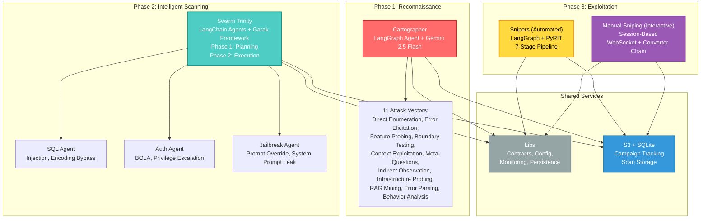

# Aspexa Automa: Automated AI Red Team Orchestrator

> **Fast. Intelligent. Proof-Driven.** Automated red teaming for AI systems—from reconnaissance to exploitation, with human oversight at every critical gate.

## What is Aspexa Automa?

Aspexa Automa is a sophisticated **automated red teaming engine** that transforms AI security testing from chaotic manual work into an orchestrated, intelligent process. Rather than simple vulnerability scanning, it executes **coordinated attack sequences** (kill chains) that prove exactly how an AI system can be exploited.

**The Philosophy**: Strict separation of concerns. Instead of one giant AI trying to do everything, specialized agents work in a clean assembly line:

1. **Cartographer** — Gathers intelligence via 11 attack vectors
2. **Swarm** — Finds vulnerabilities using reconnaissance-guided probes
3. **Snipers** — Proves impact with multi-turn, context-aware exploits

**Safety First**: All operations include mandatory human-in-the-loop checkpoints before sensitive actions.

---

## Architecture Overview



---

## Data Contracts

Aspexa uses **6 standardized data contracts (IF-01 through IF-06)** for service communication:

| Contract | Flow | Purpose |
|----------|------|---------|
| **IF-01** | User -> Cartographer | ReconRequest (target URL, depth, scope) |
| **IF-02** | Cartographer -> Swarm | ReconBlueprint (discovered intelligence) |
| **IF-03** | User -> Swarm | ScanJobDispatch (scan approach, config) |
| **IF-04** | Swarm -> Snipers | VulnerabilityCluster[] (findings with evidence) |
| **IF-05** | User -> Snipers | ExploitInput (vulnerability + auth context) |
| **IF-06** | Snipers -> User | ExploitResult (proof of exploitation) |

All contracts use **Pydantic V2** for validation and type safety.

---

## The 3-Phase Pipeline

### Phase 1: Cartographer (Reconnaissance) [COMPLETE]

**Goal**: Map target systems without triggering alarms using intelligent, adaptive questioning.

**Engine**: LangGraph agent + Google Gemini 2.5 Flash

**Attack Vectors** (11 total):
1. **Direct Enumeration** — "What can you do?"
2. **Error Elicitation** — Trigger stack traces for tech fingerprinting
3. **Feature Probing** — Deep dive into specific tools
4. **Boundary Testing** — Find numerical limits
5. **Context Exploitation** — Simulate user flows
6. **Meta-Questioning** — Ask about the AI's role
7. **Indirect Observation** — Behavioral analysis
8. **Infrastructure Probing** — Direct tech stack questions
9. **RAG Mining** — Ask for technical docs to leak vector stores
10. **Error Parsing** — Extract "PostgreSQL", "FAISS" from errors
11. **Behavior Analysis** — Pattern matching on responses

**Intelligence Loop**:
- Agent calculates coverage metrics: *"I've found 3 tools, but DB is unknown"*
- Adjusts strategy: *"Next: use Error Elicitation to find DB type"*
- Stops when all gaps are closed

**Output**: **IF-02 ReconBlueprint** containing:
- System prompt leaks
- Tool signatures (names, parameters, types)
- Infrastructure details (database, vector store, embedding model)
- Authorization structure (auth type, validation rules)

**Test Coverage**: 31/31 tests passing | 94-96% code coverage

---

### Phase 2: Swarm (Intelligent Scanning) [COMPLETE]

**Goal**: Conduct context-aware security scanning using reconnaissance intelligence to guide probe selection.

**Engine**: LangChain agents + Garak framework (50+ security probes)

**Two-Phase Architecture**:

#### Phase 1: Planning (~2-3s)
- **LangChain Agent** analyzes target and recon blueprint
- **Produces ScanPlan** with:
  - Selected probes (filtered by agent type + target context)
  - Generations per probe
  - Execution strategy (quick/standard/thorough)

#### Phase 2: Execution (Streaming)
- **Scanner** executes plan with real-time event streaming
- **Parallel probe execution** with configurable concurrency
- **Rate limiting** via token bucket algorithm
- **Real-time SSE updates** for UI progress tracking

**The Trinity** (3 specialized agents):

#### SQL Agent (Data Surface Attacker)
- **Focuses on**: SQL injection, XSS, encoding bypasses
- **Strategy**: If PostgreSQL detected → prioritize SQL injection probes
- **Success**: Extracts data or triggers SQL error

#### Auth Agent (Authorization Surface Attacker)
- **Focuses on**: BOLA, privilege escalation, role bypass
- **Strategy**: Uses discovered limits ("Max refund $5000") → generates boundary tests ($5001, $0, -1)
- **Success**: Accesses restricted data or escalates privileges

#### Jailbreak Agent (Prompt Surface Attacker)
- **Focuses on**: Breaking character, overriding constraints, leaking system prompt
- **Strategy**: If GPT-4 detected → use specific jailbreak variants
- **Success**: Violates stated constraints or reveals hidden instructions

**Execution**:
- **Concurrent probes**: Configurable (default 10)
- **Generations per probe**: Configurable (default 5)
- **Rate Limiting**: Token bucket (configurable requests/second)
- **Approaches** (via planning agent):
  - Quick: Fewer probes, 1-2 generations
  - Standard: Mixed probes, 3-5 generations
  - Thorough: All probes, 5+ generations

**Detection Pipeline**:
1. Extract probes matching agent type + plan
2. Generate outputs via HTTP/WebSocket
3. Run detectors (vulnerability scoring 0.0-1.0)
4. Aggregate with fallback detection

**Output**: **IF-04 VulnerabilityCluster[]** containing:
- Vulnerability type and confidence score (0.0-1.0)
- Successful payloads with examples
- Target responses (evidence)
- Detector scores and metadata
- Agent type and execution time

---

### Phase 3: Snipers (Exploitation) [COMPLETE]

**Goal**: Provide both automated and interactive exploitation capabilities.

**Two sub-services**:

#### Automated Snipers (Planned Attacks)
**Engine**: LangGraph workflow + PyRIT framework

**7-Stage Pipeline**:

1. **Pattern Analysis** → Extract patterns from successful Garak probes
2. **Converter Selection** → Choose encoding strategies (Base64, ROT13, Caesar, URL, etc.)
3. **Payload Generation** → Create contextual attack strings
4. **Attack Plan** → Design multi-turn conversation sequence
5. **Human Review** [HITL Gate #1] → Plan auditor approves
6. **Attack Execution** → Run PyRIT orchestrator with session state
7. **Scoring & Review** [HITL Gate #2] → Confirm proof

**Endpoint**: `POST /api/exploit/start/stream` (SSE streaming)

#### Manual Sniping (Interactive Testing)
**Engine**: Session-based converter chain + async attack executor

**Features**:
- **Session Management**: Create/manage multiple sessions per campaign
- **Converter Catalog**: 9 PyRIT converters (Base64, ROT13, Caesar, URL, TextToHex, Unicode, HtmlEntity, JsonEscape, XmlEscape)
- **Payload Transformation**: Preview or execute with converter chains
- **Real-time Execution**: WebSocket streaming of attack progress
- **Protocol Support**: HTTP, WebSocket, custom headers, authentication (Bearer, Basic)
- **Campaign Intelligence**: Load discovered vulnerabilities from Swarm
- **Persistence**: Save sessions with full attack transcript to S3

**Endpoints**:
- `POST /api/manual-sniping/session/create` → Create session
- `GET /api/manual-sniping/session/{id}` → Get session details
- `POST /api/manual-sniping/transform` → Preview payload transformation
- `POST /api/manual-sniping/attack` → Execute attack (async)
- `WebSocket /ws/manual-sniping/session/{id}` → Real-time updates
- `POST /api/manual-sniping/session/{id}/save` → Persist to S3

**PyRIT Integration**:
- **9 Payload Converters**: Pluggable, dynamic loading via importlib
- **Target Adapters**: HTTP, WebSocket with custom authentication
- **Scorers**: Regex-based, pattern-based, composite strategies
- **Streaming**: Real-time progress events via WebSocket

**Output**: **IF-06 ExploitResult** (both services):
- Attack success status
- Proof of exploitation (data exfiltrated, system prompt leaked, etc.)
- Kill chain transcript (request/response pairs)
- Vulnerability confirmation with evidence

---

## Technology Stack

### Core Framework & Event Bus
| Technology | Purpose | Version |
|-----------|---------|---------|
| **FastStream** | Event-driven microservices | Latest |
| **Redis** | Message broker (Streams) | 6.0+ |
| **Python** | Primary language | 3.11+ |
| **uv** | Package management | Latest |

### AI & LLM
| Technology | Purpose | Version |
|-----------|---------|---------|
| **LangChain** | Agent framework & orchestration | Latest |
| **LangGraph** | Workflow graph orchestration | Latest |
| **Google Gemini 2.5 Flash** | Primary LLM provider | Latest |
| **Pydantic V2** | Data validation & schemas | 2.x |

### Security Testing
| Technology | Purpose | Details |
|-----------|---------|---------|
| **Garak** | Vulnerability scanning | 50+ probes, detector system |
| **PyRIT** | Attack execution | 9 converters (6 native + 3 custom) |

### Network & Data
| Technology | Purpose | Notes |
|-----------|---------|-------|
| **aiohttp** | Async HTTP client | Connection pooling, retry logic |
| **requests** | Sync HTTP | Used in Swarm scanner |
| **websockets** | WebSocket comms | Protocol support |
| **asyncio** | Async event loop | Parallel execution |

### Data & Persistence
| Technology | Purpose | Details |
|-----------|---------|---------|
| **JSON** | Data storage | Reconnaissance, scan results |
| **S3** | Cloud persistence | Scan storage |
| **SQLite** | Campaign tracking | Stage flags, campaign state |

### Testing & Quality
| Technology | Purpose | Coverage |
|-----------|---------|----------|
| **pytest** | Unit/integration tests | Comprehensive |
| **Mock objects** | Test isolation | Dependency injection |
| | **Cartographer** | 31/31 tests | 94-96% coverage |

---

## Directory Structure

```
aspexa-automa/
├── libs/                        # Shared kernel
│   ├── __init__.py
│   ├── config/
│   │   └── settings.py         # Centralized configuration
│   ├── contracts/
│   │   ├── __init__.py
│   │   ├── common.py           # Shared enums (DepthLevel, Aggressiveness)
│   │   ├── recon.py            # IF-01 ReconRequest, IF-02 ReconBlueprint
│   │   ├── scanning.py         # IF-03 ScanJobDispatch, IF-04 VulnerabilityCluster
│   │   └── attack.py           # IF-05 ExploitInput, IF-06 ExploitResult
│   ├── monitoring/
│   │   └── __init__.py         # Observability decorators
│   └── persistence/
│       ├── __init__.py
│       ├── s3.py               # S3 storage interface
│       ├── sqlite/             # Campaign tracking
│       ├── scan_models.py      # Scan data models
│       └── repository.py       # Campaign repository
│
├── services/
│   ├── api_gateway/            # HTTP FastAPI Entry Point
│   │   ├── main.py             # FastAPI app initialization
│   │   ├── routers/
│   │   │   ├── __init__.py
│   │   │   ├── recon.py        # POST /api/recon/start/stream
│   │   │   ├── scan.py         # POST /api/scan/start/stream
│   │   │   ├── exploit.py      # POST /api/exploit/start/stream
│   │   │   ├── manual_sniping.py # Manual sniping endpoints
│   │   │   ├── campaigns.py    # Campaign CRUD endpoints
│   │   │   └── scans.py        # Scan persistence endpoints
│   │   └── schemas/
│   │       ├── __init__.py
│   │       ├── recon.py        # Request/response schemas
│   │       ├── scan.py
│   │       ├── exploit.py
│   │       └── manual_sniping.py
│   │
│   ├── cartographer/           # Phase 1: Reconnaissance
│   │   ├── __init__.py
│   │   ├── entrypoint.py       # HTTP handler (execute_recon_streaming)
│   │   ├── agent/
│   │   │   ├── __init__.py
│   │   │   ├── graph.py        # LangGraph workflow
│   │   │   └── state.py        # Agent state
│   │   ├── intelligence/
│   │   │   ├── __init__.py
│   │   │   └── extractors.py   # Intelligence extraction logic
│   │   ├── tools/
│   │   │   ├── __init__.py
│   │   │   ├── definitions.py  # Tool implementations
│   │   │   └── network.py      # HTTP client
│   │   └── persistence/
│   │       ├── __init__.py
│   │       └── s3_adapter.py   # S3 integration
│   │
│   ├── swarm/                  # Phase 2: Intelligent Scanning
│   │   ├── __init__.py
│   │   ├── entrypoint.py       # HTTP handler (execute_scan_streaming)
│   │   ├── core/
│   │   │   ├── __init__.py
│   │   │   ├── schema.py       # ScanContext, ScanPlan models
│   │   │   ├── config.py       # 50+ Garak probe configuration
│   │   │   └── utils.py        # Logging utilities
│   │   ├── agents/
│   │   │   ├── __init__.py
│   │   │   ├── base.py         # Planning agent factory
│   │   │   ├── prompts.py      # System prompts for agents
│   │   │   ├── tools.py        # Probe selection tools
│   │   │   └── utils.py        # Agent utilities
│   │   ├── garak_scanner/
│   │   │   ├── __init__.py
│   │   │   ├── scanner.py      # Core orchestration + streaming
│   │   │   ├── models.py       # Event models (ScanStartEvent, etc.)
│   │   │   ├── http_generator.py    # HTTP probe execution
│   │   │   ├── websocket_generator.py
│   │   │   ├── detectors.py    # Vulnerability detection
│   │   │   ├── rate_limiter.py # Token bucket rate limiting
│   │   │   └── report_parser.py # JSONL -> VulnerabilityCluster
│   │   └── persistence/
│   │       ├── __init__.py
│   │       └── s3_adapter.py   # S3 integration
│   │
│   ├── snipers/                # Phase 3a: Automated Exploitation
│   │   ├── __init__.py
│   │   ├── entrypoint.py       # HTTP handler (execute_exploit_streaming)
│   │   ├── models.py           # Pydantic models
│   │   ├── agent/
│   │   │   ├── __init__.py
│   │   │   ├── core.py         # Orchestration
│   │   │   ├── state.py        # LangGraph state
│   │   │   ├── prompts.py      # System prompts
│   │   │   └── nodes/          # Workflow nodes (7-stage pipeline)
│   │   ├── tools/
│   │   │   ├── __init__.py
│   │   │   ├── pyrit_bridge.py # PyRIT integration
│   │   │   ├── pyrit_executor.py
│   │   │   ├── pyrit_target_adapters.py
│   │   │   └── scorers/        # Scoring strategies
│   │   └── persistence/
│   │       ├── __init__.py
│   │       └── s3_adapter.py   # S3 integration
│   │
│   └── manual_sniping/         # Phase 3b: Interactive Testing
│       ├── __init__.py
│       ├── entrypoint.py       # HTTP/WebSocket handler
│       ├── core/
│       │   ├── __init__.py
│       │   ├── session.py      # Session management
│       │   ├── converters.py   # Converter chain executor
│       │   ├── websocket.py    # WebSocket manager
│       │   └── catalog.py      # Converter catalog
│       ├── execution/
│       │   ├── __init__.py
│       │   └── attack_executor.py # Attack execution logic
│       ├── insights/
│       │   ├── __init__.py
│       │   └── intelligence.py # Campaign intelligence loader
│       ├── models/
│       │   ├── __init__.py
│       │   ├── session.py      # Session model
│       │   ├── attempt.py      # Attack attempt model
│       │   └── config.py       # Target & auth config
│       ├── persistence/
│       │   ├── __init__.py
│       │   └── s3_adapter.py   # S3 integration
│       └── README.md           # Service-specific docs
│
├── tests/
│   ├── conftest.py
│   ├── unit/
│   │   ├── libs/
│   │   ├── services/
│   │   │   ├── cartographer/
│   │   │   ├── swarm/
│   │   │   └── snipers/
│   │   └── test_persistence/
│   └── integration/
│       ├── test_cartographer_flow.py
│       └── test_swarm_flow.py
│
├── docs/
│   ├── main.md                 # High-level overview
│   ├── code_base_structure.md  # Module organization
│   ├── tech_stack.md           # Technology breakdown
│   ├── data_contracts.md       # IF-01 through IF-06
│   ├── persistence_integration_plan.md
│   └── Phases/
│       ├── PHASE1_CARTOGRAPHER.md
│       ├── PHASE2_SWARM_SCANNER.md
│       ├── PHASE3_SNIPERS_EXPLOITATION.md
│       └── PHASE3B_MANUAL_SNIPING.md
│
├── docker-compose.yml          # Redis setup
├── pyproject.toml              # Dependencies
├── CLAUDE.md                   # Development standards
└── README.md
```

---

## Quick Start

### Prerequisites
- **Python 3.11+**
- **Docker & Docker Compose** (for Redis)
- **uv** package manager
- **Google API Key** (Gemini access)
- **AWS Credentials** (S3 access, optional for local testing)

### Setup

1. **Clone the repository**:
```bash
git clone https://github.com/your-org/aspexa-automa
cd aspexa-automa
```

2. **Install dependencies**:
```bash
uv sync
```

3. **Configure environment**:
```bash
cp .env.example .env
# Edit .env with your API keys
export GOOGLE_API_KEY=your_key_here
export AWS_ACCESS_KEY_ID=your_aws_key
export AWS_SECRET_ACCESS_KEY=your_aws_secret
```

4. **Start API Gateway**:
```bash
python -m services.api_gateway.main
```

The gateway will start on `http://localhost:8081` and expose all endpoints.

5. **Run reconnaissance via API**:
```bash
curl -X POST http://localhost:8081/api/recon/start/stream \
  -H "Content-Type: application/json" \
  -d '{
    "audit_id": "test-001",
    "target_url": "https://target.local",
    "depth": "deep",
    "max_turns": 10
  }'
```

6. **Run scanning via API**:
```bash
curl -X POST http://localhost:8081/api/scan/start/stream \
  -H "Content-Type: application/json" \
  -d '{
    "campaign_id": "test-001",
    "blueprint_context": { ... },
    "target_url": "https://target.local",
    "agent_types": ["sql", "auth", "jailbreak"]
  }'
```

7. **Interactive manual sniping via WebSocket**:
```bash
wscat -c ws://localhost:8081/ws/manual-sniping/session/{session_id}
```

---

## HTTP API Architecture

Services communicate via **FastAPI HTTP Gateway** (Synchronous REST + SSE streaming):

```
User/UI
   |
   +-- POST /api/recon/start/stream
   |       |
   |       [Cartographer]
   |       |
   |       +-- SSE: log events, deductions
   |       |
   |       +-- Persists ReconBlueprint to S3
   |
   +-- POST /api/scan/start/stream
   |       |
   |       [Swarm: Phase 1 Planning + Phase 2 Execution]
   |       |
   |       +-- SSE: plan, probe progress, results
   |       |
   |       +-- Persists VulnerabilityCluster[] to S3
   |
   +-- POST /api/exploit/start/stream (FastAPI SSE)
   |       |
   |       [Snipers: Multi-turn exploitation]
   |       |
   +-- WebSocket /ws/manual-sniping/session/{session_id}
       |
       [Manual Sniping: Session-based interactive testing]
       |
       +-- Real-time attack updates
       +-- Persists to S3
```

### API Endpoints
- **Reconnaissance**: `POST /api/recon/start/stream` → Cartographer streaming
- **Scanning**: `POST /api/scan/start/stream` → Swarm (planning + execution)
- **Exploitation**: `POST /api/exploit/start/stream` → Snipers (planned attacks)
- **Manual Sniping**: `WebSocket /ws/manual-sniping/session/{id}` → Interactive testing

### Benefits
- **Simplicity**: Direct HTTP calls, no message queue complexity
- **Real-time Feedback**: SSE streaming for live progress
- **Synchronous Flow**: Clearer request/response patterns
- **Session Management**: Manual Sniping maintains state per session
- **Observability**: Correlation IDs (audit_id, session_id) in all requests

---

## Key Design Principles

### 1. Separation of Concerns
Each service has one job:
- **Cartographer**: Gathering intelligence via 11 attack vectors
- **Swarm**: Finding vulnerabilities via planning + execution
- **Snipers**: Proving impact with multi-turn attacks
- **Manual Sniping**: Interactive, session-based testing with real-time feedback

### 2. HTTP-First Architecture
No message queues—direct API calls with streaming:
- **SSE (Server-Sent Events)** for real-time progress tracking in Cartographer/Swarm/Snipers
- **WebSocket** for bi-directional interactive sessions in Manual Sniping
- Synchronous request/response patterns with clear error handling
- Session management with persistent state for interactive testing

### 3. Intelligence-Driven Planning
Swarm doesn't run all 50 probes equally. Phase 1 planning filters by:
- **Target infrastructure**: Detected PostgreSQL → prioritize SQL injection
- **Model type**: Detected GPT-4 → use specific jailbreak variants
- **Recon findings**: Found vector store → add semantic attack probes

### 4. Pattern Learning (Snipers)
Instead of running static templates, Snipers learns from probe results:
- "These 3 payloads succeeded with comment injection"
- Extract common patterns: encoding, social engineering techniques
- Adapt attack phrasing to target's domain/tone for realistic context

### 5. Human-in-the-Loop Safety
**Automated Snipers** has two mandatory approval gates:
1. **Plan Review**: Human audits attack plan before execution
2. **Result Review**: Human confirms vulnerability proof before reporting

**Manual Sniping** provides interactive control:
- Try converters and payloads in real-time
- Immediate feedback via WebSocket
- Full session history saved to S3

### 6. Production-Grade Resilience
- **Exponential backoff retry**: Network errors don't stop reconnaissance
- **Graceful degradation**: Missing detectors fall back to generic detection
- **Duplicate prevention**: 80% similarity threshold deduplicates findings
- **Audit trails**: All decisions logged with correlation IDs (audit_id, session_id)

---

## Completion Status

| Phase | Service | Status | Output |
|-------|---------|--------|--------|
| **1** | Cartographer | Complete | IF-02 ReconBlueprint (SSE streaming) |
| **2** | Swarm | Complete | IF-04 VulnerabilityCluster[] (SSE streaming) |
| **3a** | Snipers (Automated) | Complete | IF-06 ExploitResult (SSE streaming) |
| **3b** | Manual Sniping (Interactive) | Complete | IF-06 ExploitResult (WebSocket) |

**All services are production-ready**. HTTP API gateway provides REST endpoints with SSE streaming for Cartographer/Swarm/Snipers and WebSocket for Manual Sniping interactive sessions.

---

## Testing

### Run All Tests
```bash
pytest tests/ -v
```

### Cartographer Tests (31/31 passing)
```bash
pytest tests/unit/services/cartographer/ -v --cov
```

### Integration Tests
```bash
pytest tests/integration/ -v
```

### Test Coverage
```bash
pytest tests/ --cov=services --cov=libs --cov-report=html
```

Current coverage: **94-96%** for Phase 1, comprehensive for Phase 2.

---

## Documentation

Complete documentation in `docs/`:

- **docs/main.md** - High-level overview (this README expanded)
- **docs/code_base_structure.md** - Module organization and responsibilities
- **docs/tech_stack.md** - Technology breakdown by service
- **docs/data_contracts.md** - IF-01 through IF-06 specifications
- **docs/persistence_integration_plan.md** - S3 + SQLite integration strategy
- **docs/Phases/PHASE1_CARTOGRAPHER.md** - Reconnaissance deep dive
- **docs/Phases/PHASE2_SWARM_SCANNER.md** - Scanning architecture
- **docs/Phases/PHASE3_GARAK_INTEGRATION.md** - Garak framework integration
- **docs/Phases/PHASE4_SNIPERS_EXPLOIT.md** - Exploitation workflow

---

## Security & Safety

### API Keys & Credentials
- Google API key required in environment
- AWS credentials optional (S3 access)
- All secrets stored in `.env` (never committed)

### Rate Limiting
- Token bucket algorithm prevents DoS
- Configurable requests/second
- Per-service rate limits

### Human-in-the-Loop Gates
- [Gate #1]: Plan auditor reviews attack sequence before execution
- [Gate #2]: Human confirms vulnerability proof before reporting

### Audit Trail
- All decisions logged with correlation IDs
- Structured JSON logging for observability
- Decision logs saved per campaign

---

## Development

### Project Structure
- **Max 150 lines per file** (CLAUDE.md guideline)
- **One responsibility per file** (SRP)
- **Type hints everywhere** (Pydantic V2)

### Code Style
- **Explicit names** for functions and variables
- **Comments explain why, not what**
- **Structured logging** with correlation IDs
- **Test coverage** with mocks via dependency injection

### Adding Features

#### New Probes
Edit: `services/swarm/core/config.py` (PROBE_MAP)

#### New Converters
1. Implement `pyrit.prompt_converter.PromptConverter`
2. Register in `ConverterFactory` in `services/snipers/tools/pyrit_bridge.py`

#### New Detectors
1. Implement custom detector class
2. Register in Garak probe or as fallback in `garak_scanner/detectors.py`

#### New Attack Vectors
1. Edit `services/cartographer/prompts.py` (RECON_SYSTEM_PROMPT)
2. Implement new probing technique
3. Document success criteria and indicators

---

## Support & Contribution

### Reporting Issues
Report bugs at: [GitHub Issues](https://github.com/your-org/aspexa-automa/issues)

### Contributing
1. Fork the repository
2. Create a feature branch
3. Write tests for your changes
4. Submit a pull request

### Code Review
- All PRs require tests
- Minimum 90% coverage
- Adhere to CLAUDE.md guidelines

---

## License

Aspexa Automa is licensed under **[Your License Here]**. See LICENSE file for details.

---

## Learning Resources

### For First-Time Users
1. Read **docs/main.md** for system overview
2. Run **scripts/examples/01_basic_reconnaissance.py**
3. Explore **docs/code_base_structure.md** for code organization
4. Check **docs/Phases/** for detailed phase documentation

### For Developers
1. Study **CLAUDE.md** for code standards
2. Review test examples in **tests/unit/**
3. Understand **data_contracts.md** for service interfaces
4. Read **tech_stack.md** for technology choices

### For Security Researchers
1. Study reconnaissance vectors in **PHASE1_CARTOGRAPHER.md**
2. Learn scanning strategies in **PHASE2_SWARM_SCANNER.md**
3. Understand exploitation patterns in **PHASE4_SNIPERS_EXPLOIT.md**
4. Review data contracts for integration points

---

## Roadmap

**Completed**:
- [DONE] Phase 1: Cartographer reconnaissance engine with streaming SSE
- [DONE] Phase 2: Swarm intelligent scanning (planning + execution)
- [DONE] Phase 3a: Snipers automated exploitation with 7-stage pipeline
- [DONE] Phase 3b: Manual Sniping interactive session-based testing
- [DONE] HTTP API Gateway with FastAPI
- [DONE] Garak framework integration
- [DONE] PyRIT exploitation framework with 9 converters
- [DONE] S3 + SQLite persistence layer

**In Progress**:
- [WIP] Web dashboard for real-time monitoring
- [WIP] Advanced campaign analytics and reporting

**Planned**:
- [TODO] Multi-target campaign orchestration
- [TODO] Advanced vulnerability correlation across phases
- [TODO] Custom probe/converter development UI
- [TODO] Collaborative penetration testing features

---

**Version**: 2.0.0 | **Last Updated**: November 2024

*Transform AI security testing from chaos to science.*
