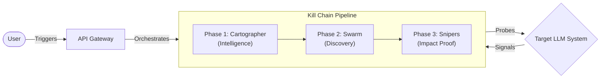
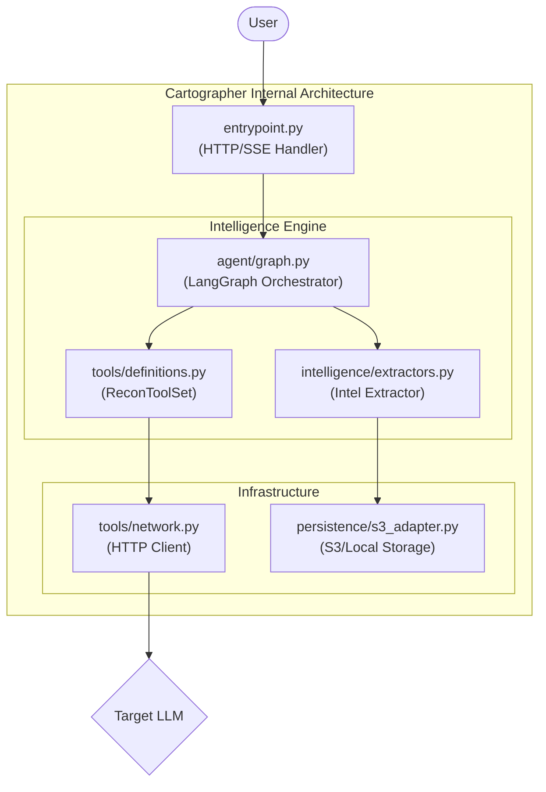
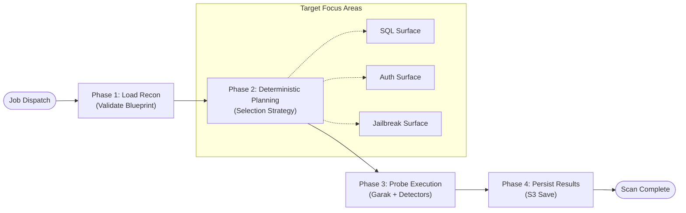
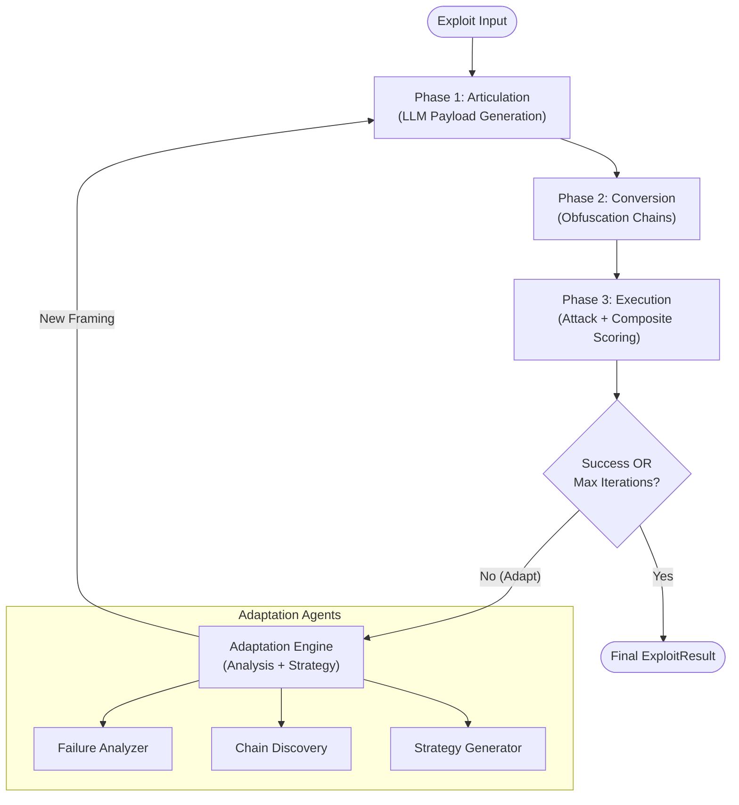
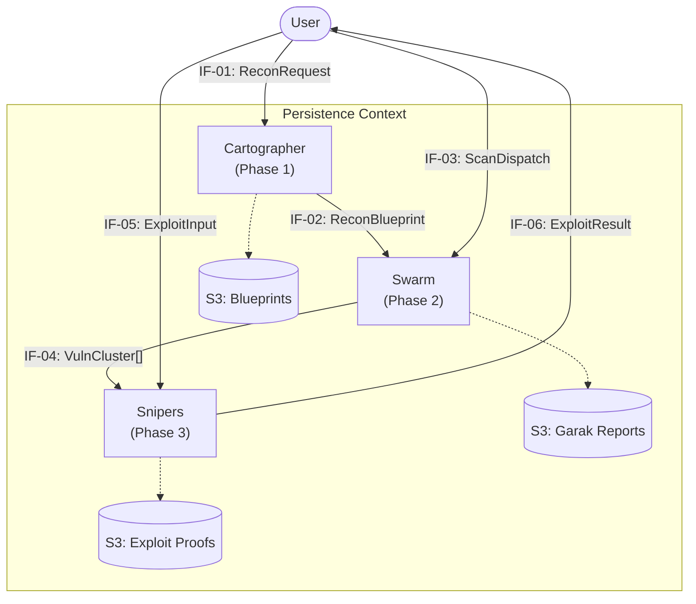
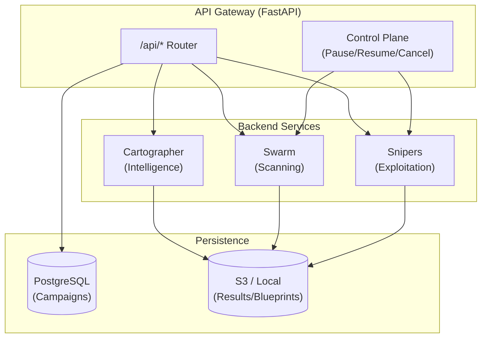

# Aspexa Automa: Automated Red Team Orchestrator

## Overview

Aspexa Automa is an automated red teaming engine for stress-testing AI systems. Rather than simple vulnerability scanning, it orchestrates sophisticated "kill chains"—coordinated attack sequences that prove exactly how an AI system can be exploited.

**Philosophy**: Aspexa enforces strict separation of concerns. Instead of one giant AI trying to do everything, specialized agents work in a clean assembly line:

1. **Cartographer** (reconnaissance) → gathers intelligence
2. **Swarm** (scanning) → finds vulnerabilities
3. **Snipers** (exploitation) → proves the impact

**Safety First**: All operations include mandatory human-in-the-loop checkpoints before sensitive actions (scanning critical tools, executing high-risk payloads, finalizing verdicts).



---

## How It Works: The 3-Phase Pipeline

### Phase 1: Cartographer (Reconnaissance)

**Goal**: Map target systems without triggering alarms using intelligent, adaptive questioning.

**Engine**: LangGraph agent + Google Gemini 1.5 Flash

**Workflow & Components**:



**Strategy**: 11 attack vectors

1. Direct Enumeration ("What can you do?")
2. Error Elicitation (trigger stack traces for tech stack fingerprinting)
3. Feature Probing (deep dive into specific tools)
4. Boundary Testing (find numerical limits)
5. Context Exploitation (simulate user flows)
6. Meta-Questioning (ask about the AI's role)
7. Indirect Observation (behavioral analysis)
8. Infrastructure Probing (direct tech stack questions)
9. RAG Mining (ask for technical docs to leak vector stores)
10. Error Parsing (extract "PostgreSQL", "FAISS" from errors)
11. Behavior Analysis (pattern matching on responses)

**Output**: IF-02 ReconBlueprint containing:

- System prompt leaks
- Tool signatures (function names, parameters, types)
- Infrastructure details (database type, vector store, embedding model)
- Authorization structure (auth type, validation rules, privilege levels)

**Intelligence Loop**: The agent self-reflects after each turn:

- Calculates coverage metrics ("I've found 3 tools, but DB is unknown")
- Employs an **Adaptive Three-Phase Strategy** (Early, Mid, and Late Game) to tailor probes based on target behavior.
- Adjusts strategy ("Next: use Error Elicitation to find DB type")
- Stops when gaps are closed or maximum turns reached.

**Test Coverage**: 31/31 tests passing, 94-96% code coverage

---

### Phase 2: Swarm (Deterministic Scanning)

**Goal**: Conduct high-speed, context-aware scanning using reconnaissance intelligence to automatically select and execute security probes.

**Engine**: Deterministic Probe Engine + Garak framework (50+ security probes)

**Workflow & Execution Phases**:



**Architecture**: The Trinity (3 Attack Surface Modules)

Each module maps reconnaissance data to specific security tests:

**SQL Module** (Data Surface)

- Focuses on: SQL injection, XSS, encoding bypasses
- Consumes: `recon.tools`, `recon.infrastructure.database`
- Strategy: If "PostgreSQL" detected, prioritize SQL injection probes
- Success: Extracts data or triggers SQL error

**Auth Module** (Authorization Surface)

- Focuses on: BOLA, privilege escalation, role bypass
- Consumes: `recon.authorization`, role structure, limits
- Strategy: Uses discovered limits ("Max refund $5000") to generate boundary tests ($5001, $0, -1)
- Success: Accesses restricted data or escalates privileges

**Jailbreak Module** (Prompt Surface)

- Focuses on: Breaking character, overriding constraints, leaking system prompt
- Consumes: `recon.system_prompt_leak`, `recon.infrastructure.model_family`
- Strategy: If "GPT-4" detected, use specific jailbreak variants
- Success: Violates stated constraints or reveals hidden instructions

**Deterministic Dynamic Planning**:
Unlike typical agentic flows that rely on LLMs for decision-making, Swarm uses a high-performance **Deterministic Planning Phase** (`run_deterministic_planning`). This phase analyzes the `ReconBlueprint` and cross-references detected technologies (e.g., PostgreSQL, MongoDB, OpenAI, Gemini) against a specialized **Infrastructure Probe Map**.

This allows Swarm to **dynamically load** targeted probes—such as SQL-injection variants for a detected database or specific model-jailbreaks—instantly, without the latency or cost of an additional model turn.

**Execution & Safety**:

- **Deterministic Planning**: Probes are selected based on reconnaissance intelligence via a specialized planning phase.
- **Hard Caps**: Default limits of 3 probes per agent and 5 prompts per probe to ensure efficient resource usage.
- **Parallel Performance**: Parallel probes (up to 10 concurrent) and parallel generations (up to 5 concurrent).
- **Rate Limiting**: Token bucket algorithm with support for HTTP and WebSocket targets.
- **Approaches**: Quick (2 min), Standard (10 min), Thorough (30 min).

**Detection Pipeline**:

- Extract probes from Garak
- Generate outputs via HTTP/WebSocket
- Run detectors (vulnerability scoring 0.0-1.0)
- Aggregate with fallback detection

**Output**: IF-04 VulnerabilityCluster[] containing:

- Vulnerability type and confidence score (0.0-1.0)
- Successful payloads with examples
- Target responses (evidence)
- Detector scores
- Metadata (agent type, execution time, generations)

---

### Phase 3: Snipers (Adaptive Exploitation)

**Goal**: Analyze vulnerability patterns, plan multi-turn attacks, and execute with mandatory human approval or via an autonomous adaptive loop.

**Engine**: Simple **Adaptive While-Loop** (migrated from LangGraph for performance) + PyRIT framework

**Adaptive Attack Lifecycle**:



**Execution Modes**:

- **One-shot**: A single pass through Articulation, Conversion, and Execution phases.
- **Adaptive**: An autonomous loop that analyzes failure signals to adapt framing strategies and converter chains.
- **Streaming**: Real-time SSE events for every phase, iteration, and adaptation decision.
- **Resume**: Supports resuming a paused or failed attack from a persisted S3 checkpoint.

**Success & Scoring**:

- **5+ Parallel Scorers**: Specialized detectors for Jailbreak, Prompt Leak, Data Leak, Tool Abuse, and PII Exposure.
- **Composite Aggregator**: Combines multiple signals into a single severity and success verdict.

**Advanced Features**:

- **Bypass Knowledge VDB**: A vector database that stores successful bypass episodes to improve future attack strategies.
- **Framing Priority**: Dynamically selects between recon-driven (IF-02), LLM-generated, and preset framing strategies.
- **9+ Converters**: Base64, ROT13, Homoglyph, Leetspeak, and custom obfuscation chains.

**Status**: ✅ Complete

- ✅ Simplified adaptive while-loop (Zero LangGraph dependencies)
- ✅ Full Pause/Resume/Cancel control plane
- ✅ Bypass Knowledge VDB integration
- ✅ REST API endpoints and SSE streaming
- ✅ Persistence to PostgreSQL and S3

---

## Data Contracts

Aspexa uses 6 standardized contracts (IF-01 through IF-06) for service communication:

| Contract  | Flow                 | Purpose                                         |
| --------- | -------------------- | ----------------------------------------------- |
| **IF-01** | User → Cartographer  | ReconRequest (target URL, depth, scope)         |
| **IF-02** | Cartographer → Swarm | ReconBlueprint (discovered intelligence)        |
| **IF-03** | User → Swarm         | ScanJobDispatch (scan approach, config)         |
| **IF-04** | Swarm → Snipers      | VulnerabilityCluster[] (findings with evidence) |
| **IF-05** | User → Snipers       | ExploitInput (vulnerability + auth context)     |
| **IF-06** | Snipers → User       | ExploitResult (proof of exploitation)           |

All contracts use Pydantic V2 for validation and type safety.



---

**System Architecture Overview**:



**Service-Specific Features**:

- **Framework**: FastAPI with specialized routers for Recon, Scan, and Snipers.
- **Security**: Clerk-based authentication with tiered access (mandatory `friend` metadata role).
- **Routing**: Centralized routing to Cartographer, Swarm, and Snipers backend services.
- **Control Plane**: Granular control over active tasks including Pause, Resume, and Cancel.
- **Persistence**: Dedicated routes for `/api/campaigns` (PostgreSQL) and `/api/scans` (S3/Local).
- **Observability**: Structured JSON logging with correlation IDs and real-time SSE event streaming.

**Direct Service Invocation**:

- Services can be invoked directly via their respective `entrypoint.py` for synchronous or streaming (SSE) results.
- Persistence is handled automatically via service-specific adapters (e.g., S3/Local for blueprints, PostgreSQL for campaign metadata).

---

## Key Design Principles

### 1. Separation of Concerns

Each service has one job:

- **Cartographer**: Gathering intelligence
- **Swarm**: Finding vulnerabilities
- **Snipers**: Proving impact

### 2. Intelligence-Driven Decisions

Swarm doesn't run all 50 probes equally. It uses **Deterministic Dynamic Planning** to prioritize probes based on Phase 1 reconnaissance:

- **Database Awareness**: Detected PostgreSQL → automatically injects SQL injection and Python package probes.
- **Model Specificity**: Detected Gemini/GPT-4 → prioritizes model-specific jailbreak variants.
- **Context Injection**: Found vector store → adds semantic data-leakage and RAG-specific probes.

### 3. Pattern Learning (Snipers)

Instead of running static templates, Snipers learns from Garak's successful probes:

- "These 3 payloads succeeded, these 47 failed"
- Extract common patterns: comment injection, encoding, social engineering
- Adapt attack phrasing to target's domain/tone

### 4. Human-in-the-Loop Safety

Two mandatory approval gates:

1. **Plan Review**: Human audits the attack plan before execution
2. **Result Review**: Human confirms vulnerability proof before reporting

### 5. Production-Grade Resilience

- Exponential backoff retry (network errors don't stop reconnaissance)
- Graceful degradation (missing detectors fall back to generic detection)
- Duplicate prevention (80% similarity threshold deduplicates findings)
- Audit trails (all decisions logged with correlation IDs)

---

## Directory Structure

See **docs/code_base_structure.md** for complete file organization:

```
aspexa-automa/
├── libs/            # Shared contracts, config, persistence
├── services/
│   ├── api_gateway/     # Centralized HTTP access
│   ├── cartographer/    # Phase 1: Reconnaissance (Complete)
│   ├── swarm/           # Phase 2: Scanning (Complete)
│   └── snipers/         # Phase 3: Exploitation (Complete)
├── scripts/         # Examples and utilities
├── tests/           # Unit and integration tests
└── docs/            # Documentation
```

---

## Getting Started

See **README.md** and **docs/onboarding.md** for project-wide setup. For service-specific details, see:

- **services/cartographer/README.md**
- **services/swarm/README.md**
- **services/snipers/README.md**

---

## Technology Stack

See **docs/tech_stack.md** for complete breakdown:

**Core**: FastAPI (API Gateway), PostgreSQL (Storage), Python 3.12+
**Agents**: LangChain, LangGraph, Google Gemini 1.5 Flash
**Security**: Garak (probes), PyRIT (exploitation)
**Data**: Pydantic V2 (validation), SQL/JSON (persistence)
**Testing**: pytest (unit/integration), 94-96% coverage

---

## Phases & Completion

| Phase | Service      | Status      | Output                       |
| ----- | ------------ | ----------- | ---------------------------- |
| 1     | Cartographer | ✅ Complete | IF-02 ReconBlueprint         |
| 2     | Swarm        | ✅ Complete | IF-04 VulnerabilityCluster[] |
| 3     | Snipers      | ✅ Complete | IF-06 ExploitResult          |

All phases are production-ready with full REST API support, persistent campaign tracking, and real-time streaming.

---

## Summary

Aspexa Automa transforms LLM security testing from chaotic manual work into an orchestrated, intelligent process:

- **Cartographer** asks the right questions to understand the target
- **Swarm** uses that intelligence to probe efficiently
- **Snipers** learns from successes and crafts targeted kill chains
- **Humans** maintain control at critical approval gates

The result: fast, accurate, comprehensive red team assessments with proof of impact.

---

## See Also

- **docs/code_base_structure.md** - Directory organization and module responsibilities
- **docs/persistence.md** - Campaign tracking and S3 storage
- **docs/Phases/PHASE1_CARTOGRAPHER.md** - Phase 1 reconnaissance details
- **docs/Phases/PHASE2_SWARM_SCANNER.md** - Phase 2 scanning details
- **docs/Phases/PHASE4_SNIPERS_EXPLOIT.md** - Phase 3 exploitation details
- **docs/tech_stack.md** - Technology overview
- **services/cartographer/README.md** - Cartographer service guide
- **services/swarm/README.md** - Swarm service guide
- **services/snipers/README.md** - Snipers service guide
