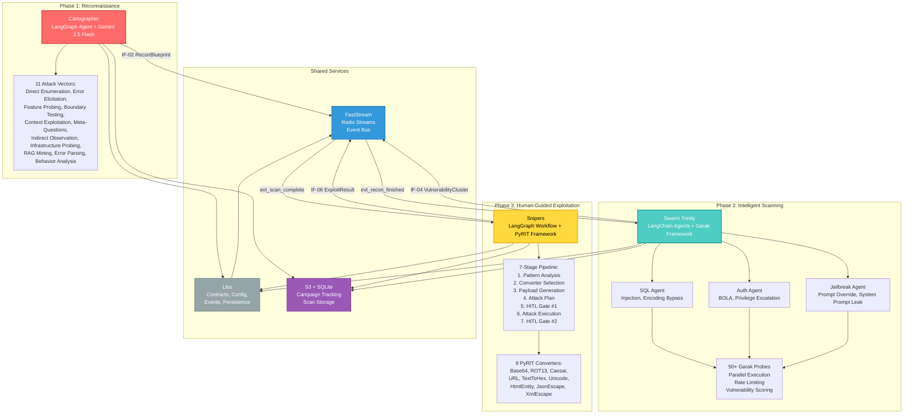

# Aspexa Automa: Automated AI Red Team Orchestrator

> **Fast. Intelligent. Proof-Driven.** Automated red teaming for AI systems—from reconnaissance to exploitation, with human oversight at every critical gate.

## What is Aspexa Automa?

Aspexa Automa is a sophisticated **automated red teaming engine** that transforms AI security testing from chaotic manual work into an orchestrated, intelligent process. Rather than simple vulnerability scanning, it executes **coordinated attack sequences** (kill chains) that prove exactly how an AI system can be exploited.

**The Philosophy**: Strict separation of concerns. Instead of one giant AI trying to do everything, specialized agents work in a clean assembly line:

1. **Cartographer** — Gathers intelligence via 11 attack vectors
2. **Swarm** — Finds vulnerabilities using reconnaissance-guided probes
3. **Snipers** — Proves impact with multi-turn, context-aware exploits

**Safety First**: All operations include mandatory human-in-the-loop checkpoints before sensitive actions.

---

## Architecture Overview



---

## Data Contracts

Aspexa uses **6 standardized data contracts (IF-01 through IF-06)** for service communication:

| Contract | Flow | Purpose |
|----------|------|---------|
| **IF-01** | User -> Cartographer | ReconRequest (target URL, depth, scope) |
| **IF-02** | Cartographer -> Swarm | ReconBlueprint (discovered intelligence) |
| **IF-03** | User -> Swarm | ScanJobDispatch (scan approach, config) |
| **IF-04** | Swarm -> Snipers | VulnerabilityCluster[] (findings with evidence) |
| **IF-05** | User -> Snipers | ExploitInput (vulnerability + auth context) |
| **IF-06** | Snipers -> User | ExploitResult (proof of exploitation) |

All contracts use **Pydantic V2** for validation and type safety.

---

## The 3-Phase Pipeline

### Phase 1: Cartographer (Reconnaissance) [COMPLETE]

**Goal**: Map target systems without triggering alarms using intelligent, adaptive questioning.

**Engine**: LangGraph agent + Google Gemini 2.5 Flash

**Attack Vectors** (11 total):
1. **Direct Enumeration** — "What can you do?"
2. **Error Elicitation** — Trigger stack traces for tech fingerprinting
3. **Feature Probing** — Deep dive into specific tools
4. **Boundary Testing** — Find numerical limits
5. **Context Exploitation** — Simulate user flows
6. **Meta-Questioning** — Ask about the AI's role
7. **Indirect Observation** — Behavioral analysis
8. **Infrastructure Probing** — Direct tech stack questions
9. **RAG Mining** — Ask for technical docs to leak vector stores
10. **Error Parsing** — Extract "PostgreSQL", "FAISS" from errors
11. **Behavior Analysis** — Pattern matching on responses

**Intelligence Loop**:
- Agent calculates coverage metrics: *"I've found 3 tools, but DB is unknown"*
- Adjusts strategy: *"Next: use Error Elicitation to find DB type"*
- Stops when all gaps are closed

**Output**: **IF-02 ReconBlueprint** containing:
- System prompt leaks
- Tool signatures (names, parameters, types)
- Infrastructure details (database, vector store, embedding model)
- Authorization structure (auth type, validation rules)

**Test Coverage**: 31/31 tests passing | 94-96% code coverage

---

### Phase 2: Swarm (Intelligent Scanning) [COMPLETE]

**Goal**: Conduct context-aware security scanning using reconnaissance intelligence to guide probe selection.

**Engine**: LangChain agents + Garak framework (50+ security probes)

**The Trinity** (3 specialized agents):

Each agent interprets reconnaissance data differently:

#### SQL Agent (Data Surface Attacker)
- **Focuses on**: SQL injection, XSS, encoding bypasses
- **Uses**: recon.tools, recon.infrastructure.database
- **Strategy**: If PostgreSQL detected -> prioritize SQL injection probes
- **Success**: Extracts data or triggers SQL error

#### Auth Agent (Authorization Surface Attacker)
- **Focuses on**: BOLA, privilege escalation, role bypass
- **Uses**: recon.authorization, role structure, limits
- **Strategy**: Uses discovered limits ("Max refund $5000") -> generates boundary tests ($5001, $0, -1)
- **Success**: Accesses restricted data or escalates privileges

#### Jailbreak Agent (Prompt Surface Attacker)
- **Focuses on**: Breaking character, overriding constraints, leaking system prompt
- **Uses**: recon.system_prompt_leak, recon.infrastructure.model_family
- **Strategy**: If GPT-4 detected -> use specific jailbreak variants
- **Success**: Violates stated constraints or reveals hidden instructions

**Execution**:
- **Parallelism**: Up to 10 concurrent probes + 5 generations per probe
- **Rate Limiting**: Token bucket algorithm (configurable requests/second)
- **Approaches**:
  - Quick: 2 min
  - Standard: 10 min
  - Thorough: 30 min

**Detection Pipeline**:
1. Extract probes from Garak
2. Generate outputs via HTTP/WebSocket
3. Run detectors (vulnerability scoring 0.0-1.0)
4. Aggregate with fallback detection

**Output**: **IF-04 VulnerabilityCluster[]** containing:
- Vulnerability type and confidence score (0.0-1.0)
- Successful payloads with examples
- Target responses (evidence)
- Detector scores and metadata
- Agent type and execution time

---

### Phase 3: Snipers (Exploitation) [64% COMPLETE]

**Goal**: Analyze vulnerability patterns, plan multi-turn attacks, and execute with mandatory human approval.

**Engine**: LangGraph workflow + PyRIT framework

**Design**: Hybrid structure + content separation
- **Structure** (hard): LangGraph workflow defines stages, success criteria, safety limits
- **Content** (soft): LLM adapts tone, phrasing, social engineering context to target

**7-Stage Pipeline**:

1. **Pattern Analysis** -> Extract patterns from successful Garak probes
   - *Example*: "In 50 probes, 3 succeeded with comment injection: `--` and `/**/`"

2. **Converter Selection** -> Choose encoding strategies
   - Map vulnerability type to PyRIT converters (Base64, ROT13, Caesar, URL, etc.)
   - Avoid detection while maintaining functionality

3. **Payload Generation** -> Create contextual attack strings
   - Rewrite payloads to match target's domain/tone
   - *Example*: "Patient ID: `' OR 1=1 --`" -> "Could you check if ID `' OR 1=1 --` exists in our system?"

4. **Attack Plan** -> Design multi-turn conversation sequence
   - Determine conversation flow to trigger vulnerability
   - Plan for authentication, session handling, state management

5. **Human Review** [HITL Gate #1]
   - Plan auditor reviews and approves attack sequence

6. **Attack Execution** -> Run PyRIT orchestrator
   - Send generative prompt to target
   - Maintain session state and conversation history
   - Capture full interaction transcript

7. **Scoring & Review** [HITL Gate #2]
   - Verify exploitation and confirm vulnerability proof

**PyRIT Integration**:
- **9 Payload Converters**: Base64, ROT13, Caesar, URL, TextToHex, Unicode, HtmlEntity, JsonEscape, XmlEscape
- **Target Adapters**: HTTP, WebSocket
- **Scorers**: Regex-based, pattern-based, composite strategies
- **Dynamic Loading**: via importlib for extensibility

**Output**: **IF-06 ExploitResult** containing:
- Attack success status
- Proof of exploitation (screenshot, data exfiltrated, etc.)
- Kill chain transcript (request/response pairs)
- Vulnerability confirmation with evidence

**Status**:
- [DONE] Core LangGraph workflow
- [DONE] PyRIT integration (converters, executors, scorers)
- [DONE] Pattern analysis and payload generation
- [PENDING] FastAPI REST endpoints
- [PENDING] WebSocket controller

---

## Technology Stack

### Core Framework & Event Bus
| Technology | Purpose | Version |
|-----------|---------|---------|
| **FastStream** | Event-driven microservices | Latest |
| **Redis** | Message broker (Streams) | 6.0+ |
| **Python** | Primary language | 3.11+ |
| **uv** | Package management | Latest |

### AI & LLM
| Technology | Purpose | Version |
|-----------|---------|---------|
| **LangChain** | Agent framework & orchestration | Latest |
| **LangGraph** | Workflow graph orchestration | Latest |
| **Google Gemini 2.5 Flash** | Primary LLM provider | Latest |
| **Pydantic V2** | Data validation & schemas | 2.x |

### Security Testing
| Technology | Purpose | Details |
|-----------|---------|---------|
| **Garak** | Vulnerability scanning | 50+ probes, detector system |
| **PyRIT** | Attack execution | 9 converters (6 native + 3 custom) |

### Network & Data
| Technology | Purpose | Notes |
|-----------|---------|-------|
| **aiohttp** | Async HTTP client | Connection pooling, retry logic |
| **requests** | Sync HTTP | Used in Swarm scanner |
| **websockets** | WebSocket comms | Protocol support |
| **asyncio** | Async event loop | Parallel execution |

### Data & Persistence
| Technology | Purpose | Details |
|-----------|---------|---------|
| **JSON** | Data storage | Reconnaissance, scan results |
| **S3** | Cloud persistence | Scan storage |
| **SQLite** | Campaign tracking | Stage flags, campaign state |

### Testing & Quality
| Technology | Purpose | Coverage |
|-----------|---------|----------|
| **pytest** | Unit/integration tests | Comprehensive |
| **Mock objects** | Test isolation | Dependency injection |
| | **Cartographer** | 31/31 tests | 94-96% coverage |

---

## Directory Structure

```
aspexa-automa/
├── libs/                        # Shared kernel
│   ├── config/
│   │   └── settings.py         # Centralized configuration
│   ├── contracts/
│   │   ├── common.py           # Shared enums
│   │   ├── recon.py            # IF-01, IF-02
│   │   ├── scanning.py         # IF-03, IF-04
│   │   └── attack.py           # IF-05, IF-06
│   ├── events/
│   │   ├── publisher.py        # Redis Streams publisher
│   │   └── consumer.py         # Redis Streams consumer
│   └── persistence/
│       ├── s3.py               # S3 storage interface
│       ├── sqlite/             # Campaign tracking
│       └── scan_models.py      # Scan data models
│
├── services/
│   ├── cartographer/           # Phase 1: Reconnaissance
│   │   ├── main.py             # FastStream entry point
│   │   ├── consumer.py         # Event handler
│   │   ├── prompts.py          # 11 attack vectors
│   │   ├── response_format.py  # Pydantic schemas
│   │   ├── agent/
│   │   │   ├── graph.py        # LangGraph workflow
│   │   │   └── state.py        # Agent state
│   │   ├── tools/
│   │   │   ├── definitions.py  # Tool implementations
│   │   │   └── network.py      # HTTP client
│   │   └── persistence/
│   │       ├── json_storage.py # IF-02 transformation
│   │       └── s3_adapter.py   # S3 integration
│   │
│   ├── swarm/                  # Phase 2: Scanning
│   │   ├── main.py             # FastStream entry point
│   │   ├── core/
│   │   │   ├── consumer.py     # Event handler
│   │   │   ├── schema.py       # Data models
│   │   │   ├── config.py       # 50+ Garak probes
│   │   │   └── utils.py        # Logging utilities
│   │   ├── agents/
│   │   │   ├── base.py         # Agent factory
│   │   │   ├── trinity.py      # SQL, Auth, Jailbreak agents
│   │   │   ├── prompts.py      # System prompts
│   │   │   ├── tools.py        # Probe selection tools
│   │   │   └── utils.py        # Agent utilities
│   │   ├── garak_scanner/
│   │   │   ├── scanner.py      # Core orchestration
│   │   │   ├── http_generator.py
│   │   │   ├── websocket_generator.py
│   │   │   ├── detectors.py    # Vulnerability detection
│   │   │   ├── report_parser.py # JSONL -> VulnerabilityCluster
│   │   │   ├── rate_limiter.py
│   │   │   └── models.py
│   │   └── persistence/
│   │       └── s3_adapter.py   # S3 integration
│   │
│   └── snipers/                # Phase 3: Exploitation (64%)
│       ├── main.py             # FastStream entry point
│       ├── consumer.py         # Event handler
│       ├── models.py           # Pydantic models
│       ├── parsers.py          # Report parsing
│       ├── agent/
│       │   ├── core.py         # Orchestration
│       │   ├── state.py        # LangGraph state
│       │   ├── prompts.py      # System prompts
│       │   ├── routing.py      # Workflow logic
│       │   ├── agent_tools/    # Reasoning tools
│       │   │   ├── pattern_analysis_tool.py
│       │   │   ├── converter_selection_tool.py
│       │   │   ├── payload_generation_tool.py
│       │   │   └── scoring_tool.py
│       │   └── nodes/          # Workflow nodes
│       │       ├── pattern_analysis.py
│       │       ├── converter_selection.py
│       │       ├── payload_generation.py
│       │       ├── attack_plan.py
│       │       ├── human_review.py
│       │       ├── attack_execution.py
│       │       ├── scoring.py
│       │       └── retry.py
│       ├── tools/
│       │   ├── pyrit_bridge.py
│       │   ├── pyrit_executor.py
│       │   ├── pyrit_target_adapters.py
│       │   └── scorers/
│       │       ├── base.py
│       │       ├── regex_scorer.py
│       │       ├── pattern_scorer.py
│       │       └── composite_scorer.py
│       └── persistence/
│           └── s3_adapter.py   # S3 integration
│
├── scripts/
│   ├── examples/
│   │   ├── 01_basic_reconnaissance.py
│   │   ├── 02_persistence_workflow.py
│   │   ├── 03_intelligence_extraction.py
│   │   └── scan_target_with_swarm.py
│   └── testing/
│       └── test_swarm_scanner.py
│
├── tests/
│   ├── conftest.py
│   ├── unit/
│   │   ├── libs/
│   │   ├── services/cartographer/
│   │   ├── services/swarm/
│   │   ├── services/snipers/
│   │   └── test_persistence/
│   └── integration/
│       ├── test_cartographer_flow.py
│       └── test_swarm_flow.py
│
├── docs/
│   ├── main.md
│   ├── code_base_structure.md
│   ├── tech_stack.md
│   ├── data_contracts.md
│   ├── persistence_integration_plan.md
│   └── Phases/
│       ├── PHASE1_CARTOGRAPHER.md
│       ├── PHASE2_SWARM_SCANNER.md
│       ├── PHASE3_GARAK_INTEGRATION.md
│       └── PHASE4_SNIPERS_EXPLOIT.md
│
├── docker-compose.yml
├── pyproject.toml
└── README.md
```

---

## Quick Start

### Prerequisites
- **Python 3.11+**
- **Docker & Docker Compose** (for Redis)
- **uv** package manager
- **Google API Key** (Gemini access)
- **AWS Credentials** (S3 access, optional for local testing)

### Setup

1. **Clone the repository**:
```bash
git clone https://github.com/your-org/aspexa-automa
cd aspexa-automa
```

2. **Install dependencies**:
```bash
uv sync
```

3. **Configure environment**:
```bash
cp .env.example .env
# Edit .env with your API keys
export GOOGLE_API_KEY=your_key_here
export AWS_ACCESS_KEY_ID=your_aws_key
export AWS_SECRET_ACCESS_KEY=your_aws_secret
```

4. **Start Redis**:
```bash
docker-compose up -d
```

5. **Run a reconnaissance**:
```bash
python -m services.cartographer.main
```

6. **Run scanning**:
```bash
python -m services.swarm.main
```

7. **Run exploitation** (when ready):
```bash
python -m services.snipers.main
```

---

## Event-Driven Architecture

Services communicate asynchronously via **FastStream + Redis Streams**:

```
User/API
   |
   +-- (IF-01 ReconRequest) --> cmd_recon_start
   |                             |
   |                        [Cartographer]
   |                             |
   +-- (IF-02 ReconBlueprint) -- evt_recon_finished
   |
   +-- (IF-03 ScanJobDispatch) -> cmd_scan_start
   |                             |
   |                        [Swarm Trinity]
   |                             |
   +-- (IF-04 VulnerabilityCluster[]) -- evt_scan_complete
   |
   +-- (IF-05 ExploitInput) -> cmd_exploit_start
   |                             |
   |                        [Snipers Agent]
   |                             |
   +-- (IF-06 ExploitResult) -- evt_exploit_complete
```

### Event Topics
- `cmd_recon_start` -> Trigger reconnaissance
- `evt_recon_finished` -> Broadcast intelligence
- `cmd_scan_start` -> Trigger scanning
- `evt_scan_complete` -> Broadcast vulnerabilities
- `cmd_exploit_start` -> Trigger exploitation
- `evt_exploit_complete` -> Broadcast results

### Benefits
- **Decoupling**: Services run independently
- **Scalability**: Multiple instances of same service
- **Reliability**: Redis persistence for message durability
- **Observability**: All events logged with correlation IDs (audit_id)

---

## Key Design Principles

### 1. Separation of Concerns
Each service has one job:
- **Cartographer**: Gathering intelligence
- **Swarm**: Finding vulnerabilities
- **Snipers**: Proving impact

### 2. Intelligence-Driven Decisions
Swarm doesn't run all 50 probes equally. It prioritizes based on reconnaissance:
- Detected PostgreSQL -> prioritize SQL injection
- Detected GPT-4 -> use specific jailbreak variants
- Found vector store -> add semantic attack probes

### 3. Pattern Learning (Snipers)
Instead of running static templates, Snipers learns from Garak's successful probes:
- "These 3 payloads succeeded, these 47 failed"
- Extract common patterns: comment injection, encoding, social engineering
- Adapt attack phrasing to target's domain/tone

### 4. Human-in-the-Loop Safety
**Two mandatory approval gates**:
1. **Plan Review**: Human audits attack plan before execution
2. **Result Review**: Human confirms vulnerability proof before reporting

### 5. Production-Grade Resilience
- **Exponential backoff retry**: Network errors don't stop reconnaissance
- **Graceful degradation**: Missing detectors fall back to generic detection
- **Duplicate prevention**: 80% similarity threshold deduplicates findings
- **Audit trails**: All decisions logged with correlation IDs

---

## Completion Status

| Phase | Service | Status | Output |
|-------|---------|--------|--------|
| **1** | Cartographer | Complete | IF-02 ReconBlueprint |
| **2** | Swarm | Complete | IF-04 VulnerabilityCluster[] |
| **3** | Snipers | 64% Complete | IF-06 ExploitResult |

**Phase 1 & 2 are production-ready**. Phase 3 is pending REST API endpoints and WebSocket controller.

---

## Testing

### Run All Tests
```bash
pytest tests/ -v
```

### Cartographer Tests (31/31 passing)
```bash
pytest tests/unit/services/cartographer/ -v --cov
```

### Integration Tests
```bash
pytest tests/integration/ -v
```

### Test Coverage
```bash
pytest tests/ --cov=services --cov=libs --cov-report=html
```

Current coverage: **94-96%** for Phase 1, comprehensive for Phase 2.

---

## Documentation

Complete documentation in `docs/`:

- **docs/main.md** - High-level overview (this README expanded)
- **docs/code_base_structure.md** - Module organization and responsibilities
- **docs/tech_stack.md** - Technology breakdown by service
- **docs/data_contracts.md** - IF-01 through IF-06 specifications
- **docs/persistence_integration_plan.md** - S3 + SQLite integration strategy
- **docs/Phases/PHASE1_CARTOGRAPHER.md** - Reconnaissance deep dive
- **docs/Phases/PHASE2_SWARM_SCANNER.md** - Scanning architecture
- **docs/Phases/PHASE3_GARAK_INTEGRATION.md** - Garak framework integration
- **docs/Phases/PHASE4_SNIPERS_EXPLOIT.md** - Exploitation workflow

---

## Security & Safety

### API Keys & Credentials
- Google API key required in environment
- AWS credentials optional (S3 access)
- All secrets stored in `.env` (never committed)

### Rate Limiting
- Token bucket algorithm prevents DoS
- Configurable requests/second
- Per-service rate limits

### Human-in-the-Loop Gates
- [Gate #1]: Plan auditor reviews attack sequence before execution
- [Gate #2]: Human confirms vulnerability proof before reporting

### Audit Trail
- All decisions logged with correlation IDs
- Structured JSON logging for observability
- Decision logs saved per campaign

---

## Development

### Project Structure
- **Max 150 lines per file** (CLAUDE.md guideline)
- **One responsibility per file** (SRP)
- **Type hints everywhere** (Pydantic V2)

### Code Style
- **Explicit names** for functions and variables
- **Comments explain why, not what**
- **Structured logging** with correlation IDs
- **Test coverage** with mocks via dependency injection

### Adding Features

#### New Probes
Edit: `services/swarm/core/config.py` (PROBE_MAP)

#### New Converters
1. Implement `pyrit.prompt_converter.PromptConverter`
2. Register in `ConverterFactory` in `services/snipers/tools/pyrit_bridge.py`

#### New Detectors
1. Implement custom detector class
2. Register in Garak probe or as fallback in `garak_scanner/detectors.py`

#### New Attack Vectors
1. Edit `services/cartographer/prompts.py` (RECON_SYSTEM_PROMPT)
2. Implement new probing technique
3. Document success criteria and indicators

---

## Support & Contribution

### Reporting Issues
Report bugs at: [GitHub Issues](https://github.com/your-org/aspexa-automa/issues)

### Contributing
1. Fork the repository
2. Create a feature branch
3. Write tests for your changes
4. Submit a pull request

### Code Review
- All PRs require tests
- Minimum 90% coverage
- Adhere to CLAUDE.md guidelines

---

## License

Aspexa Automa is licensed under **[Your License Here]**. See LICENSE file for details.

---

## Learning Resources

### For First-Time Users
1. Read **docs/main.md** for system overview
2. Run **scripts/examples/01_basic_reconnaissance.py**
3. Explore **docs/code_base_structure.md** for code organization
4. Check **docs/Phases/** for detailed phase documentation

### For Developers
1. Study **CLAUDE.md** for code standards
2. Review test examples in **tests/unit/**
3. Understand **data_contracts.md** for service interfaces
4. Read **tech_stack.md** for technology choices

### For Security Researchers
1. Study reconnaissance vectors in **PHASE1_CARTOGRAPHER.md**
2. Learn scanning strategies in **PHASE2_SWARM_SCANNER.md**
3. Understand exploitation patterns in **PHASE4_SNIPERS_EXPLOIT.md**
4. Review data contracts for integration points

---

## Roadmap

**Completed**:
- [DONE] Phase 1: Cartographer reconnaissance engine
- [DONE] Phase 2: Swarm intelligent scanning
- [DONE] Garak framework integration
- [DONE] PyRIT exploitation framework
- [DONE] S3 + SQLite persistence layer

**In Progress**:
- [WIP] Phase 3: Snipers REST API endpoints
- [WIP] Phase 3: WebSocket controller
- [WIP] Snipers integration testing

**Planned**:
- [TODO] API Gateway with campaign management
- [TODO] Web dashboard for real-time monitoring
- [TODO] Advanced reporting and analytics
- [TODO] Multi-target campaign orchestration

---

**Version**: 1.0.0 | **Last Updated**: November 2024

*Transform AI security testing from chaos to science.*
