# Aspexa Automa: Automated AI Red Team Orchestrator

> **Fast. Intelligent. Proof-Driven.** Automated security testing for AI systems with human oversight at every critical decision.

## What is Aspexa Automa?

A **three-phase red teaming engine** that transforms AI security testing into an orchestrated process:

1. **Cartographer** (Phase 1) — Intelligent reconnaissance via 11 attack vectors
2. **Swarm** (Phase 2) — Context-aware vulnerability scanning
3. **Snipers** (Phase 3) — Multi-turn exploitation with proof of impact

**Philosophy**: Specialized agents in a clean assembly line. Each service does one job well.

---

## System Overview

```mermaid
graph TB
    User["👤 User/API"]

    subgraph "Phase 1: Intelligence"
        Cart["🗺️ Cartographer<br/>LangGraph + Gemini<br/>11 attack vectors"]
    end

    subgraph "Phase 2: Scanning"
        Plan["📋 Planning Agent<br/>2-3 seconds"]
        Exec["🔬 Scanner<br/>Concurrent probes<br/>Real-time SSE"]
    end

    subgraph "Phase 3: Exploitation"
        Auto["⚡ Snipers (Auto)<br/>7-stage pipeline<br/>+ HITL gates"]
        Manual["🎮 Manual Sniping<br/>Interactive<br/>WebSocket"]
    end

    subgraph "Shared"
        S3["☁️ S3 + SQLite<br/>Campaign Data"]
        Lib["📦 Libs<br/>Contracts, Config"]
    end

    User -->|audit_id, target_url| Cart
    Cart -->|IF-02 Blueprint| Plan
    Plan -->|ScanPlan| Exec
    Exec -->|IF-04 Vulns| Auto
    Exec -->|IF-04 Vulns| Manual

    Cart -.->|Persist| S3
    Exec -.->|Persist| S3
    Auto -.->|Persist| S3

    Cart -.->|Use| Lib
    Exec -.->|Use| Lib
    Auto -.->|Use| Lib

    style Cart fill:#ff6b6b,stroke:#c92a2a,color:#fff
    style Plan fill:#4ecdc4,stroke:#0d9488,color:#fff
    style Exec fill:#4ecdc4,stroke:#0d9488,color:#fff
    style Auto fill:#ffd93d,stroke:#f39c12,color:#000
    style Manual fill:#9b59b6,stroke:#8e44ad,color:#fff
    style S3 fill:#3498db,stroke:#2980b9,color:#fff
    style Lib fill:#95a5a6,stroke:#7f8c8d,color:#fff
```



---

## Phase 1: Cartographer (Reconnaissance)

**Goal**: Map target AI system without triggering alarms.

**How It Works**:
- Sends 11 types of probing questions (enumeration, error elicitation, boundary testing, etc.)
- Accumulates observations across turns
- Deduplicates findings (80% similarity threshold)
- Stops when all intelligence gaps closed

**Output**: **IF-02 ReconBlueprint** containing:
- System prompts / constraints discovered
- Tool signatures (names, parameters)
- Infrastructure (database type, vector store, model)
- Authorization structure

**Status**: ✅ Complete (31/31 tests passing | 94-96% coverage)

---

## Phase 2: Swarm (Intelligent Scanning)

**Goal**: Find vulnerabilities using recon intelligence to guide probe selection.


**Three Specialized Agents**:

| Agent | Focuses On | Adapts To |
|-------|-----------|-----------|
| **SQL** | Data extraction, injection | Detected DB type (PostgreSQL, MongoDB, etc.) |
| **Auth** | Privilege escalation, BOLA | Discovered auth type & roles |
| **Jailbreak** | Prompt override, constraint bypass | Model type (GPT-4, Claude, etc.) |

**Execution Strategy**:
- **Quick**: 3-5 probes, 1-2 generations (~2 min)
- **Standard**: 5-10 probes, 3-5 generations (~10 min)
- **Thorough**: 10-20 probes, 5+ generations (~30 min)

**Output**: **IF-04 VulnerabilityCluster[]** with:
- Vulnerability type & confidence score
- Successful payloads with examples
- Target responses (evidence)
- Detector scores & metadata

**Features**:
- ✅ Parallel probe execution (configurable)
- ✅ Rate limiting (token bucket algorithm)
- ✅ Real-time SSE streaming
- ✅ WebSocket support for endpoint testing

**Status**: ✅ Complete

---

## Phase 3: Snipers (Exploitation)

### 3a: Automated Snipers

**Adaptive Attack Loop**:

```mermaid
graph LR
    A["🧠 Articulate<br/>Generate Payloads"]
    B["🔄 Convert<br/>Apply Chain"]
    C["🎯 Execute<br/>Send Attacks"]
    D["📊 Evaluate<br/>Score Results"]
    E["🔁 Adapt<br/>Learn & Retry"]

    A --> B --> C --> D --> E
    E -->|Success| END["✅ Complete"]
    E -->|Max Iterations| END
    E -->|Failure| A

    style A fill:#4ecdc4,stroke:#0d9488,color:#fff
    style B fill:#4ecdc4,stroke:#0d9488,color:#fff
    style C fill:#ffd93d,stroke:#f39c12,color:#000
    style D fill:#9b59b6,stroke:#8e44ad,color:#fff
    style E fill:#ff6b6b,stroke:#c92a2a,color:#fff
    style END fill:#2ecc71,stroke:#27ae60,color:#fff
```



**Key Features**:
- **Adaptive loop**: Learns from each iteration, retries with adjusted parameters
- **Learns from Swarm results**: Uses vulnerability patterns to guide payload generation
- **Contextual framing**: QA Testing, Compliance Audit, Debugging, etc.
- **8 custom converters**: Homoglyph, leetspeak, morse code, etc.
- **Automatic scoring**: Composite scorer with 5 specialized detectors
- **Iteration history**: Tracks best score, adaptation reasoning, all attempts

### 3b: Manual Sniping (Interactive)

**Session-Based Testing with Real-Time Control**:
- Create/manage sessions per campaign
- 9 PyRIT converters for payload transformation
- WebSocket streaming of attack progress
- Protocol support: HTTP, WebSocket, custom headers
- Campaign intelligence integration

**Endpoints**:
- `POST /api/manual-sniping/session/create`
- `POST /api/manual-sniping/transform` (preview payload)
- `POST /api/manual-sniping/attack` (execute)
- `WebSocket /ws/manual-sniping/session/{id}` (real-time updates)

**Output** (both modes): **IF-06 ExploitResult**
- Attack success status
- Proof of exploitation
- Kill chain transcript
- Vulnerability confirmation

**Status**: ✅ Complete

---

## API Gateway

**Single HTTP Entry Point** on `http://localhost:8081`:


**Key Endpoints**:
- `POST /recon/start` — Start reconnaissance
- `POST /scan/start` — Start scanning (campaign or manual blueprint)
- `POST /exploit/start` — Start automated exploitation
- `POST /campaigns` — Campaign CRUD
- `GET /scans/{type}/{scan_id}` — Retrieve results

**Features**:
- ✅ Campaign-driven workflow (recon → scan → exploit)
- ✅ Real-time SSE streaming for monitoring
- ✅ S3-backed result persistence
- ✅ Automatic campaign stage tracking

---

## Data Contracts (IF-01 through IF-06)

| Contract | Flow | Purpose |
|----------|------|---------|
| **IF-01** | User → Cartographer | ReconRequest (target, depth, scope) |
| **IF-02** | Cartographer → Swarm | ReconBlueprint (discovered intelligence) |
| **IF-03** | User → Swarm | ScanJobDispatch (scan config) |
| **IF-04** | Swarm → Snipers | VulnerabilityCluster[] (findings) |
| **IF-05** | User → Snipers | ExploitInput (vuln + auth context) |
| **IF-06** | Snipers → User | ExploitResult (proof of exploitation) |

All use **Pydantic V2** for validation.

---

## Shared Services

### Libs (Core Kernel)

**Contracts** - Data models for all service communication
**Config** - Centralized settings (API keys, feature flags)
**Monitoring** - Langfuse integration for observability
**Persistence** - S3 + SQLite adapters for campaign tracking

### Observability (Monitoring)

```python
from libs.monitoring import observe, get_callbacks_config

# Decorator-based function tracing
@observe()
async def analyze_vulnerability(target_url):
    return perform_analysis(target_url)

# LangChain integration
config = get_callbacks_config(
    session_id="exploit-001",
    trace_name="attack-workflow"
)
result = workflow.invoke(state, config=config)
```

**Features**: Langfuse backend, automatic LLM call tracing, zero overhead when disabled.

---

## Technology Stack

| Layer | Technology | Purpose |
|-------|-----------|---------|
| **API** | FastAPI | HTTP REST gateway + SSE streaming |
| **Agents** | LangChain + LangGraph | Orchestration & workflows |
| **LLM** | Google Gemini 2.5 Flash | Primary reasoning engine |
| **Security** | Garak + PyRIT | 50+ probes + 9 converters |
| **Async** | asyncio | Concurrent execution |
| **Data** | Pydantic V2 | Type-safe validation |
| **Persistence** | S3 + SQLite | Results + campaign tracking |
| **Observability** | Langfuse | LLM call tracing |

---

## Quick Start

### 1. Setup

```bash
# Install dependencies
uv sync

# Configure environment
export GOOGLE_API_KEY=your_key_here
export AWS_REGION=ap-southeast-2
export S3_BUCKET_NAME=your-bucket
```

### 2. Start API Gateway

```bash
python -m services.api_gateway.main
# Gateway runs on http://localhost:8081
```

### 3. Run Reconnaissance

```bash
curl -X POST http://localhost:8081/recon/start \
  -H "Content-Type: application/json" \
  -d '{
    "audit_id": "test-001",
    "target_url": "http://localhost:8082/chat",
    "depth": "standard",
    "max_turns": 10
  }'
```

### 4. Run Scanning

```bash
curl -X POST http://localhost:8081/scan/start \
  -H "Content-Type: application/json" \
  -d '{
    "campaign_id": "test-001",
    "agent_types": ["sql", "auth", "jailbreak"],
    "config": {
      "approach": "standard",
      "max_probes": 10
    }
  }'
```

### 5. Run Exploitation (Adaptive)

```bash
# Single-shot: one iteration through all phases
curl -X POST http://localhost:8081/exploit/start \
  -H "Content-Type: application/json" \
  -d '{
    "campaign_id": "test-001",
    "target_url": "http://localhost:8082/chat",
    "mode": "full"
  }'

# Adaptive: auto-retry with parameter adjustment (up to 5 iterations)
curl -X POST http://localhost:8081/exploit/start \
  -H "Content-Type: application/json" \
  -d '{
    "campaign_id": "test-001",
    "target_url": "http://localhost:8082/chat",
    "mode": "adaptive",
    "max_iterations": 5,
    "success_threshold": 0.8
  }'
```

---

## Project Structure

```
aspexa-automa/
├── libs/                          # Shared kernel
│   ├── contracts/                # IF-01 through IF-06 data models
│   ├── config/                   # Configuration management
│   ├── monitoring/               # Langfuse integration
│   └── persistence/              # S3 + SQLite adapters
│
├── services/
│   ├── api_gateway/              # FastAPI HTTP entry point
│   │   └── routers/             # Recon, Scan, Exploit, Manual, Campaigns
│   │
│   ├── cartographer/             # Phase 1: Reconnaissance
│   │   ├── agent/               # LangGraph workflow
│   │   ├── tools/               # take_note, analyze_gaps
│   │   └── persistence/         # IF-02 transformation
│   │
│   ├── swarm/                    # Phase 2: Scanning
│   │   ├── agents/              # Planning agent + system prompts
│   │   ├── garak_scanner/       # Probe execution + detectors
│   │   └── persistence/         # IF-04 transformation
│   │
│   ├── snipers/                  # Phase 3a: Automated Exploitation
│   │   ├── adaptive_attack/     # LangGraph workflow + HITL gates
│   │   ├── attack_phases/       # 3-phase pipeline
│   │   ├── utils/               # Converters, scorers, nodes
│   │   └── persistence/         # IF-06 transformation
│   │
│   └── manual_sniping/           # Phase 3b: Interactive Testing
│       ├── core/                # Session, converter chain
│       ├── execution/           # Attack executor
│       └── persistence/         # Session + result storage
│
└── tests/
    ├── unit/                     # Comprehensive coverage
    └── integration/              # End-to-end workflows
```

---

## Key Features

✅ **Intelligent Planning**: Swarm filters 50+ probes based on recon intelligence
✅ **Concurrent Execution**: Parallel probe execution with configurable limits
✅ **Rate Limiting**: Token bucket algorithm prevents target API overload
✅ **Real-Time Streaming**: SSE for Cartographer/Swarm/Snipers, WebSocket for Manual
✅ **Adaptive Attacks**: Automatic retry & parameter adjustment based on scoring
✅ **Observability**: Langfuse tracing for all LLM calls
✅ **Persistence**: S3 + SQLite for campaign tracking & result storage
✅ **Learning**: Snipers learns from successful Swarm patterns, adjusts per iteration

---

## Completion Status

| Phase | Service | Status | Output |
|-------|---------|--------|--------|
| 1 | Cartographer | ✅ Complete | IF-02 ReconBlueprint (SSE) |
| 2 | Swarm | ✅ Complete | IF-04 VulnerabilityCluster[] (SSE) |
| 3a | Snipers (Automated) | ✅ Complete | IF-06 ExploitResult (SSE) |
| 3b | Manual Sniping | ✅ Complete | IF-06 ExploitResult (WebSocket) |

**All services production-ready with comprehensive test coverage.**

---

## Documentation

- **[Cartographer](services/cartographer/README.md)** - Reconnaissance deep dive
- **[Swarm](services/swarm/README.md)** - Scanning architecture & Trinity agents
- **[Snipers](services/snipers/README.md)** - Exploitation workflow & adaptive loop
- **[API Gateway](services/api_gateway/README.md)** - HTTP endpoints & campaign orchestration
- **[Manual Sniping](services/manual_sniping/README.md)** - Interactive testing guide
- **[Monitoring](libs/monitoring/README.md)** - Langfuse observability setup
- **[Prompt Articulation](services/snipers/utils/prompt_articulation/README.md)** - Contextual payload generation

---

## Testing

```bash
# Run all tests
pytest tests/ -v

# Cartographer (31/31 passing)
pytest tests/unit/services/cartographer/ -v --cov

# Coverage report
pytest tests/ --cov=services --cov=libs --cov-report=html
```

**Current Coverage**: 94-96% for Phase 1, comprehensive for Phases 2-3.

---

## Security

✅ No hardcoded credentials (all in `.env`)
✅ Rate limiting prevents API overload
✅ Human-in-the-loop gates for sensitive operations
✅ Audit trail with correlation IDs (audit_id, session_id)
✅ Structured logging for security analysis

---

## Development Standards

- **Max file size**: 150 lines
- **One responsibility per file**: SRP enforced
- **Type hints everywhere**: Pydantic V2
- **Composition over inheritance**: DI for testing
- **Fail fast**: Input validation at system boundaries

See [CLAUDE.md](CLAUDE.md) for detailed standards.

---

## Support

- **Issues**: Report bugs via [GitHub Issues](https://github.com/your-org/aspexa-automa/issues)
- **Docs**: Complete documentation in each service `README.md`
- **Tests**: 100+ unit + integration tests with examples

---

**Version**: 2.1.0 | **Status**: Production-Ready | **Last Updated**: December 2024

*Transform AI security testing from chaos to orchestrated proof.*
