# Aspexa Automa: Automated AI Red Team Orchestrator

> **Fast. Intelligent. Proof-Driven.** Automated security testing for AI systems with human oversight at every critical decision.

## What is Aspexa Automa?

A **three-phase red teaming engine** that transforms AI security testing into an orchestrated process:

1. **Cartographer** (Phase 1) — Intelligent reconnaissance via 11 attack vectors
2. **Swarm** (Phase 2) — Context-aware vulnerability scanning
3. **Snipers** (Phase 3) — Multi-turn exploitation with proof of impact

**Philosophy**: Specialized agents in a clean assembly line. Each service does one job well.

---

## System Overview

```mermaid
graph TB
    User["👤 User/API"]

    subgraph "Phase 1: Intelligence"
        Cart["🗺️ Cartographer<br/>LangGraph + Gemini<br/>11 attack vectors"]
    end

    subgraph "Phase 2: Scanning"
        Plan["📋 Planning Agent<br/>2-3 seconds"]
        Exec["🔬 Scanner<br/>Concurrent probes<br/>Real-time SSE"]
    end

    subgraph "Phase 3: Exploitation"
        Auto["⚡ Snipers (Auto)<br/>7-stage pipeline<br/>+ HITL gates"]
        Manual["🎮 Manual Sniping<br/>Interactive<br/>WebSocket"]
    end

    subgraph "Shared"
        S3["☁️ S3 + SQLite<br/>Campaign Data"]
        Lib["📦 Libs<br/>Contracts, Config"]
    end

    User -->|audit_id, target_url| Cart
    Cart -->|IF-02 Blueprint| Plan
    Plan -->|ScanPlan| Exec
    Exec -->|IF-04 Vulns| Auto
    Exec -->|IF-04 Vulns| Manual

    Cart -.->|Persist| S3
    Exec -.->|Persist| S3
    Auto -.->|Persist| S3

    Cart -.->|Use| Lib
    Exec -.->|Use| Lib
    Auto -.->|Use| Lib

    style Cart fill:#ff6b6b,stroke:#c92a2a,color:#fff
    style Plan fill:#4ecdc4,stroke:#0d9488,color:#fff
    style Exec fill:#4ecdc4,stroke:#0d9488,color:#fff
    style Auto fill:#ffd93d,stroke:#f39c12,color:#000
    style Manual fill:#9b59b6,stroke:#8e44ad,color:#fff
    style S3 fill:#3498db,stroke:#2980b9,color:#fff
    style Lib fill:#95a5a6,stroke:#7f8c8d,color:#fff
```



---

## Phase 1: Cartographer (Reconnaissance)

**Goal**: Map target AI system without triggering alarms, gathering complete intelligence in 10-15 turns.

**Architecture**: LangGraph-based agent with dual-track strategy (business logic + infrastructure enumeration).

### Reconnaissance Strategy


### 11 Attack Vectors

The agent employs **11 specialized attack vectors** simultaneously, each targeting different knowledge extraction paths:

| # | Vector | Technique | Goal |
|---|--------|-----------|------|
| 1️⃣ | **Direct Enumeration** | Ask directly: "What can you do?" | Get capability list |
| 2️⃣ | **Error Elicitation** | Send malformed inputs | Leak stack traces, DB types, frameworks |
| 3️⃣ | **Feature Probing** | Deep-dive known capabilities | Extract parameter requirements |
| 4️⃣ | **Boundary Testing** | Test edge cases and limits | Find validation logic |
| 5️⃣ | **Infrastructure Inference** | Analyze responses for tech clues | Deduce vector DB, LLM model, frameworks |
| 6️⃣ | **Reverse Engineering** | Infer behavior from outputs | Understand hidden logic |
| 7️⃣ | **Authorization Testing** | Probe access controls | Find privilege boundaries |
| 8️⃣ | **Permission Escalation** | Try elevated operations | Test role-based access |
| 9️⃣ | **Context Extraction** | Extract state/context leaks | Reveal system prompt |
| 🔟 | **Bypass Attempts** | Test constraint violations | Find safety rule gaps |
| 1️⃣1️⃣ | **Pattern Recognition** | Identify behavioral patterns | Learn model preferences |

### Intelligence Collection (4 Categories)

**1. System Prompt**
- Role definition (e.g., "You are a coding assistant")
- Safety rules and constraints
- Behavioral guidelines
- Personality/tone

**2. Tools**
- Function names (`search_documents`, `execute_code`, etc.)
- Parameter signatures (`query: str`, `depth: int`)
- Return types and descriptions
- Capabilities and limitations

**3. Authorization**
- Auth type (OAuth, JWT, RBAC, API Key, Session)
- Access control rules
- Role definitions and privileges
- Data access policies
- Vulnerability patterns

**4. Infrastructure**
- **Databases**: PostgreSQL, MongoDB, SQLite, DynamoDB
- **Vector Stores**: FAISS, Pinecone, Chroma, Weaviate, Qdrant, Milvus
- **Embeddings**: OpenAI, SentenceTransformers, Google
- **LLM Models**: GPT-4, Claude, Gemini, LLaMA, Mistral
- **Frameworks**: FastAPI, Django, Flask
- **Rate Limits**: Strict, moderate, or permissive

### Core Components

**LangGraph Agent** ([`agent/graph.py`](services/cartographer/agent/graph.py)):
- Model: Google Gemini 2.5 Pro
- Temperature: 0.1 (reliable structured output)
- Tools: `take_note()`, `analyze_gaps()`
- Pre-flight health check before starting
- Streaming events throughout execution

**Observation Tools** ([`tools/definitions.py`](services/cartographer/tools/definitions.py)):

**`take_note(observation, category)`**:
- Records concrete technical findings
- 4 categories: `system_prompt`, `tools`, `authorization`, `infrastructure`
- 80% duplicate threshold (SequenceMatcher) prevents redundancy
- Exact and similarity-based deduplication
- Returns confirmation with counter

**`analyze_gaps()`**:
- Analyzes intelligence coverage across categories
- Identifies missing information
- Prioritizes recommendations
- Success criteria: 3+ observations per category, 5+ tools identified

**Intelligence Extraction** ([`intelligence/extractors.py`](services/cartographer/intelligence/extractors.py)):
- `extract_infrastructure_intel()` - Pattern matches for tech stack
- `extract_auth_structure()` - Identifies auth mechanisms
- `extract_detected_tools()` - Parses tool signatures

**Health Check** ([`tools/health.py`](services/cartographer/tools/health.py)):
- Pre-flight verification before reconnaissance
- Validates endpoint reachability and auth headers
- Prevents wasting turns on dead targets

**Persistence** ([`persistence/s3_adapter.py`](services/cartographer/persistence/s3_adapter.py)):
- Saves IF-02 ReconBlueprint to S3: `scans/recon/{scan_id}.json`
- Updates campaign stage tracking
- Auto-creates campaigns if needed

### Configuration

**Scope Parameters**:
```python
scope = {
    "depth": "standard",           # "shallow" | "standard" | "aggressive"
    "max_turns": 10,               # Number of reconnaissance turns
    "forbidden_keywords": ["admin"] # Keyword blacklist for output filtering
}
```

**Depth Levels**:
- 🔵 **Shallow**: 5 turns, surface-level probing (~2 min)
- 🟢 **Standard**: 10 turns, comprehensive coverage (~5 min) — DEFAULT
- 🔴 **Aggressive**: 15+ turns, exhaustive intelligence gathering (~10 min)

### Usage Example

**Basic**:
```python
from services.cartographer.entrypoint import execute_recon_streaming

async for event in execute_recon_streaming(ReconRequest(
    audit_id="audit-001",
    target_url="http://localhost:8082/chat",
    scope=ReconScope(depth="standard", max_turns=10)
)):
    if event["type"] == "observations":
        print(f"Findings: {event['data']}")
    elif event["type"] == "error":
        print(f"Failed: {event['message']}")
```

**With Special Instructions**:
```python
async for event in execute_recon_streaming(ReconRequest(
    audit_id="audit-002",
    target_url="http://localhost:8082/chat",
    scope=ReconScope(depth="aggressive", max_turns=15),
    special_instructions="Focus on data extraction capabilities and database access"
)):
    # ... handle events
```

### Output

**IF-02 ReconBlueprint** containing:
```python
{
    "audit_id": "audit-001",
    "system_prompt": [...],          # Discovered role, constraints, rules
    "detected_tools": [...],         # Tool names, signatures, parameters
    "auth_structure": {              # OAuth, JWT, RBAC, API Key details
        "type": "RBAC",
        "roles": ["user", "admin"],
        "permissions": {...}
    },
    "infrastructure": {              # Tech stack intelligence
        "databases": ["PostgreSQL"],
        "vector_store": "Pinecone",
        "llm_model": "GPT-4",
        "rate_limits": "strict"
    },
    "timestamp": "2024-12-08T12:34:56Z"
}
```

### Key Features

- ✅ **Dual-Track Strategy** - Business logic + infrastructure enumeration simultaneously
- ✅ **11 Attack Vectors** - Multi-angle probing prevents blind spots
- ✅ **Intelligent Deduplication** - 80% similarity threshold prevents redundant findings
- ✅ **Gap Analysis** - Tool identifies what intelligence is still missing
- ✅ **Health Check** - Pre-flight verification prevents wasted turns
- ✅ **Real-Time Streaming** - Events for UI progress updates
- ✅ **Async Execution** - Fast target communication
- ✅ **S3 Persistence** - Campaign tracking integration

### Files Reference

- [`services/cartographer/agent/graph.py`](services/cartographer/agent/graph.py) - LangGraph orchestration
- [`services/cartographer/tools/definitions.py`](services/cartographer/tools/definitions.py) - take_note, analyze_gaps tools
- [`services/cartographer/tools/health.py`](services/cartographer/tools/health.py) - Health check
- [`services/cartographer/intelligence/extractors.py`](services/cartographer/intelligence/extractors.py) - Intelligence parsing
- [`services/cartographer/persistence/s3_adapter.py`](services/cartographer/persistence/s3_adapter.py) - S3 storage
- [`services/cartographer/entrypoint.py`](services/cartographer/entrypoint.py) - HTTP API handler
- [`services/cartographer/prompts.py`](services/cartographer/prompts.py) - System prompt with 11 vectors
- [`services/cartographer/response_format.py`](services/cartographer/response_format.py) - Pydantic models

**Status**: ✅ Complete (31/31 tests passing | 94-96% coverage)

---

## Phase 2: Swarm (Intelligent Scanning)

**Goal**: Find vulnerabilities using recon intelligence to guide probe selection with real-time streaming feedback.

**Architecture**: LangGraph state machine orchestrating planning → safety checks → execution → persistence with multi-mode streaming.

### LangGraph State Machine


**State Descriptions**:
- **load_recon**: Load intelligence from request or S3
- **check_safety**: Enforce safety policy, route agents based on config
- **plan**: Planning agent decides which probes to run (2-3s)
- **execute**: Scanner executes plan with real-time SSE streaming
- **persist**: Save results to S3/DB in IF-04 format

**Architecture Files**: See `services/swarm/graph/` for LangGraph nodes and state management.

#### Phase 1: Planning (2-3 seconds)

The planning agent analyzes target intelligence and creates a scan strategy:
- Receives full recon context (infrastructure, tools, detected prompts, auth details)
- Calls `analyze_target()` tool to assess threat level
- Calls `plan_scan()` tool to determine probe selection and generations
- Returns ScanPlan with reasoning for each probe selection

**User sees**: Quick feedback about what will be tested in <3 seconds, before execution even starts.

**Entry Point**: `services/swarm/agents/base.py:208-284` (`run_planning_agent()`)

#### Phase 2: Execution (Streaming)

Scanner executes the plan with real-time SSE events:
- `probe_start` - When a probe begins execution
- `probe_result` - Each individual test result (pass/fail/error) with detector confidence score
- `probe_complete` - Probe summary with pass/fail counts and duration
- `complete` - Final results with total vulnerability count

**User sees**: Live progress updates, can see results as they arrive via multi-mode streaming.

**Entry Point**: `services/swarm/entrypoint.py:38-215` (`execute_scan_streaming()`)

### The Trinity: Three Specialized Agents

Each agent specializes in a different attack surface and adapts based on recon intelligence:

#### 🗄️ SQL Agent (Data Surface)

**Mission**: Detect data extraction, SQL injection, and database exploitation

**What it tests**:
- Can I inject SQL commands?
- Can I access data I shouldn't?
- Can I break the database?

**Probes**: `pakupaku`, `lmrc`, `malwaregen`, and 10+ variations

**Adapts To**:
- Database type (PostgreSQL, MongoDB, MySQL, etc.)
- Detected data-access tools
- Schema information in error messages

#### 🔐 Auth Agent (Authorization Surface)

**Mission**: Detect privilege escalation, BOLA, BFLA, and access control bypasses

**What it tests**:
- Can I see other users' data?
- Can I upgrade my permissions?
- Can I bypass security checks?

**Probes**: `bola`, `bfla`, custom RBAC bypass probes

**Adapts To**:
- Role-based systems detected
- Multi-tenancy indicators
- User context patterns

#### 🎪 Jailbreak Agent (Prompt Surface)

**Mission**: Detect prompt injection, system prompt leaks, and jailbreaks

**What it tests**:
- Can I make the AI ignore its safety rules?
- Can I extract the system prompt?
- Can I manipulate the AI's behavior?

**Probes**: `dan.*` (11 variations), `encoding.*` (base64, morse, etc.), `goodside.*`, `grandma.*`

**Adapts To**:
- LLM model type (GPT-4, Claude, Gemini, etc.)
- System prompt leaks from recon
- Instruction-following behavior

### Configuration & Execution Modes

**Three Scan Approaches** (difficulty levels):

| Approach | Probes | Gens | Duration | Best For |
|----------|--------|------|----------|----------|
| **Quick** | 3-5 | 3 | ~2 min | Basic coverage |
| **Standard** | 5-10 | 5 | ~10 min | Balanced |
| **Thorough** | 10-20 | 10 | ~30 min | Complete assessment |

**Production Features**:
- ✅ **Parallel Execution** - Run multiple probes concurrently with configurable limits
- ✅ **Rate Limiting** - Token bucket algorithm (requests per second)
- ✅ **WebSocket Support** - Test WebSocket-based LLM endpoints
- ✅ **Request Configuration** - Custom timeouts, retries, backoff
- ✅ **Real-time SSE Streaming** - 8 event types for live UI updates
- ✅ **Intelligent Adaptation** - Agent adjusts based on target intelligence

### Usage Example

**HTTP Streaming (Recommended)**:
```python
from libs.contracts.scanning import ScanJobDispatch
from services.swarm.entrypoint import execute_scan_streaming

request = ScanJobDispatch(
    audit_id="scan-001",
    target_url="https://api.example.com/chat",
    blueprint_context={
        "target_url": "https://api.example.com/chat",
        "infrastructure": {"model": "gpt-4"},
        "detected_tools": [...]
    }
)

# Execute with real-time streaming
async for event in execute_scan_streaming(request, stream_mode="custom"):
    if event["type"] == "probe_result":
        print(f"Result: {event['status']}")
    elif event["type"] == "complete":
        print(f"Done: {event['data']['vulnerabilities']} found")
```

**Direct Planning Agent (Testing)**:
```python
from services.swarm.agents.base import run_planning_agent
from services.swarm.core.schema import ScanInput, ScanConfig

scan_input = ScanInput(
    audit_id="test-001",
    agent_type="agent_jailbreak",
    target_url="https://api.example.com/chat",
    infrastructure={"model_family": "gpt-4"},
    detected_tools=[],
    config=ScanConfig(approach="standard", max_probes=10)
)

result = await run_planning_agent(
    agent_type="agent_jailbreak",
    scan_input=scan_input
)

if result.success:
    plan = result.plan
    print(f"Selected probes: {plan.selected_probes}")
else:
    print(f"Planning failed: {result.error}")
```

**Advanced Streaming (Full Control)**:
```python
# Configure custom parameters
request = ScanJobDispatch(
    audit_id="scan-002",
    target_url="https://api.example.com/chat",
    blueprint_context={...},
    scan_config=ScanConfig(
        approach="thorough",
        enable_parallel_execution=True,
        max_concurrent_probes=3,
        max_concurrent_generations=2,
        requests_per_second=10.0,
        request_timeout=60
    )
)

# Execute with debug mode (both state and StreamWriter events)
async for event in execute_scan_streaming(request, stream_mode="debug"):
    if event["type"] == "log":
        print(f"[LOG] {event['message']}")
    elif event["type"] == "probe_result":
        print(f"Result: {event['status']} (score: {event['detector_score']:.2f})")
    elif event["type"] == "complete":
        print(f"Done: {event['data']['vulnerabilities']} vulns found")
```

### Output

**IF-04 VulnerabilityCluster[]** with:
- Vulnerability type & confidence score (0.0-1.0)
- Category (jailbreak, sql_injection, auth_bypass, etc.)
- Severity level (critical, high, medium, low, none)
- Successful payloads with examples
- Target responses (evidence)
- Detector scores & metadata
- Affected component

### Files Reference

See **[Swarm README](services/swarm/README.md)** for detailed documentation with working code references.

**Key Architecture Components**:
- `services/swarm/agents/base.py:208-284` - Planning agent entry point
- `services/swarm/entrypoint.py:38-215` - HTTP streaming orchestration
- `services/swarm/graph/swarm_graph.py` - LangGraph state machine definition
- `services/swarm/graph/nodes/` - 5 state machine nodes (load_recon, check_safety, plan, execute, persist)
- `services/swarm/agents/sql/`, `auth/`, `jailbreak/` - Trinity agents with isolated prompts and tools
- `services/swarm/garak_scanner/scanner.py` - Probe execution engine
- `services/swarm/core/config.py` - Agent types, probe configurations, scan approaches
- `services/swarm/core/schema.py:25-100` - ScanInput, ScanConfig, ScanPlan types

**Status**: ✅ Complete | **Latest Features**: LangGraph state machine, safety policy enforcement, multi-mode streaming (values/custom/debug), pause/resume/cancel controls, configurable scan approaches

---

## Phase 3: Snipers (Exploitation)

### 3a: Automated Snipers - Adaptive Attack Loop

**Architecture**: LangGraph-based autonomous attack orchestration with intelligent failure analysis and adaptation.

#### Graph Structure

```mermaid
graph TD
    START([Start]) --> Adapt["adapt node:<br/>Failure Analysis<br/>& Chain Selection"]
    Adapt --> Articulate["articulate node:<br/>Generate Payloads<br/>with Framing"]
    Articulate --> Convert["convert node:<br/>Apply Converter<br/>Chain"]
    Convert --> Execute["execute node:<br/>Send Attacks &<br/>Get Responses"]
    Execute --> Evaluate["evaluate node:<br/>Score Results<br/>Check Success"]

    Evaluate --> Success{Any Scorer ≥<br/>Threshold?}
    Success -->|Yes| END1(["✅ Success"])
    Success -->|No| MaxIter{Max Iterations<br/>Reached?}

    MaxIter -->|Yes| END2(["❌ Failed"])
    MaxIter -->|No| Adapt

    style Adapt fill:#ff6b6b,stroke:#c92a2a,color:#fff
    style Articulate fill:#4ecdc4,stroke:#0d9488,color:#fff
    style Convert fill:#4ecdc4,stroke:#0d9488,color:#fff
    style Execute fill:#ffd93d,stroke:#f39c12,color:#000
    style Evaluate fill:#9b59b6,stroke:#8e44ad,color:#fff
    style Success fill:#ffeb3b,stroke:#f57f17,color:#000
    style END1 fill:#2ecc71,stroke:#27ae60,color:#fff
    style END2 fill:#ffcdd2,stroke:#d32f2f,color:#000
```



#### State Management

The adaptive loop maintains efficient state tracking ([`services/snipers/adaptive_attack/state.py`](services/snipers/adaptive_attack/state.py)):

```python
AdaptiveAttackState:
    # Configuration
    campaign_id: str
    target_url: str
    max_iterations: int
    success_threshold: float
    success_scorers: list[str]  # Which metrics trigger success

    # Current iteration state
    iteration: int
    phase1_result: Phase1Result | None
    phase2_result: Phase2Result | None
    phase3_result: Phase3Result | None

    # Adaptation tracking
    tried_converters: list[list[str]]
    tried_framings: list[str]
    failure_cause: FailureCause | None  # no_impact, blocked, partial_success, etc.

    # Scoring
    is_successful: bool
    total_score: float
    best_score: float
    composite_score_result: CompositeScoreResult | None

    # History
    iteration_history: list[dict]
    adaptation_decisions: list[AdaptationDecision]
```

**Failure Cause Types** (`FailureCause`):
- `no_impact` - Attack had no effect → try different approach
- `blocked` - Attack was blocked/detected → escalate obfuscation
- `partial_success` - Some effect achieved → refine current approach
- `rate_limited` - Too many requests → slow down
- `error` - Technical failure → retry same approach

**Adaptation Actions**:
- `change_framing` - Try different contextual framing (QA Testing, Debugging, etc.)
- `change_converters` - Switch to different converter chain
- `escalate_obfuscation` - Add more converters for stronger transformation
- `regenerate_payloads` - Generate entirely new payloads
- `increase_payload_count` - Generate more variations
- `reduce_concurrency` - Slow down request rate
- `retry_same` - Retry with identical parameters
- `llm_strategy_generated` - Use LLM-generated custom strategy

#### Adaptive Loop Components

**1. Adapt Node** ([`services/snipers/adaptive_attack/nodes/adapt.py`](services/snipers/adaptive_attack/nodes/adapt.py))

Orchestrates failure analysis and chain selection:
- Calls `FailureAnalyzer` to detect defense type (rule-based pattern matching)
- Calls `FailureAnalyzerAgent` for semantic root cause analysis
- Calls `ChainDiscoveryAgent` to select optimal new converter chain
- Calls `StrategyGenerator` to create adaptation decision

**2. Articulate Node** ([`services/snipers/adaptive_attack/nodes/articulate.py`](services/snipers/adaptive_attack/nodes/articulate.py))

Phase 1: Payload generation with recon-based framing:
- Loads campaign intelligence from S3
- Extracts system prompts automatically (4 regex patterns)
- Selects converter chain from pattern database (via adapt node feedback)
- Generates payloads with domain-aligned framing

**3. Convert Node** ([`services/snipers/adaptive_attack/nodes/convert.py`](services/snipers/adaptive_attack/nodes/convert.py))

Phase 2: Apply converter chain to payloads:
- Executes selected converter chain sequentially
- Tracks converter success rate
- Handles conversion failures gracefully

**4. Execute Node** ([`services/snipers/adaptive_attack/nodes/execute.py`](services/snipers/adaptive_attack/nodes/execute.py))

Phase 3: Send attacks and collect responses:
- Dispatches HTTP/WebSocket attacks to target
- Collects responses with timestamps
- Records metadata (status codes, latency, etc.)

**5. Evaluate Node** ([`services/snipers/adaptive_attack/nodes/evaluate.py`](services/snipers/adaptive_attack/nodes/evaluate.py))

Score responses and check success criteria:
- Runs composite scorer with 5 specialized detectors
- Checks if ANY configured `success_scorers` meet `success_threshold`
- Determines iteration outcome (success/failure/max_iterations)

#### Key Components

**Failure Analyzer** ([`services/snipers/adaptive_attack/components/failure_analyzer.py`](services/snipers/adaptive_attack/components/failure_analyzer.py)):
- Rule-based pattern matching
- Detects defense mechanisms: refusal keywords, policy citations, honeypots
- Returns `DefenseAnalysis` with confidence scores

**Failure Analyzer Agent** ([`services/snipers/adaptive_attack/components/failure_analyzer_agent.py`](services/snipers/adaptive_attack/components/failure_analyzer_agent.py)):
- LLM-powered semantic analysis
- Extracts root cause (not just keywords)
- Generates actionable defense signals
- Returns `FailureAnalysis` with reasoning

**Chain Discovery Agent** ([`services/snipers/adaptive_attack/components/chain_discovery_agent.py`](services/snipers/adaptive_attack/components/chain_discovery_agent.py)):
- LLM analyzes failure context
- Suggests optimal converter chains
- Evaluates converter effectiveness
- Returns `ChainSelectionResult` with ranked options

**Strategy Generator** ([`services/snipers/adaptive_attack/components/strategy_generator.py`](services/snipers/adaptive_attack/components/strategy_generator.py)):
- Creates adaptation strategies from failure analysis
- Generates custom framing suggestions
- Plans next attack direction
- Returns `AdaptationDecision` with guidance

**Response Analyzer** ([`services/snipers/adaptive_attack/components/response_analyzer.py`](services/snipers/adaptive_attack/components/response_analyzer.py)):
- Lightweight pattern matching (no LLM)
- Detects refusal keywords, policy citations
- Measures tone and confusion signals
- Used for quick classification

**Turn Logger** ([`services/snipers/adaptive_attack/components/turn_logger.py`](services/snipers/adaptive_attack/components/turn_logger.py)):
- Tracks all decisions made during adaptive loop
- Logs conversation turns, tool calls, reasoning
- Provides audit trail for debugging

#### Success Criteria Configuration

```python
result = await execute_adaptive_attack(
    campaign_id="campaign1",
    target_url="http://localhost:8082/chat",
    max_iterations=10,
    success_scorers=["jailbreak"],      # Which metrics trigger success
    success_threshold=0.8               # Must score ≥ 0.8
)
```

**Available Scorers**:
- `jailbreak` - Detects prompt injection success
- `prompt_leak` - Detects system prompt exposure
- `data_leak` - Detects sensitive data exposure
- `tool_abuse` - Detects unauthorized tool/function calls
- `pii_exposure` - Detects PII leakage

**Success Logic**:
- Attack succeeds if **ANY** configured scorer ≥ `success_threshold`
- Example: `success_scorers=["jailbreak", "prompt_leak"]` with threshold `0.7`
  - Success if jailbreak_score ≥ 0.7 OR prompt_leak_score ≥ 0.7
  - Other scorers (data_leak, tool_abuse, pii_exposure) are ignored

#### Usage Examples

**Single Target Vulnerability**:
```python
from services.snipers.entrypoint import execute_adaptive_attack

result = await execute_adaptive_attack(
    campaign_id="campaign1",
    target_url="http://localhost:8082/chat",
    max_iterations=10,
    success_scorers=["jailbreak"],
    success_threshold=0.8
)
# Stops when jailbreak score ≥ 0.8, ignores other scorers
```

**Multiple Vulnerability Targets**:
```python
result = await execute_adaptive_attack(
    campaign_id="campaign1",
    target_url="http://localhost:8082/chat",
    max_iterations=10,
    success_scorers=["jailbreak", "prompt_leak", "data_leak"],
    success_threshold=0.7
)
# Stops when ANY of 3 scorers ≥ 0.7
```

**Return Value**:
```python
AdaptiveAttackResult:
    is_successful: bool
    total_score: float
    best_score: float
    best_iteration: int
    iterations_run: int
    final_chain: list[str]           # Winning converter chain
    iteration_history: list[dict]    # All attempts with scores
    adaptation_decisions: list[...]  # Decisions made per iteration
```

#### Key Features

- ✅ **Intelligent Adaptation** - LLM analyzes failures, suggests chain changes
- ✅ **Failure Classification** - Distinguishes between blocked, no_impact, partial_success
- ✅ **Flexible Success Criteria** - Choose which metrics to optimize for
- ✅ **Iteration History** - Complete audit trail of all attempts
- ✅ **Converging Search** - Learns optimal chains for target defenses
- ✅ **Context Isolation** - Each subagent runs in isolated context

#### Files Reference

- [`services/snipers/adaptive_attack/graph.py`](services/snipers/adaptive_attack/graph.py) - LangGraph orchestration
- [`services/snipers/adaptive_attack/state.py`](services/snipers/adaptive_attack/state.py) - State definition
- [`services/snipers/adaptive_attack/nodes/`](services/snipers/adaptive_attack/nodes/) - 5 graph nodes (adapt, articulate, convert, execute, evaluate)
- [`services/snipers/adaptive_attack/components/`](services/snipers/adaptive_attack/components/) - Analyzer agents (failure, chain discovery, strategy)
- [`services/snipers/adaptive_attack/models/`](services/snipers/adaptive_attack/models/) - Data structures (adaptation_decision, chain_discovery, failure_analysis, defense_analysis)
- [`services/snipers/adaptive_attack/prompts/`](services/snipers/adaptive_attack/prompts/) - LLM system prompts for analyzers

### 3b: Manual Sniping (Interactive)

**Session-Based Testing with Real-Time Control**:
- Create/manage sessions per campaign
- 9 PyRIT converters for payload transformation
- WebSocket streaming of attack progress
- Protocol support: HTTP, WebSocket, custom headers
- Campaign intelligence integration

**Endpoints**:
- `POST /api/manual-sniping/session/create`
- `POST /api/manual-sniping/transform` (preview payload)
- `POST /api/manual-sniping/attack` (execute)
- `WebSocket /ws/manual-sniping/session/{id}` (real-time updates)

**Output** (both modes): **IF-06 ExploitResult**
- Attack success status
- Proof of exploitation
- Kill chain transcript
- Vulnerability confirmation

**Status**: ✅ Complete

---

## API Gateway

**Single HTTP Entry Point** on `http://localhost:8081`:


**Key Endpoints**:
- `POST /recon/start` — Start reconnaissance
- `POST /scan/start` — Start scanning (campaign or manual blueprint)
- `POST /exploit/start` — Start automated exploitation
- `POST /campaigns` — Campaign CRUD
- `GET /scans/{type}/{scan_id}` — Retrieve results

**Features**:
- ✅ Campaign-driven workflow (recon → scan → exploit)
- ✅ Real-time SSE streaming for monitoring
- ✅ S3-backed result persistence
- ✅ Automatic campaign stage tracking

---

## Data Contracts (IF-01 through IF-06)

| Contract | Flow | Purpose |
|----------|------|---------|
| **IF-01** | User → Cartographer | ReconRequest (target, depth, scope) |
| **IF-02** | Cartographer → Swarm | ReconBlueprint (discovered intelligence) |
| **IF-03** | User → Swarm | ScanJobDispatch (scan config) |
| **IF-04** | Swarm → Snipers | VulnerabilityCluster[] (findings) |
| **IF-05** | User → Snipers | ExploitInput (vuln + auth context) |
| **IF-06** | Snipers → User | ExploitResult (proof of exploitation) |

All use **Pydantic V2** for validation.

---

## Shared Services

### Libs (Core Kernel)

**Contracts** - Data models for all service communication
**Config** - Centralized settings (API keys, feature flags)
**Monitoring** - Langfuse integration for observability
**Persistence** - S3 + SQLite adapters for campaign tracking

### Observability (Monitoring)

```python
from libs.monitoring import observe, get_callbacks_config

# Decorator-based function tracing
@observe()
async def analyze_vulnerability(target_url):
    return perform_analysis(target_url)

# LangChain integration
config = get_callbacks_config(
    session_id="exploit-001",
    trace_name="attack-workflow"
)
result = workflow.invoke(state, config=config)
```

**Features**: Langfuse backend, automatic LLM call tracing, zero overhead when disabled.

---

## Technology Stack

| Layer | Technology | Purpose |
|-------|-----------|---------|
| **API** | FastAPI | HTTP REST gateway + SSE streaming |
| **Agents** | LangChain + LangGraph | Orchestration & workflows |
| **LLM** | Google Gemini 2.5 Flash | Primary reasoning engine |
| **Security** | Garak + PyRIT | 50+ probes + 9 converters |
| **Async** | asyncio | Concurrent execution |
| **Data** | Pydantic V2 | Type-safe validation |
| **Persistence** | S3 + SQLite | Results + campaign tracking |
| **Observability** | Langfuse | LLM call tracing |

---

## Quick Start

### 1. Setup

```bash
# Install dependencies
uv sync

# Configure environment
export GOOGLE_API_KEY=your_key_here
export AWS_REGION=ap-southeast-2
export S3_BUCKET_NAME=your-bucket
```

### 2. Start API Gateway

```bash
python -m services.api_gateway.main
# Gateway runs on http://localhost:8081
```

### 3. Run Reconnaissance

```bash
curl -X POST http://localhost:8081/recon/start \
  -H "Content-Type: application/json" \
  -d '{
    "audit_id": "test-001",
    "target_url": "http://localhost:8082/chat",
    "depth": "standard",
    "max_turns": 10
  }'
```

### 4. Run Scanning (Real-time Streaming)

```bash
curl -X POST http://localhost:8081/scan/start/stream \
  -H "Content-Type: application/json" \
  -d '{
    "audit_id": "test-001",
    "target_url": "http://localhost:8082/chat",
    "blueprint_context": {
      "target_url": "http://localhost:8082/chat",
      "audit_id": "test-001",
      "infrastructure": {
        "model": "gpt-4"
      },
      "detected_tools": []
    },
    "scan_config": {
      "approach": "standard",
      "max_probes": 10,
      "allow_agent_override": true
    }
  }'
```

This will stream real-time events (probe_start, probe_result, probe_complete, complete) as scanning happens.

See: **[Swarm README - Usage](services/swarm/README.md#how-to-use-phase-2-api)** for detailed examples

### 5. Run Exploitation (Adaptive)

```bash
# Single-shot: one iteration through all phases
curl -X POST http://localhost:8081/exploit/start \
  -H "Content-Type: application/json" \
  -d '{
    "campaign_id": "test-001",
    "target_url": "http://localhost:8082/chat",
    "mode": "full"
  }'

# Adaptive: auto-retry with parameter adjustment (up to 5 iterations)
curl -X POST http://localhost:8081/exploit/start \
  -H "Content-Type: application/json" \
  -d '{
    "campaign_id": "test-001",
    "target_url": "http://localhost:8082/chat",
    "mode": "adaptive",
    "max_iterations": 5,
    "success_threshold": 0.8
  }'
```

---

## Project Structure

```
aspexa-automa/
├── libs/                          # Shared kernel
│   ├── contracts/                # IF-01 through IF-06 data models
│   ├── config/                   # Configuration management
│   ├── monitoring/               # Langfuse integration
│   └── persistence/              # S3 + SQLite adapters
│
├── services/
│   ├── api_gateway/              # FastAPI HTTP entry point
│   │   └── routers/             # Recon, Scan, Exploit, Manual, Campaigns
│   │
│   ├── cartographer/             # Phase 1: Reconnaissance
│   │   ├── agent/               # LangGraph workflow
│   │   ├── tools/               # take_note, analyze_gaps
│   │   └── persistence/         # IF-02 transformation
│   │
│   ├── swarm/                    # Phase 2: Scanning
│   │   ├── agents/              # Planning agent + system prompts
│   │   ├── garak_scanner/       # Probe execution + detectors
│   │   └── persistence/         # IF-04 transformation
│   │
│   ├── snipers/                  # Phase 3a: Automated Exploitation
│   │   ├── adaptive_attack/     # LangGraph workflow + HITL gates
│   │   ├── attack_phases/       # 3-phase pipeline
│   │   ├── utils/               # Converters, scorers, nodes
│   │   └── persistence/         # IF-06 transformation
│   │
│   └── manual_sniping/           # Phase 3b: Interactive Testing
│       ├── core/                # Session, converter chain
│       ├── execution/           # Attack executor
│       └── persistence/         # Session + result storage
│
└── tests/
    ├── unit/                     # Comprehensive coverage
    └── integration/              # End-to-end workflows
```

---

## Key Features

✅ **Intelligent Planning**: Swarm filters 50+ probes based on recon intelligence
✅ **Concurrent Execution**: Parallel probe execution with configurable limits
✅ **Rate Limiting**: Token bucket algorithm prevents target API overload
✅ **Real-Time Streaming**: SSE for Cartographer/Swarm/Snipers, WebSocket for Manual
✅ **Adaptive Attacks**: Automatic retry & parameter adjustment based on scoring
✅ **Observability**: Langfuse tracing for all LLM calls
✅ **Persistence**: S3 + SQLite for campaign tracking & result storage
✅ **Learning**: Snipers learns from successful Swarm patterns, adjusts per iteration

---

## Completion Status

| Phase | Service | Status | Output |
|-------|---------|--------|--------|
| 1 | Cartographer | ✅ Complete | IF-02 ReconBlueprint (SSE) |
| 2 | Swarm | ✅ Complete | IF-04 VulnerabilityCluster[] (SSE) |
| 3a | Snipers (Automated) | ✅ Complete | IF-06 ExploitResult (SSE) |
| 3b | Manual Sniping | ✅ Complete | IF-06 ExploitResult (WebSocket) |

**All services production-ready with comprehensive test coverage.**

---

## Documentation

- **[Cartographer](services/cartographer/README.md)** - Reconnaissance deep dive
- **[Swarm](services/swarm/README.md)** - Scanning architecture & Trinity agents
- **[Snipers](services/snipers/README.md)** - Exploitation workflow & adaptive loop
- **[API Gateway](services/api_gateway/README.md)** - HTTP endpoints & campaign orchestration
- **[Manual Sniping](services/manual_sniping/README.md)** - Interactive testing guide
- **[Monitoring](libs/monitoring/README.md)** - Langfuse observability setup
- **[Prompt Articulation](services/snipers/utils/prompt_articulation/README.md)** - Contextual payload generation

---

## Testing

```bash
# Run all tests
pytest tests/ -v

# Cartographer (31/31 passing)
pytest tests/unit/services/cartographer/ -v --cov

# Coverage report
pytest tests/ --cov=services --cov=libs --cov-report=html
```

**Current Coverage**: 94-96% for Phase 1, comprehensive for Phases 2-3.

---

## Security

✅ No hardcoded credentials (all in `.env`)
✅ Rate limiting prevents API overload
✅ Human-in-the-loop gates for sensitive operations
✅ Audit trail with correlation IDs (audit_id, session_id)
✅ Structured logging for security analysis

---

## Development Standards

- **Max file size**: 150 lines
- **One responsibility per file**: SRP enforced
- **Type hints everywhere**: Pydantic V2
- **Composition over inheritance**: DI for testing
- **Fail fast**: Input validation at system boundaries

See [CLAUDE.md](CLAUDE.md) for detailed standards.

---

## Support

- **Issues**: Report bugs via [GitHub Issues](https://github.com/your-org/aspexa-automa/issues)
- **Docs**: Complete documentation in each service `README.md`
- **Tests**: 100+ unit + integration tests with examples

---

**Version**: 2.1.0 | **Status**: Production-Ready | **Last Updated**: December 2024

*Transform AI security testing from chaos to orchestrated proof.*
