# Aspexa Automa — Automated Red Team Orchestrator

> **Specialized agents. Clean assembly line. No guessing.**
>
> Instead of one giant AI trying to do everything, three purpose-built services work in sequence — each feeding precise intelligence to the next.

---

## Why This Architecture

Most red team tools are either too manual (human writes every payload) or too naïve (run all probes blindly). Aspexa takes a different approach: **intelligence before action**.

```
❌ Naïve approach:
   Run 50 probes → mostly noise → miss real vulnerabilities

✅ Aspexa approach:
   Map the target → understand what's there → only probe what matters
                  → exploit with context → prove real impact
```

The three-service split exists because each problem requires a different mindset:

| Problem | Solution | Why Separate |
|---------|----------|--------------|
| "What is this system?" | Cartographer (adaptive recon agent) | LLM reasoning for open-ended discovery |
| "What vulnerabilities exist?" | Swarm (deterministic scanner) | Speed + reproducibility, not creativity |
| "Can we prove impact?" | Snipers (adaptive exploit engine) | Iterative learning from real responses |

Separating them means each service can be optimized, tested, and scaled independently — and the intelligence flows cleanly forward without contamination.

---

## The Kill Chain at a Glance

```mermaid
graph LR
    U([Operator]) -->|IF-01: ReconRequest| C

    subgraph P1 ["Phase 1 — Cartographer"]
        C["🗺️ Cartographer<br/><i>LangGraph + Gemini</i><br/>11 attack vectors"]
    end

    C -->|IF-02: ReconBlueprint<br/>tools · system prompt · infra · auth| S3_C[(S3)]

    S3_C -->|Blueprint| SW

    subgraph P2 ["Phase 2 — Swarm"]
        SW["🐝 Swarm<br/><i>Deterministic Garak Scanner</i><br/>50+ probes · 3 agent modules"]
    end

    SW -->|"IF-04: VulnerabilityCluster list<br/>detector scores · examples"| S3_SW[(S3)]

    S3_SW -->|Campaign Intel| SN

    subgraph P3 ["Phase 3 — Snipers"]
        SN["🎯 Snipers<br/><i>Adaptive While-Loop + PyRIT</i><br/>LLM agents · converter chains · effectiveness tracking"]
    end

    SN -->|IF-06: ExploitResult<br/>proof · severity · scoring| U

    style P1 fill:#3b82f6,color:#fff,stroke:none
    style P2 fill:#f59e0b,color:#fff,stroke:none
    style P3 fill:#ef4444,color:#fff,stroke:none
```



Each arrow is a defined contract (IF-01 through IF-06). Services never share memory — they communicate only through S3 artifacts and Pydantic-validated payloads.

---

## Phase 1 — Cartographer (Reconnaissance)

**Goal**: Build a complete picture of the target before touching it offensively.

**Why a LangGraph agent?** Discovery is open-ended — you don't know upfront which probes will reveal useful information. The agent self-reflects after every turn, calculates coverage gaps, and chooses the next most valuable vector. A static script would miss context-dependent signals.

### Internal Architecture



```mermaid
graph TD
    subgraph Entry ["HTTP Entrypoint"]
        EP["entrypoint.py<br/>execute_recon_streaming()"]
    end

    subgraph Agent ["LangGraph Agent Loop"]
        direction TB
        GRAPH["graph.py · build_recon_graph()"]
        STATE["ReconState TypedDict<br/>observations · gaps · turn_count"]
        PROMPT["prompts.py<br/>11 attack vectors"]
        GRAPH <-->|reads/writes| STATE
        GRAPH -->|guided by| PROMPT
    end

    subgraph Tools ["Agent Tools"]
        TAKE["take_note(category, content)<br/>records structured observations"]
        GAPS["analyze_gaps()<br/>coverage self-assessment"]
        NET["network.py · AsyncHttpClient<br/>retries · timeouts"]
    end

    subgraph Intel ["Intelligence Extraction"]
        EXT["extractors.py<br/>infrastructure · auth · tools"]
    end

    subgraph Persist ["Persistence"]
        S3["s3_adapter.py<br/>persist_recon_result()"]
        BP[("IF-02<br/>ReconBlueprint")]
    end

    EP --> GRAPH
    GRAPH --> TAKE & GAPS
    TAKE & GAPS --> NET
    NET -->|probes| TARGET{Target LLM}
    TARGET -->|responses| GRAPH
    GRAPH --> EXT --> S3 --> BP

    style Entry fill:#3b82f6,color:#fff,stroke:none
    style Agent fill:#8b5cf6,color:#fff,stroke:none
    style Tools fill:#06b6d4,color:#fff,stroke:none
    style Intel fill:#10b981,color:#fff,stroke:none
    style Persist fill:#f43f5e,color:#fff,stroke:none
```

### 11 Recon Vectors

The agent cycles through these based on what's still unknown:

| # | Vector | What It Finds |
|---|--------|--------------|
| 1 | Direct Enumeration | Tool names, capabilities |
| 2 | Error Elicitation | Stack traces → tech stack fingerprint |
| 3 | Feature Probing | Deep tool parameter signatures |
| 4 | Boundary Testing | Numeric limits, thresholds |
| 5 | Context Exploitation | Multi-turn user flow simulation |
| 6 | Meta-Questioning | Agent role, persona, restrictions |
| 7 | Indirect Observation | Behavioral pattern analysis |
| 8 | Infrastructure Probing | Direct tech stack questions |
| 9 | RAG Mining | Vector store + embedding model leak |
| 10 | Error Parsing | Extract "PostgreSQL"/"FAISS" from error text |
| 11 | Behavior Analysis | Response pattern matching |

### Three-Phase Adaptive Strategy


### Output: IF-02 ReconBlueprint

```
ReconBlueprint
├── system_prompt_leak      → leaked instructions, persona, forbidden topics
├── detected_tools[]        → function names, parameters, types, format constraints
│   └── business_rules[]    → validation rules, thresholds, access checks
├── infrastructure
│   ├── model_family        → GPT-4 / Claude / Llama / Gemini
│   ├── database_type       → PostgreSQL / MongoDB / None
│   └── vector_db           → FAISS / Pinecone / Chroma / None
└── authorization
    ├── auth_type           → bearer / session / API key
    ├── privilege_levels[]  → user roles discovered
    └── vulnerabilities[]   → observed auth weaknesses
```

---

## Phase 2 — Swarm (Deterministic Scanning)

**Goal**: High-speed, targeted vulnerability scanning using the recon blueprint.

**Why deterministic (no LLM)?** Speed and reproducibility. The probe selection problem is already solved by the recon blueprint — we know what's there, so we map it to the right attacks without LLM latency. This phase is about volume and coverage, not creativity.

### Internal Architecture



```mermaid
graph TD
    subgraph Input ["Input"]
        SC["ScanJobDispatch<br/>audit_id · target_url · agent_types"]
        BP[("IF-02<br/>ReconBlueprint")]
    end

    subgraph Phases ["Sequential Phases (no LangGraph)"]
        direction TB
        PH1["Phase 1 · load_recon.py<br/>Validate blueprint → emit SCAN_STARTED"]
        PH2["Phase 2 · deterministic_planning.py<br/>Deterministic probe selection<br/>ScanApproach → probe pool[:3]"]
        PH3["Phase 3 · probe_execution.py<br/>GarakScanner → stream per prompt"]
        PH4["Phase 4 · persist_results.py<br/>S3 save → emit SCAN_COMPLETE"]
        PH1 --> PH2 --> PH3 --> PH4
    end

    subgraph Modules ["Three Attack Surface Modules"]
        JB["🔓 Jailbreak Module<br/>dan · encoding · promptinj"]
        SQL["💉 SQL Module<br/>sqli · xss · encoding bypasses"]
        AUTH["🔐 Auth Module<br/>glitch · BOLA · privilege escalation"]
    end

    subgraph Scanner ["Garak Scanner"]
        GEN["Generator<br/>HTTP / WebSocket"]
        DET["Detectors<br/>score 0.0–1.0 per prompt"]
        CAP["Hard caps<br/>3 probes · 5 prompts · max 45 calls"]
    end

    subgraph Output ["Output"]
        S3[("S3")]
        VC["IF-04<br/>VulnerabilityCluster list"]
    end

    SC --> PH1
    BP --> PH1
    PH2 --> JB & SQL & AUTH
    PH3 --> GEN --> DET
    PH4 --> S3 --> VC

    style Input fill:#3b82f6,color:#fff,stroke:none
    style Phases fill:#f59e0b,color:#fff,stroke:none
    style Modules fill:#8b5cf6,color:#fff,stroke:none
    style Scanner fill:#06b6d4,color:#fff,stroke:none
    style Output fill:#10b981,color:#fff,stroke:none
```

### Recon-Driven Probe Selection

The blueprint directly gates which probes run:

```mermaid
graph LR
    subgraph Blueprint ["ReconBlueprint signals"]
        DB["database_type: PostgreSQL"]
        MODEL["model_family: GPT-4"]
        VS["vector_db: FAISS"]
        AUTH2["auth vulnerabilities found"]
    end

    subgraph Probes ["Probes unlocked"]
        P1["SQL injection probes<br/>Python package probes"]
        P2["GPT-specific jailbreaks<br/>DAN variants"]
        P3["RAG data leakage<br/>Semantic injection"]
        P4["BOLA · privilege escalation<br/>Boundary tests from discovered limits"]
    end

    DB -->|SQL Module| P1
    MODEL -->|Jailbreak Module| P2
    VS -->|SQL/RAG Module| P3
    AUTH2 -->|Auth Module| P4

    style Blueprint fill:#3b82f6,color:#fff,stroke:none
    style Probes fill:#ef4444,color:#fff,stroke:none
```



### Scan Approach Tiers

| Approach | Time | Probes/Agent | Prompts/Probe | Max Calls |
|----------|------|-------------|--------------|-----------|
| Quick | ~2 min | 1 | 3 | 9 |
| Standard | ~10 min | 3 | 5 | 45 |
| Thorough | ~30 min | 5 | 10 | 150 |

### SSE Event Stream

```
SCAN_STARTED
  └── for each agent module:
        PLAN_START → PLAN_COMPLETE
        └── for each probe:
              PROBE_START
              └── for each prompt:
                    PROBE_RESULT { prompt, output, detector_score, pass/fail }
              PROBE_COMPLETE { pass_count, fail_count }
        AGENT_COMPLETE { total_pass, total_fail, vulnerabilities_found }
SCAN_COMPLETE { audit_id, full agent results map }
```

### Output: IF-04 VulnerabilityCluster

```
VulnerabilityCluster[]
├── detector             → probe identifier (e.g. "dan.DAN", "promptinject")
├── score                → 0.0–1.0 vulnerability confidence
├── examples[]           → { prompt, output, detector_score }
└── metadata             → agent_type, execution_time, generations_count
```

---

## Phase 3 — Snipers (Adaptive Exploitation)

**Goal**: Prove real impact — not just "this probe fired" but "here is the exact payload, the response, and the severity score."

**Why an adaptive loop (not one-shot)?** Defenses vary wildly between systems and evolve within a session. A static payload always fails eventually. The loop lets three specialized LLM agents analyze each failure signal and evolve the strategy — converters, framing, and vocabulary — until something breaks through or the budget is exhausted. A fourth, LLM-free mechanism (`EffectivenessTracker`) compounds wins across iterations and across runs by tracking historical framing success rates per domain.

### Internal Architecture



```mermaid
graph TD
    subgraph Input ["Input"]
        CI[("S3 Campaign Intel\nReconBlueprint + Garak Results")]
    end

    subgraph P1 ["Phase 1 — Articulation"]
        L["CampaignLoader\nload recon + garak data"]
        SE["SwarmExtractor\nall objectives · probe examples · detector scores"]
        RE["ReconExtractor\ntool sigs · system prompt · model family"]
        ET["EffectivenessTracker\nbias framing selection by historical win-rates"]
        PG["PayloadGenerator\nLLM · framing strategy · vocab guidance"]
        L --> SE & RE --> PG
        ET --> PG
    end

    subgraph P2 ["Phase 2 — Conversion"]
        CC["ConverterChain\nup to 3 converters in sequence"]
        CV["10+ Converters\nhomoglyph · leetspeak · unicode\nbase64 · ROT13 · morse_code\nhtml_entity · xml_escape · json_escape · GCG suffix"]
        CC --> CV
    end

    subgraph P3 ["Phase 3 — Execution"]
        HTTP["HTTP Attack\nconcurrent payloads"]
        SC["CompositeScorer\n5 parallel scorers"]
        HTTP --> SC
    end

    subgraph Eval ["Evaluate + Record"]
        CHK{"success or\nmax_iterations?"}
        REC["EffectivenessTracker\nrecord_attempt + save to S3"]
        CHK --> REC
    end

    subgraph Adapt ["Adaptation Engine (on failure)"]
        FA["FailureAnalyzerAgent\nreads: responses · history\n+ recon intel · swarm intel"]
        CD["ChainDiscoveryAgent\nreads: failure context · recon intel\noutputs: ranked converter chains"]
        SG["StrategyGenerator\nreads: all context\noutputs: framing · guidance · vocab"]
        FA --> CD --> SG
    end

    subgraph State ["LoopState (persists across iterations)"]
        LS["converters · framings · custom_framing\npayload_guidance · avoid_terms · emphasize_terms\ndiscovered_parameters · iteration_history"]
    end

    CI --> L
    P1 -->|payloads| P2 -->|obfuscated| P3 --> Eval
    Eval -->|failed| Adapt
    Adapt -->|updates| State
    State -->|drives next| P1
    REC -.->|next iteration reads updated history| ET

    Eval -->|success or done| OUT["IF-06 ExploitResult\nproof · severity · composite score"]

    style Input fill:#1e293b,color:#94a3b8,stroke:#334155
    style P1 fill:#0f172a,color:#a5b4fc,stroke:#4338ca
    style P2 fill:#0f172a,color:#7dd3fc,stroke:#0369a1
    style P3 fill:#0f172a,color:#fcd34d,stroke:#b45309
    style Eval fill:#0f172a,color:#f87171,stroke:#b91c1c
    style Adapt fill:#0f172a,color:#fb923c,stroke:#c2410c
    style State fill:#0f172a,color:#6ee7b7,stroke:#065f46
```

### What Adapts Each Iteration

```mermaid
graph LR
    subgraph Agents ["3 LLM Agents"]
        FA2["FailureAnalyzerAgent<br/><i>Defense signals · root cause · evolution</i>"]
        CD2["ChainDiscoveryAgent<br/><i>Next converter chain</i>"]
        SG2["StrategyGenerator<br/><i>Framing · vocabulary · payload guidance</i>"]
        FA2 --> CD2 --> SG2
    end

    subgraph Context ["Context fed to agents every iteration"]
        RI["Recon Intelligence<br/>system prompt leak · tool sigs · model family"]
        SI["Swarm Intelligence<br/>all garak objectives · probe examples · detector scores"]
        IH["Iteration History<br/>scores · framings · converters tried"]
        TR["Target Responses<br/>last 5 responses verbatim"]
    end

    subgraph Outputs ["What changes for next iteration"]
        O1["Converter chain<br/>(Phase 2)"]
        O2["Framing strategy<br/>(Phase 1)"]
        O3["Payload guidance<br/>(Phase 1 prompt)"]
        O4["Vocabulary blacklist<br/>(Phase 1 prompt)"]
        O5["Vocabulary emphasis<br/>(Phase 1 prompt)"]
        O6["Discovered parameters<br/>(accumulated)"]
    end

    Context --> Agents
    FA2 -->|ChainDiscoveryContext| CD2
    CD2 -->|ChainSelectionResult| SG2
    SG2 --> O1 & O2 & O3 & O4 & O5 & O6

    style Agents fill:#0f172a,color:#fb923c,stroke:#c2410c
    style Context fill:#0f172a,color:#7dd3fc,stroke:#0369a1
    style Outputs fill:#0f172a,color:#6ee7b7,stroke:#065f46
```



### Framing Priority Cascade

```
Priority 1: recon_custom_framing
  → Role derived from target's own system prompt leak
  → Most natural — target's own language used against it

Priority 2: custom_framing (LLM-generated)
  → StrategyGenerator invents a new persona based on failure analysis

Priority 3: preset_framing
  → qa_testing · debugging · customer_support · audit · ...
  → Selected by EffectivenessTracker — highest historical win-rate first
  → Falls back to round-robin if no history exists
```

### Converter Chains


**Chain selection rules** (enforced by ChainDiscoveryAgent):
- Max 3 converters per chain
- If `target_cannot_decode`: visual-only (homoglyph, leetspeak, unicode) — never base64/ROT13
- If model is GPT: base64 chains valid (auto-decoded)
- If model is Claude: adversarial suffixes preferred
- If model is Llama/Mistral: visual-only converters

### Composite Scoring


### Checkpoint & Resume

```mermaid
sequenceDiagram
    participant Op as Operator
    participant API as API Gateway
    participant AL as adaptive_loop.py
    participant S3

    Op->>API: POST /attack/adaptive/stream
    API->>S3: create_checkpoint(RUNNING)
    API->>AL: run_loop()

    loop Each Iteration
        AL->>AL: P1 → P2 → P3 → evaluate → adapt
        AL->>S3: update_checkpoint(iteration_data)
        AL-->>Op: SSE events
    end

    Op->>API: POST /attack/adaptive/pause/:id
    API->>AL: signal pause
    AL->>S3: set_status(PAUSED)
    AL-->>Op: attack_paused event

    Op->>API: POST /attack/adaptive/resume/:cid/:sid
    API->>S3: load_checkpoint()
    API->>AL: resume_loop()
    AL-->>Op: attack_resumed + continue SSE
```



---

## Data Contracts

All inter-service communication is Pydantic-validated. No service imports another's models directly.

```mermaid
graph TD
    U([Operator])

    U -->|"IF-01 ReconRequest<br/>target_url · depth · scope"| C["Cartographer"]
    C -->|"IF-02 ReconBlueprint<br/>system_prompt · tools · infra · auth"| SW["Swarm"]

    U -->|"IF-03 ScanJobDispatch<br/>audit_id · agent_types · approach"| SW
    SW -->|"IF-04 VulnerabilityCluster list<br/>detector · score · examples"| SN["Snipers"]

    U -->|"IF-05 ExploitInput<br/>campaign_id · target_url · mode"| SN
    SN -->|"IF-06 ExploitResult<br/>proof · severity · composite score"| U

    subgraph S3 ["S3 / Local Storage"]
        B1[("ReconBlueprints")]
        B2[("GarakResults")]
        B3[("ExploitProofs")]
        B4[("Checkpoints")]
    end

    C -.->|persist| B1
    SW -.->|persist| B2
    SN -.->|persist| B3 & B4

    style S3 fill:#374151,color:#fff,stroke:none
```



---

## Key Design Decisions

### 1. Separation of Concerns

Each service has exactly one job, one team, one test suite, and one failure mode. Intelligence flows forward through S3 artifacts — never through shared databases or direct imports. This means:
- Cartographer can be rerun without touching Swarm
- Swarm results can be used for multiple exploit runs
- Each service can be scaled, replaced, or tested in isolation

### 2. Determinism Where Speed Matters, LLM Where Creativity Matters

Swarm's probe selection is fully deterministic — no LLM calls. The decision of *which probes to run* is entirely derived from the blueprint via a lookup table. This makes scans fast, reproducible, and testable.

Cartographer and Snipers use LLMs because their problems are genuinely open-ended: discovery requires reasoning about unknown unknowns, and exploitation requires creative responses to live defense signals.

### 3. Intelligence Compounds Across the Pipeline

Snipers doesn't just read the final vulnerability list — it reads **everything**:

- Cartographer's system prompt leak → drives framing persona
- Cartographer's tool signatures → constrains converter choice (preserve parameter formats)
- Cartographer's model family → unlocks model-specific converter chains
- Swarm's probe examples → feeds FailureAnalyzerAgent as concrete successful patterns
- Swarm's per-detector scores → tells agents which vulnerability classes are exploitable
- Prior run outcomes → `EffectivenessTracker` persists framing win-rates to S3 so each new run on the same campaign starts smarter than the last

This is why the pipeline produces results that single-phase tools miss.

### 4. Full Observability at Every Step

Every phase emits structured SSE events. Every adaptation decision is logged with reasoning. Every iteration is checkpointed to S3. The result is a complete audit trail from the first recon probe to the final exploit proof — essential for security teams that need to reproduce and report findings.

### 5. Human Control at Every Layer

- **Pause/Resume**: Stop any active scan or exploit run mid-execution
- **Checkpoint recovery**: Resume from exact iteration without losing state
- **Streaming results**: Watch every probe fire and every adaptation decision in real time
- **Scoring thresholds**: Configure what counts as success before a run starts

---

## Directory Structure

```
aspexa-automa/
├── libs/                    # Shared contracts, persistence primitives
│   ├── contracts/           # IF-01 through IF-06 Pydantic schemas
│   └── persistence/         # Checkpoint models
│
├── services/
│   ├── api_gateway/         # FastAPI + Clerk auth + routing
│   ├── cartographer/        # Phase 1: LangGraph recon agent
│   ├── swarm/               # Phase 2: Deterministic Garak scanner
│   └── snipers/             # Phase 3: Adaptive exploit engine
│
├── tests/                   # Unit + integration (94-96% coverage on Cartographer)
└── docs/                    # Architecture docs, onboarding
```

---

## Technology Stack

| Layer | Technology | Why |
|-------|-----------|-----|
| API | FastAPI + SSE | Async-first, streaming-native |
| Auth | Clerk | Managed auth with role metadata |
| Recon agent | LangGraph + Gemini | Stateful multi-turn reasoning |
| Scanning | Garak (50+ probes) | Industry-standard LLM security probes |
| Exploitation | PyRIT + custom converters | Production-grade payload transformation |
| Payload LLM | Gemini 2.5 Flash | Fast structured output for agents |
| Storage | PostgreSQL + S3/Local | Campaigns in PG, artifacts in S3 |
| Validation | Pydantic V2 | Strict contracts between services |

---

## Status

| Phase | Service | Status | Output Contract |
|-------|---------|--------|----------------|
| 1 | Cartographer | ✅ Complete · 94-96% test coverage | IF-02 ReconBlueprint |
| 2 | Swarm | ✅ Complete · deterministic scanner | IF-04 VulnerabilityCluster[] |
| 3 | Snipers | ✅ Complete · full adaptive loop | IF-06 ExploitResult |

**Snipers adaptation pipeline (fully wired as of 2026-02-22)**:
- ✅ `avoid_terms` / `emphasize_terms` from StrategyGenerator → vocabulary blacklist/emphasis in Phase 1 prompt
- ✅ Swarm intelligence (probe examples, detector scores, all objectives) → SWARM INTELLIGENCE section in FailureAnalyzerAgent prompt
- ✅ Cartographer recon (system prompt, tool sigs, model family) → all 3 adaptation agents every iteration
- ✅ `EffectivenessTracker` wired end-to-end: created once per run, passed into Phase 1, outcomes recorded after Phase 3, saved to S3 — framing selection improves across iterations and across campaign runs without any LLM call

---

## See Also

- `services/cartographer/README.md` — Cartographer recon agent internals
- `services/swarm/README.md` — Swarm scanner internals and probe map
- `services/snipers/README.md` — Snipers adaptive loop, adaptation engine, scoring
- `services/snipers/CLAUDE.md` — Developer guide, extension points, gotchas
