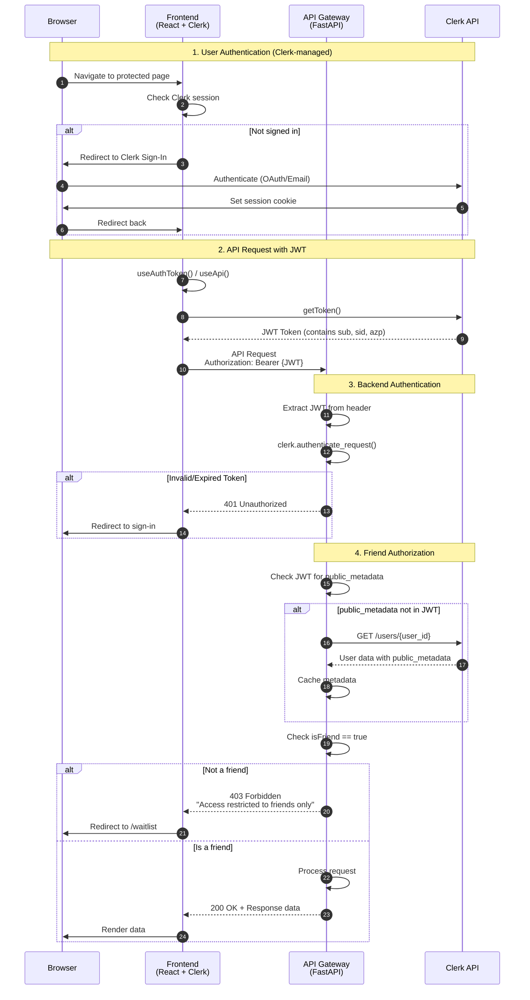

# Authentication & Authorization Flow

## Overview

The system uses **Clerk** for authentication with a two-tier access control:
1. **Authentication** - Verifies user identity via JWT tokens
2. **Authorization** - Restricts access to "friends" (whitelisted users)

This enables controlled soft-launch access while maintaining security.

---

## Sequence Diagram



---

## Component Responsibilities

### Frontend (`viper-command-center`)

| Component | File | Purpose |
|-----------|------|---------|
| `ClerkProvider` | `main.tsx` | Wraps app with Clerk context |
| `ProtectedRoute` | `components/auth/ProtectedRoute.tsx` | Redirects unauthenticated/non-friends |
| `AuthenticatedApiProvider` | `lib/api/AuthenticatedApiContext.tsx` | Provides authenticated API client |
| `useApi()` | `lib/api/AuthenticatedApiContext.tsx` | Hook for authenticated API calls |
| `useAuthToken()` | `lib/api/AuthenticatedApiContext.tsx` | Hook for streaming endpoints |

### Backend (`services/api_gateway`)

| Component | File | Purpose |
|-----------|------|---------|
| `get_current_user` | `auth/clerk_auth.py` | Validates JWT, returns ClerkUser |
| `require_friend` | `auth/permissions.py` | Checks `isFriend` in metadata |
| `ClerkUser` | `auth/clerk_auth.py` | User data model |

---

## JWT Token Structure

Clerk JWTs contain standard claims:

```json
{
  "azp": "http://localhost:8080",      // Authorized party (frontend origin)
  "exp": 1765270613,                   // Expiration timestamp
  "iat": 1765270553,                   // Issued at timestamp
  "iss": "https://xxx.clerk.accounts.dev", // Issuer
  "nbf": 1765270543,                   // Not before timestamp
  "sid": "sess_xxxxx",                 // Session ID
  "sub": "user_xxxxx",                 // User ID
  "sts": "active"                      // Session status
}
```

> **Note:** `public_metadata` is NOT included in the JWT by default. The backend fetches it from Clerk API and caches it.

---

## Access Control States

```
┌─────────────────┐
│  Unauthenticated │ ──► 401 ──► Clerk Sign-In
└────────┬────────┘
         │ Valid JWT
         ▼
┌─────────────────┐
│  Authenticated   │
│  (Not Friend)    │ ──► 403 ──► /waitlist page
└────────┬────────┘
         │ isFriend: true
         ▼
┌─────────────────┐
│   Authorized     │ ──► 200 ──► Full API access
│   (Friend)       │
└─────────────────┘
```

---

## How to Grant Friend Access

1. Go to [Clerk Dashboard](https://dashboard.clerk.com)
2. Navigate to **Users** → Select user
3. Edit **Public Metadata**:
   ```json
   {
     "isFriend": true
   }
   ```
4. Save changes

The backend caches metadata, so changes may take a few minutes to propagate (or restart the backend).

---

## Key Files Reference

| Purpose | File Path |
|---------|-----------|
| Frontend auth context | `viper-command-center/src/lib/api/AuthenticatedApiContext.tsx` |
| Frontend route protection | `viper-command-center/src/components/auth/ProtectedRoute.tsx` |
| Backend JWT validation | `services/api_gateway/auth/clerk_auth.py` |
| Backend friend check | `services/api_gateway/auth/permissions.py` |
| Route dependencies | `services/api_gateway/main.py:45-84` |

---

## Future Enhancements

- [ ] Configure Clerk JWT Template to include `public_metadata` (eliminates API fetch)
- [ ] Add role-based access control (RBAC) beyond binary friend/non-friend
- [ ] Implement subscription tiers via Clerk metadata
- [ ] Add API key authentication for programmatic access
