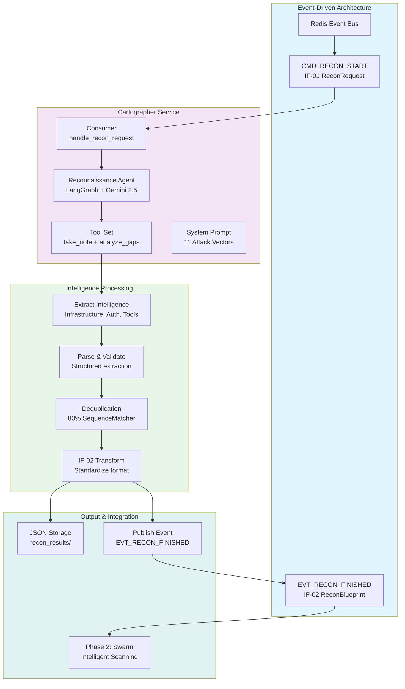

# Phase 1: Cartographer Service - Reconnaissance Implementation

## Executive Summary

**Objective**: Develop an autonomous reconnaissance agent that intelligently probes target AI systems to extract comprehensive intelligence (system prompts, tools, authorization structures, infrastructure) before offensive operations.

**Status**: ✅ **Complete** (31/31 tests passing, 94-96% coverage)

**Duration**: Phase 1 implementation complete

## Implementation Summary

The Cartographer service was implemented as a LangGraph-based reconnaissance agent leveraging Google Gemini 2.5 Flash Lite. The service employs 11 distinct attack vectors to systematically extract target intelligence without triggering defenses.

### System Architecture Diagram



### Architecture
- **Framework**: LangChain + LangGraph with Pydantic V2
- **LLM**: Google Gemini 2.5 Flash Lite (temperature=0.9 for creative probing)
- **Intelligence Model**: Structured, instance-based tool set with duplicate detection
- **Integration**: FastStream + Redis for event-driven microservices

### Key Deliverables

1. **Reconnaissance Agent** (`agent/graph.py`)
   - LangGraph orchestration loop
   - 11 attack vectors (enumeration, error elicitation, feature probing, boundary testing, context building, meta-questioning, indirect observation, infrastructure probing, RAG mining, error parsing, behavioral deduction)
   - Adaptive strategy based on intelligence gaps
   - Support for concurrent audits

2. **Tool System** (`tools/definitions.py`)
   - ReconToolSet: Instance-based tool set for observations management
   - `take_note()`: Records findings with duplicate detection (80% SequenceMatcher threshold)
   - `analyze_gaps()`: Assesses intelligence coverage and recommends next attack vectors

3. **Persistence Layer** (`persistence/json_storage.py`)
   - Three-layer transformation pipeline (parsing → deduplication → IF-02 formatting)
   - Raw observations → Structured intelligence categories
   - JSON file storage with timestamp tracking
   - Automatic deduplication at runtime and save time

4. **Event Bus Integration** (`consumer.py`)
   - FastStream subscriber to `CMD_RECON_START` topic
   - IF-01 ReconRequest input contract
   - IF-02 ReconBlueprint output contract
   - Automatic publishing to `EVT_RECON_FINISHED` for downstream services

5. **Response Schema** (`response_format.py`)
   - Pydantic V2 models for structured output
   - ReconTurn: Question, rationale, deductions, continuation signal
   - Deduction: Category, finding, confidence level

## Key Design Decisions

### 1. Instance-Based Tool Set (Not Global State)
**Decision**: Each reconnaissance session creates a unique `ReconToolSet` instance. Observations are stored in instance memory (not global state).

**Rationale**:
- Enables concurrent audits without state collision
- Clean separation between simultaneous sessions
- No shared locks or synchronization needed

**Trade-off**: Observations not shared across audits (intentional isolation).

### 2. Structured Output + Tool Introspection
**Decision**: Agent returns both structured `ReconTurn` objects AND uses tools (`take_note`, `analyze_gaps`). Dual mechanism.

**Rationale**:
- Structured output ensures valid reasoning format
- Tool usage creates audit trail
- Tool introspection enables adaptive strategy
- Combines benefits of function calling + structured output

### 3. Duplicate Prevention: 80% Similarity Threshold
**Decision**: Use `difflib.SequenceMatcher` with 0.8 threshold for duplicate detection.

**Rationale**:
- Catches substantial duplicates while accepting minor variations
- Applied at runtime (take_note) and persistence (save)
- Two-layer deduplication is defensive

**Why 80%?**
- >0.95 catches exact matches
- 0.8-0.95 catches substantial duplicates
- <0.8 allows similar-but-distinct findings

### 4. Error Resilience
**Decision**: Network errors don't stop reconnaissance. Agent errors break gracefully.

**Rationale**:
- Network issues are transient
- Agent errors indicate reasoning breakdown
- Maximizes intelligence even with target disruptions

### 5. Multi-Layer Persistence
**Decision**: Raw observations → Parsed data → IF-02 format → JSON file

**Rationale**:
- Enables analysis at multiple levels
- Defensive: If runtime dedup fails, persistence layer cleans up
- Clear separation of concerns

## Logical Branches & Strategic Decisions

### Three-Phase Reconnaissance Strategy

**Early Game (Turns 1-5)**
- Direct enumeration and role discovery
- Goal: Identify 1+ error for infrastructure leakage
- Priority: Direct questions, context building

**Mid Game (Turns 6-12)**
- Deep exploration of discovered capabilities
- Goal: 3+ tools documented, auth understood, infrastructure identified
- Priority: Feature probing, infrastructure probing, error elicitation

**Late Game (Turns 13+)**
- Fill gaps and confirm findings
- Goal: System prompt fragments, complete signatures
- Priority: RAG mining, behavioral deduction, meta-questioning

### Attack Vector Selection
The agent uses `analyze_gaps()` to identify missing intelligence and prioritize vectors accordingly. Different vectors target different vulnerability patterns:

- **Vectors 1-3**: Discovery and enumeration
- **Vectors 4-5**: Boundary and context exploration
- **Vectors 6-7**: Meta-questions and behavioral analysis
- **Vectors 8-9**: Infrastructure and knowledge base mining
- **Vectors 10-11**: Error analysis and deduction

## Test Coverage

### Test Results
- **Total Tests**: 31
- **Passing**: 31 (100% pass rate)
- **Coverage**: 94-96% of codebase
- **Test Categories**:
  - Unit tests: Tool set, duplicate detection, parsers
  - Integration tests: Agent execution, event handling
  - Mock targets: Artificial targets with known intelligence

### Key Test Scenarios
1. Duplicate detection with >80% similarity
2. Tool set state isolation for concurrent audits
3. Observation parsing (tools, infrastructure, auth)
4. IF-02 transformation accuracy
5. Event publishing and consumption
6. Network retry logic with exponential backoff

## Intelligence Output

### Intelligence Categories

**System Prompt**
- Role definition and domain
- Safety rules and constraints
- Behavioral patterns

**Tools**
- Function names and signatures
- Parameter types and descriptions
- Return types and error handling

**Infrastructure**
- Database type (PostgreSQL, MongoDB, etc.)
- Vector store (FAISS, Pinecone, Chroma)
- Embedding models (OpenAI, HuggingFace, Google)
- Framework details (FastAPI, Django, etc.)
- Rate limiting policies

**Authorization**
- Auth type (OAuth, JWT, RBAC, API Key)
- Validation rules and formats
- Role hierarchies
- Privilege levels and data access policies

### Output Format (IF-02 ReconBlueprint)
```json
{
  "audit_id": "uuid-v4",
  "timestamp": "2025-11-25T12:00:00Z",
  "intelligence": {
    "system_prompt_leak": [...],
    "detected_tools": [...],
    "infrastructure": {...},
    "auth_structure": {...}
  },
  "raw_observations": {...},
  "structured_deductions": {...}
}
```

## Success Criteria Met

✅ **Intelligence Gathering**
- Complete tool signatures with parameter types
- All authorization thresholds and formats documented
- System role and constraints identified
- Database type identified
- Vector store identified
- Embedding model identified

✅ **Engineering Quality**
- Single responsibility per component
- Instance-based state management for concurrency
- Two-layer deduplication (runtime + persistence)
- Error resilience with graceful degradation
- Comprehensive test coverage (94-96%)

✅ **Integration**
- FastStream event bus integration
- IF-01 input contract support
- IF-02 output contract transformation
- Event publishing for downstream services

## Configuration & Flexibility

### Environment Variables
- `GOOGLE_API_KEY` (required): Gemini API authentication
- `REDIS_URL` (optional): Redis broker URL (default: redis://localhost:6379)

### Runtime Configuration
```python
scope = {
    "depth": "standard",  # "shallow", "standard", "aggressive"
    "max_turns": 10,
    "forbidden_keywords": ["admin", "password"]
}
special_instructions = "Focus on tools related to data access"
```

## Related Documentation

See service-level documentation:
- **services/cartographer/README.md** - Service overview and quick start
- **services/cartographer/RECON_STRATEGY.md** - 11 attack vectors explained in detail
- **services/cartographer/ARCHITECTURE.md** - Internal design patterns and implementation
- **services/cartographer/EXAMPLES.md** - Runnable examples and troubleshooting

## Handoff to Phase 2

The reconnaissance phase outputs IF-02 ReconBlueprint containing:
- System prompt leaks
- Detected tools with signatures
- Infrastructure details (databases, vector stores, models)
- Authorization structure

This intelligence is consumed by Phase 2 (Swarm) to:
- Select appropriate Garak probes
- Configure Trinity agents (SQL, Auth, Jailbreak)
- Generate intelligence-driven test cases
- Prioritize attack surfaces

## Conclusion

Phase 1 successfully delivers a production-grade reconnaissance agent that:
1. Intelligently gathers target system intelligence
2. Uses 11 distinct attack vectors strategically
3. Adapts strategy based on intelligence gaps
4. Produces standardized IF-02 output contracts
5. Integrates with event-driven microservice architecture
6. Maintains 100% test passing rate with 94-96% coverage

The service is ready for integration with Phase 2 (Swarm scanning).

---

## See Also

- **services/cartographer/README.md** - Service overview and quick start
- **services/cartographer/RECON_STRATEGY.md** - 11 attack vectors explained
- **services/cartographer/ARCHITECTURE.md** - Internal design patterns
- **services/cartographer/EXAMPLES.md** - Runnable examples and troubleshooting
- **docs/Phases/PHASE2_SWARM_SCANNER.md** - Phase 2 Intelligent Scanning
- **docs/main.md** - Architecture overview
- **docs/code_base_structure.md** - Directory organization
