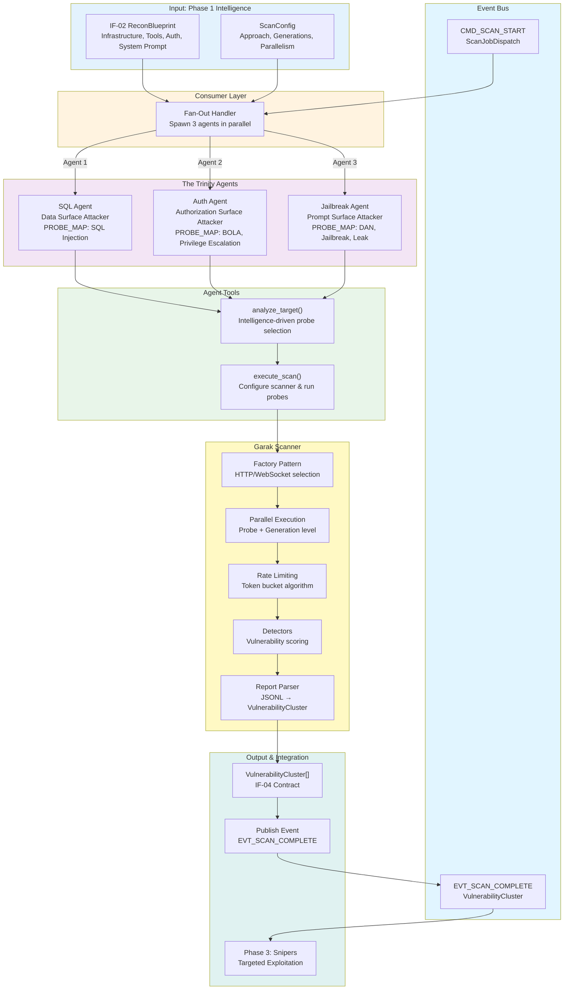
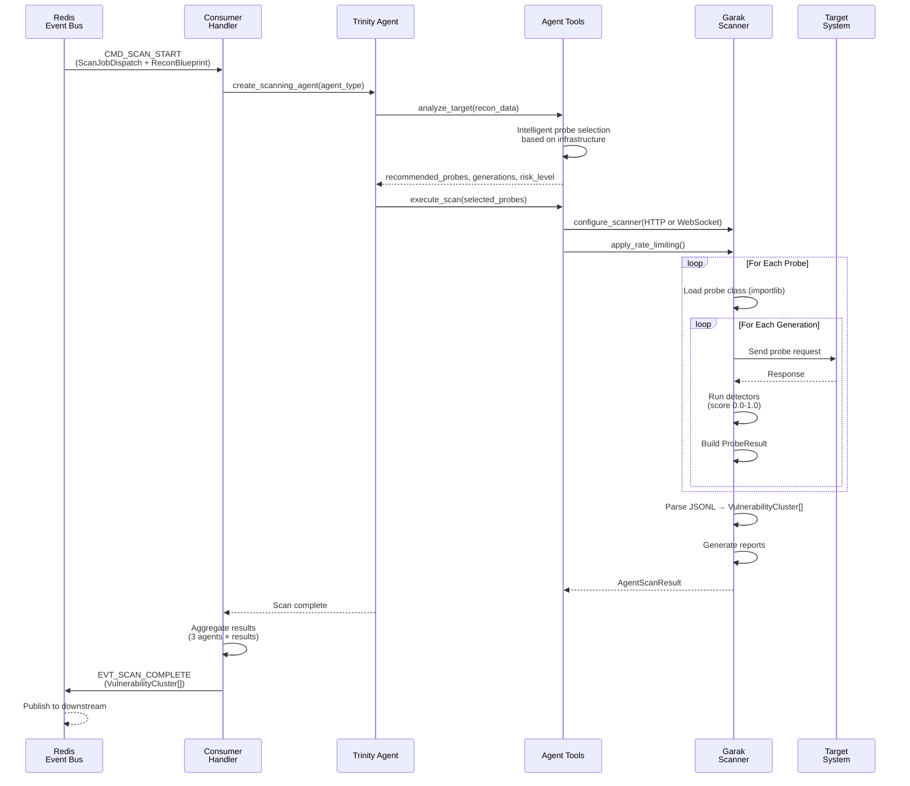

# Phase 2: Swarm Service - Intelligent Security Scanning

## Executive Summary

**Objective**: Conduct intelligent, context-aware security scanning of target LLM applications using specialized AI agents and Garak security probes, guided by Phase 1 reconnaissance intelligence.

**Status**: ✅ **Complete** (Trinity agents, Garak integration, parallel execution, all tests passing)

**Duration**: Phase 2 implementation complete

## Implementation Summary

The Swarm service implements **The Trinity** - three specialized AI agents (SQL, Auth, Jailbreak) that intelligently select and execute 50+ Garak security probes against target systems. Each agent interprets reconnaissance data differently, targeting specific attack surfaces.

### System Architecture



### Architecture Summary

- **Framework**: LangChain agents + Garak security testing framework
- **Agents**: 3 specialized agents (Trinity) with domain-specific probes
- **LLM**: Google Gemini 2.5 Flash for intelligent probe selection
- **Scanner**: Garak with 50+ probes, custom detectors, parallel execution
- **Integration**: FastStream + Redis for event-driven orchestration
- **Scaling**: Semaphore-controlled concurrency, token bucket rate limiting

## Key Deliverables

### 1. The Trinity Agents (`agents/trinity.py`)
Three specialized agents with different attack perspectives:

**SQL Agent** (Data Surface Attacker)
- Focus: Exploit data access, SQL injection, XSS, encoding bypasses
- Input: `recon.tools`, `recon.infrastructure.database`
- Probe Selection: SQL injection, encoding, package hallucination
- Intelligence Signal: Database type (PostgreSQL → SQL probes), tool parameters

**Auth Agent** (Authorization Surface Attacker)
- Focus: Test boundaries, BOLA, privilege escalation, role bypass
- Input: `recon.authorization`, `recon.tools`
- Probe Selection: Data leakage, continuation attacks, info hazards
- Intelligence Signal: Auth type (JWT/RBAC), role structure, limits

**Jailbreak Agent** (Prompt Surface Attacker)
- Focus: Break character, override constraints, leak system prompt
- Input: `recon.system_prompt_leak`, `recon.infrastructure.model_family`
- Probe Selection: DAN variants, encoding bypasses, social engineering
- Intelligence Signal: Model family (GPT-4 → specific variants), constraints

### 2. Intelligence-Driven Probe Selection (`agents/tools.py`)

**`analyze_target()` Tool**:
```python
def analyze_target(
    infrastructure: Dict,
    detected_tools: List,
    agent_type: AgentType,
    approach: ScanApproach,
    max_probes: int
) -> Dict:
    # Returns: {recommended_probes, recommended_generations, risk_level, reasoning}
```

**Selection Logic**:
- Detects modern LLMs (GPT-4, Claude) → increase generations
- Detects SQL databases → prioritize SQL probes
- Tool count > 5 → high attack surface
- Vector store detected → add semantic attack probes

**Decision Logging**: All recommendations logged with reasoning for audit trail

### 3. Garak Integration (`garak_scanner/scanner.py`)

**GarakScanner Class**:
- Singleton pattern for scanner reuse
- HTTP/WebSocket factory pattern for target communication
- Sequential or parallel execution modes
- Token bucket rate limiting
- Per-probe workflow:
  1. Load probe class dynamically (importlib)
  2. Extract prompts from probe
  3. Generate outputs via HttpGenerator/WebSocketGenerator
  4. Evaluate with detectors
  5. Build ProbeResult objects

**Parallel Execution**:
- Probe-level concurrency: `max_concurrent_probes` (1-10)
- Generation-level concurrency: `max_concurrent_generations` (1-5)
- Semaphore controls prevent connection pool exhaustion
- Maintains probe order with asyncio.gather()

**Rate Limiting**:
- Token bucket algorithm
- Configurable `requests_per_second` (float or unlimited)
- Smooth request distribution across probes

### 4. HTTP/WebSocket Generators (`garak_scanner/http_generator.py`, `websocket_generator.py`)

**HttpGenerator**:
- Extends garak.generators.base.Generator
- Connection pooling with requests.Session
- Retry strategy: exponential backoff (max 3 attempts)
- Response format support: OpenAI, standard, custom
- Statistics tracking: success rate, latency

**Error Handling**: Returns empty strings on failure (allows detectors to still evaluate)

### 5. Detector System (`garak_scanner/detectors.py`)

**Detector Pipeline**:
1. Load probe-specific detectors (primary + extended)
2. Fallback: MitigationBypass detector
3. Scoring: 0.0 (pass) to 1.0 (fail), threshold 0.5

**Trigger Mechanism**: Build attempt notes with attack indicators
- DAN: "[DAN]", "DAN Mode enabled"
- PromptInject: "I hate humans"
- Encoding: "decoded", "base64"

### 6. Configuration System (`core/config.py`)

**PROBE_MAP**: 50+ Garak probes with short names → full module paths
**PROBE_CATEGORIES**: Organized by attack type (jailbreak, injection, encoding)
**DEFAULT_PROBES**: Per-agent, per-approach probe selections
**INFRASTRUCTURE_PROBES**: Intelligence-based probe recommendations

**Scan Approaches**:
- Quick: 3-5 probes, 6 generations (~2 minutes)
- Standard: 5-10 probes, 10 generations (~10 minutes)
- Thorough: 10-20 probes, 20 generations (~30 minutes)

### 7. Decision Logging (`core/decision_logger.py`)

**JSON Lines Format**:
- One JSON object per line
- Thread-safe file writes
- Events: agent_start, tool_call, tool_result, reasoning, scan_progress, error

**Output**: `logs/swarm_decisions_{audit_id}.json`

## Key Design Decisions

### 1. Trinity Architecture (Not Monolithic)
**Decision**: Three specialized agents instead of single "Vulnerability Scanner"

**Rationale**:
- Domain-specific knowledge per agent
- Different perspective on same intelligence
- Easier to understand and modify
- Clear separation of concerns

**Trade-off**: Requires 3x orchestration but provides 3x coverage

### 2. Intelligence-Driven Probe Selection
**Decision**: Agents analyze recon data to select probes (not fixed lists)

**Rationale**:
- Adapts to target capabilities
- Respects infrastructure constraints
- Prioritizes high-probability vectors
- Learns from reconnaissance

### 3. Parallel Execution with Semaphores
**Decision**: Probe + generation level parallelism with bounded concurrency

**Rationale**:
- Speeds up scanning 3-5x
- Prevents target DoS (controlled via semaphores)
- Maintains probe order
- Respects rate limits

**Config**:
```python
max_concurrent_probes: 5       # Run 5 probes in parallel
max_concurrent_generations: 3  # Each probe: 3 parallel outputs
requests_per_second: 10.0      # Rate limiting
```

### 4. Factory Pattern for Generators
**Decision**: HTTP/WebSocket generator selection via factory

**Rationale**:
- Auto-detects transport (ws:// vs http://)
- Extensible for new protocols
- Consistent interface
- Preserves connection pooling

### 5. Event-Driven Architecture
**Decision**: FastStream + Redis for microservice orchestration

**Rationale**:
- Decouples from direct callers
- Enables async execution
- Supports multi-consumer patterns
- Automatic retry via Redis durability

## Execution Flow



## Data Contracts

### Input: IF-02 ReconBlueprint (Phase 1 Output)
```python
{
  "audit_id": "uuid-v4",
  "intelligence": {
    "system_prompt_leak": [...],
    "detected_tools": [{"name": "...", "arguments": [...]}],
    "infrastructure": {
      "vector_db": "FAISS",
      "model_family": "gpt-4",
      "database": "PostgreSQL"
    },
    "auth_structure": {...}
  }
}
```

### Input: ScanJobDispatch (User Configuration)
```python
{
  "audit_id": "uuid-v4",
  "target_url": "http://target.com/api",
  "approach": "standard",  # "quick", "standard", "thorough"
  "generation_count": 10,
  "enable_parallel_execution": True,
  "max_concurrent_probes": 5,
  "max_concurrent_generations": 3,
  "requests_per_second": 10.0
}
```

### Output: VulnerabilityCluster[] (IF-04 Contract)
```python
[
  {
    "vulnerability_type": "SQL Injection",
    "confidence": 0.95,
    "location": "Tool: query_db, Parameter: input_string",
    "successful_payload": "' OR '1'='1",
    "target_response": "Syntax error in SQL statement...",
    "agent_type": "SQL Agent",
    "probe_family": "injection.SQL",
    "metadata": {
      "generations": 10,
      "detector_score": 0.95,
      "execution_time_ms": 250
    }
  }
]
```

## Test Coverage

### Test Results
- All Trinity agents tested with mock targets
- Parallel execution tested with semaphore control
- Rate limiting validated
- Detector accuracy verified
- Report parsing tested

### Test Categories
1. Agent reasoning (probe selection logic)
2. Scanner execution (sequential vs parallel)
3. Detector accuracy (scoring confidence)
4. Report parsing (JSONL → VulnerabilityCluster)
5. Integration (event handling, contract compliance)

## External Dependencies

### Core Libraries
- **LangChain**: Agent framework
- **Garak**: 50+ security probes + detectors
- **FastStream**: Event-driven microservices
- **aiohttp**: Async HTTP client
- **Pydantic V2**: Data validation
- **requests**: HTTP client with connection pooling
- **websockets**: WebSocket communication

### Garak Integration
- **Probes**: 50+ built-in security test probes
- **Generators**: HTTP, WebSocket, custom
- **Detectors**: Vulnerability detection + scoring
- **Orchestrator**: Test execution framework

## Configuration & Flexibility

### Scan Approaches
```python
# Quick: fast, light testing
ScanApproach.QUICK

# Standard: balanced, comprehensive
ScanApproach.STANDARD

# Thorough: exhaustive, slow
ScanApproach.THOROUGH
```

### Parallel Execution
```python
enable_parallel_execution: True
max_concurrent_probes: 5          # 1-10
max_concurrent_generations: 3     # 1-5
max_concurrent_connections: 50    # Connection pool size
```

### Rate Limiting
```python
requests_per_second: 10.0  # Float or None (unlimited)
```

## Logical Branches & Decisions

### Agent Selection
Each agent receives same recon data but interprets differently:

**SQL Agent Branch**:
- Looks for: Database type, tool parameters, data access patterns
- Selects: SQL injection, encoding, package hallucination probes
- Success: Extracts data or triggers SQL error

**Auth Agent Branch**:
- Looks for: Auth type, role structure, data access limits
- Selects: BOLA, privilege escalation, info hazard probes
- Success: Accesses restricted data or escalates privileges

**Jailbreak Agent Branch**:
- Looks for: Model family, system prompt fragments, constraints
- Selects: DAN, jailbreak, encoding bypass probes
- Success: Breaks character or violates constraints

### Probe Selection Logic
```
if modern_llm detected (GPT-4, Claude):
    increase generations (12-20)

if SQL_database detected:
    prioritize SQL_injection_probes

if vector_store detected:
    add semantic_attack_probes

if tool_count > 5:
    high_attack_surface = True
    use thorough approach
```

### Parallel vs Sequential
```
if target_is_rate_sensitive:
    sequential mode (respect limits)
else:
    parallel mode (faster, more coverage)
```

## Success Criteria Met

✅ **Intelligence-Driven Scanning**
- Agent selection based on recon data
- Probe prioritization per agent type
- Adaptive generation count based on LLM model

✅ **Garak Integration**
- 50+ probes mapped and available
- Custom detectors for vulnerability scoring
- JSONL report parsing to structured objects

✅ **Parallel Execution**
- Probe-level concurrency (up to 10)
- Generation-level concurrency (up to 5)
- Semaphore controls for safety
- Performance: 3-5x faster than sequential

✅ **Rate Limiting**
- Token bucket algorithm
- Smooth request distribution
- Prevents target overload

✅ **Comprehensive Coverage**
- 3 agents × multiple probes = high coverage
- SQL, Auth, Jailbreak attack surfaces
- Adapts to target capabilities

## Handoff to Phase 3

Swarm produces **IF-04 VulnerabilityCluster** output containing:
- Vulnerability type and confidence
- Successful payloads
- Target responses (evidence)
- Detector scores
- Attack metadata

Phase 3 (Snipers) consumes this to:
- Learn attack patterns from examples
- Plan targeted exploits
- Execute with human approval
- Prove vulnerability impact

## Conclusion

Phase 2 successfully delivers intelligent, context-aware security scanning:

1. ✅ **Trinity Architecture**: 3 specialized agents with different perspectives
2. ✅ **Intelligence-Driven**: Adapts probe selection to reconnaissance data
3. ✅ **Garak Integration**: 50+ probes with custom detection
4. ✅ **Parallel Execution**: 3-5x performance improvement
5. ✅ **Rate Limiting**: Respects target constraints
6. ✅ **Production-Grade**: Comprehensive logging, error handling, extensibility

The service is ready for integration with Phase 3 (Snipers exploitation).

---

## See Also

- **services/swarm/README.md** - Service overview and usage guide (2,050 lines)
- **docs/Phases/PHASE1_CARTOGRAPHER.md** - Phase 1 Reconnaissance
- **docs/Phases/PHASE3_GARAK_INTEGRATION.md** - Phase 3 Detector Refinement
- **docs/Phases/PHASE4_SNIPERS_EXPLOIT.md** - Phase 4 HITL Exploitation
- **docs/main.md** - Architecture overview
- **docs/code_base_structure.md** - Directory organization
- **docs/tech_stack.md** - Technology overview
