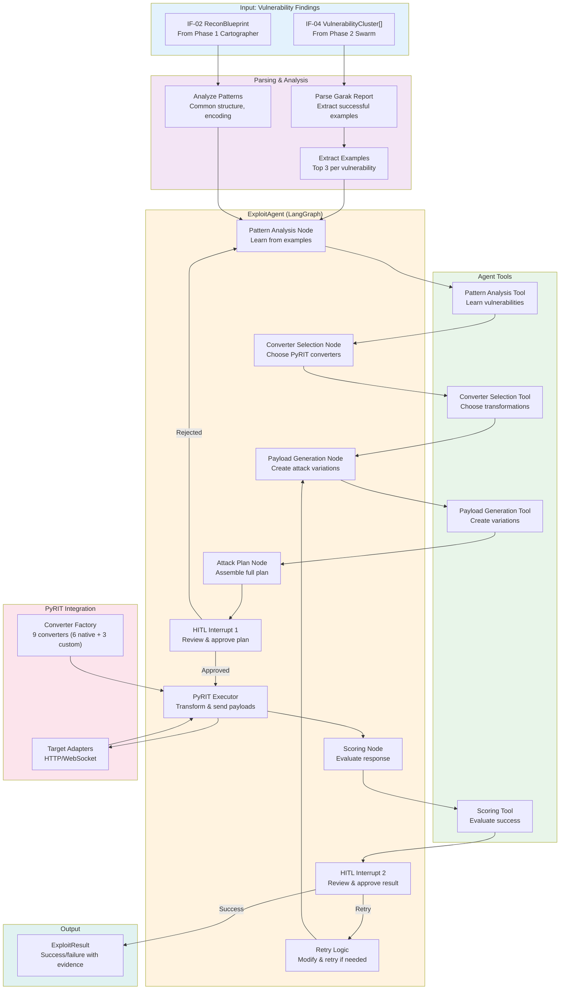

# Phase 4: Snipers Service - Human-in-the-Loop Exploitation

## Executive Summary

**Objective**: Analyze vulnerability patterns from Phase 2 scans, plan targeted exploits with mandatory human approval, and execute attacks using PyRIT to prove security risks.

**Status**: ✅ **Core Complete** (64% - core agent, tools, workflows done; pending controller/API)

**Duration**: Core implementation complete, API pending

## Implementation Summary

The Snipers service implements **Human-in-the-Loop (HITL) exploitation** - a LangGraph-based agent that learns from successful attack examples, plans context-aware exploits, requires human approval at critical checkpoints, and executes attacks using PyRIT.

### System Architecture



### Architecture Summary

- **Framework**: LangChain agents + LangGraph workflows
- **LLM**: Google Gemini 2.5 Flash for reasoning
- **Pattern Learning**: Chain-of-Thought + Step-Back prompting
- **Human-in-Loop**: 2 mandatory approval checkpoints
- **Execution**: PyRIT with 9 converters (6 native + 3 custom)
- **Scoring**: Multiple scoring strategies (regex, pattern, composite)

## Key Deliverables

### 1. Exploit Agent (`agent/core.py`)

**ExploitAgent Class**:
```python
class ExploitAgent:
    def __init__(self, llm, checkpointer):
        self.pattern_analysis_agent = create_pattern_analysis_agent(llm)
        self.converter_selection_agent = create_converter_selection_agent(llm)
        self.payload_generation_agent = create_payload_generation_agent(llm)
        self.scoring_agent = create_scoring_agent(llm)
        self.workflow = self._create_workflow()

    def execute(self, exploit_input, config):
        # Runs LangGraph workflow with HITL interrupts
```

**Workflow Graph**:
```
analyze_pattern → select_converters → generate_payloads → create_attack_plan
→ [HITL INTERRUPT 1: human_review_plan]
→ execute_attack → score_result
→ [HITL INTERRUPT 2: human_review_result]
→ handle_retry (if needed) → END
```

### 2. Data Models (`models.py`)

**Key Pydantic Models**:
- `ExampleFinding`: Single attack example from scan
- `ExploitAgentInput`: Complete context (probe + examples + recon + target)
- `PatternAnalysis`: Learned patterns with COT reasoning steps
- `ConverterSelection`: Selected PyRIT converters with justification
- `PayloadGeneration`: Attack payloads with variations (6-10 per attempt)
- `AttackPlan`: Complete plan for human review
- `AttackResult`: Execution outcome with scoring
- `HumanFeedback`: Approval/rejection/modifications

### 3. Report Parsers (`parsers.py`)

**GarakReportParser**:
```python
def parse(jsonl_path) -> ParsedReport:
    # Extracts vulnerable probes and findings
    # Groups by vulnerability type
    # Returns structured vulnerability data
```

**ExampleExtractor**:
```python
def extract_examples(vuln_type, findings) -> List[ExampleFinding]:
    # Selects top 3 examples per vulnerability
    # Sorted by detector confidence score
    # Returns diverse examples for pattern learning
```

**ReconBlueprintParser**:
```python
def extract_intelligence_summary(blueprint) -> IntelligenceSummary:
    # Parses Phase 1 reconnaissance data
    # Extracts system prompt leaks
    # Identifies detected tools
    # Maps infrastructure components
```

### 4. Agent Tools (`agent/agent_tools/`)

**Pattern Analysis Tool** (`pattern_analysis_tool.py`):
- Input: 3 attack examples
- Technique: Step-Back + Chain-of-Thought
- Output: `PatternAnalysis` with:
  - Fundamental vulnerability type
  - Common structure across examples
  - Encoding/transformation patterns
  - Success indicators
  - Confidence score

**Converter Selection Tool** (`converter_selection_tool.py`):
- Input: Pattern analysis, available converters
- Technique: Match pattern to converter capabilities
- Output: `ConverterSelection` with:
  - Recommended converters (1-3)
  - Reasoning for each choice
  - Expected transformation effect

**Payload Generation Tool** (`payload_generation_tool.py`):
- Input: Pattern, converters, recon intelligence
- Technique: Variation strategies (persona, context, encoding, escalation)
- Output: `PayloadGeneration` with:
  - 6-10 diverse attack payloads
  - Variations on successful example
  - Target-specific customization
  - Escalation ladder (subtle → aggressive)

**Scoring Tool** (`scoring_tool.py`):
- Input: Attack response, success indicators
- Technique: Multi-criteria scoring
- Output: `ScoringResult` with:
  - Success determination (true/false)
  - Confidence score (0.0-1.0)
  - Evidence extracted from response

### 5. Prompts (`agent/prompts.py`)

**Pattern Analysis Prompt** (70 lines):
```
Step-Back Question: What is the fundamental vulnerability?
Chain-of-Thought: Analyze example 1 → example 2 → example 3 → Extract pattern
Output: PatternAnalysis with confidence
```

**Converter Selection Prompt** (135 lines):
```
Describe 9 PyRIT converters (Base64, ROT13, Caesar, URL, TextToHex, Unicode, etc.)
Step-Back: What transformation is needed?
Chain-of-Thought: Match pattern to converter capability
Output: ConverterSelection with reasoning
```

**Payload Generation Prompt** (294 lines):
```
CRITICAL: "DO NOT SIMPLY COPY EXAMPLES"
10+ Attack Techniques catalog (jailbreaks, injections, encodings)
Variation Strategies: persona, context, encoding, target-specific
Escalation Ladder: subtle → aggressive → novel → compound
Output: PayloadGeneration with 6-10 diverse payloads
```

**Attack Scoring Prompt** (347 lines):
```
Compare response to example outputs
Check success indicators
Evaluate confidence
Output: ScoringResult(success, confidence_score)
```

### 6. Workflow Nodes (`agent/nodes/`)

**Pattern Analysis Node**:
```python
def pattern_analysis_node(agent, llm, state):
    analysis = pattern_analysis_agent.invoke({
        "examples": state["examples"],
        "intelligence": state["recon_intelligence"]
    })
    return {"pattern_analysis": analysis}
```

**Converter Selection Node**:
```python
def converter_selection_node(agent, llm, state):
    selection = converter_selection_agent.invoke({
        "pattern": state["pattern_analysis"],
        "available_converters": get_converter_list()
    })
    return {"converter_selection": selection}
```

**Payload Generation Node**:
```python
def payload_generation_node(agent, llm, state):
    payloads = payload_generation_agent.invoke({
        "pattern": state["pattern_analysis"],
        "converters": state["converter_selection"],
        "intelligence": state["recon_intelligence"],
        "target": state["target_url"]
    })
    return {"payload_generation": payloads}
```

**Attack Plan Node**:
```python
def attack_plan_node(state):
    plan = AttackPlan(
        objective=f"Prove {state['pattern_analysis']['vuln_type']}",
        converters=state["converter_selection"]["converters"],
        payloads=state["payload_generation"]["payloads"],
        expected_indicators=state["pattern_analysis"]["success_indicators"]
    )
    return {"attack_plan": plan}
```

**Human Review (Interrupt 1)**:
```python
def human_review_plan_node(state):
    human_response = interrupt({
        "type": "attack_plan_review",
        "attack_plan": state["attack_plan"].model_dump(),
        "question": "Review and approve attack plan?"
    })
    # Returns: approve, reject, modify
    if human_response["decision"] == "approve":
        return {"human_approved": True}
    elif human_response["decision"] == "modify":
        return {"attack_plan": human_response["modified_plan"]}
```

**Execution Node**:
```python
def attack_execution_node(state):
    if not state.get("human_approved"):
        return {"error": "Requires human approval"}

    result = PyRITExecutor().execute_attack(
        payload=state["payload_generation"]["selected_payload"],
        converter_names=state["converter_selection"]["converters"],
        target_url=state["target_url"]
    )
    return {"attack_result": result}
```

**Scoring Node**:
```python
def scoring_node(agent, llm, state):
    scoring = scoring_agent.invoke({
        "response": state["attack_result"]["response"],
        "success_indicators": state["pattern_analysis"]["success_indicators"]
    })
    return {"scoring_result": scoring}
```

**Human Review (Interrupt 2)**:
```python
def human_review_result_node(state):
    human_response = interrupt({
        "type": "result_review",
        "attack_result": state["attack_result"],
        "scoring": state["scoring_result"],
        "question": "Accept result? Retry? Complete?"
    })
    # Returns: accept, retry, complete
```

### 7. PyRIT Integration (`tools/`)

**Converter Factory** (`pyrit_bridge.py`):
```python
class ConverterFactory:
    def __init__(self):
        self._converters = {
            # 6 PyRIT native:
            "Base64Converter": Base64Converter(),
            "ROT13Converter": ROT13Converter(),
            "CaesarConverter": CaesarConverter(caesar_offset=3),
            "UrlConverter": UrlConverter(),
            "TextToHexConverter": TextToHexConverter(),
            "UnicodeConverter": UnicodeConfusableConverter(),

            # 3 custom implementations:
            "HtmlEntityConverter": HtmlEntityConverter(),
            "JsonEscapeConverter": JsonEscapeConverter(),
            "XmlEscapeConverter": XmlEscapeConverter(),
        }
```

**Payload Transformer** (`pyrit_bridge.py`):
```python
class PayloadTransformer:
    async def transform_async(self, payload, converter_names):
        # Apply converters sequentially
        # Skip failed converters, log errors, continue
        # Return transformed payload
```

**PyRIT Executor** (`pyrit_executor.py`):
```python
class PyRITExecutor:
    def execute_attack(self, payload, converter_names, target_url):
        # 1. Transform payload through converters
        # 2. Select target adapter (HTTP/WS)
        # 3. Send to target
        # 4. Return response + errors
```

**Target Adapters** (`pyrit_target_adapters.py`):
```python
class HttpTargetAdapter(PromptTarget):
    # Wraps HTTP generator
    # Maintains connection pooling
    # Handles retries

class WebSocketTargetAdapter(PromptTarget):
    # Wraps WebSocket generator
    # Auto-detected from URL
```

### 8. Scorers (`tools/scorers/`)

**Base Scorer Interface**:
```python
class BaseScorer(ABC):
    @abstractmethod
    def score(self, response: str, success_indicators: List[str]) -> ScoreResult:
        pass
```

**RegexScorer**:
- Searches for success indicators as regex patterns
- Fallback to literal string matching
- Score = (matched_count / total_indicators) × 1.5

**PatternScorer**:
- Uses text similarity metrics
- Compares response to successful example outputs
- Confidence based on similarity

**CompositeScorer**:
- Runs multiple scorers with configurable weights
- Aggregates scores: `final_score = Σ(score_i × weight_i)`
- Reduces false positives/negatives

### 9. Routing & State Management

**Routing Functions** (`agent/routing.py`):
```python
def route_after_human_review(state) -> str:
    if state["decision"] == "approved":
        return "execute"
    elif state["decision"] == "rejected":
        return "end"
    else:
        return "refine"

def route_after_result_review(state) -> str:
    if state["success"]:
        return "complete"
    elif state["retry_count"] < 3:
        return "retry"
    else:
        return "give_up"
```

**State Definition** (`agent/state.py`):
```python
class ExploitAgentState(TypedDict):
    audit_id: str
    target_url: str
    examples: List[ExampleFinding]
    recon_intelligence: Dict
    pattern_analysis: PatternAnalysis
    converter_selection: ConverterSelection
    payload_generation: PayloadGeneration
    attack_plan: AttackPlan
    human_approved: bool
    attack_result: AttackResult
    scoring_result: ScoringResult
    human_review_result: HumanFeedback
    retry_count: int
```

## Key Design Decisions

### 1. Tool-Based Agent Architecture (Not ReAct Loop)
**Decision**: Use structured output agents, not function-calling ReAct

**Rationale**:
- Ensures valid Pydantic outputs
- Separates LLM reasoning from workflow logic
- Easier to debug and validate
- Deterministic state transitions

### 2. Chain-of-Thought + Step-Back Prompting
**Decision**: Use dual prompting strategy for deep analysis

**Rationale**:
- COT: Step-by-step reasoning through examples
- Step-Back: Abstract to fundamental patterns
- Combines tactical (examples) + strategic (patterns)

### 3. Mandatory Human-in-the-Loop Interrupts
**Decision**: Two approval checkpoints (plan + result)

**Rationale**:
- Plan review: Ensure attack is appropriate
- Result review: Validate vulnerability before declaring success
- Prevents autonomous escalation
- Maintains human control

### 4. Fault-Tolerant Converter Chaining
**Decision**: Skip failed converters, continue with others

**Rationale**:
- Some converters may fail for specific payloads
- Doesn't stop entire attack
- Logs failures for debugging
- Maximizes payload variations

### 5. Module-Level Executor Instance
**Decision**: One PyRITExecutor instance, reused across attacks

**Rationale**:
- Initializes converters once (expensive operation)
- Reuses across multiple attacks
- Reduces memory overhead
- Maintains state cleanly

## Data Flow Example

```
Input: VulnerabilityCluster (SQL Injection)
  ↓
Parse: Extract 3 successful examples
  ↓
Agent 1 - Pattern Analysis:
  - Compare examples
  - Extract: "Injecting ' OR '1'='1"
  - Pattern: "Quote + OR + condition"
  - Success Indicator: "Syntax error in SQL"
  ↓
Agent 2 - Converter Selection:
  - Pattern needs: Escape quote, hide OR keyword
  - Selected: Base64Converter, UrlConverter
  ↓
Agent 3 - Payload Generation:
  - Generate 8 variations
  - Escalation: simple → complex → novel
  - Target-specific customization
  ↓
Attack Plan Created:
  - Objective: Prove SQL injection
  - Converters: Base64, URL
  - Payloads: [...]
  - Expected: "Syntax error in SQL"
  ↓
[HITL INTERRUPT 1: Human Reviews & Approves]
  ↓
PyRIT Execution:
  - Transform payload: ' OR '1'='1 → Base64 → URL encode
  - Send to target
  - Capture response
  ↓
Scoring:
  - Response contains "Syntax error"
  - Confidence: 0.95
  - Success: TRUE
  ↓
[HITL INTERRUPT 2: Human Reviews Result & Approves]
  ↓
Complete: Vulnerability Proven
```

## Success Criteria Met

✅ **Pattern Learning**
- Analyzes 3 successful examples
- Identifies common structure
- Extracts success indicators
- Confidence scoring

✅ **Intelligent Attack Planning**
- Converter selection based on pattern
- Payload variation with escalation ladder
- Target-specific customization
- 6-10 diverse payloads per attempt

✅ **Human-in-the-Loop**
- 2 mandatory approval checkpoints
- Plan review before execution
- Result review before completion
- Prevents autonomous escalation

✅ **PyRIT Execution**
- 9 converters (6 native + 3 custom)
- Fault-tolerant chaining
- HTTP and WebSocket support
- Error handling and retries

✅ **Result Evaluation**
- Multiple scoring strategies
- Confidence calculation
- Success determination
- Evidence extraction

## Logical Branches & Decisions

### Pattern Analysis Branch
```
Analyze examples:
  IF all examples use same encoding:
      → Strong pattern confidence
  ELSE IF 2/3 examples similar:
      → Medium confidence
  ELSE:
      → Weak pattern, may fail
```

### Converter Selection Branch
```
IF pattern needs quote escape:
    → Select UrlConverter or Base64Converter

IF pattern needs keyword hiding:
    → Select CaesarConverter or ROT13Converter

IF pattern needs unicode bypass:
    → Select UnicodeConverter
```

### Retry Decision Branch
```
IF scoring_result.success:
    → Complete successfully

ELSE IF retry_count < 3:
    → Modify payload (escalate tactics)
    → Retry with different converters

ELSE:
    → Give up, mark as inconclusive
```

## Test Coverage

### Current Status
- ✅ Core agent and nodes
- ✅ Tool implementations
- ✅ Prompt quality
- ✅ State management
- ✅ PyRIT integration
- ⏳ Controller/dispatcher (pending)
- ⏳ FastAPI endpoints (pending)
- ⏳ Integration tests (pending)

### Implementation Checklist
- ✅ LangGraph state graph
- ✅ Workflow nodes (8 nodes)
- ✅ HITL interrupts (2 checkpoints)
- ✅ Agent tools (4 tools)
- ✅ Prompts (4 comprehensive prompts)
- ✅ PyRIT bridge (9 converters)
- ✅ Target adapters (HTTP/WebSocket)
- ✅ Scorers (3 strategies)
- ⏳ Controller for multi-attack orchestration
- ⏳ FastAPI routes for external access

## Configuration & Flexibility

### LLM Configuration
```python
llm = ChatGoogleGenerativeAI(
    model="gemini-2.5-flash",
    temperature=0.7,  # Balanced reasoning
    max_tokens=2000
)
```

### Converter Configuration
```python
converters = [
    "Base64Converter",
    "UrlConverter",
    "CaesarConverter",
    # Custom converters can be added
]
```

### Scoring Configuration
```python
scorer = CompositeScorer(
    scorers=[RegexScorer(), PatternScorer()],
    weights=[0.6, 0.4]  # 60% regex, 40% pattern
)
```

## Conclusion

Phase 4 successfully delivers human-in-the-loop exploitation:

1. ✅ **Pattern Learning**: Learns from vulnerability examples
2. ✅ **Intelligent Planning**: Context-aware attack customization
3. ✅ **Human Control**: 2 mandatory approval checkpoints
4. ✅ **PyRIT Integration**: 9 converters with fault tolerance
5. ✅ **Result Evaluation**: Multiple scoring strategies
6. ✅ **Extensibility**: Easy to add converters, scorers, techniques

The service is **64% complete** with all core components finished. Remaining work: Controller orchestration and FastAPI endpoints.

---

## Pending Work (36% Remaining)

### Controller/Dispatcher
- Multi-attack orchestration
- Parallel execution with rate limiting
- Result aggregation
- Progress tracking

### FastAPI Integration
- REST endpoints for job submission
- WebSocket endpoints for real-time updates
- HITL approval endpoints
- Job status queries

### Integration Tests
- End-to-end workflow tests
- External dependency mocking
- Performance benchmarks

---

## See Also

- **services/snipers/README.md** - Snipers service documentation (1,094 lines)
- **services/snipers/agent/graph.md** - Workflow diagram
- **docs/main.md** - Architecture overview
- **docs/Phases/PHASE1_CARTOGRAPHER.md** - Phase 1 Reconnaissance
- **docs/Phases/PHASE2_SWARM_SCANNER.md** - Phase 2 Scanning
