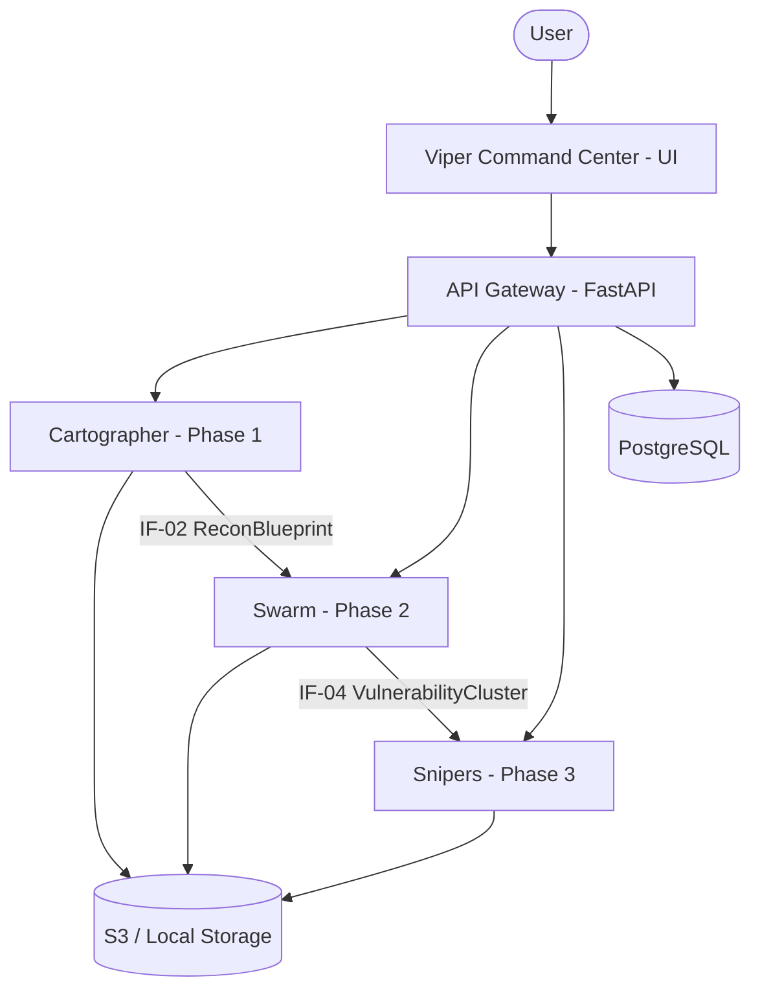

# Aspexa Automa: Complete Code Structure

This document provides a comprehensive overview of the Aspexa Automa codebase organization, component hierarchy, and module responsibilities.

---

## System Overview

Aspexa Automa is organized as a set of specialized microservices coordinated through a central API Gateway.



---

## Directory Hierarchy

```
aspexa-automa/
├── libs/                 # Shared kernel (contracts, persistence, config)
│   ├── config/           # Centralized settings
│   ├── connectivity/     # HTTP/WebSocket adapters
│   ├── contracts/        # Data schemas (IF-01 to IF-06)
│   ├── monitoring/       # Logging and observability
│   └── persistence/      # Database and S3 storage adapters
├── services/             # Core microservices
│   ├── api_gateway/      # Centralized REST access
│   ├── cartographer/     # Phase 1: Reconnaissance
│   ├── swarm/            # Phase 2: Scanning
│   └── snipers/          # Phase 3: Exploitation
├── scripts/              # Utilities and example workflows
└── tests/                # Unit and integration test suite
```

---

## libs/ - Shared Kernel

### [libs/config/](../libs/config/)
- **`settings.py`**: Centralized configuration using `pydantic-settings`. Loads environment variables for API keys, database URLs, and service thresholds.

### [libs/contracts/](../libs/contracts/)
- Defines the 6 core data contracts used for inter-service communication.
- **`recon.py`**: `ReconRequest` (IF-01), `ReconBlueprint` (IF-02).
- **`scanning.py`**: `ScanJobDispatch` (IF-03), `VulnerabilityCluster` (IF-04).
- **`recon.py`**: `ExploitInput` (IF-05), `ExploitResult` (IF-06).

### [libs/persistence/](../libs/persistence/)
- **`bucket_manager.py`**: Abstraction for storing large JSON results (Blueprints, Scan Results) in S3 or local storage.
- **`scan_models.py`**: Pydantic models specifically for persistence (e.g., `GarakResult`, `ReconResult`).
- **`sqlite/` / `postgres/`**: Database adapters for campaign and scan metadata.

### [libs/connectivity/](../libs/connectivity/)
- **`http/`**: Async HTTP client wrappers with exponential backoff.
- **`adapters/`**: Target-specific adapters for PyRIT and Garak.

---

## services/ - Core Microservices

### [services/api_gateway/](../services/api_gateway/)
- **Role**: Entry point for the system. Handles authentication (Clerk), request routing, and unified logging.
- **Technology**: FastAPI, Uvicorn.

### [services/cartographer/](../services/cartographer/)
- **Role**: Phase 1 Reconnaissance. An autonomous agent that maps target systems using 11 adaptive attack vectors.
- **Engine**: LangGraph + Google Gemini 1.5 Flash.
- **Key Logic**: `agent/graph.py` defines the state machine; `prompts.py` contains the intelligence extraction logic.

### [services/swarm/](../services/swarm/)
- **Role**: Phase 2 Scanning. Uses the "Trinity" of specialized agents to execute context-aware security probes.
- **Engine**: LangChain + Garak framework.
- **Key Logic**: `garak_scanner/scanner.py` orchestrates the execution of 50+ security probes.

### [services/snipers/](../services/snipers/)
- **Role**: Phase 3 Exploitation. Analyzes vulnerability patterns and executes targeted "kill chains" with human approval.
- **Engine**: LangGraph + PyRIT framework.
- **Key Logic**: `agent/core.py` manages the 7-stage exploitation pipeline, including mandatory HITL gates.

---

## Summary of Data Flow

1.  **Phase 1**: `ReconRequest` is sent to Cartographer. It generates a `ReconBlueprint` (IF-02) detailing tools, infrastructure, and potential weaknesses.
2.  **Phase 2**: Swarm consumes the `ReconBlueprint` and `ScanJobDispatch`. It outputs `VulnerabilityClusters` (IF-04) containing evidence of successful jailbreaks or injections.
3.  **Phase 3**: Snipers takes the `VulnerabilityClusters` and attempts to prove impact through adaptive exploitation, resulting in an `ExploitResult` (IF-06).

---

## Coding Standards

- **Python 3.12+**: Use type hints and `async/await` throughout.
- **Pydantic V2**: All data exchange must use validated models.
- **Modular Design**: Keep files under 150 lines where possible. Follow the Single Responsibility Principle.
- **Documentation**: Every public function requires a docstring. Every service requires a `README.md`.