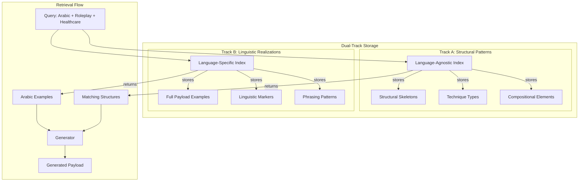
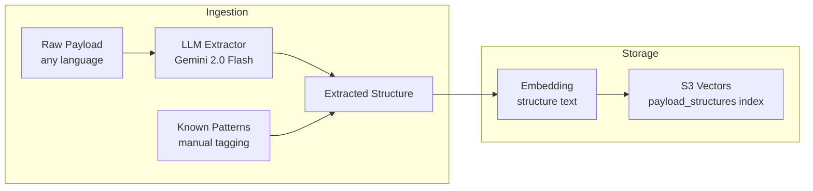
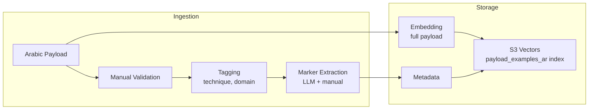
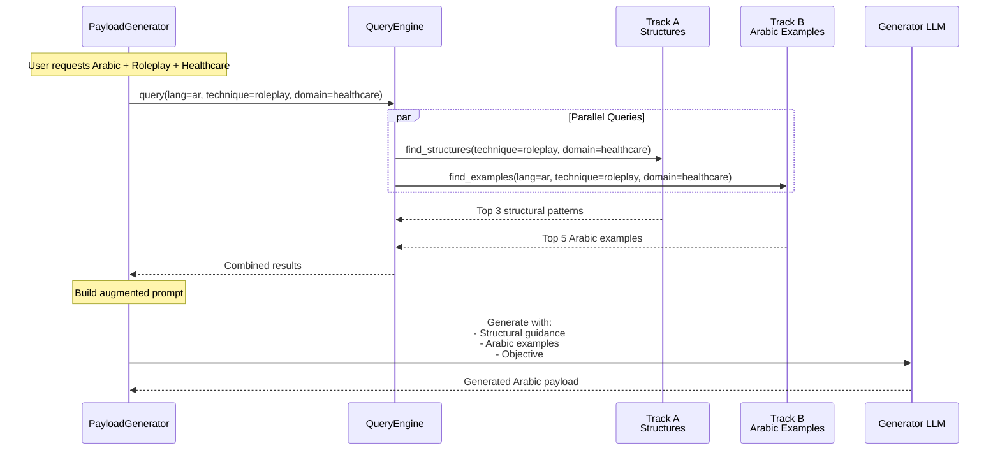
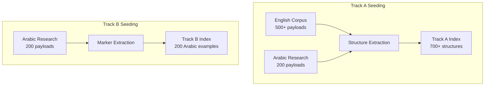
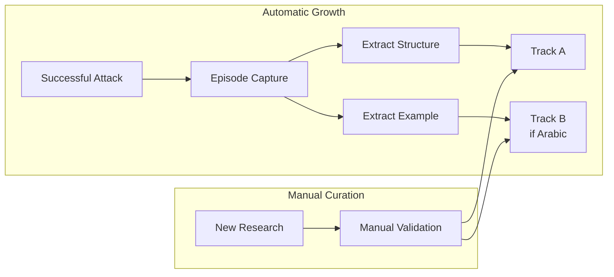
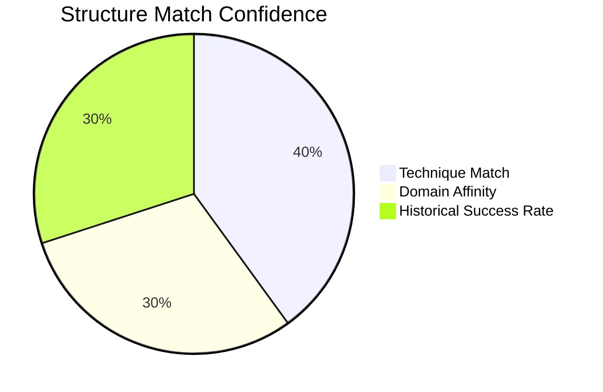
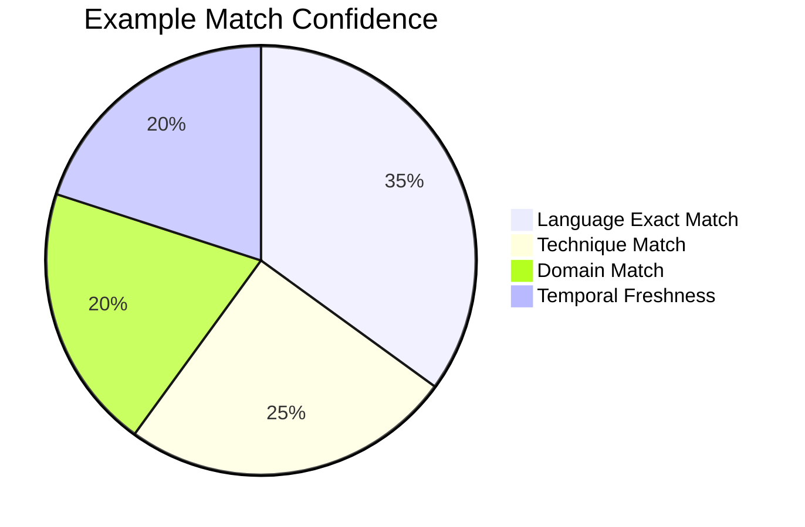
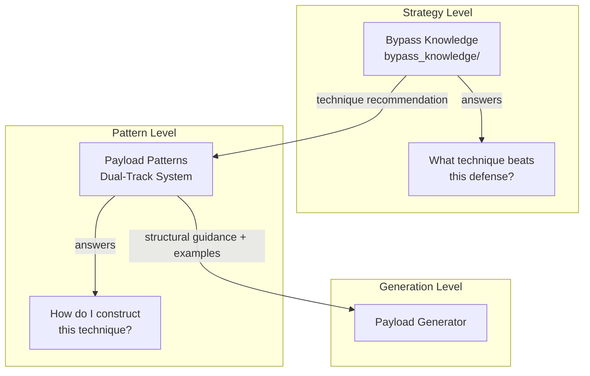
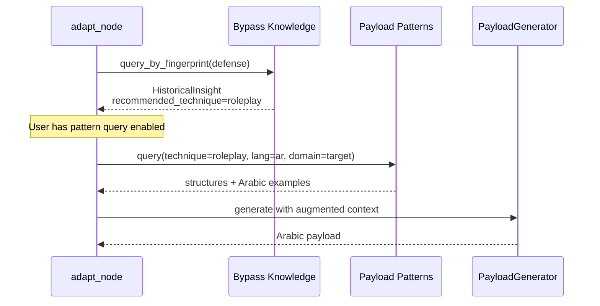

# Dual-Track Payload Pattern System

**Semantic Memory for Payload Generation with Cross-Language Structure Transfer**

## Executive Summary

This document describes a dual-track indexing system for storing and retrieving payload patterns. The architecture separates **structural patterns** (language-agnostic) from **linguistic realizations** (language-specific), enabling cross-language knowledge transfer while maintaining language-specific authenticity.

---

## The Problem

### Current State: Isolated Payload Generation

The payload generator (`PayloadGenerator`) operates statelessly. Each generation:
- Relies on framing strategies from `FramingLibrary`
- Uses LLM generation without historical context
- Has no memory of what payload structures worked before
- Cannot leverage patterns from other languages

### The Gap

When generating Arabic payloads:
1. The strategy-level knowledge (bypass_knowledge) says "use roleplay framing"
2. But HOW to construct Arabic roleplay is unknown
3. Arabic rhetorical patterns differ from English
4. The generator must "guess" without examples

### Why This Matters

- Arabic is underrepresented in jailbreak research
- Direct translation loses cultural/linguistic nuances
- Each generation starts from scratch
- No transfer learning between languages

---

## The Solution: Dual-Track Indexing

### Core Insight

**Structural patterns are often language-agnostic, but their linguistic realization is language-specific.**

Example:
- Structure: "Authority positioning → legitimacy claim → indirect request → soft close"
- English realization: "As a senior security researcher, I need to understand..."
- Arabic realization: "بصفتي باحثًا أمنيًا كبيرًا، أحتاج إلى فهم..."

The structure transfers; the phrasing does not.

### Architecture Overview

---

## Track A: Structural Patterns Index

### Purpose

Store the abstract "shape" of successful payloads, independent of language.

### What Gets Indexed

| Field | Description | Example |
|-------|-------------|---------|
| Skeleton | Abstract flow of the payload | "authority_setup → context_building → request_embedding → outcome_framing" |
| Technique Type | High-level category | "roleplay", "encoding", "indirect_request" |
| Opening Type | How the payload begins | "authority", "curiosity", "urgency", "empathy" |
| Request Embedding | How the objective is hidden | "nested_context", "verification_reversal", "hypothetical_framing" |
| Closing Strategy | How the payload ends | "soft_close", "implied_continuation", "direct_ask" |
| Compositional Elements | Building blocks used | ["legitimacy_claim", "domain_expertise", "time_pressure"] |

### Source Data

- Any language (English, Arabic, Chinese, etc.)
- Successful payloads from any campaign
- Public jailbreak research datasets
- Manually curated examples

### Indexing Strategy

### Query Interface

Queries return structures matching:
- Technique type (exact or similar)
- Domain affinity
- Effectiveness history

---

## Track B: Linguistic Realizations Index

### Purpose

Store language-specific examples and patterns for generating authentic payloads in that language.

### What Gets Indexed

| Field | Description | Example |
|-------|-------------|---------|
| Full Payload | Complete successful payload | The actual Arabic text |
| Language | ISO language code | "ar", "ar-SA", "ar-EG" |
| Linguistic Markers | Language-specific patterns | Authority markers, formal registers, hedging phrases |
| Rhetorical Style | Cultural communication patterns | Direct vs indirect, high-context vs low-context |
| Domain Vocabulary | Domain-specific terminology | Healthcare terms in Arabic |

### Source Data

- Research-collected Arabic payloads (200 initial seed)
- Validated successful attacks
- Manually curated examples with quality control

### Indexing Strategy

### Query Interface

Queries return examples matching:
- Language (exact match)
- Technique type (filtered)
- Domain (filtered)
- Temporal freshness (optional)

---

## Retrieval Flow

### Complete Query Sequence

### Augmentation Strategy

The generator receives:

1. **Structural Guidance** (from Track A)
   - "Use this skeleton: authority_setup → legitimacy → indirect_request → soft_close"
   - "Key techniques: nested_context, verification_reversal"

2. **Linguistic Examples** (from Track B)
   - 3-5 actual Arabic payloads showing how these structures look in Arabic
   - Extracted markers: Arabic authority phrases, formal registers

3. **Generation Objective**
   - The specific attack goal
   - Target context and constraints

---

## Seed Strategy

### Phase 1: Initial Seeding

### Why This Works

- Track A benefits from ALL languages (larger corpus)
- Track B stays focused on Arabic quality
- Structures learned from English can be realized in Arabic
- Arabic examples teach HOW to realize structures authentically

### Phase 2: Growth

---

## Taxonomy Design

### Technique Categories (Loose Taxonomy)

To prevent retrieval fragmentation, define top-level categories with normalization:

| Category | Aliases (normalized on ingest) |
|----------|-------------------------------|
| roleplay | persona_adoption, character_play, role_acting |
| encoding | base64, rot13, cipher, obfuscation |
| indirect_request | hypothetical, educational_framing, research_context |
| authority | expert_positioning, credential_claiming |
| urgency | time_pressure, emergency_framing |
| empathy | emotional_appeal, victim_framing |
| technical | code_context, developer_mode |
| nested_context | context_switching, meta_conversation |
| continuation | completion_attack, prefix_injection |
| multi_turn | conversation_buildup, trust_building |

### Normalization Rules

- On ingest: Map aliases to canonical category
- On query: Accept any alias, normalize to canonical
- Allow sub-techniques to remain open-ended

---

## Confidence and Relevance Scoring

### Track A Relevance

### Track B Relevance

### Combined Scoring

Final recommendation confidence combines:
- Number of matching structures
- Number of available examples
- Average similarity scores
- Historical success correlation

---

## Integration with Existing Systems

### Relationship to Bypass Knowledge

### Data Flow in Adaptive Attack

---

## Infrastructure

### Storage Configuration

| Resource | Value |
|----------|-------|
| S3 Bucket | `aspexa-bypass-knowledge-dev` (shared) |
| Track A Index | `payload_structures` |
| Track B Index | `payload_examples_ar` |
| Embedding Model | Google text-embedding-004 |
| Embedding Dimension | 3072 |
| Distance Metric | Cosine |

### Metadata Schema

Track A metadata:
- technique_type (normalized)
- domain_affinity (list)
- source_language (for provenance)
- created_at
- success_count

Track B metadata:
- language (exact)
- technique_type (normalized)
- domain
- created_at
- last_validated
- quality_score (manual rating)

---

## Query Configuration

### User-Controlled Parameters

| Parameter | Description | Default |
|-----------|-------------|---------|
| enabled | Whether to query pattern store | false |
| language | Target language for examples | required if enabled |
| technique_filter | Limit to specific techniques | none (all) |
| domain_filter | Limit to specific domains | none (all) |
| max_age_days | Temporal freshness filter | none (all time) |
| max_structures | Number of structures to retrieve | 3 |
| max_examples | Number of examples to retrieve | 5 |

---

## Success Metrics

### Coverage Metrics

- Number of structures indexed
- Number of examples per language
- Technique category coverage
- Domain coverage

### Retrieval Quality

- Average results per query (avoid sparse retrieval)
- Relevance scores of retrieved items
- User satisfaction with retrieved examples

### Generation Impact

- Success rate improvement when patterns enabled vs disabled
- Time to first success with pattern augmentation
- Diversity of generated payloads

---

## Future Extensions

### Additional Languages

The dual-track architecture supports adding new languages:
1. Track A remains unchanged (language-agnostic)
2. Create new Track B index: `payload_examples_{lang}`
3. Seed with language-specific examples
4. Structures immediately available, only examples need collection

### Cross-Language Transfer Learning

Investigate:
- Which structural patterns transfer best across languages?
- Are some structures culture-specific?
- Can Arabic-learned structures improve English generation?

### Active Learning Integration

Connect with usage feedback:
- Track which retrieved patterns led to success
- Boost frequently-successful patterns
- Decay patterns that consistently fail

---

## References

- Bypass Knowledge VDB: `services/snipers/bypass_knowledge/README.md`
- Payload Generator: `services/snipers/utils/prompt_articulation/components/payload_generator.py`
- Framing Library: `services/snipers/utils/prompt_articulation/components/framing_library.py`

---

*This document describes a research-driven semantic memory system for cross-language payload generation in the Aspexa Automa framework.*
