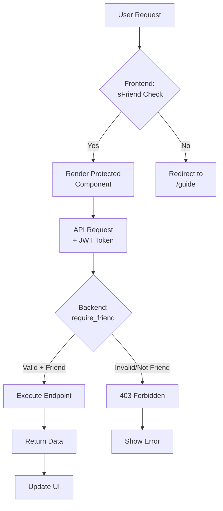

# Clerk Authorization with Friends Access

**Date:** 2025-12-09
**Type:** Feature
**Author:** [Implementation of Clerk-based friend authorization system]

## Summary
Implemented a two-tier authorization system using Clerk to protect premium features. Users marked as "friends" in their Clerk public metadata gain access to core functionality (Cartographer, Swarm, Snipers, Campaigns, Archives), while non-friends see a guide page. Frontend validates access client-side via metadata hooks; backend enforces access via JWT verification and dependency injection.

## Diagram

## Key Changes

1. **Clerk Integration** - Added clerk-backend-api (Python) and @clerk/clerk-react (TypeScript) SDKs for JWT verification and user metadata access

2. **Frontend Auth Flow** - ClerkProvider wraps app; ProtectedRoute component checks useIsFriend hook; non-friends redirect to /guide page before sidebar render

3. **Backend Auth Layer** - FastAPI dependencies (get_current_user, require_friend) verify JWT, extract Clerk payload, check isFriend flag before endpoint execution

4. **Metadata-Based Access** - isFriend=true in Clerk public metadata determines access; set via Clerk Dashboard, not application code

5. **CORS Authentication** - Updated CORS middleware to allow credentials for Clerk session cookies in JWT headers

## Affected Files

### Frontend (viper-command-center)
- `src/main.tsx` - ClerkProvider wrapper
- `src/hooks/useIsFriend.ts` - Friend status check hook
- `src/hooks/useAuthenticatedApi.ts` - Auth-injecting API client
- `src/components/auth/ProtectedRoute.tsx` - Route guard component
- `src/components/auth/index.ts` - Auth export barrel
- `src/App.tsx` - ProtectedLayout for friend-only routes
- `src/components/AppSidebar.tsx` - UserButton and SignInButton
- `src/lib/api/client.ts` - getToken injection for auth headers

### Backend (services/api_gateway)
- `auth/clerk_auth.py` - ClerkUser dataclass and get_current_user dependency
- `auth/permissions.py` - require_friend dependency for route protection
- `auth/__init__.py` - Export barrel
- `main.py` - require_friend applied to all service routers

### Configuration
- `libs/config/settings.py` - clerk_secret_key setting
- `.env` - CLERK_SECRET_KEY placeholder

## Notes

**Setup Required:**
1. Set VITE_CLERK_PUBLISHABLE_KEY in frontend .env.local
2. Set CLERK_SECRET_KEY in backend .env (from Clerk Dashboard)
3. Configure authorized_parties in clerk_auth.py to match production domains
4. Mark users as friends via Clerk Dashboard → Users → [User] → public_metadata → isFriend: true

**Access Control:**
- Public pages: /, /agents (no auth required)
- Guided page: /guide (accessible to non-friends)
- Protected pages: /dashboard, /cartographer, /swarm, /snipers/*, /campaigns, /archives (friends only)

**Testing Locally:**
- Create Clerk user without isFriend flag → can access /guide only
- Set isFriend=true in Clerk Dashboard → full access unlocked immediately
