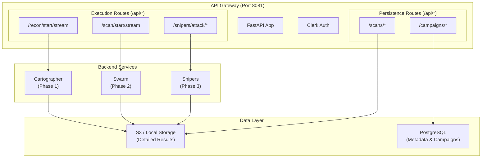

# API Gateway Service

**HTTP REST gateway for all Aspexa Automa services.**

The API Gateway provides a centralized HTTP entry point for reconnaissance, vulnerability scanning, and exploitation workflows. It handles authentication, request routing, and real-time result streaming via Server-Sent Events (SSE).

## Architecture

### High-Level Overview



## Route Organization

The API Gateway is organized into specialized functional routers:

### 1. Execution Routers
Handle long-running security tasks with real-time SSE streaming.

| Router | Prefix | Key Endpoints | Purpose |
|--------|--------|---------------|---------|
| **Recon** | `/api/recon` | `/start/stream` | Autonomous target reconnaissance |
| **Scan** | `/api/scan` | `/start/stream`, `/{id}/pause`, `/{id}/cancel` | Vulnerability scanning with Trinity agents |
| **Snipers** | `/api/snipers/attack` | `/full/stream`, `/adaptive/stream` | High-precision exploitation |

### 2. Persistence Routers
CRUD operations for audits and historical data.

| Router | Prefix | Purpose |
|--------|--------|---------|
| **Campaigns** | `/api/campaigns` | Manage security assessment sessions and stage tracking |
| **Scans** | `/api/scans` | Retrieve detailed JSON results (Blueprints, Garak reports, Exploit proofs) |

---

## Key Features

### Server-Sent Events (SSE)
All execution endpoints support SSE, allowing clients to receive:
- **Real-time logs**: Progress updates from the agentic workflows.
- **Partial findings**: Discoveries streamed as they happen (e.g., a specific tool found or a probe result).
- **Final results**: The complete data contract (IF-02, IF-04, or IF-06) delivered at the end of the stream.

### Authentication & Authorization
- **Provider**: Clerk
- **Tiered Access**: Only users with the `friend` metadata flag in Clerk can access protected `/api/*` routes.
- **Public Routes**: `/health` and `/api/auth/status`.

### Control Plane
The Gateway provides endpoints to control active scans:
- **Pause/Resume**: Supported for both Swarm scanning and Snipers adaptive exploitation.
- **Cancellation**: Gracefully terminate long-running scans while preserving partial results.

---

## Request/Response Patterns

### Triggering a Task (Streaming)
Clients should use an SSE-compatible client (or standard `EventSource` / `fetch` with streaming) to call `/start/stream` endpoints.

```bash
# Example: Start reconnaissance
curl -X POST http://localhost:8081/api/recon/start/stream \
  -H "Authorization: Bearer <clerk_token>" \
  -H "Content-Type: application/json" \
  -d 
  {
    "audit_id": "audit-123",
    "target_url": "http://target-ai.com/chat"
  }
```

### Retrieving Results
Detailed results are stored in S3 and can be retrieved by their `scan_id`.

```bash
# Get a specific reconnaissance blueprint
curl http://localhost:8081/api/scans/recon/recon-audit-123
```

---

## Configuration

| Variable | Default | Purpose |
|----------|---------|---------|
| `PORT` | `8081` | Gateway listening port |
| `DATABASE_URL` | - | PostgreSQL connection for campaign tracking |
| `CLERK_SECRET_KEY` | - | Backend validation of user tokens |
| `GOOGLE_API_KEY` | - | Required for agentic decision making in backend services |

---

## Running the Service

```bash
# From the project root
python -m services.api_gateway.main
```

Open [http://localhost:8081/docs](http://localhost:8081/docs) for the full interactive OpenAPI documentation.