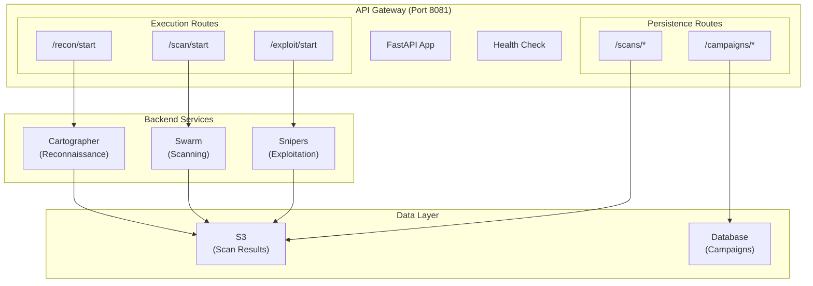
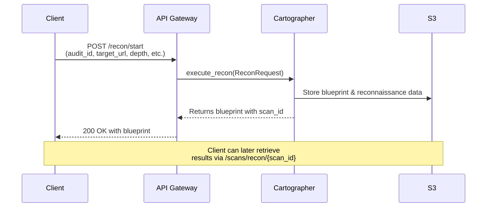
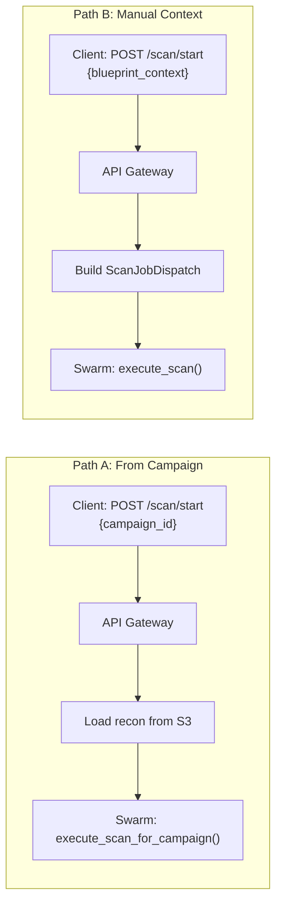
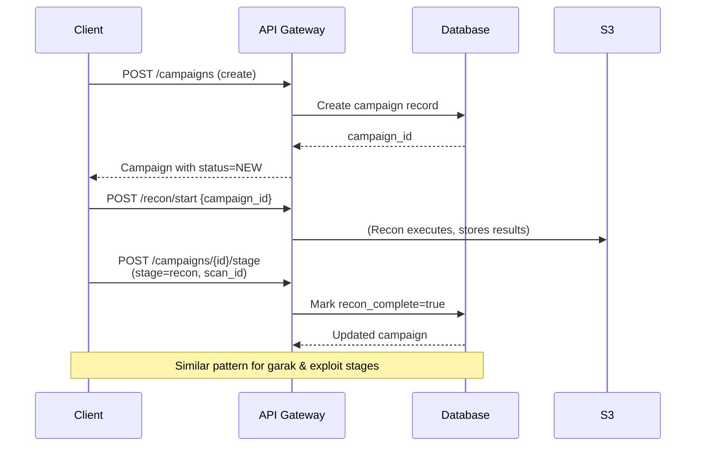
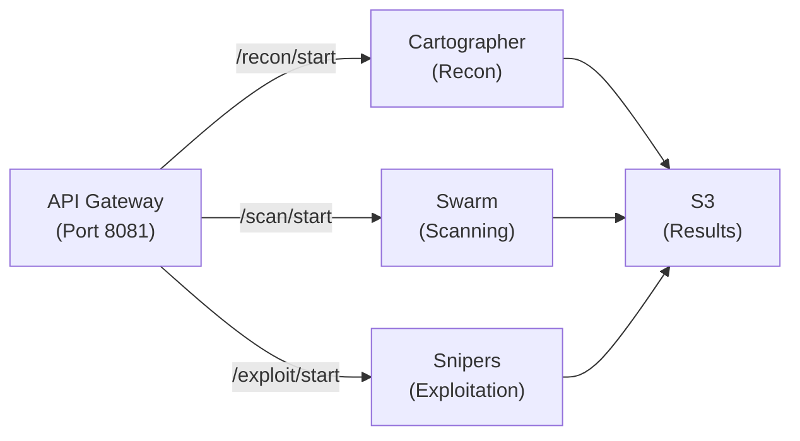

# API Gateway Service

**HTTP REST gateway for all Aspexa Automa services.**

The API Gateway provides HTTP endpoints as an alternative to event-driven consumers, enabling clients to trigger reconnaissance, vulnerability scanning, and exploitation workflows. It acts as the single entry point for the entire security assessment platform.

## Architecture

### High-Level Overview



## Route Organization

The API Gateway is organized into **two functional groups**:

### 1. Execution Routes (Service Orchestration)
Trigger backend services and return results. These are **async, long-running operations**.

| Route | Service | Purpose |
|-------|---------|---------|
| `POST /recon/start` | Cartographer | Start target reconnaissance (blueprint generation) |
| `POST /scan/start` | Swarm | Start vulnerability scanning with Trinity agents |
| `POST /exploit/start` | Snipers | Execute exploitation based on scan findings |

**Decision:** Execution routes are kept simple with minimal transformation—they validate input, convert to service contracts, and delegate to service entrypoints. Error handling is delegated to backend services.

### 2. Persistence Routes (State Management)
CRUD operations for campaigns and scan results. These interact with S3 and the database.

| Route Prefix | Purpose |
|-------------|---------|
| `/campaigns/*` | Campaign lifecycle (create, read, update, delete, stage management) |
| `/scans/*` | Scan result operations (list, retrieve, delete by type) |

**Decision:** Persistence routes provide a querying/management layer on top of S3 and the database. They enable campaign orchestration and result retrieval without re-executing services.

## Request/Response Flows

### Reconnaissance Flow



**Decisions:**
- **Auto-generated scan_id:** Cartographer generates the scan ID for tracking
- **Blocking call:** Client receives full blueprint response (async service internally)
- **Direct dispatch:** No intermediate job queue; direct service invocation

### Scanning Flow (Two Paths)



**Decisions:**
- **Dual paths:** Support both campaign-driven (recon from S3) and manual (raw blueprint) scanning
- **Config builder:** `_build_scan_config()` converts API format to internal contract
- **Safety policies:** Baked into every scan request (attack vectors, aggressiveness level)

### Campaign Orchestration



**Decisions:**
- **Explicit stage marking:** Client is responsible for calling `/stage` endpoint after completion
- **S3 key tracking:** Links campaign record to specific scan results for data recovery
- **Decoupled updates:** Gateway doesn't wait for service completion; client polls/marks stages manually

## Endpoint Reference

### Health Check
```
GET /health
```
Returns: `{"status": "healthy", "service": "api_gateway"}`

### Reconnaissance (`/recon`)

```
POST /recon/start
Request:
  - audit_id: str (required)
  - target_url: str (required)
  - auth_headers: dict[str, str] (optional, default: {})
  - depth: str (optional, default: "standard") - One of: basic, standard, deep, aggressive
  - max_turns: int (optional, default: 10)
  - forbidden_keywords: list[str] (optional)

Response:
  {
    "scan_id": "recon-uuid-xxx",
    "blueprint": {...},
    "metadata": {...}
  }
```

### Scanning (`/scan`)

```
POST /scan/start
Request (campaign-driven):
  - campaign_id: str
  - agent_types: list[str] (optional)
  - allowed_attack_vectors: list[str]
  - blocked_attack_vectors: list[str]
  - aggressiveness: str (default: "moderate")
  - target_url: str (optional if campaign exists)
  - config: ScanConfigRequest (optional)

Request (manual):
  - blueprint_context: dict (required if no campaign_id)
  - agent_types: list[str] (optional)
  - allowed_attack_vectors: list[str]
  - blocked_attack_vectors: list[str]
  - aggressiveness: str (default: "moderate")
  - target_url: str
  - config: ScanConfigRequest (optional)

ScanConfigRequest:
  - approach: str (quick, standard, thorough) - controls intensity
  - generations: int (1-50, optional) - override attempts per probe
  - custom_probes: list[str] (optional) - specific probes to run
  - allow_agent_override: bool - agent can adjust probe count
  - max_probes: int (1-20) - hard limit on probe count
  - max_generations: int (1-50) - hard limit on generations
  - enable_parallel_execution: bool - master switch for parallelism
  - max_concurrent_probes: int (1-10)
  - max_concurrent_generations: int (1-5)
  - requests_per_second: float (optional) - rate limiting
  - max_concurrent_connections: int (1-50)
  - request_timeout: int (1-300 seconds)
  - max_retries: int (0-10)
  - retry_backoff: float (0.1-10.0)
  - connection_type: str (http, websocket)

Response:
  {
    "scan_id": "scan-uuid-xxx",
    "results_per_agent": {
      "agent_type": {...}
    }
  }

Validation:
  - Must provide EITHER campaign_id OR blueprint_context
  - If manual, target_url is required
```

### Exploitation (`/exploit`)

```
POST /exploit/start
Request:
  - campaign_id: str (required)
  - target_url: str (optional, auto-loaded from campaign)
  - probe_name: str (optional) - specific probe to run

Response:
  {
    "scan_id": "exploit-uuid-xxx",
    "exploit_results": {...}
  }

Prerequisites:
  - Campaign must have completed recon and garak scans
  - S3 contains scan data from previous stages
```

### Campaigns (`/campaigns`)

```
POST /campaigns
Create campaign
Request: {name, target_url, description?, tags?}

GET /campaigns
List campaigns with filters
Query params: status={new,active,completed,failed}, limit=100, offset=0

GET /campaigns/search?q=name_or_url&limit=50
Search by name/target/tags

GET /campaigns/{campaign_id}
Get single campaign

PATCH /campaigns/{campaign_id}
Update name/tags
Request: {name?, tags?}

POST /campaigns/{campaign_id}/stage
Mark stage complete
Request: {stage: "recon"|"garak"|"exploit", scan_id}

POST /campaigns/{campaign_id}/fail
Mark campaign as failed
Query param: reason={optional}

DELETE /campaigns/{campaign_id}
Delete campaign (not S3 data)

GET /campaigns/{campaign_id}/s3-keys
Get S3 keys for all completed stages
```

### Scans (`/scans`)

```
GET /scans
List all scans with filters
Query params: scan_type={recon,garak,exploit}?, audit_id={filter}?

GET /scans/recon
GET /scans/garak
GET /scans/exploit
List scans by type
Query params: audit_id={filter}?

GET /scans/recon/{scan_id}
GET /scans/garak/{scan_id}
GET /scans/exploit/{scan_id}
Get scan result
Query param: validate={true|false} - validates against schema

HEAD /scans/recon/{scan_id}
HEAD /scans/garak/{scan_id}
HEAD /scans/exploit/{scan_id}
Check if scan exists

DELETE /scans/recon/{scan_id}
DELETE /scans/garak/{scan_id}
DELETE /scans/exploit/{scan_id}
Delete scan from S3
```

## Key Design Decisions

### 1. Dual Campaign Paths for Scanning
**Decision:** Support both campaign-driven and manual blueprint scanning.

**Rationale:**
- Campaign-driven: Typical workflow where users create campaigns and run stages sequentially
- Manual: Advanced users who have raw recon data and want to scan without creating a campaign
- Both paths share the same underlying scanning logic

**Implementation:**
- `_build_scan_config()` converts API schema to Swarm contract
- Request validator ensures either `campaign_id` or `blueprint_context` is provided
- Gateway dispatches to appropriate service entrypoint based on path

### 2. Minimal Request Transformation
**Decision:** Schemas closely mirror internal contracts; minimal translation in routers.

**Rationale:**
- Reduces coupling between API layer and services
- Easier to version API independently
- Changes to service contracts are isolated to routers
- Single source of truth for configuration (Pydantic schemas)

**Implementation:**
- `ScanConfigRequest` schema maps directly to `ScanConfigContract`
- Routers contain brief helper functions (`_build_scan_config`, `_campaign_to_dict`)
- Complex logic stays in service entrypoints

### 3. Explicit Stage Completion
**Decision:** Client must call `/campaigns/{id}/stage` after each service completes.

**Rationale:**
- Decouples campaign state from service execution
- Services don't need to know about campaigns
- Allows manual retries and stage re-execution
- Gateway doesn't wait for long-running operations

**Implementation:**
- Campaign status tracks `recon_complete`, `garak_complete`, `exploit_complete` flags
- `set_stage_complete()` atomically updates flags and links S3 keys
- `get_s3_keys()` enables data recovery for completed stages

### 4. S3-First Persistence
**Decision:** Scan results live in S3; database tracks metadata only.

**Rationale:**
- S3 is scalable and cheap for large JSON payloads
- Database remains lean and fast for campaign queries
- Clean separation of concerns (transactional vs. analytical storage)
- Easy to archive/restore results

**Implementation:**
- Services write to S3 and return scan_id
- Gateway's `/scans` endpoints load from S3 via `load_scan()`
- Campaign records store S3 keys for data reconstruction

### 5. Async-First but Blocking Responses
**Decision:** Services are async internally, but API responses are blocking (await execution).

**Rationale:**
- Simpler client logic (no polling for job status)
- Full results available immediately
- Service timeouts prevent hanging requests
- Can be wrapped in job queue later if needed

**Implementation:**
- All routers use `async def` and `await` service calls
- Service entrypoints handle parallelization internally
- FastAPI manages task scheduling

### 6. Three-Service Architecture
**Decision:** Separate services for recon (Cartographer), scanning (Swarm), exploitation (Snipers).

**Rationale:**
- Each service has distinct concerns (discovery vs. probing vs. execution)
- Allows independent scaling and deployment
- Clear stage boundaries for campaign tracking
- Easier testing and error isolation

**Diagram:**


## Running the Service

### Start API Gateway
```bash
python -m services.api_gateway.main
# Listens on http://localhost:8081
# OpenAPI docs: http://localhost:8081/docs
```

### Create a Campaign
```bash
curl -X POST http://localhost:8081/campaigns \
  -H "Content-Type: application/json" \
  -d '{
    "name": "ACME Corp Audit",
    "target_url": "https://api.acme.com",
    "description": "Q4 security assessment",
    "tags": ["external", "high-risk"]
  }'
```

### Run Reconnaissance
```bash
curl -X POST http://localhost:8081/recon/start \
  -H "Content-Type: application/json" \
  -d '{
    "audit_id": "audit-12345",
    "target_url": "https://api.acme.com",
    "depth": "standard",
    "max_turns": 10
  }'
```

### Run Scanning (from campaign)
```bash
curl -X POST http://localhost:8081/scan/start \
  -H "Content-Type: application/json" \
  -d '{
    "campaign_id": "campaign-uuid-xxx",
    "agent_types": ["garak_jailbreak", "prompt_injection"],
    "aggressiveness": "moderate",
    "allowed_attack_vectors": ["prompt_injection", "context_switching"],
    "config": {
      "approach": "standard",
      "max_probes": 5,
      "max_generations": 10
    }
  }'
```

### Mark Stage Complete
```bash
curl -X POST http://localhost:8081/campaigns/{campaign_id}/stage \
  -H "Content-Type: application/json" \
  -d '{
    "stage": "recon",
    "scan_id": "recon-scan-uuid"
  }'
```

### Retrieve Scan Results
```bash
curl http://localhost:8081/scans/recon/{scan_id}
```

## Error Handling

| Status | Scenario |
|--------|----------|
| `400` | Invalid request (missing required fields, invalid enum values, validation failure) |
| `404` | Resource not found (campaign, scan, or scan result) |
| `500` | Internal service error (propagated from backend services) |

All errors include a descriptive message:
```json
{"detail": "Campaign campaign-xxx not found"}
```

## Configuration

The API Gateway reads environment variables from service and backend configurations:
- **Port:** `8081` (hardcoded in `main.py`)
- **Host:** `0.0.0.0` (binds to all interfaces)
- **Service URLs:** Configured in individual service entrypoints (Cartographer, Swarm, Snipers)

To change port, modify `main.py:31`:
```python
uvicorn.run(app, host="0.0.0.0", port=8081)
```

## File Structure

```
services/api_gateway/
├── main.py                    # FastAPI app setup + health check
├── routers/
│   ├── recon.py              # /recon endpoints (Cartographer)
│   ├── scan.py               # /scan endpoints (Swarm)
│   ├── exploit.py            # /exploit endpoints (Snipers)
│   ├── campaigns.py          # /campaigns CRUD endpoints
│   └── scans.py              # /scans query/retrieval endpoints
└── schemas/
    ├── recon.py              # ReconStartRequest schema
    ├── scan.py               # ScanStartRequest + ScanConfigRequest schemas
    ├── exploit.py            # ExploitStartRequest schema
    └── campaigns.py          # Campaign management schemas
```

**Design principle:** Schemas are co-located with their routers for easy discovery. Single responsibility: each router handles one domain (recon, scan, campaigns, scans).

## Testing Workflows

### Minimal Happy Path
1. `POST /campaigns` → get campaign_id
2. `POST /recon/start {campaign_id}` → get recon scan_id
3. `POST /campaigns/{id}/stage {recon, scan_id}` → mark recon done
4. `POST /scan/start {campaign_id}` → get scan results
5. `POST /campaigns/{id}/stage {garak, scan_id}` → mark scan done
6. `POST /exploit/start {campaign_id}` → get exploit results

### Retrieve Results Later
1. `GET /scans/recon/{scan_id}`
2. `GET /scans/garak/{scan_id}`
3. `GET /scans/exploit/{scan_id}`

### Campaign Management
1. `GET /campaigns` → list all
2. `GET /campaigns/{id}` → view single
3. `PATCH /campaigns/{id} {name, tags}` → update metadata
4. `DELETE /campaigns/{id}` → cleanup

## Troubleshooting

**"Must provide either campaign_id or blueprint_context"**
- Scan request is missing both fields. Provide one or the other.

**"Campaign {id} not found"**
- Campaign doesn't exist in database. Create one with `POST /campaigns`.

**Scan result 404**
- Scan may not exist in S3. Check scan_id is correct and stage was completed with `POST /campaigns/{id}/stage`.

**Service timeout**
- Backend service (Cartographer, Swarm, Snipers) took too long. Check service logs and increase timeout if needed.
