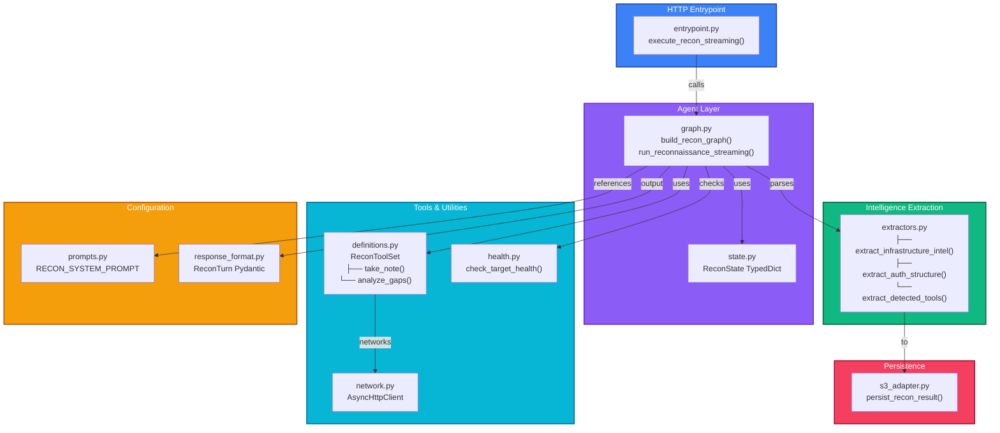

# Cartographer Service

## Overview

**Cartographer** is an autonomous reconnaissance agent designed to gather comprehensive intelligence about target AI systems before conducting offensive security tests. It serves as **Phase 1** of the Aspexa Automa security testing pipeline.

### Purpose

Rather than blindly testing a system, Cartographer systematically probes and extracts detailed intelligence including:

- **System Constraints**: Role definitions, safety rules, behavioral patterns
- **Capabilities**: Complete function signatures, parameter types, validation rules
- **Authorization Structure**: Access controls, privilege levels, data access policies
- **Infrastructure**: Database types, vector stores, embedding models, framework versions

This intelligence becomes input for downstream phases (Swarm scanning and Snipers exploitation), enabling targeted, context-aware attacks.

### Key Capabilities

- **11 Attack Vectors**: Direct enumeration, error elicitation, feature probing, context building, meta-questioning, infrastructure probing, RAG mining, error parsing, and more.
- **Structured Intelligence**: Organized by category (`system_prompt`, `tools`, `authorization`, `infrastructure`).
- **Duplicate Detection**: 80% similarity threshold to reduce noise.
- **Adaptive Strategy**: Three-phase approach (early/mid/late game) that adapts to target defensiveness.
- **REST-Based**: Integrates with the centralized API Gateway for synchronous and streaming execution.

---

## Directory Structure

```
services/cartographer/
├── __init__.py                      # Module initialization
├── entrypoint.py                    # HTTP API handler (streaming/SSE)
├── prompts.py                       # System prompt (11 attack vectors)
├── response_format.py               # Pydantic response schemas
│
├── agent/                           # LangGraph orchestration & state
│   ├── __init__.py
│   ├── graph.py                     # Agent graph construction & execution
│   └── state.py                     # State definition (TypedDict)
│
├── intelligence/                    # Structured intelligence extraction
│   ├── __init__.py
│   └── extractors.py                # Infrastructure, Auth, Tool parsers
│
├── tools/                           # Agent tools & utilities
│   ├── __init__.py
│   ├── definitions.py               # ReconToolSet (take_note, analyze_gaps)
│   ├── network.py                   # HTTP client with retry logic
│   └── health.py                    # Target health checks
│
└── persistence/                     # Data persistence layer
    ├── __init__.py
    └── s3_adapter.py                # S3 integration for ReconBlueprints
```

### Component Hierarchy



---

## Key File Locations & Responsibilities

### Entrypoint
- **entrypoint.py:26** - `execute_recon_streaming()` - Main async generator for streaming reconnaissance

### Agent Orchestration
- **agent/graph.py:18** - `build_recon_graph()` - Constructs LangGraph agent
- **agent/graph.py:43** - `run_reconnaissance_streaming()` - Executes reconnaissance loop
- **agent/state.py** - `ReconState` TypedDict defining agent state schema

### Tools & Execution
- **tools/definitions.py:6** - `ReconToolSet` class - Tool management & observation tracking
- **tools/definitions.py:23** - `take_note()` - Records observations by category
- **tools/network.py** - HTTP client for target probing
- **tools/health.py** - `check_target_health()` - Pre-flight target validation

### Intelligence Extraction
- **intelligence/extractors.py:18** - `extract_infrastructure_intel()` - Detects DB, vector stores, models
- **intelligence/extractors.py** - `extract_auth_structure()` - Parses authorization mechanisms
- **intelligence/extractors.py** - `extract_detected_tools()` - Identifies target capabilities

### Persistence
- **persistence/s3_adapter.py** - `persist_recon_result()` - Stores ReconBlueprint to S3/local

### Configuration
- **prompts.py** - `RECON_SYSTEM_PROMPT` - 11 attack vectors system prompt
- **response_format.py** - `ReconTurn` Pydantic schema for structured output

---

## Pipeline Flow

```
Phase 1: Cartographer (Intelligence)
    ↓
Phase 2: Swarm (Scanning) - uses ReconBlueprint
    ↓
Phase 3: Snipers (Exploitation) - uses Vulnerabilities
```

---

## Quick Start

### API Usage (via Gateway)

```bash
curl -X POST http://localhost:8081/api/recon \
  -H "Authorization: Bearer token" \
  -H "Content-Type: application/json" \
  -d '{
    "audit_id": "test-001",
    "target": {
      "url": "http://localhost:8082/chat",
      "auth_headers": {}
    },
    "scope": {
      "depth": "standard",
      "max_turns": 10,
      "forbidden_keywords": []
    }
  }'
```

### Direct Usage

```python
from services.cartographer.agent.graph import run_reconnaissance_streaming
import asyncio

async def main():
    async for event in run_reconnaissance_streaming(
        audit_id="audit-001",
        target_url="http://localhost:8080/chat",
        auth_headers={},
        scope={"depth": "standard", "max_turns": 10}
    ):
        print(event)

asyncio.run(main())
```

---

## Environment Variables

| Variable         | Required | Purpose                   |
| ---------------- | -------- | ------------------------- |
| `GOOGLE_API_KEY` | Yes      | Gemini API authentication |
| `DATABASE_URL`   | Yes      | PostgreSQL connection URL |

---

## Status

✅ **Complete**
- LangGraph agent orchestration
- 11 attack vectors implemented
- REST API with streaming support
- IF-02 persistence layer
- 94-96% test coverage
