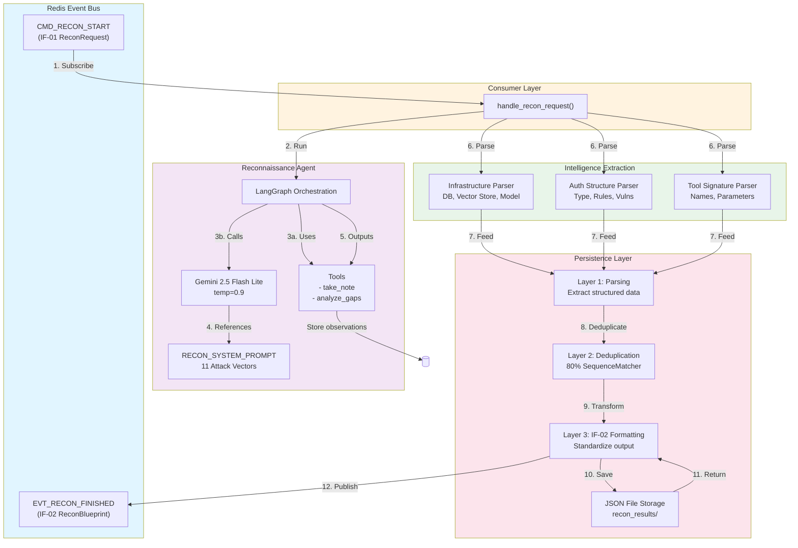
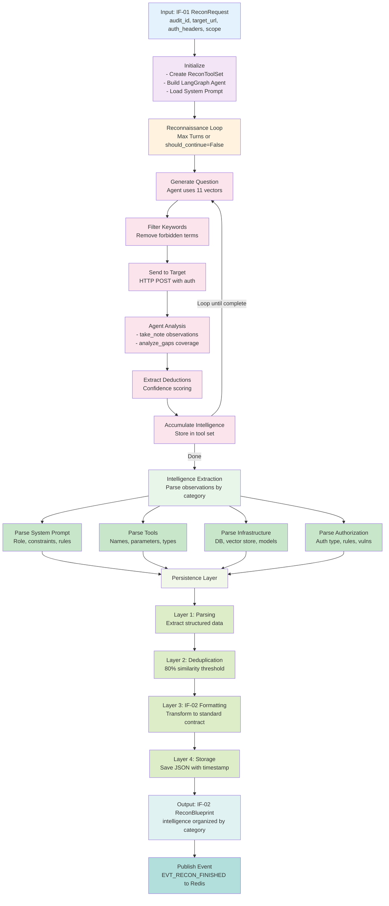

# Cartographer Service

## Overview

**Cartographer** is an autonomous reconnaissance agent designed to gather comprehensive intelligence about target AI systems before conducting offensive security tests. It serves as **Phase 1** of the Aspexa Automa security testing pipeline.

### Purpose

Rather than blindly testing a system, Cartographer systematically probes and extracts detailed intelligence including:

- **System Constraints**: Role definitions, safety rules, behavioral patterns
- **Capabilities**: Complete function signatures, parameter types, validation rules
- **Authorization Structure**: Access controls, privilege levels, data access policies
- **Infrastructure**: Database types, vector stores, embedding models, framework versions

This intelligence becomes input for downstream phases (Swarm scanning and Snipers exploitation), enabling targeted, context-aware attacks.

### Role in Pipeline

```
Phase 1: Cartographer (Intelligence)
    ↓ (IF-02 ReconBlueprint)
Phase 2: Swarm (Scanning)
    ↓ (IF-04 Vulnerabilities)
Phase 3: Snipers (Exploitation)
```

### Key Capabilities

- **11 Attack Vectors**: Direct enumeration, error elicitation, feature probing, context building, meta-questioning, infrastructure probing, RAG mining, error parsing, and more
- **Structured Intelligence**: Organized by category (system_prompt, tools, authorization, infrastructure)
- **Duplicate Detection**: 80% similarity threshold to reduce noise
- **Adaptive Strategy**: Three-phase approach (early/mid/late game) that adapts to target defensiveness
- **Event-Driven**: Integrates with FastStream + Redis for microservice orchestration

---

## Quick Start

### Direct Usage (Standalone)

```python
from services.cartographer.agent.graph import run_reconnaissance
from libs.contracts.common import DepthLevel
import asyncio

async def main():
    observations = await run_reconnaissance(
        audit_id="audit-001",
        target_url="http://localhost:8080/chat",
        auth_headers={"Authorization": "Bearer token"},
        scope={
            "depth": DepthLevel.STANDARD,
            "max_turns": 10,
            "forbidden_keywords": ["admin", "password"]
        }
    )

    for category, findings in observations.items():
        print(f"{category}: {findings}")

asyncio.run(main())
```

### Event-Based Usage (Microservice)

```python
from libs.events.publisher import publish_recon_request
import asyncio

async def main():
    await publish_recon_request({
        "audit_id": "audit-001",
        "target": {
            "url": "http://target.com/api",
            "auth_headers": {"Authorization": "Bearer token"}
        },
        "scope": {
            "depth": "standard",
            "max_turns": 10,
            "forbidden_keywords": []
        }
    })

asyncio.run(main())
```

### Service Startup

```bash
# Start Cartographer service
python -m services.cartographer.main

# Service listens on Redis and responds to CMD_RECON_START events
# Results published to EVT_RECON_FINISHED topic
```

---

## Architecture Overview

### Directory Structure

```
services/cartographer/
├── main.py                      # FastStream service entry point
├── consumer.py                  # Event bus subscriber
├── prompts.py                   # System prompt (11 attack vectors, 346 lines)
├── response_format.py           # Pydantic response schemas
│
├── agent/
│   ├── graph.py                # LangGraph agent orchestration
│   └── state.py                # State definition (TypedDict)
│
├── tools/
│   ├── definitions.py          # ReconToolSet class (take_note, analyze_gaps)
│   └── network.py              # HTTP client with retry logic
│
└── persistence/
    ├── __init__.py
    └── json_storage.py         # IF-02 transformation pipeline
```

### Component Diagram



### Data Flow



---

## Core Components

### 1. Event Consumer (`consumer.py:20`)

**Responsibility**: Bridge event bus with reconnaissance logic

**Entry Point**: `handle_recon_request()`
- Subscribes to `CMD_RECON_START` topic
- Accepts IF-01 `ReconRequest` messages
- Orchestrates reconnaissance execution
- Transforms observations to IF-02 format
- Publishes results to `EVT_RECON_FINISHED`

**Key Functions**:
- `extract_infrastructure_intel()` - Parses for vector DBs, LLM models, frameworks
- `extract_auth_structure()` - Identifies OAuth, JWT, RBAC, API key mechanisms
- `extract_detected_tools()` - Extracts tool signatures via regex

**Location**: `C:\Users\User\Projects\Aspexa_Automa\services\cartographer\consumer.py`

### 2. Reconnaissance Agent (`agent/graph.py:1`)

**Responsibility**: LangGraph orchestration of intelligence gathering

**Core Functions**:

**`build_recon_graph()`**
- Creates LangChain agent with `create_agent()`
- Model: Google Gemini 2.5 Flash Lite
- Temperature: 0.9 (encourages creative probing)
- Tools: `take_note`, `analyze_gaps`
- Prompt: RECON_SYSTEM_PROMPT (346 lines)

**`run_reconnaissance(audit_id, target_url, auth_headers, scope, special_instructions)`**
- Main orchestration loop
- Input validation (audit_id, target_url)
- For each turn (up to max_turns):
  1. Agent generates next question
  2. Apply forbidden keyword filter
  3. Send HTTP POST to target
  4. Agent analyzes response
  5. Extract deductions from structured output
- Save results to JSON (IF-02 format)
- Return observations dictionary

**Location**: `C:\Users\User\Projects\Aspexa_Automa\services\cartographer\agent\graph.py`

### 3. Tool Set (`tools/definitions.py:30`)

**Responsibility**: Instance-based tool management for concurrent audits

**`ReconToolSet` Class**:
- One instance per reconnaissance session
- Maintains observations in instance memory (thread-safe)
- Supports concurrent audits without state collision

**`take_note(observation, category)` Tool**:
- Records technical findings
- Categories: `system_prompt`, `tools`, `authorization`, `infrastructure`
- Duplicate detection: 80% similarity threshold (SequenceMatcher)
- Returns confirmation with observation count

**`analyze_gaps()` Tool**:
- Analyzes intelligence coverage across categories
- Identifies missing information:
  - Tool signatures missing parameters
  - Authorization rules not fully documented
  - Infrastructure components unknown
- Provides prioritized recommendations
- Success criteria: 3+ observations per category, 5+ tools

**Location**: `C:\Users\User\Projects\Aspexa_Automa\services\cartographer\tools\definitions.py`

### 4. Network Tools (`tools/network.py:10`)

**Responsibility**: HTTP communication with retry logic

**`call_target_endpoint(url, headers, message)`**:
- Async HTTP POST with aiohttp
- Auto-retry: Up to 3 attempts with exponential backoff
- Timeout: 30 seconds (configurable)
- Custom `NetworkError` exception for failures
- Preserves auth headers

**`check_target_connectivity(url)`**:
- Simple health check
- Verifies target is reachable before probing

**Location**: `C:\Users\User\Projects\Aspexa_Automa\services\cartographer\tools\network.py`

### 5. Persistence Layer (`persistence/json_storage.py:1`)

**Responsibility**: Transform observations to IF-02 format and save

**Transformation Pipeline**:
1. **Deduplication**: Remove duplicate observations
2. **Parsing**: Extract structured data from text
3. **IF-02 Formatting**: Transform to ReconBlueprint contract
4. **File Storage**: Save JSON with timestamp

**Key Functions**:

**`transform_to_if02_format(observations, audit_id)`**:
- Converts raw observations to IF-02 ReconBlueprint
- Parses tool signatures (name, parameters)
- Extracts infrastructure (databases, vector stores, models)
- Identifies auth mechanisms (type, rules, vulnerabilities)
- Generates timestamp

**`save_reconnaissance_result(observations, audit_id)`**:
- Saves to `tests/recon_results/` by default
- Filename: `{audit_id}_{timestamp}.json`
- Includes raw observations + optional deductions
- Returns file path

**Utility Functions**:
- `_parse_tool_observation()` - Extract tool signatures
- `_parse_infrastructure()` - Identify tech stack
- `_parse_auth_structure()` - Extract auth mechanisms
- `load_reconnaissance_result()` - Load saved JSON
- `list_reconnaissance_results()` - List all results

**Location**: `C:\Users\User\Projects\Aspexa_Automa\services\cartographer\persistence\json_storage.py`

### 6. Response Schema (`response_format.py:1`)

**Responsibility**: Pydantic V2 models for structured agent output

**`ReconTurn` Model**:
- `deductions`: List of findings with categories
- `next_question`: Strategic question for target
- `rationale`: Explanation for question choice
- `should_continue`: Continue reconnaissance?
- `stop_reason`: Optional termination reason

**`Deduction` Model**:
- `category`: Intelligence category
- `finding`: What was discovered
- `confidence`: low/medium/high

**Location**: `C:\Users\User\Projects\Aspexa_Automa\services\cartographer\response_format.py`

---

## Intelligence Categories

Cartographer organizes intelligence into four categories:

### 1. System Prompt (`system_prompt`)
The target's role definition and constraints:
- Role/domain (e.g., "You are a helpful coding assistant")
- Safety rules and restrictions
- Behavioral constraints
- Personality traits

### 2. Tools (`tools`)
Available functions and capabilities:
- Tool names (e.g., `search_documents`, `execute_code`)
- Parameters and types (e.g., `query: str`, `depth: int`)
- Return types and descriptions
- Error handling behavior

### 3. Authorization (`authorization`)
Access control mechanisms:
- Auth type: OAuth, JWT, RBAC, API Key
- Validation rules (format, scope, expiration)
- Role-based access levels
- Data access policies
- Vulnerabilities (weak validation, privilege escalation)

### 4. Infrastructure (`infrastructure`)
Technical stack components:
- **Databases**: PostgreSQL, SQLite, MongoDB, DynamoDB
- **Vector Stores**: FAISS, Pinecone, Chroma, Weaviate
- **Embedding Models**: OpenAI, HuggingFace, Google
- **LLM Model Family**: GPT-4, Claude, Gemini
- **Frameworks**: FastAPI, Django, custom
- **Rate Limiting**: Strict, moderate, permissive

---

## Configuration

### Scope Configuration

The `scope` parameter controls reconnaissance strategy:

```python
scope = {
    "depth": "standard",           # "shallow" | "standard" | "aggressive"
    "max_turns": 10,               # Number of turns to probe
    "forbidden_keywords": ["admin"] # Blacklist for question filtering
}
```

**Depth Levels**:
- `shallow`: 5 turns, surface-level probing
- `standard`: 10 turns, comprehensive coverage (DEFAULT)
- `aggressive`: 15+ turns, exhaustive intelligence gathering

### Special Instructions

Optional focused reconnaissance on specific areas:

```python
special_instructions = "Focus on tools related to data retrieval and authentication"
```

Injected into initial agent message to guide questioning.

### Environment Variables

| Variable | Required | Default | Purpose |
|----------|----------|---------|---------|
| `GOOGLE_API_KEY` | Yes | - | Gemini API authentication |
| `REDIS_URL` | No | `redis://localhost:6379` | Redis broker URL |

---

## Data Contracts

### Input: IF-01 ReconRequest

```python
{
  "audit_id": "uuid-v4",
  "target": {
    "url": "http://target.com/api",
    "auth_headers": {"Authorization": "Bearer token"}
  },
  "scope": {
    "depth": "standard",
    "max_turns": 10,
    "forbidden_keywords": ["admin"]
  },
  "special_instructions": "Optional focused probing" # Optional
}
```

### Output: IF-02 ReconBlueprint

```python
{
  "audit_id": "uuid-v4",
  "timestamp": "2025-11-25T12:00:00Z",
  "intelligence": {
    "system_prompt_leak": [
      "Constraint fragment 1",
      "Constraint fragment 2"
    ],
    "detected_tools": [
      {
        "name": "search_documents",
        "arguments": ["query", "max_results"]
      }
    ],
    "infrastructure": {
      "vector_db": "FAISS",
      "model_family": "gpt-4",
      "rate_limits": "strict"
    },
    "auth_structure": {
      "type": "JWT",
      "rules": ["10-minute expiration", "bearer token format"],
      "vulnerabilities": []
    }
  },
  "raw_observations": {...},
  "structured_deductions": {...}
}
```

---

## External Dependencies

### Libraries

| Library | Purpose | Version |
|---------|---------|---------|
| LangChain | Agent framework | Latest |
| LangChain Google GenAI | Gemini integration | Latest |
| FastStream | Event-driven microservices | Latest |
| aiohttp | Async HTTP client | Latest |
| Pydantic | Data validation | V2 |
| difflib | Similarity checking | Python stdlib |

### Event Bus Integration

**Subscribes to**: `CMD_RECON_START`
- Receives IF-01 ReconRequest
- Executes reconnaissance
- Processes results

**Publishes to**: `EVT_RECON_FINISHED`
- Sends IF-02 ReconBlueprint
- Downstream services consume for scanning/exploitation

### Internal Dependencies

- `libs.events.publisher` - Event bus integration
- `libs.contracts.recon` - IF-01/IF-02 data contracts
- `libs.contracts.common` - Base models, DepthLevel enum

---

## Key Design Decisions

### 1. Instance-Based Tool Set
Each reconnaissance session creates a unique `ReconToolSet` instance. Observations are stored in instance memory (not global state), enabling concurrent audits without state collision.

**Rationale**: Prevents cross-contamination between simultaneous probes.

### 2. Structured Output + Tool Introspection
Agent returns structured `ReconTurn` objects AND uses `take_note`/`analyze_gaps` tools. This dual mechanism ensures:
- Structured reasoning captured
- Tool usage creates audit trail
- Agent can introspect own progress

**Rationale**: Combines benefits of function calling + structured output.

### 3. Duplicate Prevention
80% similarity threshold using `SequenceMatcher`. Duplicates removed during tool execution (take_note) AND persistence transformation.

**Rationale**: Reduces noise, improves signal clarity.

### 4. Error Resilience
Network errors don't stop reconnaissance (loop continues). Agent invocation errors break gracefully with logging.

**Rationale**: Ensures maximum intelligence gathering even with target disruptions.

### 5. Multi-Layer Persistence
- Raw observations stored in tool set
- Transformed to IF-02 during save
- Optional structured deductions with confidence
- Automatic saves after each run

**Rationale**: Enables analysis at multiple levels (raw, transformed, deduced).

---

## Supplementary Documentation

For deeper technical details, see:

- **[Reconnaissance Strategy](./RECON_STRATEGY.md)** - Complete breakdown of 11 attack vectors, three-phase strategy, success criteria
- **[Architecture Deep Dive](./ARCHITECTURE.md)** - LangGraph integration, event bus patterns, persistence design, error handling
- **[Examples & Troubleshooting](./EXAMPLES.md)** - Runnable examples, common issues and solutions, advanced scenarios

---

## Status

✅ **Complete**

- LangGraph agent orchestration
- 11 attack vectors implemented
- Event bus integration (FastStream + Redis)
- Persistence layer with IF-02 transformation
- Comprehensive test coverage (94-96%)
- 31 passing tests (100% pass rate)

---

## Quick Reference

| Task | Location | Method |
|------|----------|--------|
| Run reconnaissance | `agent/graph.py:40` | `run_reconnaissance()` |
| Handle events | `consumer.py:20` | `handle_recon_request()` |
| Extract intelligence | `consumer.py:50` | `extract_infrastructure_intel()`, `extract_auth_structure()` |
| Save results | `persistence/json_storage.py:80` | `save_reconnaissance_result()` |
| Load results | `persistence/json_storage.py:120` | `load_reconnaissance_result()` |
| Configure tools | `tools/definitions.py:30` | `ReconToolSet.__init__()` |
| Network communication | `tools/network.py:10` | `call_target_endpoint()` |

---

## License

Part of Aspexa Automa security testing framework.
