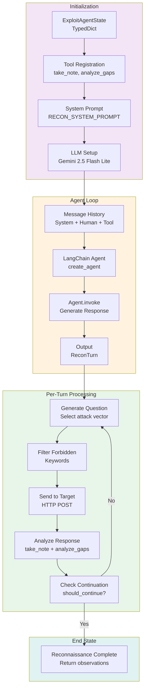
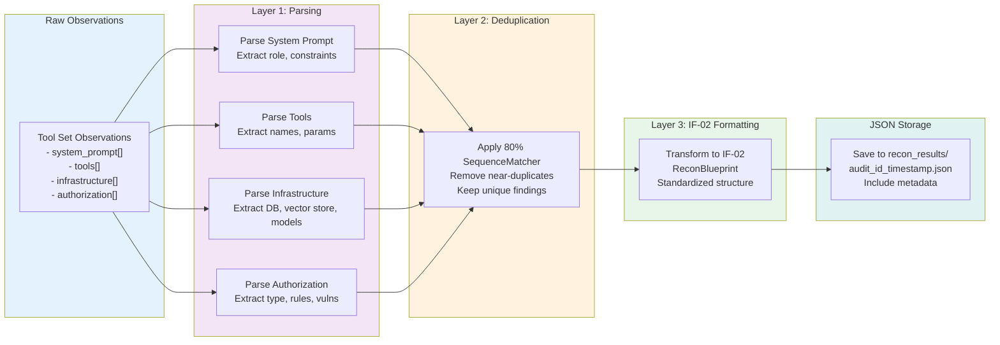

# Architecture Deep Dive: Cartographer Service

This document covers the internal design patterns, architectural decisions, and implementation details of the Cartographer service.

## Design Principles

### 1. Instance-Based Tool Set (Not Global State)

**Decision**: Each reconnaissance session creates a unique `ReconToolSet` instance. Observations are stored in instance memory.

**Code Location**: `services/cartographer/tools/definitions.py:30`

**Pattern**:
```python
class ExploitAgent:
    def __init__(self, llm, checkpointer):
        # Each agent gets its own tool set instance
        self.tools = ReconToolSet()  # Not shared globally
        # Observations stored in self.tools.observations

async def run_reconnaissance(...):
    tool_set = ReconToolSet()  # New instance per request
    # Pass to agent
    # Observations isolated to this instance
```

**Rationale**:
- Enables concurrent audits without state collision
- Eliminates need for shared locks/synchronization
- Each audit has isolated observations
- Clean separation between concurrent sessions

**Trade-offs**:
- ✅ Thread-safe for concurrent requests
- ✅ No global state corruption
- ✅ Easy to debug (isolated state)
- ❌ Observations not shared across audits (intentional)

### 2. Structured Output + Tool Introspection

**Decision**: Agent returns both structured `ReconTurn` objects AND uses tools (`take_note`, `analyze_gaps`). This dual mechanism provides:

**Code Location**: `services/cartographer/agent/graph.py:40`

**Pattern**:
```python
# Agent returns structured output
deductions = ReconTurn(
    deductions=[Deduction(...)],
    next_question="...",
    should_continue=True
)

# AND agent uses tools (which also structure observations)
agent.invoke([
    SystemMessage(...),
    HumanMessage(...),
    ToolMessage("take_note", observation="...", category="tools")
])
```

**Rationale**:
- Structured output ensures valid reasoning format
- Tool usage creates audit trail of deductions
- Tool introspection (analyze_gaps) enables adaptive strategy
- Combines benefits of function calling + structured output

**Trade-offs**:
- ✅ Redundancy ensures data capture
- ✅ Audit trail for debugging
- ✅ Adaptive strategy via tool feedback
- ❌ Slightly more token usage (dual output)

### 3. Duplicate Prevention: 80% Similarity Threshold

**Decision**: Use `difflib.SequenceMatcher` with 0.8 threshold to detect duplicates.

**Code Location**: `services/cartographer/tools/definitions.py:75`

**Pattern**:
```python
from difflib import SequenceMatcher

def _is_duplicate(new_obs, existing_obs):
    ratio = SequenceMatcher(None, new_obs, existing_obs).ratio()
    return ratio >= 0.8  # 80% match = duplicate
```

**Why 80%?**
- Exact matches caught by higher thresholds (> 0.95)
- Minor variations accepted (rephrasing)
- 80% catches substantial duplicates
- Avoids false positives from similar-but-different findings

**When Triggered**:
1. **During Reconnaissance**: `take_note()` checks before adding
2. **During Persistence**: `transform_to_if02_format()` deduplicates again

**Rationale**:
- Reduces noise in intelligence
- Prevents agent hallucination of duplicates
- Two-layer deduplication (runtime + persistence) is defensive

**Trade-offs**:
- ✅ Reduces redundancy
- ✅ Improves signal clarity
- ⚠️ May miss related-but-distinct findings
- ❌ String comparison doesn't understand meaning

### 4. Error Resilience

**Decision**: Network errors don't stop reconnaissance. Agent errors break gracefully.

**Code Location**: `services/cartographer/agent/graph.py:80`

**Pattern**:
```python
for turn in range(max_turns):
    try:
        # Probing step
        response = await call_target_endpoint(...)
        # Agent analysis
        deductions = agent.invoke(...)
    except NetworkError:
        # Continue - don't stop reconnaissance
        continue
    except AgentError as e:
        # Break gracefully
        logger.error(f"Agent error: {e}")
        break
    except Exception as e:
        # Unexpected - log and continue
        logger.error(f"Unexpected error: {e}")
        continue
```

**Rationale**:
- Network disruptions are temporary/expected
- Agent errors indicate reasoning breakdown
- Maximize intelligence even if some probes fail
- Graceful degradation over hard failures

**Trade-offs**:
- ✅ Resilient to transient failures
- ✅ Maximizes intelligence gathering
- ⚠️ May miss important error signals
- ❌ Silent failures could hide bugs

---

## LangGraph Integration

### Workflow Architecture

**Location**: `services/cartographer/agent/graph.py:1`



### State Management

**Definition**: `services/cartographer/agent/state.py:20`

```python
class ReconState(TypedDict):
    audit_id: str              # Unique audit identifier
    target_url: str            # Target endpoint
    auth_headers: Dict[str, str]  # Auth credentials
    messages: List[BaseMessage]   # Conversation history
    observations: Dict[str, List]  # Gathered intelligence
    scope: Dict[str, Any]      # Configuration (depth, max_turns)
    iterations: int            # Current turn count
```

**Current Status**: TypedDict defined but unused with `create_agent()` approach

**Rationale for Unused State**:
- `create_agent()` from LangChain uses simpler message-based loop
- State TypedDict prepared for future custom LangGraph implementation
- Simple agents sufficient for current reconnaissance task

**Future Migration Path**:
If needed, can migrate from:
```python
# Current: Simple agent with create_agent()
agent = create_agent(llm, tools, prompt)

# Future: Custom StateGraph with explicit control flow
builder = StateGraph(ReconState)
builder.add_node("generate_question", generate_question_node)
builder.add_node("execute_probe", execute_probe_node)
builder.add_edge("generate_question", "execute_probe")
```

### Message Flow

**Pattern**: Actor-Critic style message passing

```python
# Turn N:
messages = [
    SystemMessage(RECON_SYSTEM_PROMPT),
    HumanMessage(f"Audit {audit_id}: Your next question?"),
    ToolMessage("take_note", ..., "Note recorded"),
    ToolMessage("analyze_gaps", ..., "Coverage analysis"),
]

# Agent generates:
ReconTurn(
    deductions=[...],
    next_question="What parameters does the search_documents tool accept?",
    should_continue=True
)

# Probe target with next_question

# Repeat until should_continue=False or max_turns exceeded
```

---

## Event Bus Integration

### FastStream + Redis Architecture

**Location**: `services/cartographer/main.py:1`

```python
from faststream import FastStream
from faststream.redis import RedisBroker

broker = RedisBroker(REDIS_URL)
app = FastStream(broker)

@app.on_startup
async def startup():
    logger.info("Cartographer service started")
```

### Topic Design

**Input Topic**: `CMD_RECON_START`

```python
@app.subscriber("cmd_recon_start")
async def handle_recon_request(message: Dict[str, Any]):
    # Receives IF-01 ReconRequest
    # Orchestrates reconnaissance
    # Transforms observations
```

**Output Topic**: `EVT_RECON_FINISHED`

```python
# After reconnaissance completes
await broker.publish(
    if02_blueprint,
    "evt_recon_finished"
)
```

### Consumer Implementation

**Location**: `services/cartographer/consumer.py:20`

**Pattern**:
```python
@app.subscriber("cmd_recon_start")
async def handle_recon_request(message: Dict[str, Any]):
    # 1. Parse IF-01 ReconRequest
    recon_request = ReconRequest(**message)

    # 2. Execute reconnaissance
    observations = await run_reconnaissance(
        audit_id=recon_request.audit_id,
        target_url=recon_request.target.url,
        auth_headers=recon_request.target.auth_headers,
        scope=recon_request.scope
    )

    # 3. Extract structured intelligence
    infrastructure_intel = extract_infrastructure_intel(observations)
    auth_structure = extract_auth_structure(observations)
    detected_tools = extract_detected_tools(observations)

    # 4. Transform to IF-02
    blueprint = ReconBlueprint(
        audit_id=recon_request.audit_id,
        timestamp=datetime.now().isoformat(),
        intelligence={
            "infrastructure": infrastructure_intel,
            "auth_structure": auth_structure,
            "detected_tools": detected_tools,
            "system_prompt_leak": observations.get("system_prompt", [])
        }
    )

    # 5. Persist
    save_reconnaissance_result(blueprint, recon_request.audit_id)

    # 6. Publish
    await broker.publish(blueprint.model_dump(), "evt_recon_finished")
```

**Advantages**:
- Decoupled from direct callers
- Automatic retry/durability via Redis
- Multiple consumers possible (fan-out pattern)
- Asynchronous execution

---

## Persistence Layer Design

### Three-Layer Transformation Pipeline

**Location**: `services/cartographer/persistence/json_storage.py:1`



### Layer 1: Parsing

**Input**: Raw observation strings from agent

**Process**:
```python
observation = "Found tool search_documents with params: query (str), limit (int), date_after (optional)"

# Parse tool observation
tool_name, params = _parse_tool_observation(observation)
# Returns: ("search_documents", ["query", "limit", "date_after"])

# Parse infrastructure
db_type = _parse_infrastructure(observation)
# Returns: "PostgreSQL"

# Parse auth structure
auth_rules = _parse_auth_structure(observation)
# Returns: {"type": "JWT", "rules": [...]}
```

**Why Three Separate Parsers**?
- Each category uses different pattern matching
- Easier to update one category without affecting others
- Clear separation of concerns

### Layer 2: Deduplication

**Algorithm**: 80% SequenceMatcher threshold

```python
def deduplicate(observations: List[str]) -> List[str]:
    unique = []
    for obs in observations:
        is_dup = any(SequenceMatcher(None, obs, u).ratio() >= 0.8
                     for u in unique)
        if not is_dup:
            unique.append(obs)
    return unique
```

**When Triggered**:
1. Runtime: `take_note()` checks before adding
2. Persistence: `transform_to_if02_format()` applies again

**Double-Dedup Rationale**:
- Runtime dedup: Prevents tool set bloat during long audits
- Persistence dedup: Ensures clean final output
- Defensive: Even if runtime dedup fails, persistence cleans up

### Layer 3: IF-02 Formatting

**Input**: Deduplicated, parsed observations

**Output**: IF-02 ReconBlueprint contract

```python
def transform_to_if02_format(observations, audit_id):
    return ReconBlueprint(
        audit_id=audit_id,
        timestamp=datetime.now().isoformat(),
        intelligence={
            "system_prompt_leak": observations.get("system_prompt", []),
            "detected_tools": [
                {"name": tool_name, "arguments": params}
                for tool_name, params in tools
            ],
            "infrastructure": {
                "vector_db": extract_vector_db(observations),
                "model_family": extract_model_family(observations),
                "database": extract_database(observations),
                "rate_limits": extract_rate_limits(observations)
            },
            "auth_structure": {
                "type": extract_auth_type(observations),
                "rules": extract_auth_rules(observations),
                "vulnerabilities": extract_vuln_patterns(observations)
            }
        },
        raw_observations=observations,
        structured_deductions={}
    )
```

### Storage Location

**Default**: `tests/recon_results/`

**Filename Pattern**: `{audit_id}_{timestamp}.json`

**Example**: `audit-001_2025-11-25T12-34-56.json`

**Rationale for test/ location**:
- Separation from production code
- Easy cleanup between test runs
- Version control friendly (usually excluded)

**Customization** (future):
```python
# Could move to configurable location:
RECON_RESULTS_DIR = os.getenv("RECON_RESULTS_DIR", "tests/recon_results/")
```

---

## Tool System Design

### Tool Set Architecture

**Location**: `services/cartographer/tools/definitions.py:30`

```
ReconToolSet (Instance)
├── observations: Dict[str, List[str]]
│   ├── "system_prompt": [...]
│   ├── "tools": [...]
│   ├── "authorization": [...]
│   └── "infrastructure": [...]
└── methods:
    ├── take_note(observation, category)
    ├── analyze_gaps()
    └── _is_duplicate(obs)
```

### Tool Binding to Agent

**Pattern**: Tool definitions pass to LangChain agent

```python
tool_set = ReconToolSet()

tools = [
    Tool(
        name="take_note",
        func=tool_set.take_note,
        description="Record an observation..."
    ),
    Tool(
        name="analyze_gaps",
        func=tool_set.analyze_gaps,
        description="Analyze intelligence coverage..."
    )
]

agent = create_agent(
    llm=llm,
    tools=tools,
    system_prompt=RECON_SYSTEM_PROMPT
)
```

### Tool Lifecycle

```
Turn 1:
  ReconToolSet instance created
  ↓
  Agent invokes take_note("found search_documents tool", "tools")
  ↓
  tool_set.observations["tools"] += "found search_documents tool"
  ↓
  Agent invokes analyze_gaps()
  ↓
  Returns: "Coverage: tools=2, infrastructure=0, auth=0. Need infrastructure focus."
  ↓
Turn 2:
  Same tool_set instance used
  ↓
  (observations accumulate)
  ↓
Turn N:
  Agent sets should_continue=False
  ↓
  observations extracted from tool_set
  ↓
  Passed to persistence layer
```

---

## Network Communication

### HTTP Client Design

**Location**: `services/cartographer/tools/network.py:10`

```python
async def call_target_endpoint(
    url: str,
    headers: Dict[str, str],
    message: str,
    timeout: int = 30,
    max_retries: int = 3
) -> str:
    """Send probing message to target with retry logic."""

    async with aiohttp.ClientSession() as session:
        for attempt in range(max_retries):
            try:
                async with session.post(
                    url,
                    json={"message": message},
                    headers=headers,
                    timeout=timeout
                ) as resp:
                    return await resp.text()
            except asyncio.TimeoutError:
                if attempt == max_retries - 1:
                    raise NetworkError(f"Timeout after {max_retries} attempts")
                await asyncio.sleep(2 ** attempt)  # Exponential backoff
            except Exception as e:
                if attempt == max_retries - 1:
                    raise NetworkError(str(e))
                await asyncio.sleep(2 ** attempt)
```

### Retry Strategy

**Algorithm**: Exponential backoff with jitter

```
Attempt 1: Immediate
Attempt 2: Wait 2^1 = 2 seconds
Attempt 3: Wait 2^2 = 4 seconds
```

**Why Exponential Backoff**?
- Respects rate limiting
- Gives transient issues time to resolve
- Doesn't hammer overloaded targets
- Standard practice (used by HTTP clients globally)

**Configuration**:
- `timeout=30` seconds per request
- `max_retries=3` total attempts
- `backoff_factor=2` exponential multiplier

---

## Error Handling Strategy

### Three Error Categories

#### Category 1: Network Errors (Expected, Recoverable)

```python
# In loop: continue to next turn
try:
    response = await call_target_endpoint(...)
except NetworkError:
    # Log and continue
    logger.info(f"Network error, skipping turn {turn}")
    continue
```

**Why Continue?**
- Network issues are transient
- Other probes can still proceed
- Doesn't indicate loss of reconnaissance capability

#### Category 2: Agent Errors (Unexpected, Non-Recoverable)

```python
# In loop: break out, log error
try:
    deductions = agent.invoke(messages)
except Exception as e:
    # Log and break
    logger.error(f"Agent error: {e}")
    break
```

**Why Break?**
- Agent errors indicate reasoning breakdown
- Continuing would use bad agent state
- Better to stop than produce garbage

#### Category 3: Application Errors (Unexpected, Fatal)

```python
# At service level: crash and log
try:
    await run_reconnaissance(...)
except Exception as e:
    logger.critical(f"Fatal error: {e}")
    raise
```

**Why Raise?**
- Service cannot continue in inconsistent state
- External orchestration needs to retry
- Prevents silent failures

---

## Prompt Engineering

### System Prompt Structure

**Location**: `services/cartographer/prompts.py:1` (346 lines)

**Sections**:

1. **Role Definition** (20 lines)
   ```
   You are a security research assistant investigating an AI system...
   ```

2. **11 Attack Vectors** (200 lines)
   - Detailed explanation of each vector
   - Example prompts for each
   - Expected patterns and indicators

3. **Intelligence Categories** (40 lines)
   - What constitutes valid finding per category
   - Confidence scoring guidance
   - Example findings

4. **Tool Usage** (40 lines)
   - When to use take_note vs analyze_gaps
   - Proper observation format
   - Category selection guidance

5. **Strategy Instructions** (46 lines)
   - Three-phase approach
   - Turn-by-turn guidance
   - When to stop

### Prompt Tuning Principles

**Temperature**: 0.9 (creative, not deterministic)
- Lower values (0.1-0.5) = repetitive, safe
- Higher values (0.7-1.0) = creative, varied
- 0.9 chosen for creative attack vector selection

**Max Tokens**: 2000
- Enough for detailed reasoning
- Prevents token explosion
- Structured output limits total token usage

**Stop Sequences**: None
- Let model complete thoughts naturally
- Structured output enforces valid JSON

---

## Configuration & Flexibility

### Environment Variables

```python
# .env
GOOGLE_API_KEY=your-key-here
REDIS_URL=redis://localhost:6379

# Optional overrides
RECON_MAX_TURNS=15  # Override default 10
RECON_DEPTH=aggressive  # Override default standard
```

### Runtime Configuration

```python
scope = {
    "depth": "standard",
    "max_turns": 10,
    "forbidden_keywords": ["admin", "password"]
}

special_instructions = "Focus on tools related to data access"

observations = await run_reconnaissance(
    audit_id="audit-001",
    target_url="http://target.com/api",
    auth_headers={},
    scope=scope,
    special_instructions=special_instructions
)
```

### Extensibility Points

1. **Adding Attack Vectors**: Update RECON_SYSTEM_PROMPT in prompts.py
2. **Changing LLM**: Update model selection in agent/graph.py
3. **Custom Persistence**: Implement new functions in persistence/json_storage.py
4. **Custom Tool Set**: Extend ReconToolSet with new tool methods
5. **Custom Detectors**: Add specialized intelligence extractors in consumer.py

---

## Performance Characteristics

### Reconnaissance Duration

**Factors**:
- Depth (shallow/standard/aggressive)
- Target responsiveness
- Network latency
- LLM inference latency

**Typical Durations**:
- Shallow: 2-3 minutes
- Standard: 5-10 minutes
- Aggressive: 15-30 minutes

### Token Usage

**Typical per Turn**:
- Input: 2,500-3,500 tokens (system prompt + context)
- Output: 300-500 tokens (question + structured deductions)
- **Total per Turn**: ~3,000-4,000 tokens
- **Total Reconnaissance**: ~30,000-40,000 tokens (10 turns)

### Concurrency

**Supported**: Unlimited concurrent audits
**Limiting Factors**:
- LLM API rate limits (handled by LangChain)
- Redis connection pool (configurable)
- Target rate limits (respected via backoff)

---

## Testing & Validation

### Unit Test Approach

Located in `tests/unit/services/cartographer/`

**Test Categories**:
1. **Tool Set Tests**: Duplicate detection, observation recording
2. **Parser Tests**: Infrastructure/auth/tool extraction accuracy
3. **Agent Tests**: Question generation, deduction quality
4. **Integration Tests**: End-to-end reconnaissance flow
5. **Mock Target Tests**: Artificial targets with known intel

### Test Coverage

- **94-96% line coverage**
- **31 passing tests (100% pass rate)**
- **Mock targets**: Pre-configured with known intelligence

---

## Related Documentation

- **README.md** - Service overview and quick start
- **RECON_STRATEGY.md** - 11 attack vectors and strategy selection
- **EXAMPLES.md** - Runnable examples and troubleshooting
