# Snipers Service - Exploit Agent System

## Overview

The Snipers service implements a **Human-in-the-Loop (HITL) exploit agent system** that analyzes vulnerability patterns from Garak scans and executes targeted attacks using PyRIT. The system emphasizes human oversight at all critical decision points.

**Status:** 64% Complete | Core Framework ✅ | PyRIT Integration ✅

---

## 🏗️ System Architecture

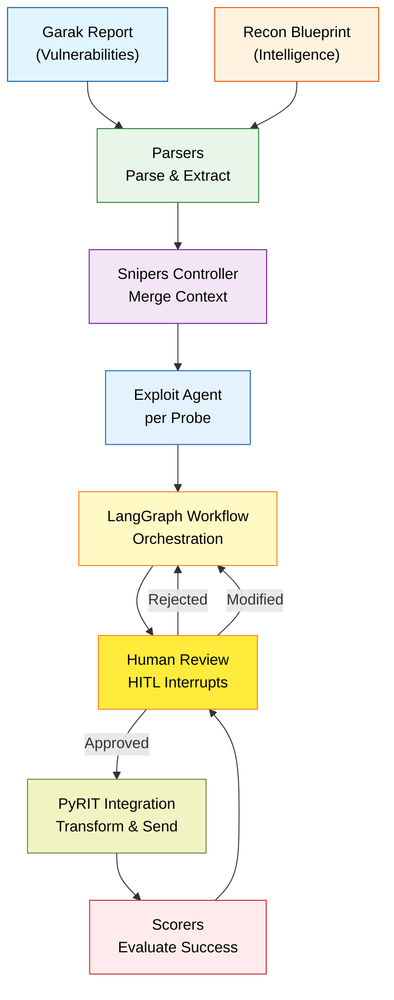

---

## 📊 Data Flow Diagram

```mermaid
graph LR
    A["Input Files<br/>garak_report.json<br/>recon_blueprint.json"]
    B["Parser Layer<br/>GarakReportParser<br/>ReconBlueprintParser<br/>ExampleExtractor"]
    C["Structured Data<br/>ExampleFinding[]<br/>ReconIntelligence<br/>VulnerableProbe[]"]
    D["Controller<br/>Merge Context<br/>Match Evidence<br/>Create Job"]
    E["Exploit Agent Input<br/>probe_name<br/>example_findings[]<br/>recon_intelligence<br/>target_url"]
    F["Agent Reasoning<br/>analyze_pattern()<br/>select_converters()<br/>generate_payloads()"]
    G["Structured Outputs<br/>PatternAnalysis<br/>ConverterSelection<br/>PayloadGeneration"]
    H["Attack Plan<br/>Complete Plan<br/>for Human Review"]
    I["HITL Interrupt<br/>Present to Human<br/>Await Decision"]
    J["Execution<br/>PyRIT Converters<br/>Target Adapters<br/>HTTP/WebSocket"]
    K["Response Data<br/>Target Response<br/>Transformed Payload<br/>Converter Errors"]
    L["Scorers<br/>Regex Scorer<br/>Self-Ask Scorer<br/>Custom Scorers"]
    M["Attack Result<br/>success: bool<br/>score: float<br/>human_feedback"]
    N["Result Storage<br/>AttackResult<br/>Review Status<br/>Execution Logs"]

    A --> B
    B --> C
    C --> D
    D --> E
    E --> F
    F --> G
    G --> H
    H --> I
    I -->|Human Approves| J
    I -->|Human Modifies| F
    I -->|Human Rejects| N
    J --> K
    K --> L
    L --> M
    M --> I
    M --> N

    style A fill:#e1f5ff,stroke:#01579b,color:#000
    style B fill:#e8f5e9,stroke:#2e7d32,color:#000
    style C fill:#f1f8e9,stroke:#558b2f,color:#000
    style D fill:#f3e5f5,stroke:#6a1b9a,color:#000
    style E fill:#e3f2fd,stroke:#1565c0,color:#000
    style F fill:#fff9c4,stroke:#f57f17,color:#000
    style G fill:#fff9c4,stroke:#f57f17,color:#000
    style H fill:#fff9c4,stroke:#f57f17,color:#000
    style I fill:#ffeb3b,stroke:#f57f17,color:#000
    style J fill:#f0f4c3,stroke:#558b2f,color:#000
    style K fill:#c8e6c9,stroke:#2e7d32,color:#000
    style L fill:#ffebee,stroke:#c62828,color:#000
    style M fill:#c8e6c9,stroke:#2e7d32,color:#000
    style N fill:#e0f2f1,stroke:#00695c,color:#000
```

---

## 🔄 Agent Workflow Sequence

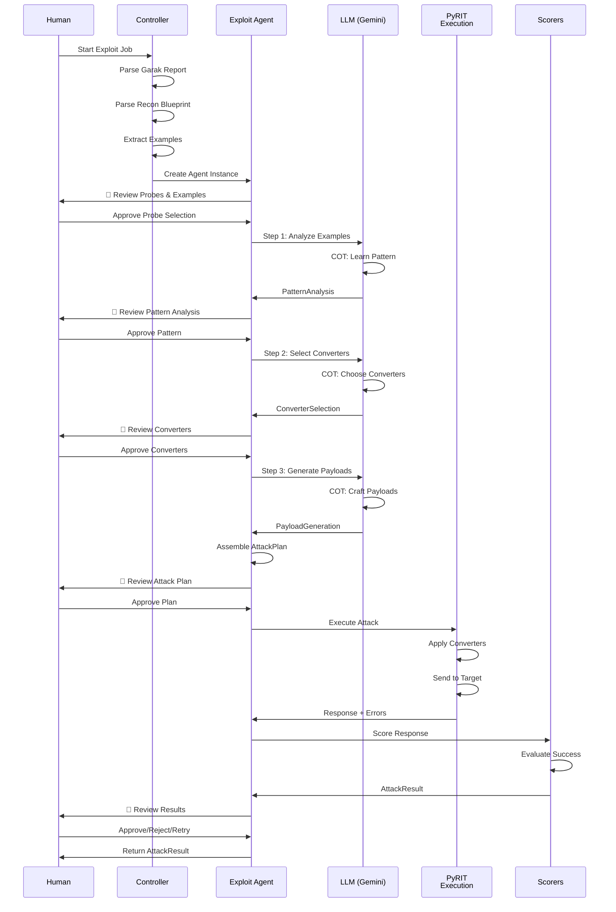

---

## 🗂️ Module Structure & Routing

```mermaid
graph TD
    A["services/snipers/"]

    A --> B["agent/"]
    A --> C["tools/"]
    A --> D["models.py"]
    A --> E["parsers.py"]
    A --> F["main.py<br/>FastAPI App"]

    B --> B1["core.py<br/>ExploitAgent"]
    B --> B2["state.py<br/>ExploitAgentState"]
    B --> B3["prompts.py<br/>System Prompts"]
    B --> B4["routing.py<br/>Route Decisions"]
    B --> B5["agent_tools/"]
    B --> B6["nodes/"]

    B5 --> B51["pattern_analysis_tool.py"]
    B5 --> B52["converter_selection_tool.py"]
    B5 --> B53["payload_generation_tool.py"]
    B5 --> B54["scoring_tool.py"]

    B6 --> B61["pattern_analysis.py"]
    B6 --> B62["converter_selection.py"]
    B6 --> B63["payload_generation.py"]
    B6 --> B64["attack_plan.py"]
    B6 --> B65["human_review.py"]
    B6 --> B66["attack_execution.py"]
    B6 --> B67["scoring.py"]
    B6 --> B68["retry.py"]

    C --> C1["pyrit_bridge.py<br/>ConverterFactory"]
    C --> C2["pyrit_target_adapters.py<br/>HTTP/WebSocket"]
    C --> C3["pyrit_executor.py<br/>PyRITExecutor"]
    C --> C4["scorers/"]

    C4 --> C41["regex_scorer.py"]
    C4 --> C42["self_ask_scorer.py"]
    C4 --> C43["custom_scorers.py"]

    style A fill:#e3f2fd,stroke:#1565c0,color:#000,stroke-width:3px
    style B fill:#f3e5f5,stroke:#6a1b9a,color:#000
    style C fill:#f0f4c3,stroke:#558b2f,color:#000
    style D fill:#e8f5e9,stroke:#2e7d32,color:#000
    style E fill:#e8f5e9,stroke:#2e7d32,color:#000
    style F fill:#fff9c4,stroke:#f57f17,color:#000

    style B1 fill:#e3f2fd,stroke:#1565c0,color:#000
    style B2 fill:#e3f2fd,stroke:#1565c0,color:#000
    style B3 fill:#fff9c4,stroke:#f57f17,color:#000
    style B4 fill:#fff9c4,stroke:#f57f17,color:#000
    style B5 fill:#f3e5f5,stroke:#6a1b9a,color:#000
    style B6 fill:#f3e5f5,stroke:#6a1b9a,color:#000

    style C1 fill:#f0f4c3,stroke:#558b2f,color:#000
    style C2 fill:#f0f4c3,stroke:#558b2f,color:#000
    style C3 fill:#f0f4c3,stroke:#558b2f,color:#000
    style C4 fill:#ffebee,stroke:#c62828,color:#000
```

---

## 🔀 Routing Decision Flow

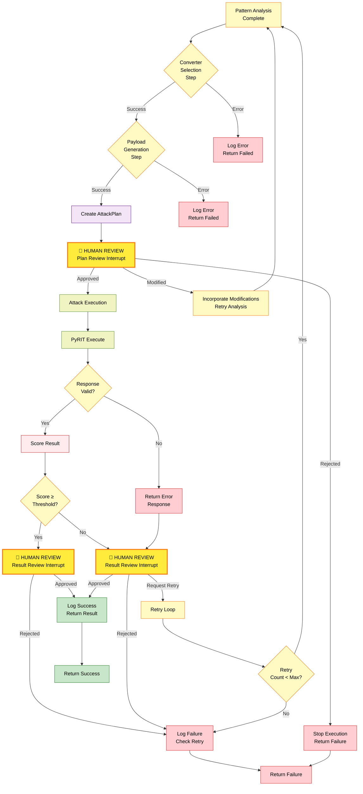

---

## 🎯 Exploit Agent State Machine

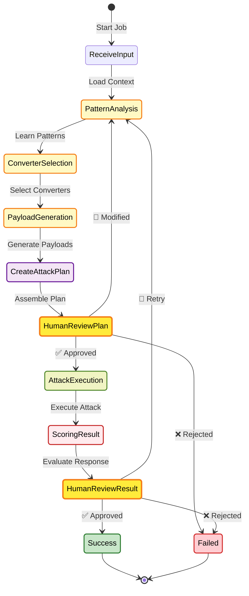

---

## 🔧 PyRIT Integration Architecture

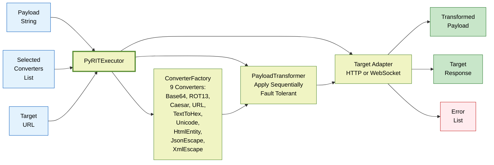

---

## 📋 Data Models Hierarchy

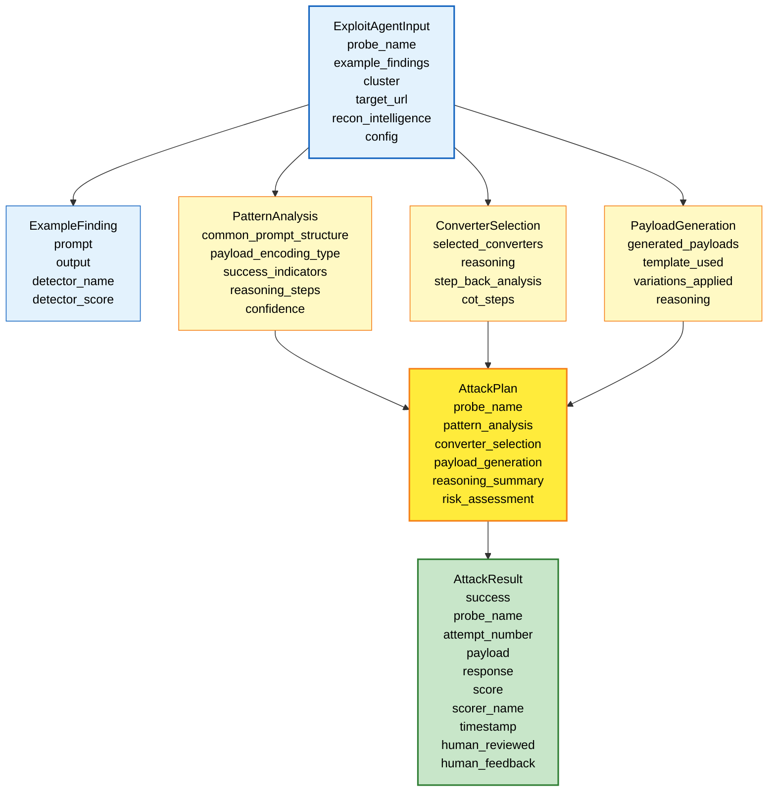

---

## 🧠 Exploit Agent Reasoning Loop

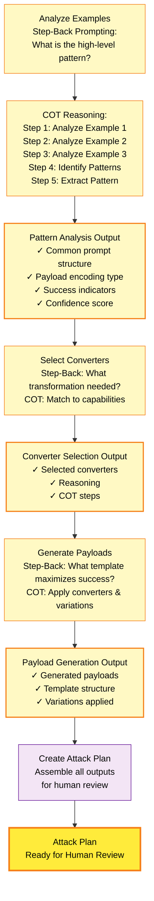

---

## 🚀 Component Interaction Matrix

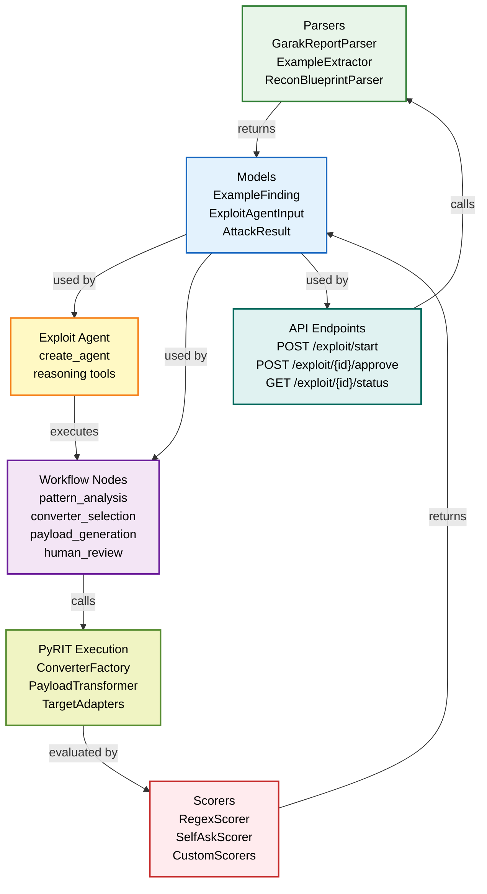

---

## 📦 Directory Structure

```
services/snipers/
│
├── agent/                              # Agent orchestration
│   ├── __init__.py
│   ├── core.py                        # ExploitAgent class (231 lines)
│   ├── state.py                       # LangGraph state (TypedDict)
│   ├── prompts.py                     # System prompts with COT/step-back
│   ├── routing.py                     # Route decision logic
│   │
│   ├── agent_tools/                   # Reasoning tools
│   │   ├── __init__.py
│   │   ├── pattern_analysis_tool.py
│   │   ├── converter_selection_tool.py
│   │   ├── payload_generation_tool.py
│   │   └── scoring_tool.py
│   │
│   └── nodes/                         # Workflow nodes
│       ├── __init__.py
│       ├── pattern_analysis.py        # Learn patterns
│       ├── converter_selection.py     # Select converters
│       ├── payload_generation.py      # Generate payloads
│       ├── attack_plan.py             # Assemble plan
│       ├── human_review.py            # HITL interrupts
│       ├── attack_execution.py        # PyRIT execution
│       ├── scoring.py                 # Score results
│       └── retry.py                   # Retry logic
│
├── tools/                              # PyRIT integration & scorers
│   ├── pyrit_bridge.py                # ConverterFactory (9 converters)
│   ├── pyrit_target_adapters.py       # HTTP/WebSocket adapters
│   ├── pyrit_executor.py              # Main PyRIT executor
│   │
│   └── scorers/                       # Result evaluation
│       ├── regex_scorer.py
│       ├── self_ask_scorer.py
│       └── custom_scorers.py
│
├── models.py                          # Pydantic models (all inputs/outputs)
├── parsers.py                         # Garak/Recon parsers
├── dispatcher.py                      # Job dispatcher (pending)
├── controller.py                      # Main controller (pending)
├── main.py                            # FastAPI app (pending)
│
└── __init__.py
```

---

## 🔑 Key Components Summary

| Component | Purpose | Status |
|-----------|---------|--------|
| **Parsers** | Extract data from Garak & Recon | ✅ Complete |
| **Models** | Pydantic validation (all data) | ✅ Complete |
| **Exploit Agent** | Core reasoning engine | ✅ Complete |
| **LangGraph Nodes** | Workflow orchestration | ✅ Complete |
| **PyRIT Integration** | Payload transformation & delivery | ✅ Complete |
| **Scorers** | Evaluate attack success | ⏳ Pending |
| **Controller** | Multi-agent orchestration | ⏳ Pending |
| **FastAPI API** | REST endpoints | ⏳ Pending |

---

## 🔗 Human-in-the-Loop (HITL) Integration

The system uses **LangGraph interrupts** at three critical points:

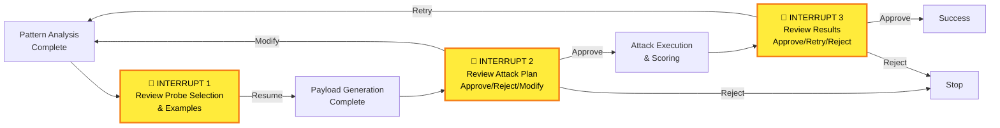

**Interrupt Types:**
- `Command(resume=True)` - Approve and proceed
- `Command(resume=False)` - Reject and stop
- `Command(resume={"modifications": {...}})` - Modify and continue

---

## 📊 Progress Summary

**Current Status: 64% Complete**

```
Completed (✅):
├── Pydantic Models (100%)
├── Parsers (100%)
├── Agent Prompts (100%)
├── Agent Core (100%)
├── Workflow Nodes (100%)
├── LangGraph State (100%)
└── PyRIT Integration (100%)

Pending (⏳):
├── Scorers Implementation (0%)
├── Controller/Dispatcher (0%)
├── FastAPI Endpoints (0%)
└── Tests (0%)
```

---

## 🎯 Next Steps

### Phase 4.2: Scorers & Controller
- [ ] Implement regex scorer with pattern matching
- [ ] Extract self-ask scorer logic from agent
- [ ] Create domain-specific custom scorers
- [ ] Build job dispatcher for parallel agent execution
- [ ] Implement result aggregation across probes

### Phase 4.3: FastAPI API
- [ ] REST endpoints for job management
- [ ] WebSocket for real-time updates
- [ ] Human approval/rejection endpoints
- [ ] Status and results retrieval

### Testing
- [ ] Unit tests for all components
- [ ] Integration tests with mock targets
- [ ] End-to-end workflow tests
- [ ] HITL interrupt handling tests

---

## 💡 Design Principles

1. **Human-in-the-Loop First**: Human oversight at all critical decision points
2. **Isolation First**: Works standalone without external dependencies
3. **Structured Everything**: All inputs/outputs are Pydantic models
4. **Reasoning-First**: COT and step-back prompting for analysis
5. **Fault Tolerant**: Graceful degradation on converter/scorer errors
6. **Extensible**: Easy to add new converters, scorers, and templates

---

## 🚀 Getting Started

### Prerequisites
```bash
uv add langchain langchain-google-genai langgraph pydantic python-pyrit
```

### Basic Usage

```python
from services.snipers.agent.core import ExploitAgent
from services.snipers.models import ExploitAgentInput, ExampleFinding

# Create agent instance
agent = ExploitAgent()

# Prepare input with examples
input_data = ExploitAgentInput(
    probe_name="encoding",
    example_findings=[...],  # 3 successful attack examples
    target_url="http://target.com/api",
    recon_intelligence={...},
    config={...}
)

# Execute workflow
result = agent.invoke(input_data)
```

---

## 📚 Complete File Reference Guide

### Core Agent Files

| File Path | Lines | Purpose | Key Classes/Functions |
|-----------|-------|---------|----------------------|
| `services/snipers/agent/core.py` | 231 | Main ExploitAgent orchestration | `ExploitAgent`, `create_workflow()`, `build_agent()` |
| `services/snipers/agent/state.py` | ~50 | LangGraph state definition | `ExploitAgentState` (TypedDict), `create_initial_state()` |
| `services/snipers/agent/prompts.py` | ~400 | System prompts & reasoning | `PATTERN_ANALYSIS_PROMPT`, `CONVERTER_SELECTION_PROMPT`, etc. |
| `services/snipers/agent/routing.py` | 58 | Routing decision logic | `route_after_human_review()`, `route_after_result_review()`, `route_after_retry()` |

### Agent Tools (Reasoning)

| File Path | Lines | Purpose | Key Functions |
|-----------|-------|---------|----------------|
| `services/snipers/agent/agent_tools/__init__.py` | ~20 | Tool exports | Tool factory imports |
| `services/snipers/agent/agent_tools/pattern_analysis_tool.py` | 64 | Pattern learning tool | `create_pattern_analysis_tool()` |
| `services/snipers/agent/agent_tools/converter_selection_tool.py` | 60 | Converter selection tool | `create_converter_selection_tool()` |
| `services/snipers/agent/agent_tools/payload_generation_tool.py` | 74 | Payload generation tool | `create_payload_generation_tool()` |
| `services/snipers/agent/agent_tools/scoring_tool.py` | 59 | Result scoring tool | `create_scoring_tool()` |

### Workflow Nodes

| File Path | Lines | Purpose | Key Functions |
|-----------|-------|---------|----------------|
| `services/snipers/agent/nodes/__init__.py` | ~30 | Node exports | Node function imports |
| `services/snipers/agent/nodes/pattern_analysis.py` | ~50 | Pattern analysis node | `analyze_pattern_node()` |
| `services/snipers/agent/nodes/converter_selection.py` | ~50 | Converter selection node | `select_converters_node()` |
| `services/snipers/agent/nodes/payload_generation.py` | ~50 | Payload generation node | `generate_payloads_node()` |
| `services/snipers/agent/nodes/attack_plan.py` | ~40 | Attack plan assembly | `create_attack_plan_node()` |
| `services/snipers/agent/nodes/human_review.py` | ~60 | HITL interrupts | `human_review_plan_node()`, `human_review_result_node()` |
| `services/snipers/agent/nodes/attack_execution.py` | 70 | PyRIT execution | `execute_attack_node()`, uses `PyRITExecutor` |
| `services/snipers/agent/nodes/scoring.py` | ~50 | Result evaluation | `score_result_node()` |
| `services/snipers/agent/nodes/retry.py` | ~40 | Retry logic | `handle_retry_node()` |

### Data Models

| File Path | Lines | Purpose | Key Classes |
|-----------|-------|---------|-------------|
| `services/snipers/models.py` | ~400 | All Pydantic models | `ExampleFinding`, `ExploitAgentInput`, `PatternAnalysis`, `ConverterSelection`, `PayloadGeneration`, `AttackPlan`, `AttackResult`, `ExploitAgentState` |
| `services/snipers/parsers.py` | ~300 | Input data parsing | `GarakReportParser`, `ExampleExtractor`, `ReconBlueprintParser` |

### PyRIT Integration

| File Path | Lines | Purpose | Key Classes |
|-----------|-------|---------|-------------|
| `services/snipers/tools/pyrit_bridge.py` | 198 | Converter factory & transformer | `ConverterFactory`, `PayloadTransformer` |
| `services/snipers/tools/pyrit_target_adapters.py` | 143 | HTTP/WebSocket adapters | `HttpTargetAdapter`, `WebSocketTargetAdapter` |
| `services/snipers/tools/pyrit_executor.py` | 178 | Main PyRIT executor | `PyRITExecutor` |

### Scorers (Pending)

| File Path | Purpose | Status |
|-----------|---------|--------|
| `services/snipers/tools/scorers/__init__.py` | Scorer exports | ⏳ Pending |
| `services/snipers/tools/scorers/regex_scorer.py` | Pattern matching scorer | ⏳ Pending |
| `services/snipers/tools/scorers/self_ask_scorer.py` | LLM-based scorer | ⏳ Pending |
| `services/snipers/tools/scorers/custom_scorers.py` | Domain-specific scorers | ⏳ Pending |

### System Integration (Pending)

| File Path | Purpose | Status |
|-----------|---------|--------|
| `services/snipers/dispatcher.py` | Job dispatcher for parallel execution | ⏳ Pending |
| `services/snipers/controller.py` | Multi-agent orchestration | ⏳ Pending |
| `services/snipers/main.py` | FastAPI application | ⏳ Pending |

---

## 🎯 Component-to-File Mapping

### Pattern Analysis Workflow
- **Input**: `ExploitAgentInput` (defined in `services/snipers/models.py`)
- **Tool**: `create_pattern_analysis_tool()` in `services/snipers/agent/agent_tools/pattern_analysis_tool.py`
- **Node**: `analyze_pattern_node()` in `services/snipers/agent/nodes/pattern_analysis.py`
- **Output**: `PatternAnalysis` (defined in `services/snipers/models.py`)

### Converter Selection Workflow
- **Input**: `PatternAnalysis` (defined in `services/snipers/models.py`)
- **Tool**: `create_converter_selection_tool()` in `services/snipers/agent/agent_tools/converter_selection_tool.py`
- **Node**: `select_converters_node()` in `services/snipers/agent/nodes/converter_selection.py`
- **Output**: `ConverterSelection` (defined in `services/snipers/models.py`)

### Payload Generation Workflow
- **Input**: `ConverterSelection` (defined in `services/snipers/models.py`)
- **Tool**: `create_payload_generation_tool()` in `services/snipers/agent/agent_tools/payload_generation_tool.py`
- **Node**: `generate_payloads_node()` in `services/snipers/agent/nodes/payload_generation.py`
- **Output**: `PayloadGeneration` (defined in `services/snipers/models.py`)

### Attack Plan Assembly
- **Node**: `create_attack_plan_node()` in `services/snipers/agent/nodes/attack_plan.py`
- **Output**: `AttackPlan` (defined in `services/snipers/models.py`)

### Human Review Points
- **Node**: `human_review_plan_node()` in `services/snipers/agent/nodes/human_review.py` (INTERRUPT 1)
- **Node**: `human_review_result_node()` in `services/snipers/agent/nodes/human_review.py` (INTERRUPT 2)
- **Uses**: `langgraph.types.interrupt()` with JSON payloads

### PyRIT Execution Pipeline
- **Converter Factory**: `services/snipers/tools/pyrit_bridge.py` → `ConverterFactory` class
- **Adapter Selection**: `services/snipers/tools/pyrit_target_adapters.py` → `HttpTargetAdapter` or `WebSocketTargetAdapter`
- **Executor**: `services/snipers/tools/pyrit_executor.py` → `PyRITExecutor` class
- **Node Integration**: `services/snipers/agent/nodes/attack_execution.py` → `execute_attack_node()`

### Result Scoring
- **Tool**: `create_scoring_tool()` in `services/snipers/agent/agent_tools/scoring_tool.py`
- **Node**: `score_result_node()` in `services/snipers/agent/nodes/scoring.py`
- **Output**: `AttackResult` (defined in `services/snipers/models.py`)

### Input Parsing
- **Garak Parser**: `services/snipers/parsers.py` → `GarakReportParser` class
- **Example Extractor**: `services/snipers/parsers.py` → `ExampleExtractor` class
- **Recon Parser**: `services/snipers/parsers.py` → `ReconBlueprintParser` class

---

## 🔧 Modification Guide by Use Case

### To Add a New Converter Type:
1. Edit `services/snipers/tools/pyrit_bridge.py` → `ConverterFactory._initialize_converters()` method
2. Register in `services/snipers/agent/prompts.py` → `CONVERTER_SELECTION_PROMPT`
3. Test in `services/snipers/agent/nodes/attack_execution.py`

### To Add a New Scorer:
1. Create `services/snipers/tools/scorers/your_scorer.py` (when implemented)
2. Register in `services/snipers/tools/scorers/__init__.py`
3. Integrate in `services/snipers/agent/nodes/scoring.py` → `score_result_node()`

### To Modify HITL Interrupts:
1. Edit `services/snipers/agent/nodes/human_review.py` → `human_review_plan_node()` or `human_review_result_node()`
2. Update interrupt payload structure in `services/snipers/models.py` if needed
3. Update routing in `services/snipers/agent/routing.py` if decision logic changes

### To Change Agent Reasoning Behavior:
1. Edit `services/snipers/agent/prompts.py` → relevant prompt constant
2. Update structured output model in `services/snipers/models.py` if needed
3. Test in `services/snipers/agent/agent_tools/your_tool.py`

### To Add New Data Fields to Models:
1. Edit `services/snipers/models.py` → relevant Pydantic model class
2. Update parsing logic if applicable in `services/snipers/parsers.py`
3. Update agent prompts in `services/snipers/agent/prompts.py` to guide LLM generation

---

## 🔄 Flow Summary

```
Garak Report + Recon Blueprint
    ↓
Parse & Extract (Parsers)
    ↓
Create Agent Instances (Controller)
    ↓
[For Each Probe]
├─ Load Examples & Context
├─ Analyze Patterns (LLM)
├─ 👤 Human Review Point 1
├─ Select Converters (LLM)
├─ Generate Payloads (LLM)
├─ Create Attack Plan
├─ 👤 Human Review Point 2
├─ Execute with PyRIT
├─ Score Results
├─ 👤 Human Review Point 3
└─ Log Success/Failure
    ↓
Return Aggregated Results
```

---

---

## 🔍 Quick File Lookup by Task

### "I need to modify X"

| What I need to modify | Primary File | Secondary Files |
|----------------------|--------------|-----------------|
| **Probe selection logic** | `services/snipers/agent/nodes/pattern_analysis.py` | `services/snipers/models.py` |
| **Pattern learning** | `services/snipers/agent/prompts.py` (PATTERN_ANALYSIS_PROMPT) | `services/snipers/agent/agent_tools/pattern_analysis_tool.py` |
| **Converter selection** | `services/snipers/agent/prompts.py` (CONVERTER_SELECTION_PROMPT) | `services/snipers/tools/pyrit_bridge.py` |
| **Payload generation** | `services/snipers/agent/prompts.py` (PAYLOAD_GENERATION_PROMPT) | `services/snipers/agent/agent_tools/payload_generation_tool.py` |
| **Attack execution** | `services/snipers/tools/pyrit_executor.py` | `services/snipers/agent/nodes/attack_execution.py` |
| **Result scoring** | `services/snipers/agent/prompts.py` (ATTACK_SCORING_PROMPT) | `services/snipers/agent/nodes/scoring.py` |
| **Human review flow** | `services/snipers/agent/nodes/human_review.py` | `services/snipers/agent/routing.py` |
| **Data models** | `services/snipers/models.py` | All other files (consumers) |
| **Input parsing** | `services/snipers/parsers.py` | `services/snipers/models.py` |
| **Workflow routing** | `services/snipers/agent/routing.py` | `services/snipers/agent/core.py` |

---

## 📦 Import Cheat Sheet

### For Agent Workflow
```python
from services.snipers.agent.core import ExploitAgent
from services.snipers.agent.state import ExploitAgentState
from services.snipers.models import ExploitAgentInput, AttackResult
```

### For Data Models
```python
from services.snipers.models import (
    ExampleFinding,
    PatternAnalysis,
    ConverterSelection,
    PayloadGeneration,
    AttackPlan,
    AttackResult
)
```

### For Parsing
```python
from services.snipers.parsers import (
    GarakReportParser,
    ExampleExtractor,
    ReconBlueprintParser
)
```

### For PyRIT Execution
```python
from services.snipers.tools.pyrit_executor import PyRITExecutor
from services.snipers.tools.pyrit_bridge import ConverterFactory, PayloadTransformer
from services.snipers.tools.pyrit_target_adapters import HttpTargetAdapter, WebSocketTargetAdapter
```

### For Routing
```python
from services.snipers.agent.routing import (
    route_after_human_review,
    route_after_result_review,
    route_after_retry
)
```

---

## 🗂️ Full Directory Tree with Descriptions

```
services/snipers/
│
├── __init__.py                                    # Package initialization
│
├── models.py ⭐ [~400 lines]                     # All Pydantic models
│   ├── ExampleFinding - Attack example from Garak
│   ├── ExploitAgentInput - Agent input context
│   ├── PatternAnalysis - Learned patterns output
│   ├── ConverterSelection - Selected converters output
│   ├── PayloadGeneration - Generated payloads output
│   ├── AttackPlan - Complete plan for human review
│   ├── AttackResult - Final attack outcome
│   ├── HumanFeedback - Human approval/feedback
│   └── ExploitAgentState - LangGraph state
│
├── parsers.py ⭐ [~300 lines]                    # Input data parsing
│   ├── GarakReportParser - Parse Garak JSON
│   ├── ExampleExtractor - Extract top 3 examples
│   └── ReconBlueprintParser - Parse recon data
│
├── agent/
│   ├── __init__.py
│   │
│   ├── core.py ⭐ [231 lines]                    # Main orchestration
│   │   ├── ExploitAgent - Main agent class
│   │   ├── _build_agent() - Create reasoning agent
│   │   └── _create_workflow() - Build LangGraph
│   │
│   ├── state.py [~50 lines]                      # State management
│   │   ├── ExploitAgentState - TypedDict state
│   │   └── create_initial_state() - Initialize
│   │
│   ├── prompts.py [~400 lines]                   # System prompts
│   │   ├── EXPLOIT_AGENT_SYSTEM_PROMPT
│   │   ├── PATTERN_ANALYSIS_PROMPT
│   │   ├── CONVERTER_SELECTION_PROMPT
│   │   ├── PAYLOAD_GENERATION_PROMPT
│   │   └── ATTACK_SCORING_PROMPT
│   │
│   ├── routing.py [58 lines]                     # Decision routing
│   │   ├── route_after_human_review() - Approve/Reject/Modify
│   │   ├── route_after_result_review() - Review results
│   │   └── route_after_retry() - Retry logic
│   │
│   ├── agent_tools/                              # Reasoning tools for agent
│   │   ├── __init__.py [~20 lines]
│   │   │   ├── create_pattern_analysis_tool
│   │   │   ├── create_converter_selection_tool
│   │   │   ├── create_payload_generation_tool
│   │   │   └── create_scoring_tool
│   │   │
│   │   ├── pattern_analysis_tool.py [64 lines]   # Pattern learning
│   │   ├── converter_selection_tool.py [60 lines] # Converter selection
│   │   ├── payload_generation_tool.py [74 lines]  # Payload crafting
│   │   └── scoring_tool.py [59 lines]             # Result evaluation
│   │
│   └── nodes/                                    # Workflow nodes
│       ├── __init__.py [~30 lines]
│       │   ├── analyze_pattern_node
│       │   ├── select_converters_node
│       │   ├── generate_payloads_node
│       │   ├── create_attack_plan_node
│       │   ├── human_review_plan_node
│       │   ├── execute_attack_node
│       │   ├── score_result_node
│       │   └── handle_retry_node
│       │
│       ├── pattern_analysis.py [~50 lines]       # Learn patterns
│       ├── converter_selection.py [~50 lines]    # Select converters
│       ├── payload_generation.py [~50 lines]     # Generate payloads
│       ├── attack_plan.py [~40 lines]            # Assemble plan
│       ├── human_review.py [~60 lines]           # HITL interrupts (2x)
│       ├── attack_execution.py [70 lines] ⭐     # PyRIT execution
│       ├── scoring.py [~50 lines]                # Evaluate results
│       └── retry.py [~40 lines]                  # Retry handling
│
└── tools/
    ├── pyrit_bridge.py [198 lines] ⭐            # Converter factory
    │   ├── ConverterFactory - Cache 9 converters
    │   │   ├── Base64Converter
    │   │   ├── ROT13Converter
    │   │   ├── CaesarConverter
    │   │   ├── UrlConverter
    │   │   ├── TextToHexConverter
    │   │   ├── UnicodeConverter
    │   │   ├── HtmlEntityConverter (custom)
    │   │   ├── JsonEscapeConverter (custom)
    │   │   └── XmlEscapeConverter (custom)
    │   └── PayloadTransformer - Apply converters with fault tolerance
    │
    ├── pyrit_target_adapters.py [143 lines] ⭐   # Target adapters
    │   ├── HttpTargetAdapter - Wraps HttpGenerator
    │   └── WebSocketTargetAdapter - Wraps WebSocketGenerator
    │
    ├── pyrit_executor.py [178 lines] ⭐          # Main executor
    │   └── PyRITExecutor - Orchestrate execution
    │
    └── scorers/ [PENDING]                        # Result evaluation
        ├── __init__.py
        ├── regex_scorer.py - Pattern matching
        ├── self_ask_scorer.py - LLM evaluation
        └── custom_scorers.py - Domain-specific

├── dispatcher.py [PENDING]                       # Job dispatcher
├── controller.py [PENDING]                       # Multi-agent orchestrator
├── main.py [PENDING]                             # FastAPI app

```

⭐ = Critical/Core implementation

---

## 📍 Line-by-Line Navigation Map

### Core Agent Classes
- **ExploitAgent**: `services/snipers/agent/core.py` → Main class that orchestrates everything
- **ExploitAgentState**: `services/snipers/agent/state.py` → TypedDict for LangGraph state
- **ExploitAgentInput**: `services/snipers/models.py` → Input schema with 3 examples

### Data Transformation Classes
- **GarakReportParser**: `services/snipers/parsers.py` → Parse vulnerability JSON
- **ExampleExtractor**: `services/snipers/parsers.py` → Select 3 best examples per probe
- **PatternAnalysis**: `services/snipers/models.py` → Output from pattern analysis step
- **ConverterSelection**: `services/snipers/models.py` → Output from converter selection step
- **PayloadGeneration**: `services/snipers/models.py` → Output from payload generation step

### PyRIT Integration Classes
- **ConverterFactory**: `services/snipers/tools/pyrit_bridge.py` → Cache and retrieve converters
- **PayloadTransformer**: `services/snipers/tools/pyrit_bridge.py` → Apply converter chains
- **HttpTargetAdapter**: `services/snipers/tools/pyrit_target_adapters.py` → HTTP wrapper
- **WebSocketTargetAdapter**: `services/snipers/tools/pyrit_target_adapters.py` → WebSocket wrapper
- **PyRITExecutor**: `services/snipers/tools/pyrit_executor.py` → Main orchestrator

### Routing Functions
- **route_after_human_review()**: `services/snipers/agent/routing.py` → Approve/Reject/Modify → Step
- **route_after_result_review()**: `services/snipers/agent/routing.py` → Success/Failure/Retry → Step
- **route_after_retry()**: `services/snipers/agent/routing.py` → Retry logic → Step

### HITL Integration Points
- **Interrupt 1**: `services/snipers/agent/nodes/human_review.py` → `human_review_plan_node()` → Review probe & plan
- **Interrupt 2**: `services/snipers/agent/nodes/human_review.py` → `human_review_result_node()` → Review results

---

**Last Updated:** 2025-11-25 | **Phase:** 4 | **Status:** Core Complete
