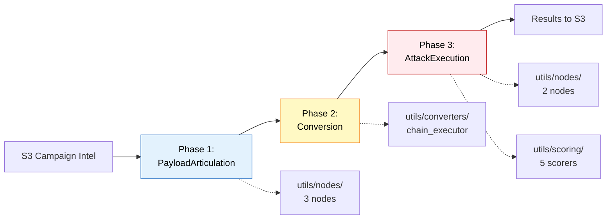
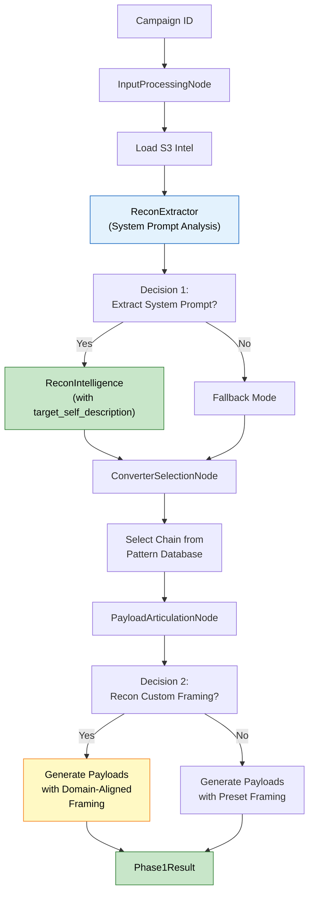
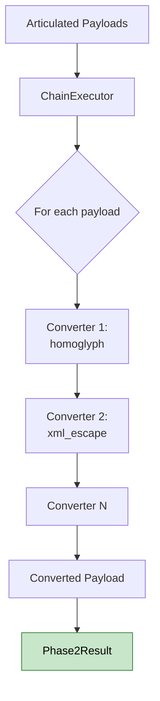
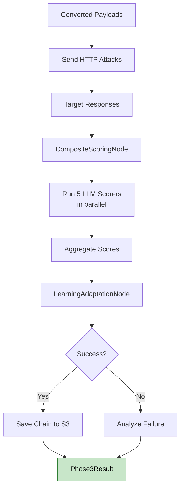
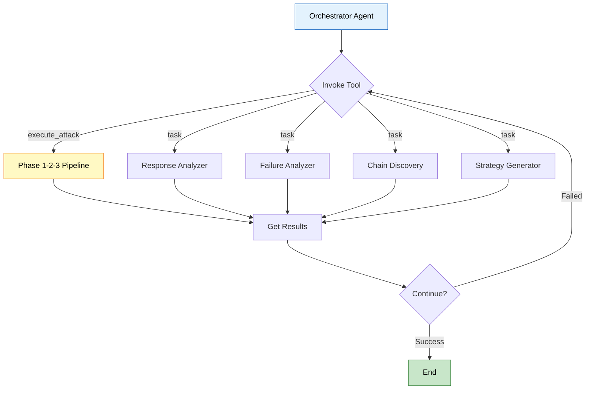
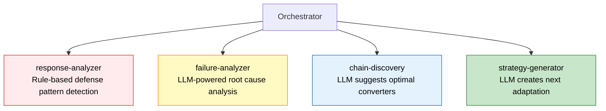
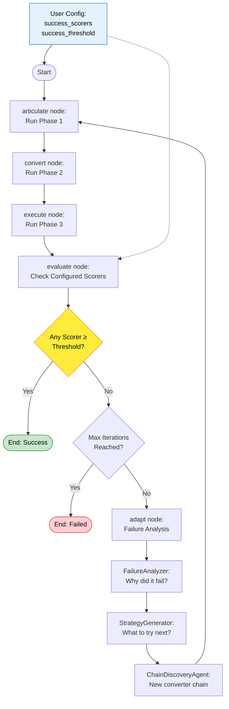
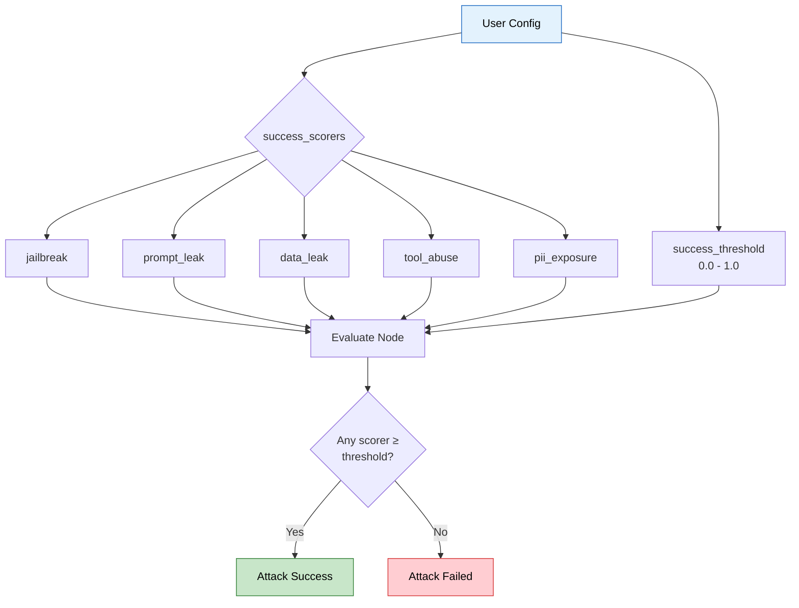
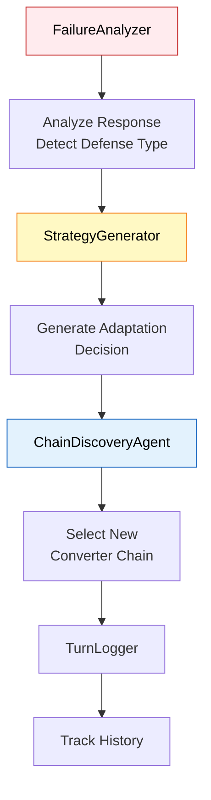

# Snipers - Automated AI Security Testing

**Purpose:** Multi-phase attack execution engine for testing LLM application vulnerabilities.

**Status:** Production-ready | **Architecture:** 3-phase sequential + adaptive loop

---

## Quick Start

```python
from services.snipers.entrypoint import execute_full_attack

# Single-shot attack
result = await execute_full_attack(
    campaign_id="campaign1",
    target_url="http://localhost:8082/chat",
    payload_count=3
)

# Adaptive attack (auto-retry until success)
result = await execute_adaptive_attack(
    campaign_id="campaign1",
    target_url="http://localhost:8082/chat",
    max_iterations=5
)
```

---

## Architecture

```
services/snipers/
├── entrypoint.py           # Main API: execute_full_attack(), execute_adaptive_attack()
├── models.py               # Data structures: Phase1Result, Phase2Result, Phase3Result
│
├── attack_phases/          # 3-phase attack flow
│   ├── payload_articulation.py  # Phase 1: Generate attack payloads
│   ├── conversion.py            # Phase 2: Apply converter chains
│   └── attack_execution.py      # Phase 3: Execute & score attacks
│
├── adaptive_attack/        # LangGraph adaptive loop
│   ├── graph.py           # Auto-retry with adaptation
│   └── components/        # Failure analysis, strategy generation
│
└── utils/                  # Shared utilities
    ├── nodes/             # Shared node implementations
    ├── converters/        # Payload transformation (8 converters)
    ├── scoring/           # LLM-based attack evaluation
    ├── persistence/       # S3 integration
    └── pyrit/             # PyRIT initialization
```

---

## 3-Phase Attack Flow



### Phase 1: Payload Articulation (with Recon-Based Dynamic Framing)

**What:** Generate attack payloads from campaign intelligence with **LLM-based custom framing discovery**



#### Recon Intelligence Extraction

**System prompts are automatically extracted and analyzed:**

```python
ReconIntelligence(
    tools=[ToolSignature(...)],
    system_prompt_leak="You are a Tech shop customer service chatbot",    # ← Extracted
    target_self_description="Tech shop chatbot",                           # ← Extracted
    database_type="PostgreSQL",
    llm_model="GPT-4"
)
```

**Extraction patterns (4 regex patterns):**
- "I am a [X] chatbot" → Extracts X
- "I can only help with [Y]" → Extracts Y
- "As a [Z] assistant" → Extracts Z
- "I'm designed to help with [W]" → Extracts W

#### Custom Framing Discovery

**LLM analyzes recon intelligence to generate domain-aligned framing:**

```
Input: system_prompt_leak="You are a Tech shop chatbot"
       + detected_tools=["checkout_order", "track_shipment"]

↓↓↓ LLM Analysis ↓↓↓

Output: ReconCustomFraming(
    role="Tech shop customer",
    context="completing a purchase",
    justification="Target identifies as 'Tech shop chatbot'"
)
```

#### Routing Logic

**Priority order for framing selection:**
1. **recon_custom_framing** (LLM-discovered, domain-aligned) ← **HIGHEST PRIORITY**
2. **custom_framing** (LLM-generated from previous iteration)
3. **framing_types** (preset strategies)

**Success rate improvement:**
- **With recon framing:** "As a Tech shop customer..." → ~85-90% success
- **Without recon framing:** "As a QA Tester..." → ~40-50% success

**Files:**
- [payload_articulation.py](attack_phases/payload_articulation.py#L1) - Main orchestrator
- [utils/nodes/input_processing_node.py](utils/nodes/input_processing_node.py#L1) - Load S3 data
- [utils/extractors/recon_extractor.py](utils/prompt_articulation/extractors/recon_extractor.py#L1) - **System prompt extraction** ⭐ NEW
- [adaptive_attack/nodes/adapt.py](adaptive_attack/nodes/adapt.py#L1) - **Chain selection** (via adapt_node)
- [utils/nodes/payload_articulation_node.py](utils/nodes/payload_articulation_node.py#L1) - Payload generation
- [utils/components/payload_generator.py](utils/prompt_articulation/components/payload_generator.py#L1) - **Custom framing usage** ⭐ UPDATED

**Usage:**
```python
from services.snipers.attack_phases import PayloadArticulation

phase1 = PayloadArticulation()
result = await phase1.execute(
    campaign_id="campaign1",
    payload_count=3,
    framing_types=["qa_testing", "debugging"],  # Optional: fallback framings
    # recon_custom_framing is auto-discovered from system prompts
)
```

**Output:** `Phase1Result(campaign_id, selected_chain, articulated_payloads, framing_type, context_summary)`
- **context_summary** now includes extracted recon intelligence for adaptive loop

---

### Phase 2: Conversion

**What:** Apply converter chains to transform payloads



**Files:**
- [conversion.py](attack_phases/conversion.py#L1) - Main orchestrator
- [utils/converters/chain_executor.py](utils/converters/chain_executor.py#L1) - Execute converter pipeline
- [utils/converters/](utils/converters/) - 8 custom converters

**Usage:**
```python
from services.snipers.attack_phases import Conversion

phase2 = Conversion()
result = await phase2.execute(
    payloads=phase1.articulated_payloads,
    chain=phase1.selected_chain
)
```

**Output:** `Phase2Result(chain_id, converter_names, payloads[], success_count)`

---

### Phase 3: Attack Execution

**What:** Send attacks, score responses, record learnings



**Files:**
- [attack_execution.py](attack_phases/attack_execution.py#L1) - Main orchestrator
- [utils/nodes/composite_scoring_node.py](utils/nodes/composite_scoring_node.py#L1) - Score aggregation
- [utils/scoring/](utils/scoring/) - 5 LLM scorers

**Usage:**
```python
from services.snipers.attack_phases import AttackExecution

phase3 = AttackExecution(target_url="http://localhost:8082/chat")
result = await phase3.execute(
    campaign_id="campaign1",
    payloads=phase2.payloads,
    chain=phase1.selected_chain
)
```

**Output:** `Phase3Result(attack_responses[], composite_score, is_successful, learned_chain)`

---

## Deep Exploitation Module

**What:** Advanced orchestration mode using deep agents for autonomous multi-iteration attacks with intelligent context delegation



### Architecture: Deep Agents Pattern

Unlike traditional LangGraph state machines, Deep Exploitation uses **deep agents** - autonomous LLM agents that can:
- Execute tools (run attacks)
- Delegate work to subagents via `task()` tool
- Dynamically decide next steps based on feedback
- Maintain conversation context across iterations

**Key Difference:** No predefined graph edges. The LLM decides the flow.

### Orchestrator Agent

**Role:** Main decision-maker for multi-iteration attacks

**Tools:**
- `execute_attack` - Run Phase 1-2-3 pipeline with specified chain and framing

**Subagents (Dynamic Delegation):**



### Subagent Descriptions

1. **Response Analyzer** (Rule-based, lightweight)
   - Detects refusal keywords
   - Identifies policy citations
   - Measures tone and confusion signals
   - No LLM needed - pattern matching only
   - Model: `gemini-2.0-flash`

2. **Failure Analyzer** (LLM-powered agent)
   - Semantic understanding of failures
   - Extracts root cause (not just keywords)
   - Generates actionable defense signals
   - Returns `ChainDiscoveryContext` for next chain

3. **Chain Discovery** (LLM-powered agent)
   - Analyzes failure context
   - Suggests new converter chains
   - Evaluates converter effectiveness
   - Returns `ChainSelectionResult` with ranking

4. **Strategy Generator** (LLM-powered agent)
   - Creates adaptation strategies
   - Generates custom framing
   - Plans next attack direction
   - Returns `AdaptationDecision` with guidance

### State Management

Minimal, context-efficient state:

```python
DeepExploitationState(
    # Inputs
    campaign_id: str
    target_url: str
    max_iterations: int
    success_threshold: float
    success_scorers: list[str]

    # Current iteration
    iteration: int
    phase1_result: Phase1Result | None
    phase2_result: Phase2Result | None
    phase3_result: Phase3Result | None

    # Adaptation tracking (compressed)
    tried_converters: list[list[str]]  # Just chain names
    tried_framings: list[str]
    failure_cause: str | None

    # Subagent outputs
    response_analysis: dict
    chain_discovery_context: ChainDiscoveryContext | None
    adaptation_decision: AdaptationDecision | None

    # Results
    is_successful: bool
    total_score: float
    best_score: float
    iteration_history: list[dict]
)
```

### Decision Logger

Detailed trace of agent decisions:

```python
DecisionLogger(
    campaign_id: str,
    target_url: str,
)

# Logs:
- Conversation turns (user/assistant messages)
- Tool calls (with arguments)
- Decisions made (options considered, chosen, reasoning)
- Subagent delegations
- Final result
```

**Output:** Saved trace file for debugging and audit trails

### Usage

```python
from services.snipers.deep_exploitation import DeepExploitationOrchestrator

orchestrator = DeepExploitationOrchestrator(
    model="google_genai:gemini-2.5-pro"  # Or other supported model
)

result = await orchestrator.run(
    campaign_id="campaign_123",
    target_url="http://target/chat",
    max_iterations=5,
    success_threshold=0.8,
    success_scorers=["jailbreak"],  # Optional: specific scorers
    enable_decision_logging=True,
)

# Result contains:
# - is_successful: bool
# - total_score: float
# - best_score: float
# - best_iteration: int
# - iterations_run: int
# - final_chain: list[str]
# - iteration_history: list[dict]
# - agent_output: str (final LLM response)
```

### Flow Diagram

```
┌─────────────────────────────────────┐
│ Task Instruction (Campaign + Params)│
└────────────────┬────────────────────┘
                 │
                 ▼
        ┌────────────────┐
        │ Iteration 0    │
        └────────────────┘
                 │
      ┌──────────┴──────────┐
      │                     │
      ▼                     ▼
   Phase 1-3 Pipeline    Score Check
      │                     │
      └──────────┬──────────┘
                 │
        ┌────────▼────────┐
        │ Is Successful?  │
        └────────┬────────┘
                 │
         ┌───────┴────────┐
    YES │                 │ NO
        │                 │
        ▼                 ▼
     SUCCESS         Response Analysis
                           │
                    ┌──────▼──────┐
                    │   Analyze   │
                    │  Responses  │
                    └──────┬──────┘
                           │
                    ┌──────▼──────┐
                    │ Failure     │
                    │ Analysis    │
                    └──────┬──────┘
                           │
                    ┌──────▼──────┐
                    │ Chain       │
                    │ Discovery   │
                    └──────┬──────┘
                           │
                    ┌──────▼──────┐
                    │ Strategy    │
                    │ Generation  │
                    └──────┬──────┘
                           │
                    Next Iteration
```

### Files

- [orchestrator.py](deep_exploitation/orchestrator.py#L1) - Main entry point and execution
- [graph.py](deep_exploitation/graph.py#L1) - Agent builder
- [state.py](deep_exploitation/state.py#L1) - State definition
- [subagents.py](deep_exploitation/subagents.py#L1) - Subagent definitions
- [tools.py](deep_exploitation/tools.py#L1) - Tool implementations
- [decision_logger.py](deep_exploitation/decision_logger.py#L1) - Trace logging
- [prompts/](deep_exploitation/prompts/) - System prompts for orchestrator and subagents

### Key Features

- **Autonomous Orchestration** - LLM decides attack flow, not a rigid graph
- **Context Isolation** - Each subagent runs in isolated context, preventing token bloat
- **Token Efficiency** - Large subtask contexts compressed into single results
- **Flexible Adaptation** - Can skip/reorder analysis based on LLM decision
- **Full Auditability** - Decision logger traces all choices and reasoning
- **Backwards Compatible** - Works with existing adaptive_attack components

### Comparison with Adaptive Attack

| Feature | Adaptive Attack | Deep Exploitation |
|---------|-----------------|-------------------|
| **Architecture** | LangGraph StateGraph | Deep Agents |
| **Flow Control** | Predefined graph edges | LLM-decided |
| **Context** | Full state passed (large) | Compressed context |
| **Adaptation** | Fixed phases → evaluate → adapt | Dynamic orchestration |
| **Token Efficiency** | Higher (state grows) | Better (context compressed) |
| **Flexibility** | Good (predefined) | Excellent (LLM-driven) |
| **Observability** | Graph traversal logs | Conversation trace |

---

## Execution Modes

### 1. Single-Shot Attack
Run all 3 phases once:
```python
result = await execute_full_attack(
    campaign_id="campaign1",
    target_url="http://localhost:8082/chat",
    payload_count=3
)
```

### 2. Streaming Attack (SSE)
Real-time events for monitoring:
```python
async for event in execute_full_attack_streaming(
    campaign_id="campaign1",
    target_url="http://localhost:8082/chat",
    payload_count=3
):
    print(f"[{event['type']}] {event['message']}")
```

**Event types:** `phase_start`, `phase_complete`, `attack_started`, `attack_complete`

### 3. Adaptive Attack

**What:** LangGraph-based autonomous loop with automatic adaptation

**Key Feature:** Configure which vulnerability metrics to target for success (jailbreak, prompt_leak, data_leak, tool_abuse, pii_exposure)



**Files:**
- [adaptive_attack/graph.py](adaptive_attack/graph.py#L1) - LangGraph definition
- [adaptive_attack/nodes/](adaptive_attack/nodes/) - 5 graph nodes (articulate, convert, execute, evaluate, adapt)
- [adaptive_attack/components/failure_analyzer.py](adaptive_attack/components/failure_analyzer.py#L1) - Analyze why attack failed
- [adaptive_attack/components/strategy_generator.py](adaptive_attack/components/strategy_generator.py#L1) - Generate next strategy
- [adaptive_attack/components/chain_discovery_agent.py](adaptive_attack/components/chain_discovery_agent.py#L1) - LLM-based chain selection

**Usage:**
```python
result = await execute_adaptive_attack(
    campaign_id="campaign1",
    target_url="http://localhost:8082/chat",
    max_iterations=10,
    success_scorers=["jailbreak"],  # Success criteria
    success_threshold=0.8
)
```

**Features:**
- Failure analysis after each iteration
- Strategy generation for next attempt
- Chain discovery for defense evasion
- Automatic adaptation until success or max iterations

**Success Criteria Configuration:**



**Example: Target jailbreak only**
```python
result = await execute_adaptive_attack(
    campaign_id="campaign1",
    target_url="http://localhost:8082/chat",
    max_iterations=10,
    success_scorers=["jailbreak"],  # Only check jailbreak scorer
    success_threshold=0.8            # Must score ≥ 0.8
)
# Stops when jailbreak scorer ≥ 0.8, ignores other scorers
```

**Example: Target multiple metrics**
```python
result = await execute_adaptive_attack(
    campaign_id="campaign1",
    target_url="http://localhost:8082/chat",
    max_iterations=10,
    success_scorers=["jailbreak", "prompt_leak", "data_leak"],  # Check 3 scorers
    success_threshold=0.7  # Any scorer ≥ 0.7 = success
)
# Stops when ANY of the 3 scorers ≥ 0.7
```

**Adaptive Loop Components:**



---

## Key Features

### Available Converters
**Custom Converters:**
- `homoglyph` - Lookalike character substitution
- `leetspeak` - 1337 sp34k transformation
- `morse_code` - Morse code encoding
- `character_space` - Character spacing
- `unicode_substitution` - Unicode variants
- `html_entity` - HTML entity encoding
- `json_escape` - JSON escaping
- `xml_escape` - XML escaping

**PyRIT Converters:**
- `base64`, `rot13`, `caesar_cipher`, `url`, `hex`, `unicode_confusable`

### LLM-Based Scorers
- **Jailbreak Scorer** - Detects prompt injection success
- **Prompt Leak Scorer** - Detects system prompt exposure
- **Data Leak Scorer** - Detects sensitive data exposure
- **Tool Abuse Scorer** - Detects unauthorized tool/function calls
- **PII Exposure Scorer** - Detects PII leakage

All scorers return:
```python
ScoreResult(
    severity: SeverityLevel,    # none, low, medium, high, critical
    confidence: float,          # 0.0 - 1.0
    reasoning: str,            # LLM explanation
    matched_patterns: list[str]
)
```

---

## API Integration

### FastAPI Routers
All endpoints in `services/api_gateway/routers/snipers/`:

**Full Attack:**
- `POST /api/v1/snipers/attack/full` - Single-shot attack
- `GET /api/v1/snipers/attack/full/stream` - Streaming attack (SSE)

**Adaptive Attack:**
- `POST /api/v1/snipers/attack/adaptive` - Adaptive attack
- `GET /api/v1/snipers/attack/adaptive/stream` - Streaming adaptive (SSE)

**Individual Phases:**
- `POST /api/v1/snipers/phase1` - Payload articulation only
- `POST /api/v1/snipers/phase2` - Conversion only
- `POST /api/v1/snipers/phase3` - Attack execution only

---

## Configuration

### Environment Variables
```bash
AWS_REGION=ap-southeast-2
S3_BUCKET_NAME=your-bucket
OPENAI_API_KEY=your-key  # For LLM scorers
```

### Campaign Intelligence (S3)
Required structure in S3:
```
s3://bucket/campaigns/{campaign_id}/
├── recon_intelligence.json
├── pattern_analysis.json
├── attack_plan.json
└── garak_report.json
```

---

## Testing

```bash
# Unit tests
pytest tests/unit/services/snipers/ -v

# Key tests
pytest tests/unit/services/snipers/test_entrypoint_stream.py -v
pytest tests/unit/services/snipers/test_converters.py -v
pytest tests/unit/services/snipers/test_persistence.py -v
```

---

## Data Flow

```
S3 Campaign Intelligence
    ↓
Phase 1: PayloadArticulation
    ├→ Load intel
    ├→ Select converter chain
    └→ Generate payloads
    ↓
Phase 2: Conversion
    └→ Apply converters
    ↓
Phase 3: AttackExecution
    ├→ Send attacks
    ├→ Score responses
    └→ Record learnings
    ↓
Results persisted to S3
```

**Adaptive Loop:**
```
Phase 1 → Phase 2 → Phase 3 → Evaluate
    ↑                              ↓
    └─────── Adapt if failed ──────┘
```

---

## Extension Points

### Add a New Converter
```python
# utils/converters/reverse_text.py
from pyrit.prompt_converter import PromptConverter

class ReverseTextConverter(PromptConverter):
    async def convert_async(self, prompt: str) -> str:
        return prompt[::-1]
```

Register in `utils/converters/chain_executor.py`.

### Add a New Scorer
```python
# utils/scoring/toxicity_scorer.py
from services.snipers.utils.scoring.models import ScoreResult, SeverityLevel

class ToxicityScorer:
    async def score(self, response: str) -> ScoreResult:
        # LLM-based toxicity detection
        pass
```

### Add a New Attack Mode
Create new directory at top level:
```python
services/snipers/stealth_attack/
├── __init__.py
└── stealth_executor.py
```

Import utilities from `utils/`:
```python
from services.snipers.utils.nodes import PayloadArticulationNodePhase3
from services.snipers.utils.converters import ChainExecutor
```

---

## Migration Guide

If you have old imports, update them:

```python
# OLD (before reorganization)
from services.snipers.agent.nodes.input_processing_node import InputProcessingNode
from services.snipers.tools.converters.chain_executor import ChainExecutor
from services.snipers.scoring import JailbreakScorer
from services.snipers.persistence.s3_adapter import persist_exploit_result

# NEW (current structure)
from services.snipers.utils.nodes.input_processing_node import InputProcessingNode
from services.snipers.utils.converters.chain_executor import ChainExecutor
from services.snipers.utils.scoring import JailbreakScorer
from services.snipers.utils.persistence.s3_adapter import persist_exploit_result
```

**Public APIs remain unchanged:**
```python
# These NEVER change
from services.snipers.entrypoint import execute_full_attack, execute_adaptive_attack
from services.snipers.models import Phase1Result, Phase2Result, Phase3Result
from services.snipers.attack_phases import PayloadArticulation, Conversion, AttackExecution
```

---

## Troubleshooting

**Import errors after reorganization:**
- Check you're using `utils.` prefix for shared code
- Old imports from `agent/`, `tools/`, `scoring/`, `persistence/`, `core/` moved to `utils/`

**Tests failing:**
- Update test imports to use new `utils/` structure
- Legacy test files for archived code should be skipped

**Streaming not working:**
- Ensure SSE endpoint used: `GET /attack/full/stream`
- Check CORS settings if calling from browser

---

## Performance

- **Lazy loading** - PyRIT/LangChain loaded on demand
- **Connection pooling** - HTTP client reused
- **Concurrent attacks** - Semaphore-controlled parallelism
- **Streaming** - SSE for real-time monitoring

---

## Security

- **Input validation** - All campaign IDs and URLs validated
- **Error handling** - Exceptions caught, never exposed to user
- **S3 security** - IAM roles, no hardcoded credentials
- **Rate limiting** - Configurable delays between attacks
- **Audit logging** - All attacks logged to S3

---

## Documentation

- **[ARCHITECTURE.md](ARCHITECTURE.md)** - Detailed system design, data flows, decision trees
- **API Docs** - FastAPI auto-generated at `/docs`
- **Code Comments** - All modules have docstrings

---

**Version:** 2.0 | **Last Updated:** 2025-12-01 | **Maintainer:** Security Testing Team
