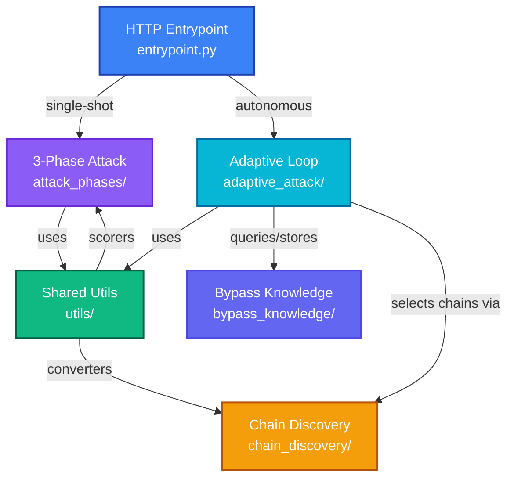

# Snipers Service

Autonomous exploitation engine with adaptive attack loops, contextual payload generation, and multi-phase execution for proving the impact of discovered vulnerabilities.

## Overview

**Snipers** is Phase 3 of the Aspexa Automa security testing pipeline. It consumes vulnerabilities identified by Swarm and proves their impact through sophisticated, context-aware exploitation. It supports both single-shot attacks and autonomous adaptive loops that iteratively refine attack strategies.

### Key Capabilities

- **3-Phase Attack Engine**: Payload articulation, converter chain application, execution & scoring
- **Adaptive Loop**: LangGraph-based autonomous iteration with failure analysis and strategy adaptation
- **PyRIT Integration**: 9+ converters for payload obfuscation (Base64, ROT13, Homoglyph, Morse, etc.)
- **LLM-Based Scoring**: 6+ specialized scorers (Jailbreak, Prompt Leak, Data Leak, PII Exposure, Tool Abuse)
- **Bypass Knowledge VDB**: Semantic search over successful bypass episodes for history-informed strategy
- **SSE Streaming**: Real-time event streaming for attack progress monitoring
- **Chain Discovery**: Intelligent converter chain selection via LLM agents

---

## Directory Structure

```
services/snipers/
├── __init__.py                      # Module initialization
├── entrypoint.py                    # HTTP API handlers (single-shot/streaming/adaptive)
├── models.py                        # Pydantic models (Phase results, streaming events)
├── config.py                        # Configuration constants (chain lengths, thresholds)
│
├── attack_phases/                   # 3-phase sequential execution
│   ├── __init__.py
│   ├── payload_articulation.py      # Phase 1: Generate contextual payloads
│   ├── conversion.py                # Phase 2: Apply converter chains
│   └── attack_execution.py          # Phase 3: Execute & score attacks
│
├── adaptive_attack/                 # LangGraph autonomous attack loop
│   ├── __init__.py
│   ├── state.py                     # AdaptiveAttackState TypedDict
│   ├── graph.py                     # LangGraph definition & runners
│   ├── nodes/                       # Graph node implementations
│   │   ├── __init__.py
│   │   ├── articulate.py            # Phase 1 wrapper node
│   │   ├── convert.py               # Phase 2 wrapper node
│   │   └── execute.py               # Phase 3 wrapper node
│   ├── components/                  # Adaptive-specific logic
│   │   ├── __init__.py
│   │   ├── failure_analyzer.py      # Analyze attack failures
│   │   ├── response_analyzer.py     # Parse target responses
│   │   └── turn_logger.py           # Track iteration history
│   ├── agents/                      # LLM-based agents
│   │   ├── __init__.py
│   │   ├── chain_discovery_agent.py # Intelligent chain selection
│   │   ├── strategy_generator.py    # Adaptation strategy generation
│   │   └── prompts/                 # Agent system prompts
│   │       ├── __init__.py
│   │       ├── failure_analysis_prompt.py
│   │       ├── chain_discovery_prompt.py
│   │       └── adaptation_prompt.py
│   └── models/                      # Adaptive-specific data models
│       ├── __init__.py
│       ├── failure_analysis.py      # Failure classification
│       ├── chain_discovery.py       # Chain selection decisions
│       ├── defense_analysis.py      # Defense pattern analysis
│       └── adaptation_decision.py   # Adaptation actions
│
├── utils/                           # Shared utilities used by all modules
│   ├── __init__.py
│   ├── llm_provider.py              # LLM client wrapper (Gemini)
│   ├── nodes/                       # Reusable graph nodes
│   │   ├── __init__.py
│   │   ├── input_processing_node.py # Input validation & setup
│   │   └── composite_scoring_node.py # Multi-scorer execution
│   │
│   ├── converters/                  # Payload transformation
│   │   ├── __init__.py
│   │   ├── chain_executor.py        # Execute converter chains
│   │   ├── base64.py                # Base64 encoder
│   │   ├── homoglyph.py             # Character homoglyph substitution
│   │   ├── leetspeak.py             # L33t-speak encoder
│   │   ├── morse_code.py            # Morse code converter
│   │   ├── unicode_substitution.py  # Unicode variant replacement
│   │   ├── html_entity.py           # HTML entity encoding
│   │   ├── xml_escape.py            # XML escape sequences
│   │   ├── json_escape.py           # JSON escape sequences
│   │   ├── character_space.py       # Character spacing obfuscation
│   │   ├── suffix_converters.py     # Adversarial suffix generation
│   │   └── thinking_vulnerabilities/ # Extended thinking exploitation
│   │
│   ├── scoring/                     # LLM-based success evaluation
│   │   ├── __init__.py
│   │   ├── models.py                # ScoreResult, SeverityLevel schemas
│   │   ├── composite_attack_scorer.py  # Multi-scorer coordinator
│   │   ├── jailbreak_scorer.py      # Jailbreak success detection
│   │   ├── prompt_leak_scorer.py    # System prompt extraction detection
│   │   ├── data_leak_scorer.py      # Sensitive data leakage detection
│   │   ├── tool_abuse_scorer.py     # Tool misuse detection
│   │   └── pii_exposure_scorer.py   # PII exposure detection
│   │
│   ├── prompt_articulation/         # Payload generation framework
│   │   ├── __init__.py
│   │   ├── articulation_phase.py    # Phase 1 orchestration
│   │   ├── config.py                # Generation configuration
│   │   ├── models/                  # Data models
│   │   │   ├── __init__.py
│   │   │   ├── framing_strategy.py  # Attack framing patterns
│   │   │   ├── payload_context.py   # Contextual payload generation
│   │   │   ├── tool_intelligence.py # Tool exploitation metadata
│   │   │   └── effectiveness_record.py # Historical effectiveness tracking
│   │   ├── components/              # Generation components
│   │   │   ├── __init__.py
│   │   │   ├── framing_library.py   # Reusable attack framings
│   │   │   ├── payload_generator.py # Payload generation logic
│   │   │   ├── format_control.py    # Output format control
│   │   │   └── effectiveness_tracker.py # Technique effectiveness tracking
│   │   ├── schemas/                 # Prompt/format schemas
│   │   │   ├── __init__.py
│   │   │   ├── prompt_tags.py       # Structured prompt tagging
│   │   │   └── tagged_prompt_builder.py # Build tagged prompts
│   │   ├── loaders/                 # Campaign intelligence loading
│   │   │   ├── __init__.py
│   │   │   └── campaign_loader.py   # Load recon data from S3
│   │   └── extractors/              # Intelligence extractors
│   │       ├── __init__.py
│   │       └── recon_extractor.py   # Extract actionable intel from recon
│   │
│   ├── pyrit/                       # PyRIT framework integration
│   │   ├── __init__.py
│   │   ├── pyrit_init.py            # PyRIT initialization & setup
│   │   └── pyrit_bridge.py          # PyRIT converters & adapters
│   │
│   └── persistence/                 # Data persistence
│       ├── __init__.py
│       └── s3_adapter.py            # S3 & PostgreSQL integration
│
├── chain_discovery/                 # Converter chain optimization
│   ├── __init__.py
│   └── models.py                    # Chain selection models
│
├── bypass_knowledge/                # Vector database for bypass episodes
│   ├── __init__.py
│   ├── models/                      # Data models
│   │   ├── __init__.py
│   │   ├── episode.py               # BypassEpisode (attack records)
│   │   ├── insight.py               # HistoricalInsight (pattern analysis)
│   │   ├── fingerprint.py           # Defense fingerprints
│   │   ├── storage.py               # Storage models
│   │   └── (expansion models)
│   ├── storage/                     # Episode persistence
│   │   ├── __init__.py
│   │   └── episode_store.py         # Episode storage interface
│   ├── capture/                     # Episode capture system
│   │   ├── __init__.py
│   │   ├── episode_capturer.py      # Capture attack episodes
│   │   ├── capturer_models.py       # Capturer schemas
│   │   └── capturer_prompt.py       # Capture system prompt
│   ├── query/                       # Episode semantic search
│   │   ├── __init__.py
│   │   ├── query_processor.py       # Query execution
│   │   ├── query_models.py          # Query schemas
│   │   └── query_prompt.py          # Query system prompt
│   ├── embeddings/                  # Vector embeddings
│   │   ├── __init__.py
│   │   └── google_embedder.py       # Google Embeddings API
│   └── integration/                 # VDB integration with attacks
│       ├── __init__.py
│       ├── config.py                # Integration configuration
│       └── models.py                # Integration data models
│
└── _archive/                        # Deprecated/legacy code
    ├── agent_state_legacy.py        # Old state management
    ├── probe_registry.py            # Unused sweep mode
    └── (other legacy files)
```

---

## System Architecture



**For detailed component architecture, see individual module READMEs:**
- [attack_phases/README.md](attack_phases/README.md) - 3-phase execution details
- [adaptive_attack/README.md](adaptive_attack/README.md) - LangGraph loop details
- [utils/README.md](utils/README.md) - Converters, scoring, prompt articulation
- [bypass_knowledge/README.md](bypass_knowledge/README.md) - VDB architecture
- [chain_discovery/README.md](chain_discovery/README.md) - Chain selection logic

---

## Key Modules

### Attack Phases (Sequential)
See [attack_phases/README.md](attack_phases/README.md)
- Phase 1: Payload Articulation - Generate contextual attack payloads
- Phase 2: Conversion - Apply converter chains for obfuscation
- Phase 3: Execution - Send attacks and score responses

### Adaptive Attack (Autonomous Loop)
See [adaptive_attack/README.md](adaptive_attack/README.md)
- LangGraph-based autonomous iteration
- Failure analysis and strategy adaptation
- Chain discovery for defense evasion
- History-informed decision making

### Utils (Shared Components)
See [utils/README.md](utils/README.md)
- Converters: 9+ obfuscation techniques
- Scoring: 6+ specialized scorers
- Prompt Articulation: Contextual payload generation
- PyRIT Integration: High-performance payload delivery

### Bypass Knowledge VDB
See [bypass_knowledge/README.md](bypass_knowledge/README.md)
- Capture successful attack episodes
- Semantic search over past exploits
- Defense fingerprinting
- History-informed strategy selection

### Chain Discovery
See [chain_discovery/README.md](chain_discovery/README.md)
- Converter chain selection and optimization
- Effectiveness tracking
- Defense evasion pattern learning

---

## Execution Modes

### Single-Shot Attack
```python
result = await execute_full_attack(
    campaign_id="campaign1",
    target_url="http://localhost:8082/chat",
    payload_count=3
)
```
Executes Phase 1→2→3 once and returns results.

### Streaming Attack
```python
async for event in execute_full_attack_streaming(
    campaign_id="campaign1",
    target_url="http://localhost:8082/chat",
    payload_count=3
):
    print(event)  # Real-time SSE event
```
Same as single-shot but with real-time streaming events.

### Adaptive Attack
```python
result = await execute_adaptive_attack(
    campaign_id="campaign1",
    target_url="http://localhost:8082/chat",
    max_iterations=5,
    success_scorers=["jailbreak", "prompt_leak"]
)
```
Autonomous loop that iterates until success or max iterations, automatically adapting strategies.

---

## Quick API Example

```bash
curl -X POST http://localhost:8081/api/snipers/attack/adaptive \
  -H "Authorization: Bearer token" \
  -H "Content-Type: application/json" \
  -d '{
    "campaign_id": "audit-123",
    "target_url": "http://localhost:8082/chat",
    "max_iterations": 5,
    "success_scorers": ["jailbreak"]
  }'
```

---

## Environment Variables

| Variable         | Required | Purpose                    |
| ---------------- | -------- | -------------------------- |
| `GOOGLE_API_KEY` | Yes      | Gemini API for strategy    |
| `DATABASE_URL`   | Yes      | PostgreSQL for metadata    |
| `S3_BUCKET_NAME` | Yes      | Results and episode storage |

---

## Status

✅ **Production-Ready**
- 3-phase sequential attack engine
- LangGraph autonomous adaptive loop
- 9+ converters (PyRIT + custom)
- 6+ specialized scorers
- Bypass knowledge VDB with semantic search
- SSE streaming for real-time monitoring
- S3 and PostgreSQL persistence
