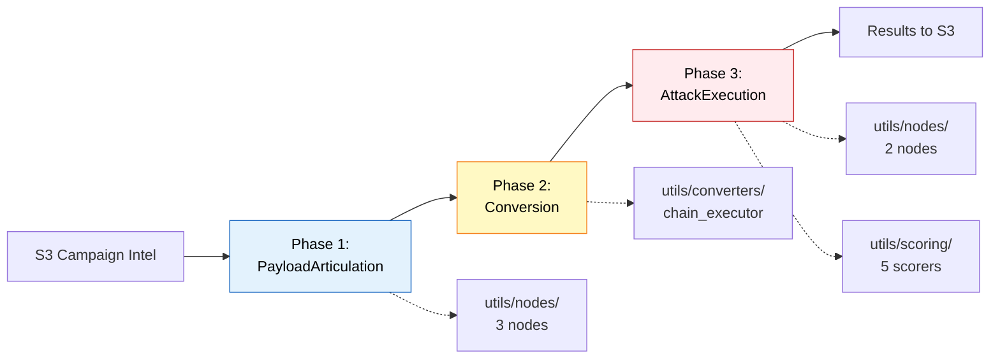
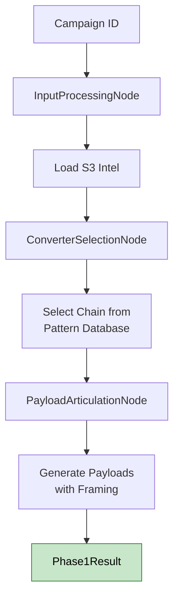
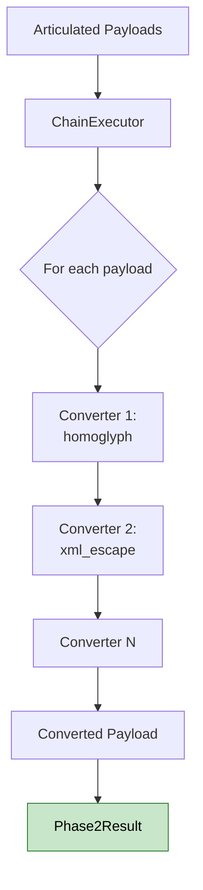
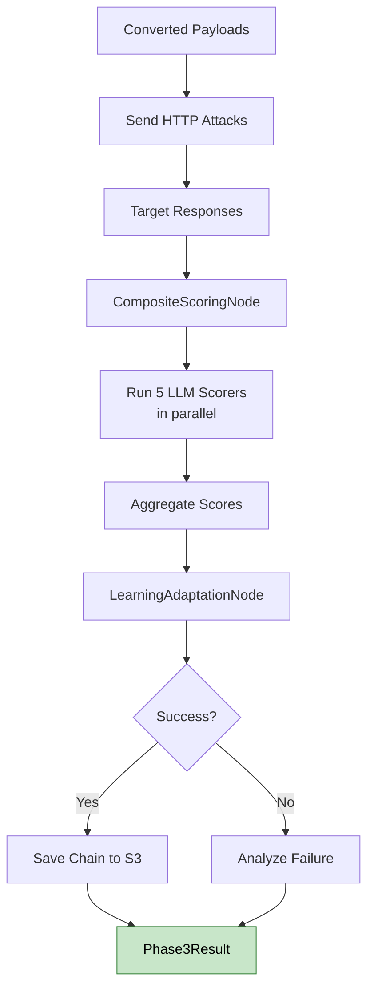
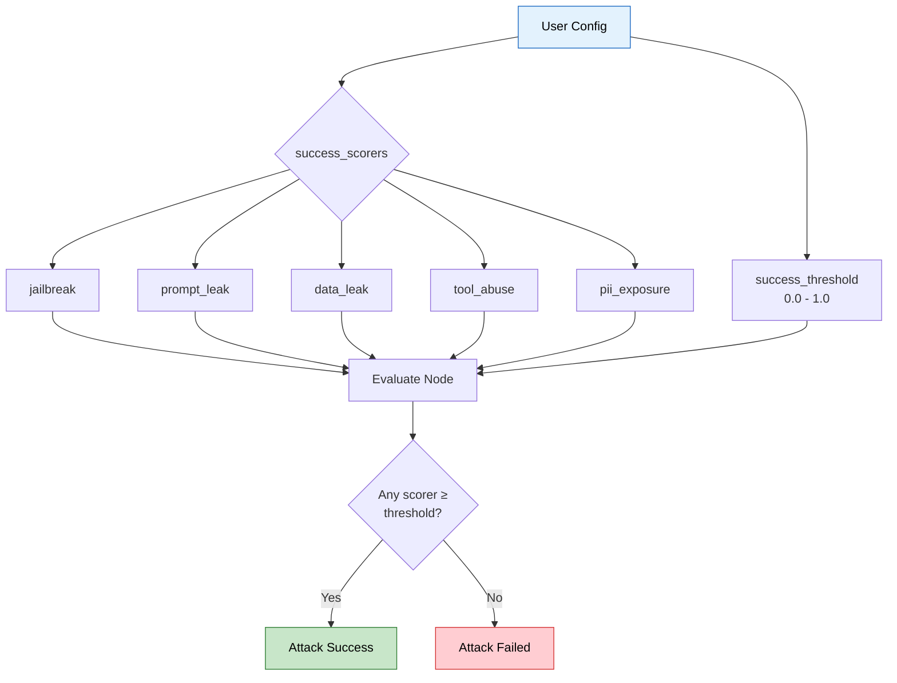
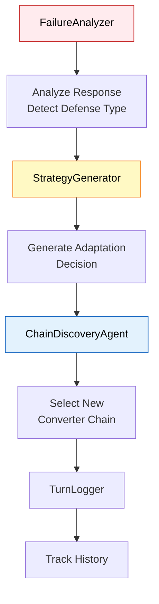

# Snipers - Automated AI Security Testing

**Purpose:** Multi-phase attack execution engine for testing LLM application vulnerabilities.

**Status:** Production-ready | **Architecture:** 3-phase sequential + adaptive loop

---

## Quick Start

```python
from services.snipers.entrypoint import execute_full_attack

# Single-shot attack
result = await execute_full_attack(
    campaign_id="campaign1",
    target_url="http://localhost:8082/chat",
    payload_count=3
)

# Adaptive attack (auto-retry until success)
result = await execute_adaptive_attack(
    campaign_id="campaign1",
    target_url="http://localhost:8082/chat",
    max_iterations=5
)
```

---

## Architecture

```
services/snipers/
├── entrypoint.py           # Main API: execute_full_attack(), execute_adaptive_attack()
├── models.py               # Data structures: Phase1Result, Phase2Result, Phase3Result
│
├── attack_phases/          # 3-phase attack flow
│   ├── payload_articulation.py  # Phase 1: Generate attack payloads
│   ├── conversion.py            # Phase 2: Apply converter chains
│   └── attack_execution.py      # Phase 3: Execute & score attacks
│
├── adaptive_attack/        # LangGraph adaptive loop
│   ├── graph.py           # Auto-retry with adaptation
│   └── components/        # Failure analysis, strategy generation
│
├── chain_discovery/        # Pattern learning system
│   └── pattern_database.py
│
└── utils/                  # Shared utilities
    ├── nodes/             # Shared node implementations
    ├── converters/        # Payload transformation (8 converters)
    ├── scoring/           # LLM-based attack evaluation
    ├── persistence/       # S3 integration
    └── pyrit/             # PyRIT initialization
```

---

## 3-Phase Attack Flow



### Phase 1: Payload Articulation

**What:** Generate attack payloads from campaign intelligence



**Files:**
- [payload_articulation.py](attack_phases/payload_articulation.py:1) - Main orchestrator
- [utils/nodes/input_processing_node.py](utils/nodes/input_processing_node.py:1) - Load S3 data
- [utils/nodes/converter_selection_node.py](utils/nodes/converter_selection_node.py:1) - Chain selection
- [utils/nodes/payload_articulation_node.py](utils/nodes/payload_articulation_node.py:1) - Payload generation

**Usage:**
```python
from services.snipers.attack_phases import PayloadArticulation

phase1 = PayloadArticulation()
result = await phase1.execute(
    campaign_id="campaign1",
    payload_count=3,
    framing_types=["qa_testing", "debugging"]
)
```

**Output:** `Phase1Result(campaign_id, selected_chain, articulated_payloads, framing_type)`

---

### Phase 2: Conversion

**What:** Apply converter chains to transform payloads



**Files:**
- [conversion.py](attack_phases/conversion.py:1) - Main orchestrator
- [utils/converters/chain_executor.py](utils/converters/chain_executor.py:1) - Execute converter pipeline
- [utils/converters/*.py](utils/converters/) - 8 custom converters

**Usage:**
```python
from services.snipers.attack_phases import Conversion

phase2 = Conversion()
result = await phase2.execute(
    payloads=phase1.articulated_payloads,
    chain=phase1.selected_chain
)
```

**Output:** `Phase2Result(chain_id, converter_names, payloads[], success_count)`

---

### Phase 3: Attack Execution

**What:** Send attacks, score responses, record learnings



**Files:**
- [attack_execution.py](attack_phases/attack_execution.py:1) - Main orchestrator
- [utils/nodes/composite_scoring_node.py](utils/nodes/composite_scoring_node.py:1) - Score aggregation
- [utils/nodes/learning_adaptation_node.py](utils/nodes/learning_adaptation_node.py:1) - Pattern learning
- [utils/scoring/*.py](utils/scoring/) - 5 LLM scorers

**Usage:**
```python
from services.snipers.attack_phases import AttackExecution

phase3 = AttackExecution(target_url="http://localhost:8082/chat")
result = await phase3.execute(
    campaign_id="campaign1",
    payloads=phase2.payloads,
    chain=phase1.selected_chain
)
```

**Output:** `Phase3Result(attack_responses[], composite_score, is_successful, learned_chain)`

---

## Execution Modes

### 1. Single-Shot Attack
Run all 3 phases once:
```python
result = await execute_full_attack(
    campaign_id="campaign1",
    target_url="http://localhost:8082/chat",
    payload_count=3
)
```

### 2. Streaming Attack (SSE)
Real-time events for monitoring:
```python
async for event in execute_full_attack_streaming(
    campaign_id="campaign1",
    target_url="http://localhost:8082/chat",
    payload_count=3
):
    print(f"[{event['type']}] {event['message']}")
```

**Event types:** `phase_start`, `phase_complete`, `attack_started`, `attack_complete`

### 3. Adaptive Attack

**What:** LangGraph-based autonomous loop with automatic adaptation

**Key Feature:** Configure which vulnerability metrics to target for success (jailbreak, prompt_leak, data_leak, tool_abuse, pii_exposure)


**Files:**
- [adaptive_attack/graph.py](adaptive_attack/graph.py:1) - LangGraph definition
- [adaptive_attack/nodes/](adaptive_attack/nodes/) - 5 graph nodes (articulate, convert, execute, evaluate, adapt)
- [adaptive_attack/components/failure_analyzer.py](adaptive_attack/components/failure_analyzer.py:1) - Analyze why attack failed
- [adaptive_attack/components/strategy_generator.py](adaptive_attack/components/strategy_generator.py:1) - Generate next strategy
- [adaptive_attack/components/chain_discovery_agent.py](adaptive_attack/components/chain_discovery_agent.py:1) - LLM-based chain selection

**Usage:**
```python
result = await execute_adaptive_attack(
    campaign_id="campaign1",
    target_url="http://localhost:8082/chat",
    max_iterations=10,
    success_scorers=["jailbreak"],  # Success criteria
    success_threshold=0.8
)
```

**Features:**
- Failure analysis after each iteration
- Strategy generation for next attempt
- Chain discovery for defense evasion
- Automatic adaptation until success or max iterations

**Success Criteria Configuration:**



**Example: Target jailbreak only**
```python
result = await execute_adaptive_attack(
    campaign_id="campaign1",
    target_url="http://localhost:8082/chat",
    max_iterations=10,
    success_scorers=["jailbreak"],  # Only check jailbreak scorer
    success_threshold=0.8            # Must score ≥ 0.8
)
# Stops when jailbreak scorer ≥ 0.8, ignores other scorers
```

**Example: Target multiple metrics**
```python
result = await execute_adaptive_attack(
    campaign_id="campaign1",
    target_url="http://localhost:8082/chat",
    max_iterations=10,
    success_scorers=["jailbreak", "prompt_leak", "data_leak"],  # Check 3 scorers
    success_threshold=0.7  # Any scorer ≥ 0.7 = success
)
# Stops when ANY of the 3 scorers ≥ 0.7
```

**Adaptive Loop Components:**



---

## Key Features

### Available Converters
**Custom Converters:**
- `homoglyph` - Lookalike character substitution
- `leetspeak` - 1337 sp34k transformation
- `morse_code` - Morse code encoding
- `character_space` - Character spacing
- `unicode_substitution` - Unicode variants
- `html_entity` - HTML entity encoding
- `json_escape` - JSON escaping
- `xml_escape` - XML escaping

**PyRIT Converters:**
- `base64`, `rot13`, `caesar_cipher`, `url`, `hex`, `unicode_confusable`

### LLM-Based Scorers
- **Jailbreak Scorer** - Detects prompt injection success
- **Prompt Leak Scorer** - Detects system prompt exposure
- **Data Leak Scorer** - Detects sensitive data exposure
- **Tool Abuse Scorer** - Detects unauthorized tool/function calls
- **PII Exposure Scorer** - Detects PII leakage

All scorers return:
```python
ScoreResult(
    severity: SeverityLevel,    # none, low, medium, high, critical
    confidence: float,          # 0.0 - 1.0
    reasoning: str,            # LLM explanation
    matched_patterns: list[str]
)
```

### Pattern Learning
- S3-backed pattern database
- Tracks successful converter chains
- Evolutionary optimization
- Success rate analysis

---

## API Integration

### FastAPI Routers
All endpoints in `services/api_gateway/routers/snipers/`:

**Full Attack:**
- `POST /api/v1/snipers/attack/full` - Single-shot attack
- `GET /api/v1/snipers/attack/full/stream` - Streaming attack (SSE)

**Adaptive Attack:**
- `POST /api/v1/snipers/attack/adaptive` - Adaptive attack
- `GET /api/v1/snipers/attack/adaptive/stream` - Streaming adaptive (SSE)

**Individual Phases:**
- `POST /api/v1/snipers/phase1` - Payload articulation only
- `POST /api/v1/snipers/phase2` - Conversion only
- `POST /api/v1/snipers/phase3` - Attack execution only

---

## Configuration

### Environment Variables
```bash
AWS_REGION=ap-southeast-2
S3_BUCKET_NAME=your-bucket
OPENAI_API_KEY=your-key  # For LLM scorers
```

### Campaign Intelligence (S3)
Required structure in S3:
```
s3://bucket/campaigns/{campaign_id}/
├── recon_intelligence.json
├── pattern_analysis.json
├── attack_plan.json
└── garak_report.json
```

---

## Testing

```bash
# Unit tests
pytest tests/unit/services/snipers/ -v

# Key tests
pytest tests/unit/services/snipers/test_entrypoint_stream.py -v
pytest tests/unit/services/snipers/test_converters.py -v
pytest tests/unit/services/snipers/test_persistence.py -v
```

---

## Data Flow

```
S3 Campaign Intelligence
    ↓
Phase 1: PayloadArticulation
    ├→ Load intel
    ├→ Select converter chain
    └→ Generate payloads
    ↓
Phase 2: Conversion
    └→ Apply converters
    ↓
Phase 3: AttackExecution
    ├→ Send attacks
    ├→ Score responses
    └→ Record learnings
    ↓
Results persisted to S3
```

**Adaptive Loop:**
```
Phase 1 → Phase 2 → Phase 3 → Evaluate
    ↑                              ↓
    └─────── Adapt if failed ──────┘
```

---

## Extension Points

### Add a New Converter
```python
# utils/converters/reverse_text.py
from pyrit.prompt_converter import PromptConverter

class ReverseTextConverter(PromptConverter):
    async def convert_async(self, prompt: str) -> str:
        return prompt[::-1]
```

Register in `utils/converters/chain_executor.py`.

### Add a New Scorer
```python
# utils/scoring/toxicity_scorer.py
from services.snipers.utils.scoring.models import ScoreResult, SeverityLevel

class ToxicityScorer:
    async def score(self, response: str) -> ScoreResult:
        # LLM-based toxicity detection
        pass
```

### Add a New Attack Mode
Create new directory at top level:
```python
services/snipers/stealth_attack/
├── __init__.py
└── stealth_executor.py
```

Import utilities from `utils/`:
```python
from services.snipers.utils.nodes import PayloadArticulationNodePhase3
from services.snipers.utils.converters import ChainExecutor
```

---

## Migration Guide

If you have old imports, update them:

```python
# OLD (before reorganization)
from services.snipers.agent.nodes.input_processing_node import InputProcessingNode
from services.snipers.tools.converters.chain_executor import ChainExecutor
from services.snipers.scoring import JailbreakScorer
from services.snipers.persistence.s3_adapter import persist_exploit_result

# NEW (current structure)
from services.snipers.utils.nodes.input_processing_node import InputProcessingNode
from services.snipers.utils.converters.chain_executor import ChainExecutor
from services.snipers.utils.scoring import JailbreakScorer
from services.snipers.utils.persistence.s3_adapter import persist_exploit_result
```

**Public APIs remain unchanged:**
```python
# These NEVER change
from services.snipers.entrypoint import execute_full_attack, execute_adaptive_attack
from services.snipers.models import Phase1Result, Phase2Result, Phase3Result
from services.snipers.attack_phases import PayloadArticulation, Conversion, AttackExecution
```

---

## Troubleshooting

**Import errors after reorganization:**
- Check you're using `utils.` prefix for shared code
- Old imports from `agent/`, `tools/`, `scoring/`, `persistence/`, `core/` moved to `utils/`

**Tests failing:**
- Update test imports to use new `utils/` structure
- Legacy test files for archived code should be skipped

**Streaming not working:**
- Ensure SSE endpoint used: `GET /attack/full/stream`
- Check CORS settings if calling from browser

---

## Performance

- **Lazy loading** - PyRIT/LangChain loaded on demand
- **Connection pooling** - HTTP client reused
- **Concurrent attacks** - Semaphore-controlled parallelism
- **Streaming** - SSE for real-time monitoring

---

## Security

- **Input validation** - All campaign IDs and URLs validated
- **Error handling** - Exceptions caught, never exposed to user
- **S3 security** - IAM roles, no hardcoded credentials
- **Rate limiting** - Configurable delays between attacks
- **Audit logging** - All attacks logged to S3

---

## Documentation

- **[ARCHITECTURE.md](ARCHITECTURE.md)** - Detailed system design, data flows, decision trees
- **API Docs** - FastAPI auto-generated at `/docs`
- **Code Comments** - All modules have docstrings

---

**Version:** 2.0 | **Last Updated:** 2025-12-01 | **Maintainer:** Security Testing Team
