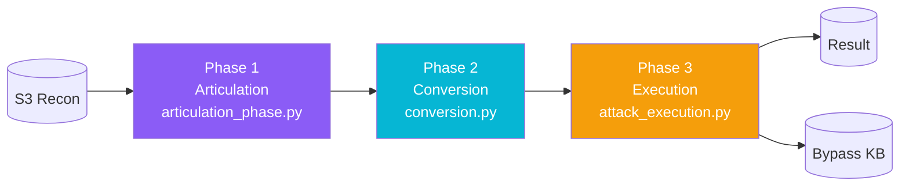
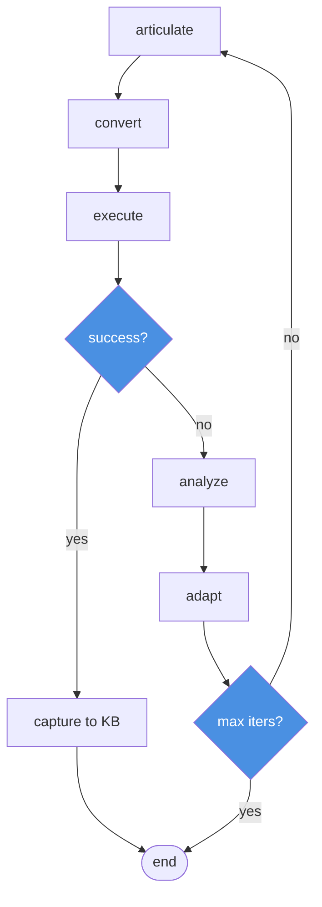
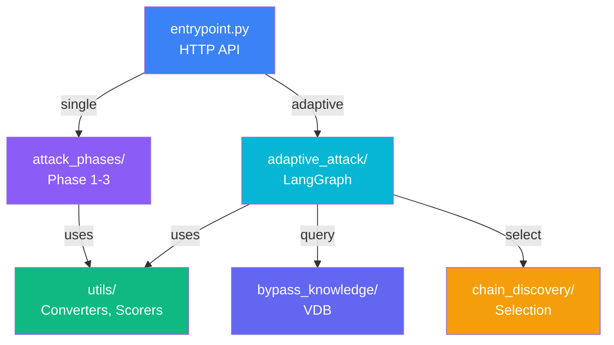

# Snipers

LLM exploitation engine. Takes campaign recon data from S3, generates attack payloads, applies obfuscation converters, fires them at target LLM endpoints, and scores responses. Two execution modes: single-shot and autonomous adaptive loop.

## Execution Modes

| Mode | Entry | Behaviour |
|------|-------|-----------|
| One-Shot | `execute_full_attack()` | Runs Phase 1→2→3 once, returns result |
| One-Shot (Streaming) | `execute_full_attack_streaming()` | Phase 1→2→3 with SSE events |
| Adaptive | `execute_adaptive_attack()` | LangGraph loop: run → analyze → adapt → repeat |

## Directory Structure

```
services/snipers/
├── entrypoint.py              # HTTP API (3 public functions)
├── models.py                  # Pydantic models + dataclasses
├── config.py                  # Constants & thresholds
├── attack_phases/             # Phase 1→2→3 sequential
├── adaptive_attack/           # LangGraph autonomous loop
├── utils/                     # Converters, scorers, articulation
├── chain_discovery/           # Chain selection & scoring
└── bypass_knowledge/          # Vector DB of bypass episodes
```

## 3-Phase Flow



Phase 1: Load campaign, extract recon intel, generate payloads via LLM. Phase 2: Apply converter chains (homoglyph→base64→leetspeak). Phase 3: Execute concurrently, score with 5+ parallel scorers.

## Adaptive Loop



## Key Schemas

| Schema | File | Purpose |
|--------|------|---------|
| Phase1Result | models.py:454 | payloads, framing_type, context |
| Phase2Result | models.py:483 | converted payloads, chain_id, success_count |
| Phase3Result | models.py:507 | responses, composite_score, severity |
| BypassEpisode | bypass_knowledge/models/episode.py | Successful bypass record |
| CompositeScore | utils/scoring/models.py | Aggregated 5+ scorer results |

## Entrypoint

| Function | Streaming | Returns |
|----------|-----------|---------|
| `execute_full_attack()` | No | Phase3Result |
| `execute_full_attack_streaming()` | SSE | AsyncGenerator[AttackEvent] |
| `execute_adaptive_attack()` | No | Phase3Result |

## Config Constants

| Constant | Value | Purpose |
|----------|-------|---------|
| MAX_CHAIN_LENGTH | 3 | Max converters per chain |
| OPTIMAL_LENGTH_BONUS | 10 | Bonus for 2–3 converters |
| LENGTH_PENALTY_FACTOR | 5 | Penalty per converter over 2 |
| RECON_CONFIDENCE_THRESHOLD | 0.6 | Min confidence threshold |
| USE_ADVERSARIAL_SUFFIXES | True | Enable suffix converters |

## Converters

10+ obfuscation techniques: Base64, Homoglyph, Leetspeak, Morse, HTML Entity, XML Escape, JSON Escape, Unicode Sub, Character Space, Suffix Converters.

## Scorers

6 specialized scorers: JailbreakScorer, PromptLeakScorer, DataLeakScorer, ToolAbuseScorer, PIIExposureScorer, CompositeScorer.

## Extension Points

- **Converter**: Add class to `utils/converters/`, register in `chain_executor.py`
- **Scorer**: Add class to `utils/scoring/`, integrate in `composite_attack_scorer.py`
- **Framing**: Add to `utils/prompt_articulation/components/framing_library.py`
- **Config**: Extend `models.py:Phase1Result`, `entrypoint.py`, and callers

## System Connections



Status: Production-ready. 3-phase attack engine with adaptive loop, 10+ converters, 6+ scorers, VDB storage, SSE streaming.
