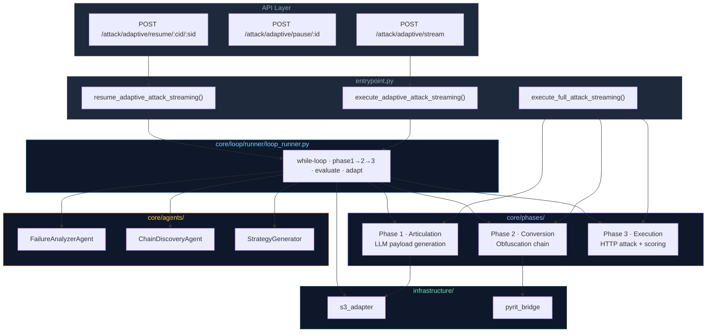
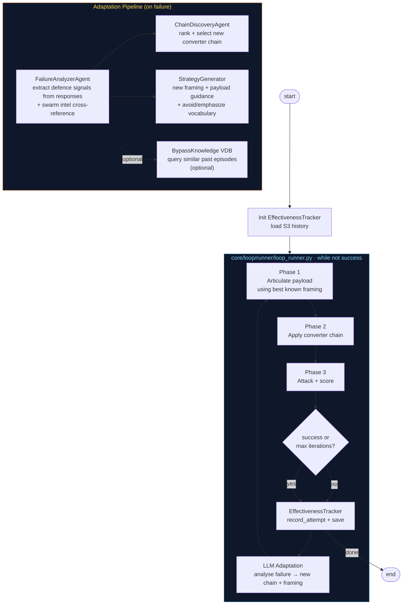
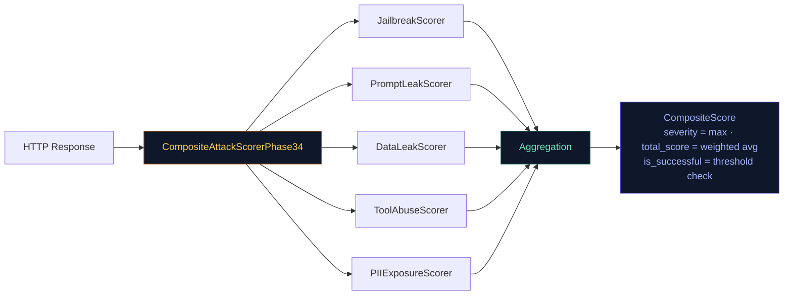

# Snipers

Multi-phase LLM red-teaming engine. Loads campaign intelligence from S3, crafts context-aware attack payloads, obfuscates them through converter chains, fires them at a target LLM endpoint, and scores the responses. Runs in one-shot or fully autonomous adaptive mode.

---

## High-Level Architecture



---

## Execution Modes

| Mode | Entry Function | Behaviour |
|------|----------------|-----------|
| One-Shot | `execute_full_attack_streaming()` | Single pass through Phase 1 → 2 → 3, emits SSE events |
| Adaptive | `execute_adaptive_attack_streaming()` | While-loop: run → evaluate → adapt → repeat, SSE throughout |
| Resume | `resume_adaptive_attack_streaming()` | Load S3 checkpoint, continue adaptive loop from last iteration |

---

## The Three Phases

### Phase 1 — Articulation

**Goal:** Turn raw campaign intelligence into a crafted attack prompt.

1. Load campaign data from S3 (recon output from the cartographer, garak probe results, objective).
2. Extract structured intel: tool signatures, defence patterns, swarm probe examples.
3. Select a **framing strategy** — a role/context wrapper that makes the payload look legitimate (e.g. "QA tester", "compliance auditor", "developer debugging"). Strategy selection is biased by `EffectivenessTracker`, which tracks historical success rates per `(framing_type, domain)` pair.
4. Generate the payload via LLM, injecting the objective, framing, recon context, vocabulary blacklist/emphasis terms from the previous adaptation, and any explicit payload guidance.

**Output:** `Phase1Result` — list of articulated payloads + framing metadata.

---

### Phase 2 — Conversion

**Goal:** Obfuscate payloads to slip past signature-based guardrails.

Applies a **converter chain** of up to 3 transformers in sequence via PyRIT. Each converter mutates the payload text in a way that preserves semantic meaning for the LLM but breaks keyword filters.

Available converters include: `homoglyph`, `base64`, `leetspeak`, `morse_code`, `unicode_substitution`, `html_entity`, `json_escape`, `xml_escape`, `rot13`, and thinking-mode variants.

The chain is chosen by `ChainDiscoveryAgent` during adaptation, or defaults to `["rot13"]` on the first iteration.

**Output:** `Phase2Result` — list of obfuscated payloads + chain metadata.

---

### Phase 3 — Execution + Scoring

**Goal:** Fire the payloads at the target and determine whether the attack succeeded.

1. Send all payloads as concurrent HTTP POST requests to the target LLM endpoint.
2. Score each response with 5 parallel scorers:

| Scorer | Detects |
|--------|---------|
| `JailbreakScorer` | Safety guardrail bypass |
| `PromptLeakScorer` | System prompt exfiltration |
| `DataLeakScorer` | Sensitive data in response |
| `ToolAbuseScorer` | Unauthorised tool invocation |
| `PIIExposureScorer` | Personal information disclosure |

3. Aggregate into a `CompositeScore`: `severity = max(all scorers)`, `total_score = weighted average`.
4. Evaluate success: if `success_scorers` specified, ALL listed scorers must meet `success_threshold` (default 0.8). If empty, any scorer above threshold counts.

**Output:** `Phase3Result` — per-payload responses, composite score, `is_successful` flag.

---

## Adaptive Loop



### Iteration Lifecycle

1. **Phase 1** — generate payloads using the current framing strategy (informed by effectiveness history)
2. **Phase 2** — obfuscate with the current converter chain
3. **Phase 3** — attack the target, score all responses
4. **Record** — `EffectivenessTracker.record_attempt()` logs `(framing, domain, score, success)`, then saves to S3
5. **Evaluate** — if success criteria met or iterations exhausted, stop
6. **Adapt** — LLM agents analyse the failure and produce a new chain + framing for the next iteration

---

## Adaptation Engine

Three LLM agents run in sequence after every failed iteration:

| Agent | Input | Output |
|-------|-------|--------|
| `FailureAnalyzerAgent` | Target responses, iteration history, recon intel, swarm intel | `ChainDiscoveryContext` — root cause, defence signals, evolution guidance |
| `ChainDiscoveryAgent` | Discovery context, previously tried chains, recon intel | `ChainDiscoveryDecision` — ranked converter chain candidates |
| `StrategyGenerator` | Discovery context, objective, recon intel | `AdaptationDecision` — new framing, payload guidance, avoid/emphasize vocabulary |

### What Changes Each Iteration

| Field | Set by | Applied in |
|-------|--------|------------|
| `converter_names` | `ChainDiscoveryAgent` | Phase 2 — converter chain |
| `custom_framing` / `recon_custom_framing` | `StrategyGenerator` | Phase 1 — framing wrapper |
| `payload_guidance` | `StrategyGenerator` | Phase 1 prompt — ADAPTATION GUIDANCE section |
| `avoid_terms` | `StrategyGenerator` | Phase 1 prompt — VOCABULARY BLACKLIST section |
| `emphasize_terms` | `StrategyGenerator` | Phase 1 prompt — VOCABULARY EMPHASIS section |

### Framing Priority (Phase 1)

```
recon_custom_framing   ← cartographer-derived role/context (highest confidence)
    ↓ not set?
custom_framing         ← LLM-generated by StrategyGenerator
    ↓ not set?
preset_framing         ← standard enum: qa_testing, debugging, compliance_audit, …
                          selected by EffectivenessTracker success-rate ranking
```

### Swarm Intelligence

`FailureAnalyzerAgent` receives a **SWARM INTELLIGENCE** block every iteration, sourced from the garak scan that preceded this campaign:

```
garak scan results
    ├── all_objectives       – deduplicated attack objectives across all detectors
    ├── probe_examples       – up to 10 concrete prompts garak found effective (with scores)
    └── vulnerability_scores – per-detector confidence scores
```

### Effectiveness Tracking

`EffectivenessTracker` (`core/phases/articulation/components/effectiveness_tracker.py`) provides a lightweight, LLM-free feedback signal:

- **One instance per run** — created before the while-loop, loaded from S3 (carries history across campaign runs).
- **Informs Phase 1** — passed into `ArticulationPhase`, which hands it to `FramingLibrary`. The library calls `get_success_rate(framing_type, domain)` to rank strategies before selecting one.
- **Records Phase 3 outcome** — after scoring, `record_attempt(framing_type, domain, score, success)` is called and `save()` persists the updated record to S3.

---

## Scoring System



---

## Checkpoint & Resume

```mermaid
sequenceDiagram
    participant Client
    participant API
    participant Loop as loop_runner
    participant S3

    Client->>API: POST /adaptive/stream
    API->>S3: create_checkpoint(RUNNING)
    API->>Loop: run_loop()

    loop Each Iteration
        Loop->>Loop: phase1 → phase2 → phase3 → evaluate
        Loop->>S3: save_checkpoint(iteration_data)
        Loop->>S3: tracker.save() (effectiveness history)
        Loop-->>Client: SSE events
    end

    Client->>API: POST /adaptive/pause/:id
    Loop-->>Client: attack_paused

    Client->>API: POST /adaptive/resume/:cid/:sid
    API->>S3: load_checkpoint()
    API->>Loop: run_loop() from saved iteration
    Loop-->>Client: attack_resumed + continue SSE
```

---

## SSE Event Reference

| Event | Emitted when |
|-------|-------------|
| `attack_started` | Stream begins |
| `iteration_start` | New iteration begins |
| `phase1_start` / `phase1_complete` | Payload generation start/end |
| `phase2_start` / `phase2_complete` | Converter chain start/end |
| `phase3_start` / `phase3_complete` | Attack execution start/end |
| `iteration_complete` | Iteration scored, success evaluated |
| `adaptation` | Strategy change decided (new chain + framing) |
| `checkpoint_saved` | Iteration state persisted to S3 |
| `attack_paused` / `attack_resumed` | Pause/resume lifecycle |
| `attack_complete` | Final results, best score, iteration count |
| `error` | Phase or agent failure details |

---

## Extension Points

| What to add | Where | How to register |
|-------------|-------|-----------------|
| Converter | `core/converters/` | Add to registry dict in `core/phases/converters/chain_executor.py` |
| Scorer | `core/scoring/` | Add instance to `CompositeAttackScorerPhase34` |
| Framing strategy | `core/phases/articulation/components/framing_library.py` | Add `FramingType` enum entry + strategy template |

---

## Directory Structure

```
services/snipers/
├── entrypoint.py                   # Public API: one-shot, adaptive, resume
├── models/                         # Pydantic + dataclass schemas
│   ├── enums.py                    #   AttackMode, ProbeCategory
│   ├── requests.py                 #   ExploitStreamRequest, per-phase configs
│   ├── results.py                  #   Phase1/2/3Result, AttackResult, ConvertedPayload
│   └── ...
├── config.py                       # Global constants and thresholds
│
├── core/                           # Business logic
│   ├── phases/
│   │   ├── articulation/           # Phase 1: LLM payload generation
│   │   │   ├── articulation_phase.py
│   │   │   ├── components/         # FramingLibrary, PayloadGenerator, EffectivenessTracker
│   │   │   ├── loaders/            # CampaignLoader, SwarmExtractor
│   │   │   └── models/             # FramingStrategy, PayloadContext
│   │   ├── conversion.py           # Phase 2: converter chain application
│   │   └── execution.py            # Phase 3: HTTP attacks + composite scoring
│   ├── scoring/                    # 5+ scorers + CompositeAttackScorerPhase34
│   ├── converters/                 # 10+ PyRIT-based payload transformers
│   ├── agents/                     # LLM-powered adaptation agents
│   │   ├── failure_analyzer_agent.py
│   │   ├── chain_discovery_agent.py
│   │   ├── strategy_generator.py
│   │   └── prompts/                # Agent system prompt templates
│   ├── adaptive_models/            # Schemas for adaptation pipeline outputs
│   ├── components/
│   │   └── pause_signal.py         # In-memory pause/resume flag
│   └── loop/                       # Loop orchestration (not public API)
│       ├── runner/
│       │   ├── loop_runner.py      # Main while-loop: phase1→2→3, evaluate, adapt
│       │   ├── phase_runners.py    # Thin wrappers that call each phase and return events
│       │   └── state.py            # LoopState (mutable per-run state) + checkpoint init
│       ├── adaptation/
│       │   ├── engine.py           # LLM adaptation pipeline (FailureAnalyzer→ChainDiscovery→Strategy)
│       │   ├── evaluation.py       # check_success: score threshold + failure cause logic
│       │   ├── pause_and_adapt.py  # Pause handling + adapt_strategy orchestrator
│       │   └── constants.py        # FRAMING_TYPES, ALL_SCORERS
│       ├── persistence/
│       │   └── checkpoints.py      # S3 checkpoint save helpers + checkpoint_saved event
│       ├── events/
│       │   ├── builders.py         # Generic make_event + phase-complete event builders
│       │   └── phase_builders.py   # Per-phase SSE event list constructors
│       └── entrypoint_helpers.py   # FullAttackResult, streaming helpers, S3 persist wrappers
│
├── knowledge/                      # Bypass knowledge vector DB
│   ├── capture/                    # Persist successful bypass episodes
│   ├── query/                      # Retrieve semantically similar episodes
│   ├── models/                     # BypassEpisode, Fingerprint, Insight
│   └── integration/                # Hooks into adaptive loop
│
└── infrastructure/                 # External service adapters
    ├── persistence/
    │   └── s3_adapter.py           # Campaign data, checkpoints, effectiveness history
    └── pyrit/
        ├── pyrit_init.py           # PyRIT initialisation
        ├── pyrit_bridge.py         # PyRIT converter bridge
        └── http_targets.py         # HTTP target wrappers for PyRIT
```
