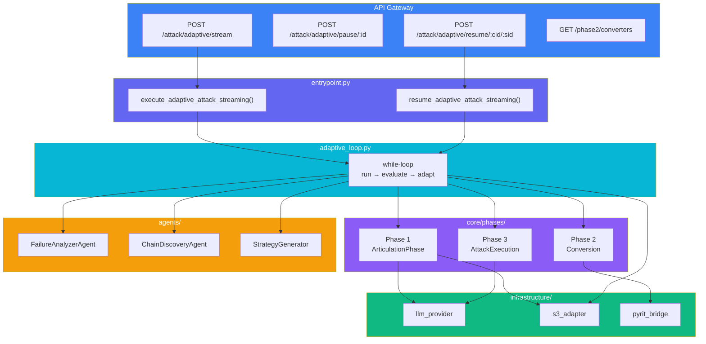
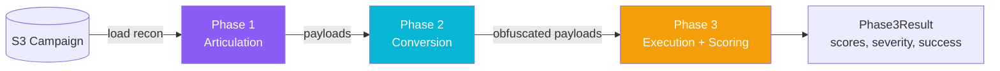
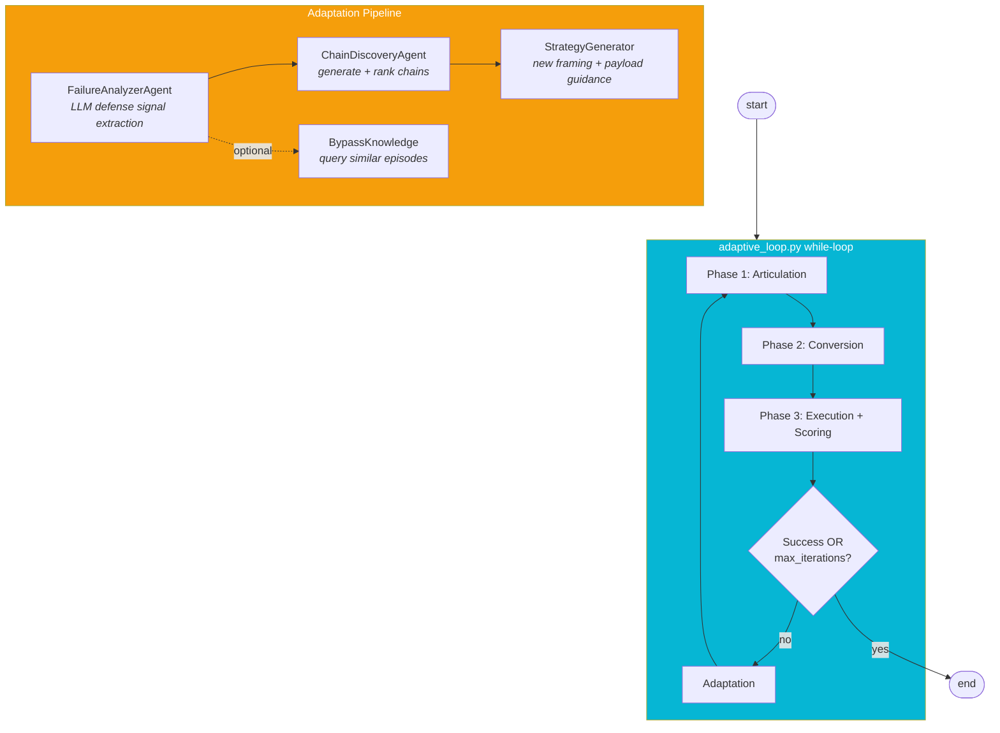
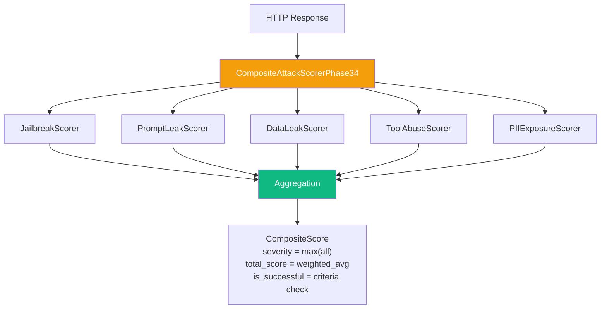

# Snipers

LLM exploitation engine. Takes campaign recon data from S3, generates attack payloads, applies obfuscation converters, fires them at target LLM endpoints, and scores responses. Two execution modes: one-shot and autonomous adaptive loop.

---

## Directory Structure

```
services/snipers/
├── entrypoint.py                   # Orchestrator: one-shot + adaptive streaming
├── adaptive_loop.py                # Adaptive while-loop (replaced LangGraph)
├── models/                         # Pydantic + dataclass schemas (split by domain)
│   ├── enums.py                    #   AttackMode, ProbeCategory
│   ├── events.py                   #   AttackEvent (SSE)
│   ├── requests.py                 #   ExploitStreamRequest, configs
│   ├── reasoning.py                #   PatternAnalysis, AttackPlan
│   ├── results.py                  #   Phase1/2/3Result, AttackResult, ConvertedPayload
│   └── state.py                    #   ExploitAgentState (HITL state)
├── config.py                       # Constants & thresholds
│
├── core/                           # Business logic
│   ├── phases/
│   │   ├── articulation/           # Phase 1: payload generation via LLM
│   │   │   ├── articulation_phase.py
│   │   │   ├── components/         # framing_library, payload_generator, format_control
│   │   │   ├── loaders/            # campaign_loader, swarm_extractor
│   │   │   └── models/             # framing_strategy, payload_context
│   │   ├── conversion.py           # Phase 2: converter chain application
│   │   └── execution.py            # Phase 3: HTTP attacks + composite scoring
│   ├── scoring/                    # 5+ scorers + composite aggregator
│   ├── converters/                 # Payload transformation converters
│   └── chain_models/               # ConverterChain, ChainMetadata
│   ├── agents/                     # LLM-powered decision agents
│   │   ├── chain_discovery_agent.py
│   │   ├── failure_analyzer_agent.py
│   │   ├── strategy_generator.py
│   │   └── prompts/                # Agent prompt templates
│   │       ├── adaptation_prompt.py
│   │       ├── chain_discovery_prompt.py
│   │       └── failure_analysis_prompt.py
│   ├── adaptive_models/            # Adaptive-specific schemas
│   │   ├── chain_discovery.py
│   │   ├── defense_analysis.py
│   │   ├── adaptation_decision.py
│   │   └── failure_analysis.py
│   └── components/
│       └── pause_signal.py         # Pause/resume signal
│
├── knowledge/                      # Bypass knowledge VDB
│   ├── capture/                    # Save successful bypasses
│   ├── query/                      # Retrieve similar bypasses
│   ├── models/                     # BypassEpisode, Fingerprint, Insight
│   └── integration/               # Hooks into adaptive loop
│
└── infrastructure/                 # External service adapters
    ├── llm_provider.py
    ├── persistence/
    │   └── s3_adapter.py
    └── pyrit/
        ├── pyrit_init.py
        └── pyrit_bridge.py
```

---

## Execution Modes

| Mode | Entry Function | Behaviour |
|------|----------------|-----------|
| One-Shot | `execute_full_attack()` | Phase 1 → 2 → 3 once, returns `Phase3Result` |
| One-Shot (Streaming) | `execute_full_attack_streaming()` | Phase 1 → 2 → 3 with SSE events |
| Adaptive | `execute_adaptive_attack_streaming()` | While-loop with SSE: run → evaluate → adapt → repeat |
| Resume | `resume_adaptive_attack_streaming()` | Load checkpoint, continue adaptive loop |

---

## High-Level Architecture



---

## One-Shot Flow



**Phase 1 (Articulation)**: Load campaign from S3, extract recon intelligence, select framing strategy, generate payloads via LLM.

**Phase 2 (Conversion)**: Apply converter chain sequentially (e.g. homoglyph → base64 → leetspeak). Up to 3 converters per chain.

**Phase 3 (Execution)**: Send HTTP POST attacks concurrently, score each response with 5+ parallel scorers, compute composite score.

---

## Adaptive Loop



### Iteration Lifecycle

1. **Phase 1** generates payloads with chosen framing (defaults on first iteration)
2. **Phase 2** applies the chosen converter chain
3. **Phase 3** sends attacks and scores responses
4. **Evaluate** checks success criteria, records history
5. **Adapt** (if not done): LLM agents analyze failure → pick new chain + framing → loop back

---

## Adaptation Engine

Three LLM agents drive adaptation between iterations:

| Agent | Input | Output |
|-------|-------|--------|
| `FailureAnalyzerAgent` | target responses, iteration history, recon intel, **swarm intel** | `ChainDiscoveryContext` (defense signals, root cause, evolution) |
| `ChainDiscoveryAgent` | discovery context, tried chains, recon intel | `ChainDiscoveryDecision` (ranked chain candidates) |
| `StrategyGenerator` | discovery context, objective, recon intel | `AdaptationDecision` (framing + payload guidance + **avoid/emphasize terms**) |

All three agents receive `recon_intelligence` (cartographer output) every iteration. `FailureAnalyzerAgent` additionally receives `swarm_context` (garak output) for richer signal analysis.

### Effectiveness Tracking

`EffectivenessTracker` (`core/phases/articulation/components/effectiveness_tracker.py`) closes the learning loop across iterations:

1. **One instance per run** — created in `loop_runner.py` before the while-loop starts and loaded from S3 (prior campaign history).
2. **Informs Phase 1** — passed into `ArticulationPhase.execute()`, which hands it to `FramingLibrary`. The library calls `get_success_rate(framing_type, domain)` to bias strategy selection toward what has worked before.
3. **Records Phase 3 outcome** — after each iteration's score/success is known, `tracker.record_attempt(framing_type, domain, score, success)` is called and then `tracker.save()` persists to S3.

This means every subsequent iteration starts with one more data point, and multi-run campaigns progressively improve framing selection without any LLM involvement.

### What Adapts Each Iteration

| Field | Source Agent | Where Applied |
|-------|-------------|---------------|
| `converter_names` | `ChainDiscoveryAgent` | Phase 2 converter chain |
| `custom_framing` / `recon_custom_framing` | `StrategyGenerator` | Phase 1 payload framing |
| `payload_guidance` | `StrategyGenerator` | Phase 1 prompt (ADAPTATION GUIDANCE section) |
| `avoid_terms` | `StrategyGenerator` | Phase 1 prompt (VOCABULARY BLACKLIST section) |
| `emphasize_terms` | `StrategyGenerator` | Phase 1 prompt (VOCABULARY EMPHASIS section) |
| `discovered_parameters` | `StrategyGenerator` | Accumulated in `LoopState`, available next iteration |

### Swarm Intelligence in Failure Analysis

`CampaignIntelligence` now carries enriched garak data:

```
garak scan results
    ├── all_objectives      – deduplicated objectives across all detected vulnerabilities
    ├── probe_examples      – up to 10 concrete prompts garak found effective (with scores)
    └── vulnerability_scores – per-detector scores from the swarm run
```

This context appears as a **SWARM INTELLIGENCE** section in the `FailureAnalyzerAgent` prompt, letting it cross-reference current attack failures against what the swarm already knows succeeded.

### Framing Priority

```
recon_custom_framing (from cartographer recon intel)
    ↓ not available?
custom_framing (LLM-generated by StrategyGenerator)
    ↓ not available?
preset_framing (standard: qa_testing, debugging, etc.)
```

---

## Scoring System



**Success Criteria**: If `success_scorers` specified, ALL listed scorers must meet `success_threshold` (default 0.8). If empty, any scorer above threshold counts.

---

## Checkpoint & Resume

```mermaid
sequenceDiagram
    participant Client
    participant API
    participant Loop as adaptive_loop
    participant S3

    Client->>API: POST /adaptive/stream
    API->>S3: create_checkpoint(RUNNING)
    API->>Loop: run_adaptive_attack_streaming()

    loop Each Iteration
        Loop->>Loop: phase1 → phase2 → phase3 → evaluate
        Loop->>S3: update_checkpoint(iteration_data)
        Loop-->>Client: SSE events
    end

    Client->>API: POST /adaptive/pause/:id
    Loop-->>Client: attack_paused event

    Client->>API: POST /adaptive/resume/:cid/:sid
    API->>S3: load_checkpoint()
    API->>Loop: resume_adaptive_attack_streaming()
    Loop-->>Client: attack_resumed + continue SSE
```

---

## SSE Event Types

| Event | When |
|-------|------|
| `attack_started` | Stream begins |
| `iteration_start` / `iteration_complete` | Iteration boundaries |
| `phase1_start` / `phase1_complete` | Payload generation |
| `phase2_start` / `phase2_complete` | Converter application |
| `phase3_start` / `phase3_complete` | Attack execution |
| `adaptation` | Strategy change details |
| `checkpoint_saved` | Progress persisted |
| `attack_paused` / `attack_resumed` | Pause/resume lifecycle |
| `attack_complete` | Final results |
| `error` | Failure details |

---

## Remaining Tasks

The following simplification work is in progress:

### Done
- [x] Removed LangGraph state machine (graph.py, state.py, 5 nodes)
- [x] Removed rule-based analyzers (ResponseAnalyzer, FailureAnalyzer, TurnLogger)
- [x] Created `adaptive_loop.py` as simple while-loop replacement
- [x] Updated entrypoint.py imports and return types
- [x] Updated API router imports
- [x] Moved graphs/ contents to core/ (`core/agents/`, `core/adaptive_models/`, `core/components/`)
- [x] Deleted graphs/ directory
- [x] Updated all imports to reference new `core/` paths
- [x] Updated tests to reference new `core/` paths
- [x] **Wired `avoid_terms`/`emphasize_terms`** end-to-end: `StrategyGenerator` → `LoopState` → Phase 1 prompt (VOCABULARY BLACKLIST / EMPHASIS sections)
- [x] **Enriched swarm context**: `CampaignIntelligence` now carries all garak objectives, probe examples, and per-detector scores; surfaced as SWARM INTELLIGENCE in `FailureAnalyzerAgent` prompt
- [x] **Extracted `swarm_extractor.py`** for clean separation of garak parsing logic

### To Do
- [ ] **Reduce adaptive_loop.py LOC**: Extract helpers, simplify event emission, reduce duplication
- [ ] **Consolidate models**: Merge overlapping schemas between `models/` and `core/adaptive_models/`

---

## Extension Points

| Add | Where | Register |
|-----|-------|----------|
| Converter | `core/converters/` | Registry in `chain_executor.py` |
| Scorer | `core/scoring/` | Add to `CompositeAttackScorerPhase34` |
| Framing | `core/phases/articulation/components/framing_library.py` | Add `FramingType` enum + template |

---

Status: Migration complete. 3-phase attack engine with adaptive loop, 10+ converters, 6+ scorers, VDB storage, SSE streaming, checkpoint/resume. LangGraph removed. Full adaptation pipeline now wired: avoid/emphasize vocabulary, enriched swarm intelligence (garak probe examples + per-detector scores), and cartographer recon all flow into every adaptation decision.
