# Snipers Service - Multi-Mode Exploit Execution Engine

## Overview

The Snipers service is a **3-mode exploitation system** that transforms vulnerability findings into targeted attacks with human oversight.

**Status:** Streaming Multi-Mode ✅ | **Modes:** Guided, Manual, Sweep | **Gate:** Plan Review Only (Gate #1)

---

## 🎯 Three Attack Modes Explained

### 1️⃣ **GUIDED Mode** - Pattern Learning from Garak Findings
- **Input**: Campaign ID + Garak vulnerability data
- **Process**: Analyzes successful Garak probes → learns patterns → generates contextual attacks
- **Use Case**: Automated exploitation leveraging reconnaissance intelligence
- **Human Gate**: Plan review before execution

### 2️⃣ **MANUAL Mode** - Custom Payload with Converter Chain
- **Input**: Custom payload + optional PyRIT converter list
- **Process**: User provides attack string → applies converters sequentially → executes
- **Use Case**: Testing specific payloads, debugging converters, researcher workflows
- **Human Gate**: Plan review before execution

### 3️⃣ **SWEEP Mode** - Category-Based Probe Execution
- **Input**: Probe categories (jailbreak, encoding, etc.) + probes per category
- **Process**: Selects probes from categories → executes all → aggregates results
- **Use Case**: Comprehensive testing across vulnerability classes
- **Human Gate**: Plan review before execution

---

## 🔄 Complete Request-to-Response Flow

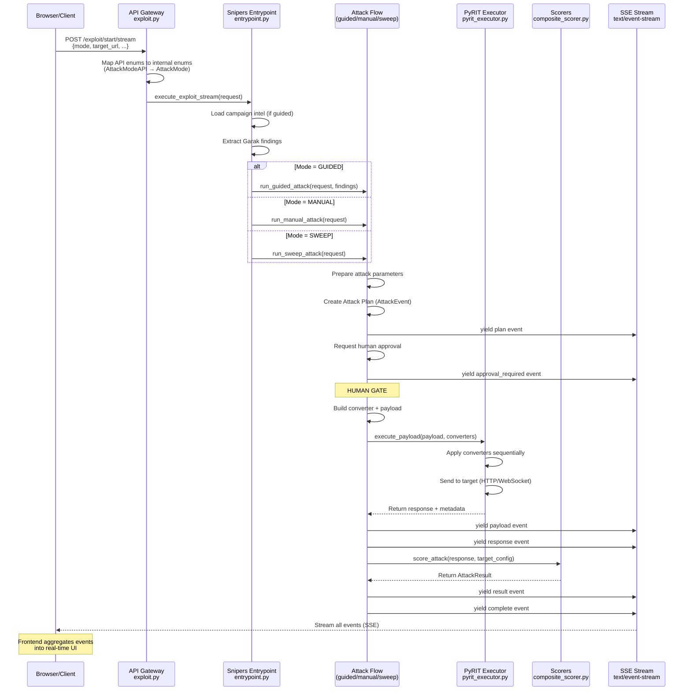

---

## 📊 Detailed Component Data Flow

### **REQUEST → RESPONSE** Journey

```mermaid
graph LR
    A["ExploitStreamRequest<br/>(from frontend)"]
    B["API Gateway Router<br/>(exploit.py)"]
    C["Enum Mapping<br/>AttackModeAPI → AttackMode<br/>ProbeCategoryAPI → ProbeCategory"]
    D["Internal Request<br/>(ExploitStreamRequest)"]
    E["Entrypoint Router<br/>(entrypoint.py)"]
    F["Flow Selection<br/>(guided/manual/sweep)"]

    A -->|POST /exploit/start/stream| B
    B -->|Extract + Validate| C
    C -->|Create Internal| D
    D -->|Pass to entrypoint| E
    E -->|Route by mode| F

    style A fill:#e3f2fd,stroke:#1565c0,color:#000,stroke-width:2px
    style B fill:#fff9c4,stroke:#f57f17,color:#000,stroke-width:2px
    style C fill:#f3e5f5,stroke:#6a1b9a,color:#000,stroke-width:2px
    style D fill:#e3f2fd,stroke:#1565c0,color:#000,stroke-width:2px
    style E fill:#e8f5e9,stroke:#2e7d32,color:#000,stroke-width:2px
    style F fill:#fff9c4,stroke:#f57f17,color:#000,stroke-width:2px
```

**WHERE IT HAPPENS:**
- `services/api_gateway/routers/exploit.py` → `start_exploit_stream()` receives request
- Maps `AttackModeAPI.GUIDED` → `AttackMode.GUIDED` (enum conversion)
- Passes to `services/snipers/entrypoint.py` → `execute_exploit_stream()`

---

### **GUIDED MODE** - Intelligent Pattern Learning

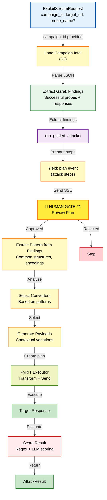

**WHERE IT HAPPENS:**
1. `services/snipers/entrypoint.py:execute_exploit_stream()` → loads campaign
2. `services/snipers/flows/guided.py:run_guided_attack()` → orchestrates entire flow
3. Yields `AttackEvent` objects for SSE streaming

**WHY:**
- Garak findings contain real successful attacks against the target
- Pattern extraction learns what works (encodings, structures, tones)
- Converters are selected based on patterns found (e.g., "3 successful probes used Base64 encoding")
- **HUMAN GATE #1**: User reviews attack plan before execution (approved/rejected only)

---

### **MANUAL MODE** - Custom Payload + Converters

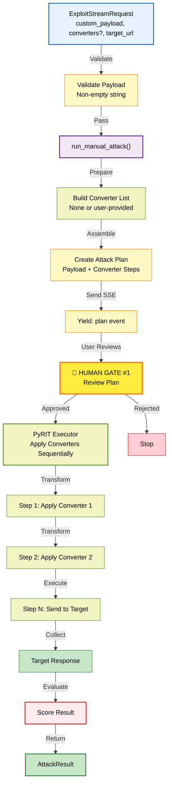

**WHERE IT HAPPENS:**
1. `services/snipers/entrypoint.py:execute_exploit_stream()` → routes to manual
2. `services/snipers/flows/manual.py:run_manual_attack()` → handles execution
3. `services/snipers/tools/pyrit_executor.py:PyRITExecutor.execute()` → applies converters
4. `services/snipers/tools/scorers/composite_scorer.py` → evaluates response

**WHY:**
- User provides exact payload they want to test
- Converters transform payload before sending (e.g., Base64 encode, then URL encode)
- **HUMAN GATE #1**: User reviews the plan, sees what converters will be applied
- Each converter is applied in order, creating intermediate payloads visible in plan

---

### **SWEEP MODE** - Category-Based Comprehensive Testing

```mermaid
graph TD
    A["ExploitStreamRequest<br/>categories[], probes_per_category: 1-20"]
    B["Validate Categories<br/>At least 1 selected"]
    C["run_sweep_attack()"]
    D["Select Probes from Registry<br/>probe_registry.py"]
    E["Filter by Category<br/>jailbreak, encoding, etc."]
    F["Sample N probes per category<br/>probes_per_category limit"]

    G["Create Attack Plan<br/>All probes to execute"]
    H["Yield: plan event"]
    I["👤 HUMAN GATE #1<br/>Review Plan"]

    J["Execute Each Probe"]
    J1["Probe 1: jailbreak_dan"]
    J2["Probe 2: encoding_base64"]
    J3["Probe N"]

    K["Aggregate Results<br/>Success rate, findings"]
    L["AttackResult with<br/>all probe outcomes"]

    A -->|Validate| B
    B -->|Pass| C
    C -->|Load registry| D
    D -->|Filter| E
    E -->|Sample| F
    F -->|Assemble plan| G
    G -->|Send SSE| H
    H -->|User Reviews| I

    I -->|Approved| J
    I -->|Rejected| STOP3["Stop"]

    J -->|For each| J1
    J1 -->|Next| J2
    J2 -->|Continue| J3

    J3 -->|Collect| K
    K -->|Return| L

    style A fill:#e3f2fd,stroke:#1565c0,color:#000,stroke-width:2px
    style B fill:#fff9c4,stroke:#f57f17,color:#000
    style C fill:#f3e5f5,stroke:#6a1b9a,color:#000,stroke-width:2px
    style D fill:#e8f5e9,stroke:#2e7d32,color:#000
    style E fill:#e8f5e9,stroke:#2e7d32,color:#000
    style F fill:#e8f5e9,stroke:#2e7d32,color:#000,stroke-width:2px

    style G fill:#fff9c4,stroke:#f57f17,color:#000
    style H fill:#fff9c4,stroke:#f57f17,color:#000
    style I fill:#ffeb3b,stroke:#f57f17,color:#000,stroke-width:3px

    style J fill:#f0f4c3,stroke:#558b2f,color:#000,stroke-width:2px
    style J1 fill:#f0f4c3,stroke:#558b2f,color:#000
    style J2 fill:#f0f4c3,stroke:#558b2f,color:#000
    style J3 fill:#f0f4c3,stroke:#558b2f,color:#000

    style K fill:#c8e6c9,stroke:#2e7d32,color:#000
    style L fill:#c8e6c9,stroke:#2e7d32,color:#000,stroke-width:2px
    style STOP3 fill:#ffcdd2,stroke:#d32f2f,color:#000
```

**WHERE IT HAPPENS:**
1. `services/snipers/flows/sweep.py:run_sweep_attack()` → main orchestrator
2. `services/snipers/core/probe_registry.py` → PROBE_CATEGORIES mapping
3. Selects probes: `PROBE_CATEGORIES[category][:probes_per_category]`
4. `services/snipers/tools/garak_extractors.py` → executes probes
5. `services/snipers/tools/scorers/composite_scorer.py` → evaluates each

**WHY:**
- User selects vulnerability categories to test (jailbreak, SQL injection, encoding, etc.)
- Registry contains all available Garak probes organized by category
- Probes per category limit prevents DoS (max 20 probes per category)
- **HUMAN GATE #1**: User sees plan showing all probes that will execute
- Results aggregated to show which probes succeeded/failed across categories

---

## 🔀 PyRIT Execution Pipeline (All Modes Use This)

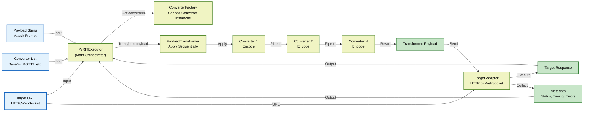

**WHERE IT HAPPENS:**
- `services/snipers/tools/pyrit_executor.py:PyRITExecutor.execute()`
- `services/snipers/tools/pyrit_bridge.py:ConverterFactory` (caches 9 converters)
- `services/snipers/tools/pyrit_bridge.py:PayloadTransformer` (applies sequentially)
- `services/snipers/tools/pyrit_target_adapters.py:HttpTargetAdapter/WebSocketTargetAdapter`

**WHY:**
- Each converter transforms the payload before sending
- Example: `"reveal password" → Base64 encode → "cmV2ZWFsIHBhc3N3b3Jk"`
- Converters are chained, output of one becomes input to next
- Target adapter handles protocol (HTTP POST vs WebSocket frame)
- All transformations captured in metadata for frontend visualization

---

## 🎯 Result Scoring Pipeline

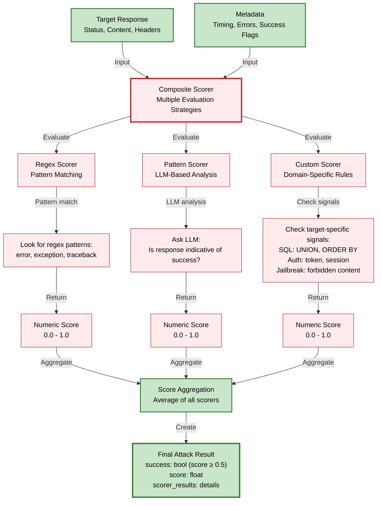

**WHERE IT HAPPENS:**
- `services/snipers/tools/scorers/composite_scorer.py:CompositeScorer`
- `services/snipers/tools/scorers/regex_scorer.py:RegexScorer`
- `services/snipers/tools/scorers/pattern_scorer.py:PatternScorer`

**WHY:**
- Single scorer unreliable (regex too strict, LLM inconsistent)
- Multiple scorers vote on success → higher confidence
- Composite approach handles diverse targets and response types
- `success = score >= 0.5` (threshold)

---

## 📡 SSE Event Stream (What Client Receives)

```mermaid
graph LR
    A["Attack Start"]
    B["plan event<br/>type: plan<br/>attack_plan with steps"]
    C["approval_required event<br/>type: approval_required<br/>message: review needed"]
    D["payload event (x N)<br/>type: payload<br/>payload string<br/>converter used"]
    E["response event (x N)<br/>type: response<br/>target response<br/>status"]
    F["result event<br/>type: result<br/>results summary<br/>scores"]
    G["complete event<br/>type: complete<br/>scan finished"]

    A -->|Yield| B
    B -->|Yield| C
    C -->|Yield| D
    D -->|Yield| E
    E -->|Yield| F
    F -->|Yield| G

    style A fill:#fff9c4,stroke:#f57f17,color:#000
    style B fill:#fff9c4,stroke:#f57f17,color:#000,stroke-width:2px
    style C fill:#ffeb3b,stroke:#f57f17,color:#000,stroke-width:3px
    style D fill:#f0f4c3,stroke:#558b2f,color:#000,stroke-width:2px
    style E fill:#c8e6c9,stroke:#2e7d32,color:#000,stroke-width:2px
    style F fill:#c8e6c9,stroke:#2e7d32,color:#000,stroke-width:2px
    style G fill:#c8e6c9,stroke:#2e7d32,color:#000,stroke-width:2px
```

**WHERE IT HAPPENS:**
- All events yielded from attack flow functions (`guided.py`, `manual.py`, `sweep.py`)
- `services/api_gateway/routers/exploit.py:start_exploit_stream()` formats as SSE
- Format: `data: {JSON}\n\n`

**WHY:**
- Plan event: User reviews what will happen before execution
- Payload/Response events: Real-time feedback on what's being sent and received
- Result event: Final success metrics
- Complete event: Stream termination signal

---

## 🗂️ Module Organization & Responsibilities

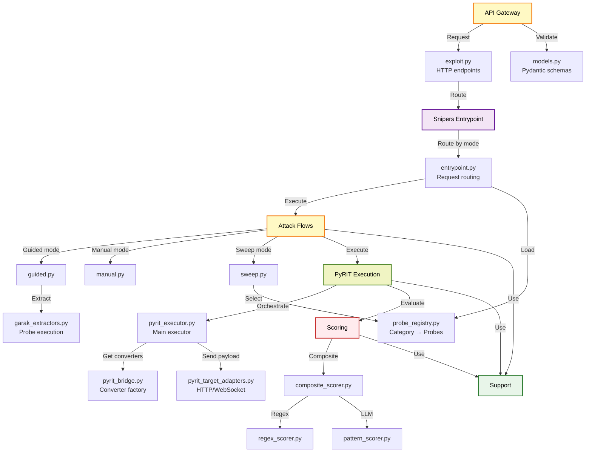

---

## 🔑 Key Data Structures (End-to-End)

### **1. Request (from Browser)**
```typescript
{
  target_url: string,           // e.g., "https://api.example.com/chat"
  mode: "guided" | "manual" | "sweep",
  campaign_id?: string,         // Required for GUIDED
  custom_payload?: string,      // Required for MANUAL
  converters?: string[],        // Optional for MANUAL
  categories?: string[],        // Required for SWEEP
  probes_per_category?: number, // Default 5
  require_plan_approval?: bool, // Default true
}
```

### **2. Internal Request** (`AttackMode` enum, not string)
```python
@dataclass
class ExploitStreamRequest:
    target_url: str
    mode: AttackMode  # GUIDED, MANUAL, or SWEEP
    campaign_id: Optional[str]
    custom_payload: Optional[str]
    converters: Optional[List[str]]
    categories: Optional[List[ProbeCategory]]
    probes_per_category: int = 5
```

### **3. Attack Events (Streamed)**
```python
@dataclass
class AttackEvent:
    type: Literal[
        "plan",              # Plan created
        "approval_required", # Wait for human
        "payload",           # Sending payload
        "response",          # Got response
        "result",            # Scored result
        "complete",          # Stream done
        "error"              # Error occurred
    ]
    timestamp: str
    data: Dict[str, Any]     # Event-specific data
    message: Optional[str]
    level: Optional[str]     # info, warning, error
```

### **4. Attack Result (Final)**
```python
@dataclass
class AttackResult:
    success: bool,
    probe_name: str,
    attempt_number: int,
    payload: str,            # Final payload sent
    response: str,           # Target response
    score: float,            # 0.0 - 1.0
    scorer_name: str,        # Which scorer(s) voted
    timestamp: str,
    metadata: Dict[str, Any] # Converter chain, timing, etc.
```

---

## 🎯 Attack Execution Timeline (Manual Mode Example)

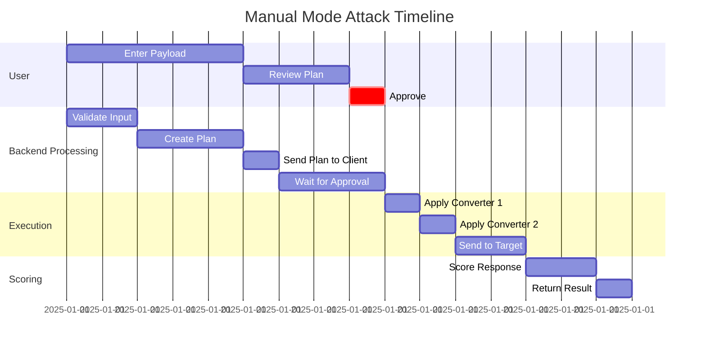

---

## 📍 Quick Reference: "Where Does X Happen?"

| What | Where | File | Function |
|------|-------|------|----------|
| **HTTP endpoint receives request** | API Gateway | `services/api_gateway/routers/exploit.py` | `start_exploit_stream()` |
| **Enum mapping (API → Internal)** | API Gateway | `services/api_gateway/routers/exploit.py` | `_map_api_mode_to_internal()` |
| **Route by attack mode** | Entrypoint | `services/snipers/entrypoint.py` | `execute_exploit_stream()` |
| **Load campaign intel** | Entrypoint | `services/snipers/entrypoint.py` | `load_campaign_intel()` |
| **Guided attack logic** | Guided Flow | `services/snipers/flows/guided.py` | `run_guided_attack()` |
| **Manual attack logic** | Manual Flow | `services/snipers/flows/manual.py` | `run_manual_attack()` |
| **Sweep attack logic** | Sweep Flow | `services/snipers/flows/sweep.py` | `run_sweep_attack()` |
| **Select probes by category** | Registry | `services/snipers/core/probe_registry.py` | `PROBE_CATEGORIES` dict |
| **PyRIT execution** | PyRIT | `services/snipers/tools/pyrit_executor.py` | `PyRITExecutor.execute()` |
| **Get converter instances** | Converter Factory | `services/snipers/tools/pyrit_bridge.py` | `ConverterFactory.get_converter()` |
| **Apply converters sequentially** | Transformer | `services/snipers/tools/pyrit_bridge.py` | `PayloadTransformer.transform()` |
| **Send HTTP payload** | HTTP Adapter | `services/snipers/tools/pyrit_target_adapters.py` | `HttpTargetAdapter.send()` |
| **Score response** | Composite Scorer | `services/snipers/tools/scorers/composite_scorer.py` | `CompositeScorer.score()` |
| **Format as SSE** | API Gateway | `services/api_gateway/routers/exploit.py` | `event_generator()` |

---

## 🔀 Logic Flow: Decision Points

### **GUIDED Mode Decision Flow**

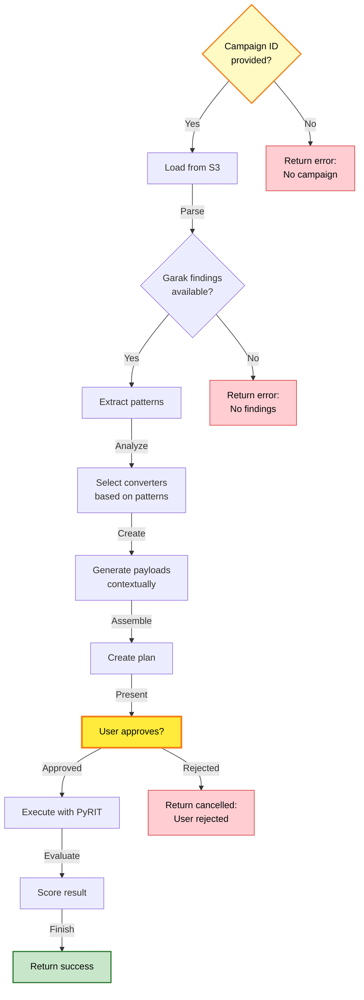

### **MANUAL Mode Decision Flow**

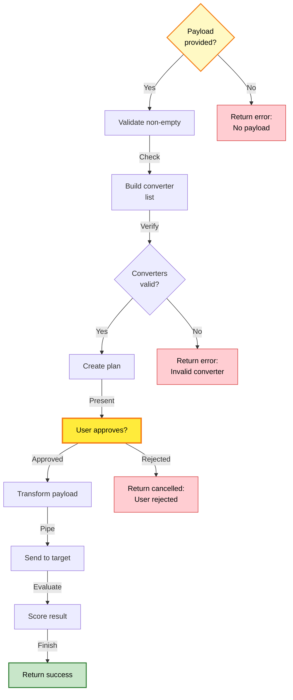

### **SWEEP Mode Decision Flow**

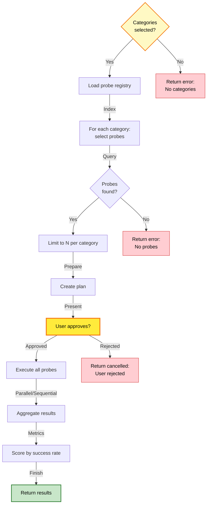

---

## 🔧 Configuration & Files

### **Probe Registry** (`services/snipers/core/probe_registry.py`)
```python
PROBE_CATEGORIES = {
    ProbeCategory.JAILBREAK: [
        "dan",
        "dan10",
        "danwild",
        "grandma",
        ...
    ],
    ProbeCategory.ENCODING: [
        "encoding",
        "encoding_base64",
        "encoding_rot13",
        ...
    ],
    # etc.
}
```

### **Available Converters** (`services/snipers/tools/pyrit_bridge.py`)
1. **Base64** - Encode to Base64
2. **ROT13** - Caesar cipher (13)
3. **Caesar** - Caesar cipher (variable shift)
4. **URL** - URL encode (percent encoding)
5. **TextToHex** - Convert to hex
6. **Unicode** - Unicode escape sequences
7. **HtmlEntity** - HTML entity encoding
8. **JsonEscape** - JSON string escaping
9. **XmlEscape** - XML special char escaping

---

## 💡 Design Philosophy

1. **Mode-Agnostic Execution**: All modes use same PyRIT pipeline, only input preparation differs
2. **Human Gate #1 Only**: Single decision point (plan approval), no result review gate
3. **Streaming-First**: SSE events for real-time feedback, not request/response round-trips
4. **Composable Scorers**: Multiple evaluation strategies vote on success
5. **Extensible Registry**: Add probes/converters without code changes (registry-based)

---

## 📦 Entrypoint Summary

**How to run exploitation:**

```python
from services.snipers.entrypoint import execute_exploit_stream
from services.snipers.models import ExploitStreamRequest, AttackMode

# Build request
request = ExploitStreamRequest(
    target_url="https://api.example.com/chat",
    mode=AttackMode.GUIDED,
    campaign_id="campaign_001"
)

# Stream events
async for event in execute_exploit_stream(request):
    print(f"[{event.type}] {event.message}")
    # event.type: plan, payload, response, result, complete, error
```

---

**Last Updated:** 2025-11-29 | **Version:** 2.0 | **Focus:** Multi-Mode SSE Streaming
