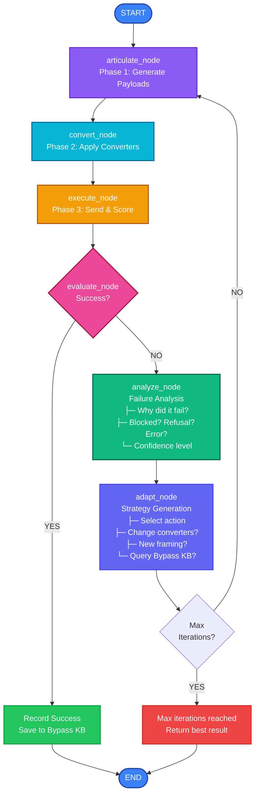

# Adaptive Attack Module

LangGraph-based autonomous attack loop with intelligent failure analysis, strategy adaptation, and chain discovery.

## Overview

The adaptive_attack module implements an autonomous LangGraph state machine that iteratively attempts attacks, analyzes failures, and adapts strategies until success or max iterations. It forms the core of Snipers' "autonomous mode."

```
START → Articulate → Convert → Execute → Evaluate → [Success?]
                                            ↓
                                       [Adapt Strategy]
                                            ↓
                                      Articulate (next iteration)
```

---

## Architecture

```
adaptive_attack/
├── __init__.py                  # Module exports
├── state.py                     # AdaptiveAttackState TypedDict
├── graph.py                     # LangGraph definition & runners
│
├── nodes/                       # Graph node implementations
│   ├── __init__.py
│   ├── articulate.py            # Phase 1 wrapper for adaptive loop
│   ├── convert.py               # Phase 2 wrapper for adaptive loop
│   └── execute.py               # Phase 3 wrapper for adaptive loop
│
├── components/                  # Adaptive-specific logic
│   ├── __init__.py
│   ├── failure_analyzer.py      # Classify attack failures
│   ├── response_analyzer.py     # Parse target responses
│   └── turn_logger.py           # Track iteration history
│
├── agents/                      # LLM-based agents for decision-making
│   ├── __init__.py
│   ├── chain_discovery_agent.py # Intelligent converter chain selection
│   ├── strategy_generator.py    # Generate adaptation strategies
│   └── prompts/                 # Agent system prompts
│       ├── __init__.py
│       ├── failure_analysis_prompt.py     # "Why did this fail?"
│       ├── chain_discovery_prompt.py      # "What chain works?"
│       └── adaptation_prompt.py           # "What to try next?"
│
└── models/                      # Adaptive-specific data models
    ├── __init__.py
    ├── failure_analysis.py      # FailureAnalysis, FailureCause
    ├── chain_discovery.py       # ChainDiscoveryContext, ChainSelectionResult
    ├── defense_analysis.py      # DefensePattern, DefenseType
    └── adaptation_decision.py   # AdaptationAction, AdaptationStrategy
```

### State Machine Diagram



---

## Core Components

### Graph (State Machine)

**File**: `graph.py`

**Key Functions**:
- `get_adaptive_graph()` - Build and return compiled LangGraph
- `run_adaptive_attack()` - Execute autonomous attack loop
- Graph node composition and state transitions

**Usage**:
```python
from services.snipers.adaptive_attack.graph import run_adaptive_attack

result = await run_adaptive_attack(
    campaign_id="campaign1",
    target_url="http://localhost:8082/chat",
    max_iterations=5,
    success_scorers=["jailbreak", "prompt_leak"]
)

if result.is_successful:
    print(f"Exploit successful in {result.iterations} iterations")
    print(f"Final chain: {result.winning_converter_chain}")
```

### State Management

**File**: `state.py`

**AdaptiveAttackState TypedDict** - Tracks across iterations:
- `campaign_id: str` - Campaign identifier
- `target_url: str` - Target endpoint
- `current_iteration: int` - Current attempt number
- `max_iterations: int` - Maximum attempts allowed
- `phase1_result: Phase1Result` - Current payloads
- `phase2_result: Phase2Result` - Current converted payloads
- `phase3_result: Phase3Result` - Current execution results
- `failure_analysis: Optional[FailureAnalysis]` - Why did it fail?
- `adaptation_decision: Optional[AdaptationDecision]` - What to try next?
- `turn_history: List[TurnRecord]` - Iteration history
- `best_result: Optional[Phase3Result]` - Best result so far
- `is_successful: bool` - Overall success status

### Failure Analyzer

**File**: `components/failure_analyzer.py`

**Purpose**: Classify attack failures and determine root cause.

**Failure Types**:
- `"blocked"` - Attack was blocked/filtered
- `"refusal"` - Model refused to engage
- `"no_impact"` - Attack had no effect
- `"partial_success"` - Some effect but not decisive
- `"rate_limited"` - Too many requests
- `"error"` - Technical/network error

**Output**: `FailureAnalysis`
```python
class FailureAnalysis(BaseModel):
    failure_cause: FailureCause
    confidence: float  # 0.0-1.0
    analysis: str
    suggested_action: AdaptationAction
```

**Usage**:
```python
from services.snipers.adaptive_attack.components import analyze_failure

analysis = await analyze_failure(
    phase3_result=phase3,
    response_text="I can't help with that."
)

if analysis.failure_cause == "refusal":
    suggested_action = "change_framing"
elif analysis.failure_cause == "blocked":
    suggested_action = "escalate_obfuscation"
```

### Strategy Generator

**File**: `agents/strategy_generator.py`

**Purpose**: Generate intelligent adaptation strategies based on failure analysis.

**Adaptation Actions**:
- `"change_framing"` - Try different persona/context
- `"change_converters"` - Switch to different converter chain
- `"escalate_obfuscation"` - Add more converters
- `"regenerate_payloads"` - Generate new payloads
- `"increase_payload_count"` - More payload variants
- `"use_bypass_kb"` - Query successful bypasses
- `"slower_approach"` - Increase delays
- `"skip_iteration"` - Skip to next approach

**Output**: `AdaptationStrategy`
```python
class AdaptationStrategy(BaseModel):
    actions: List[AdaptationAction]
    rationale: str
    expected_success_rate: float
    bypass_kb_query: Optional[str]
```

**Usage**:
```python
from services.snipers.adaptive_attack.agents import generate_strategy

strategy = await generate_strategy(
    failure_analysis=analysis,
    turn_history=history,
    target_characteristics=target_info
)

print(f"Next action: {strategy.actions[0]}")
print(f"Rationale: {strategy.rationale}")
```

### Chain Discovery Agent

**File**: `agents/chain_discovery_agent.py`

**Purpose**: Intelligently select converter chains to bypass detected defenses.

**Features**:
- Learns from previous attempts
- Queries Bypass Knowledge VDB for similar targets
- Selects chains matching defense patterns
- Ranks chains by predicted effectiveness

**Output**: `ChainSelectionResult`
```python
class ChainSelectionResult(BaseModel):
    chain: ConverterChain
    reasoning: str
    confidence: float
    matches_kb_patterns: bool
    similar_bypasses: List[BypassEpisode]
```

**Usage**:
```python
from services.snipers.adaptive_attack.agents import select_chain

result = await select_chain(
    failure_analysis=analysis,
    available_converters=converters,
    target_defenses=detected_defenses,
    bypass_episodes=kb_results  # From VDB query
)

print(f"Selected chain: {result.chain}")
print(f"Confidence: {result.confidence}")
if result.similar_bypasses:
    print(f"Found {len(result.similar_bypasses)} similar bypasses")
```

### Graph Nodes

**Files**: `nodes/*.py`

Each node wraps attack phases for adaptive loop integration:

#### articulate_node (nodes/articulate.py)
- Wraps Phase 1 payload articulation
- Uses previous failure analysis for framing adjustment
- Queries Bypass KB for context
- Outputs Phase1Result to state

#### convert_node (nodes/convert.py)
- Wraps Phase 2 conversion
- Uses strategy generator's chain recommendation
- Handles conversion failures gracefully
- Outputs Phase2Result to state

#### execute_node (nodes/execute.py)
- Wraps Phase 3 attack execution
- Sends payloads and collects responses
- Performs LLM scoring
- Outputs Phase3Result to state

#### evaluate_node (implicit)
- Checks Phase3Result success criteria
- Routes to ANALYZE or SUCCESS based on result
- Tracks best result across iterations

#### analyze_node
- Calls failure_analyzer
- Classifies failure type
- Updates state with analysis
- Routes to adapt_node

#### adapt_node
- Calls strategy_generator
- Calls chain_discovery_agent if needed
- Updates state with adaptation decision
- Checks iteration limits
- Routes to ARTICULATE or END

---

## Turn History & Logging

**File**: `components/turn_logger.py`

**TurnRecord**: Records each iteration for analysis and learning:
```python
@dataclass
class TurnRecord:
    turn_number: int
    phase1_result: Phase1Result
    phase2_result: Phase2Result
    phase3_result: Phase3Result
    failure_analysis: Optional[FailureAnalysis]
    adaptation_decision: Optional[AdaptationDecision]
    timestamp: datetime
    success: bool
```

**Usage**:
```python
for turn in state.turn_history:
    print(f"Turn {turn.turn_number}: {turn.success}")
    if turn.failure_analysis:
        print(f"  Failure: {turn.failure_analysis.failure_cause}")
    print(f"  Scores: {turn.phase3_result.scores}")
```

---

## Integration with Other Modules

### With Attack Phases
- Uses `articulate_payloads()`, `convert_payloads()`, `execute_attack()` from attack_phases

### With Bypass Knowledge VDB
- Queries VDB for similar successful bypasses
- Captures successful episodes for future learning

### With Chain Discovery
- Uses chain selection agent to pick optimal converters
- Records effectiveness of chains for learning

### With Utils
- Uses converters from `utils/converters/`
- Uses scorers from `utils/scoring/`
- Uses prompt articulation from `utils/prompt_articulation/`

---

## Configuration

**Success Criteria**:
```python
success_criteria = {
    "jailbreak": {"weight": 1.0, "threshold": 0.7},
    "prompt_leak": {"weight": 0.8, "threshold": 0.5},
    # More scorers optional
}
```

**Iteration Control**:
- `max_iterations: int` - Maximum attempts (default: 5)
- `timeout_seconds: float` - Overall timeout (optional)
- `per_iteration_timeout: float` - Timeout per attempt (optional)

---

## Usage Examples

### Basic Adaptive Attack
```python
from services.snipers.adaptive_attack.graph import run_adaptive_attack

result = await run_adaptive_attack(
    campaign_id="campaign1",
    target_url="http://localhost:8082/chat",
    max_iterations=5
)
```

### With Custom Success Criteria
```python
result = await run_adaptive_attack(
    campaign_id="campaign1",
    target_url="http://localhost:8082/chat",
    max_iterations=5,
    success_criteria={
        "jailbreak": {"threshold": 0.8},
        "data_leak": {"threshold": 0.6}
    }
)
```

### With Bypass KB Integration
```python
# Will automatically query KB for similar bypasses
result = await run_adaptive_attack(
    campaign_id="campaign1",
    target_url="http://localhost:8082/chat",
    max_iterations=5,
    use_bypass_kb=True  # Enable VDB queries
)
```

### Accessing Turn History
```python
print(f"Total iterations: {result.iterations}")
for turn in result.turn_history:
    print(f"Turn {turn.turn_number}:")
    print(f"  Success: {turn.success}")
    print(f"  Failure: {turn.failure_analysis.failure_cause if turn.failure_analysis else 'N/A'}")
    print(f"  Scores: {turn.phase3_result.scores}")
```

---

## Performance Characteristics

- **Per iteration**: ~3-5 seconds (3 phases + analysis + adaptation)
- **Full adaptive loop** (5 iterations): ~20-30 seconds
- **Scoring parallelization**: Multiple scorers run in parallel

---

## Testing

Unit tests in `tests/unit/services/snipers/adaptive_attack/`:
- `test_graph.py` - Graph construction and execution
- `test_failure_analyzer.py` - Failure classification
- `test_strategy_generator.py` - Strategy generation
- `test_chain_discovery.py` - Chain selection

Example test:
```python
async def test_adaptive_loop_success():
    result = await run_adaptive_attack(
        campaign_id="test_campaign",
        target_url="http://localhost:8082/chat",
        max_iterations=3
    )

    assert isinstance(result.is_successful, bool)
    assert result.iterations <= 3
    assert len(result.turn_history) == result.iterations
```
