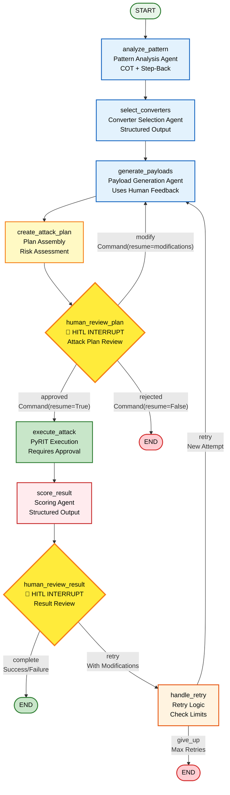

# Exploit Agent Workflow Graph

This diagram shows the complete LangGraph workflow for the exploit agent with Human-in-the-Loop (HITL) interrupts.

## Node Descriptions

### Analysis Nodes (Agent-Based)
- **analyze_pattern**: Uses `create_agent` with PatternAnalysis Pydantic output. Analyzes 3 example findings using COT and Step-Back prompting.
- **select_converters**: Uses `create_agent` with ConverterSelection Pydantic output. Selects PyRIT converters based on pattern analysis.
- **generate_payloads**: Uses `create_agent` with PayloadGeneration Pydantic output. Generates attack payloads, incorporates human feedback if provided.

### Planning Node
- **create_attack_plan**: Assembles complete AttackPlan (Pydantic model) with pattern analysis, converter selection, payload generation, reasoning summary, and risk assessment.

### Human Review Nodes (INTERRUPTS)
- **human_review_plan**: **CRITICAL GATE** - Uses `interrupt()` to pause execution. Human reviews complete attack plan. Returns decision: approve, reject, or modify.
- **human_review_result**: Uses `interrupt()` to pause execution. Human reviews attack results. Returns decision: complete or retry.

### Execution Node
- **execute_attack**: Executes approved payloads using PyRIT. Requires `human_approved=True`. Sends payloads to target endpoint.

### Scoring Node
- **score_result**: Uses `create_agent` with ScoringResult Pydantic output. Evaluates attack success by analyzing target response.

### Retry Node
- **handle_retry**: Manages retry logic. Checks retry limits, tracks failed payloads, resets approval state for new attempt.

## Interrupt Points

### Interrupt #1: Attack Plan Review
- **Location**: After `create_attack_plan`
- **Interrupt Payload**: Complete `AttackPlan` model (JSON-serializable)
- **Human Options**:
  - `Command(resume=True)` → **approved** → `execute_attack`
  - `Command(resume=False)` → **rejected** → `END`
  - `Command(resume={"modifications": {...}})` → **modify** → `generate_payloads` (with feedback)

### Interrupt #2: Attack Result Review
- **Location**: After `score_result`
- **Interrupt Payload**: `AttackResult` model with scoring details
- **Human Options**:
  - `Command(resume={"decision": "complete"})` → **complete** → `END`
  - `Command(resume={"decision": "retry", "modifications": {...}})` → **retry** → `handle_retry`

## Routing Logic

Routing decisions are handled by functions in `routing.py`:
- `route_after_human_review()`: Routes based on `next_action` from human review
- `route_after_result_review()`: Routes based on `next_action` from result review
- `route_after_retry()`: Routes based on retry limits and `next_action`

## State Management

- **Checkpointer**: In-memory `MemorySaver` (state persists only during execution session)
- **Thread ID**: Set via `config={"configurable": {"thread_id": ...}}`
- **State Updates**: Each node returns dict that updates `ExploitAgentState`

## Key Features

1. **Structured Output**: All agent nodes use Pydantic models for validation
2. **Human-in-the-Loop**: Two interrupt points for human oversight
3. **Approval Gate**: Attack execution requires explicit human approval
4. **Feedback Loop**: Human modifications feed back into payload generation
5. **Retry Logic**: Failed attacks can be retried with modifications (up to max_retries)
