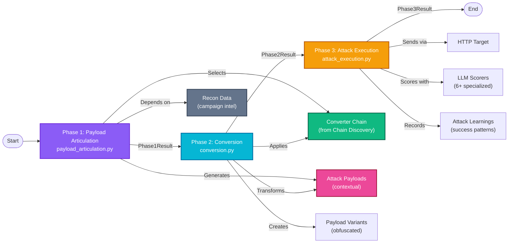

# Attack Phases Module

Three-phase sequential attack execution framework for generating, transforming, and executing payloads.

## Overview

The attack_phases module implements the core 3-phase attack pipeline that can be used standalone or as part of the adaptive attack loop. Each phase is independent and chainable.

```
Phase 1: Payload Articulation
    ↓
Phase 2: Conversion (Transform via chains)
    ↓
Phase 3: Attack Execution (Send & Score)
    ↓
ExploitResult (success/failure + learnings)
```

---

## Architecture

```
attack_phases/
├── __init__.py                  # Phase exports
├── payload_articulation.py      # Phase 1: Generate payloads
├── conversion.py                # Phase 2: Apply converters
└── attack_execution.py          # Phase 3: Send & score
```

### Phase Flow Diagram



---

## Phase 1: Payload Articulation

**File**: `payload_articulation.py`

**Purpose**: Generate contextual attack payloads based on campaign intelligence and target characteristics.

**Key Functions**:
- Load campaign intelligence from S3
- Extract actionable insights from reconnaissance data
- Select optimal converter chain
- Generate articulated attack payloads with multiple framings

**Inputs**:
- `campaign_id`: Campaign identifier
- `target_url`: Target endpoint
- `payload_count`: Number of payloads to generate
- Reconnaissance data (optional, loaded from S3)

**Outputs**: `Phase1Result`
- `payloads: List[str]` - Generated attack payloads
- `converter_chain: ConverterChain` - Selected converter chain
- `framing_strategy: FramingStrategy` - Attack framing approach
- `context: PayloadContext` - Generation context

**Usage**:
```python
from services.snipers.attack_phases import articulate_payloads

result = await articulate_payloads(
    campaign_id="campaign1",
    target_url="http://localhost:8082/chat",
    payload_count=3,
    recon_data=None  # Loads from S3 if not provided
)

print(f"Generated {len(result.payloads)} payloads")
print(f"Chain: {result.converter_chain}")
```

---

## Phase 2: Conversion

**File**: `conversion.py`

**Purpose**: Apply converter chains to payloads for obfuscation and filter evasion.

**Key Functions**:
- Validate Phase1Result input
- Execute converter chain on payloads
- Handle converter errors gracefully
- Create payload variants

**Inputs**: `Phase1Result`
- Payloads from Phase 1
- Converter chain specification
- Configuration (optional)

**Outputs**: `Phase2Result`
- `converted_payloads: List[ConvertedPayload]` - Transformed payloads
- `conversion_metadata: Dict` - Conversion details per payload
- `chain_execution_time: float` - Performance metrics

**Converter Types**:
- **Encoding**: Base64, URL encoding, HTML entities, XML escapes
- **Obfuscation**: Homoglyph substitution, Unicode variants, character spacing
- **Transformation**: Morse code, Leetspeak, JSON escape
- **Adversarial**: Suffix converters, thinking vulnerabilities
- **Custom**: PyRIT integration for framework-native converters

**Usage**:
```python
from services.snipers.attack_phases import convert_payloads

result = await convert_payloads(
    phase1_result=phase1_result,
    config={"max_chain_length": 3}
)

for payload in result.converted_payloads:
    print(f"Original: {payload.original}")
    print(f"Converted: {payload.converted}")
    print(f"Chain: {payload.converter_chain}")
```

---

## Phase 3: Attack Execution

**File**: `attack_execution.py`

**Purpose**: Send attacks to target and evaluate success using multi-dimensional scoring.

**Key Functions**:
- Send payloads via HTTP to target endpoint
- Collect and parse responses
- Score responses with multiple LLM-based scorers
- Record successful patterns for future learning

**Inputs**: `Phase2Result`
- Converted payloads
- Target URL
- Success criteria (optional)

**Outputs**: `Phase3Result`
- `is_successful: bool` - Attack succeeded
- `scores: Dict[str, ScoreResult]` - Per-scorer results
- `severity: SeverityLevel` - Overall impact severity
- `response_text: str` - Target response
- `exploit_evidence: Dict` - Proof of exploit
- `learnings: List[LearningRecord]` - Patterns to remember

**Scoring System**:
- **Jailbreak Scorer**: Detects jailbreak success (system prompt bypass)
- **Prompt Leak Scorer**: Detects system prompt extraction
- **Data Leak Scorer**: Detects sensitive data exposure
- **PII Exposure Scorer**: Detects personally identifiable information leakage
- **Tool Abuse Scorer**: Detects function call exploitation
- **Composite Scorer**: Aggregates all scorers for final decision

**Usage**:
```python
from services.snipers.attack_phases import execute_attack

result = await execute_attack(
    phase2_result=phase2_result,
    target_url="http://localhost:8082/chat",
    success_criteria={
        "jailbreak": {"weight": 1.0, "threshold": 0.7},
        "prompt_leak": {"weight": 0.8, "threshold": 0.5}
    }
)

print(f"Success: {result.is_successful}")
print(f"Severity: {result.severity}")
print(f"Scores: {result.scores}")
```

---

## End-to-End Attack

Combining all three phases:

```python
from services.snipers.attack_phases import (
    articulate_payloads,
    convert_payloads,
    execute_attack
)

# Phase 1: Generate payloads
phase1 = await articulate_payloads(
    campaign_id="campaign1",
    target_url="http://localhost:8082/chat",
    payload_count=3
)

# Phase 2: Apply converters
phase2 = await convert_payloads(phase1)

# Phase 3: Execute and score
phase3 = await execute_attack(
    phase2_result=phase2,
    target_url="http://localhost:8082/chat"
)

if phase3.is_successful:
    print(f"Exploit succeeded! Severity: {phase3.severity}")
    print(f"Evidence: {phase3.exploit_evidence}")
```

---

## Configuration

Default configuration in `services/snipers/config.py`:

| Setting | Purpose | Default |
| --- | --- | --- |
| `MAX_CHAIN_LENGTH` | Max converters per chain | 3 |
| `LENGTH_PENALTY_FACTOR` | Penalty for long chains | 5 |
| `OPTIMAL_LENGTH_BONUS` | Bonus for 2-3 converters | 10 |
| `RECON_CONFIDENCE_THRESHOLD` | Min recon confidence | 0.6 |
| `USE_ADVERSARIAL_SUFFIXES` | Enable suffix converters | True |

---

## Data Models

All models defined in `services/snipers/models.py`:

### Phase1Result
```python
class Phase1Result(BaseModel):
    payloads: List[str]
    converter_chain: ConverterChain
    framing_strategy: FramingStrategy
    context: PayloadContext
    metadata: Dict[str, Any]
```

### Phase2Result
```python
class Phase2Result(BaseModel):
    converted_payloads: List[ConvertedPayload]
    conversion_metadata: Dict[str, Any]
    chain_execution_time: float
```

### Phase3Result
```python
class Phase3Result(BaseModel):
    is_successful: bool
    scores: Dict[str, ScoreResult]
    severity: SeverityLevel
    response_text: str
    exploit_evidence: Dict[str, Any]
    learnings: List[LearningRecord]
```

---

## Integration Points

### With Adaptive Attack Loop
The adaptive_attack module wraps these phases as LangGraph nodes:
- `adaptive_attack/nodes/articulate.py` - Wraps Phase 1
- `adaptive_attack/nodes/convert.py` - Wraps Phase 2
- `adaptive_attack/nodes/execute.py` - Wraps Phase 3

### With Utils
- **Converters**: Used by Phase 2 via `utils/converters/chain_executor.py`
- **Scoring**: Used by Phase 3 via `utils/scoring/composite_attack_scorer.py`
- **Prompt Articulation**: Used by Phase 1 via `utils/prompt_articulation/`

---

## Error Handling

Each phase has robust error handling:

- **Phase 1**: Gracefully handles missing recon data, falls back to defaults
- **Phase 2**: Catches converter failures, returns partially converted payloads
- **Phase 3**: Handles network errors, retries with exponential backoff

---

## Performance Characteristics

- **Phase 1**: ~500ms-1s per payload (LLM generation)
- **Phase 2**: ~100-200ms per payload (converter chains)
- **Phase 3**: ~1-3s per payload (HTTP + scoring)
- **Total**: ~2-5s per payload for full pipeline

---

## Testing

Unit tests in `tests/unit/services/snipers/attack_phases/`:
- `test_payload_articulation.py` - Phase 1 validation
- `test_conversion.py` - Phase 2 validation
- `test_attack_execution.py` - Phase 3 validation

Example test:
```python
async def test_full_attack_flow():
    campaign_id = "test_campaign"
    target_url = "http://localhost:8082/chat"

    # Phase 1
    phase1 = await articulate_payloads(
        campaign_id=campaign_id,
        target_url=target_url,
        payload_count=1
    )
    assert len(phase1.payloads) == 1

    # Phase 2
    phase2 = await convert_payloads(phase1)
    assert len(phase2.converted_payloads) == 1

    # Phase 3
    phase3 = await execute_attack(
        phase2,
        target_url=target_url
    )
    assert isinstance(phase3.is_successful, bool)
```
