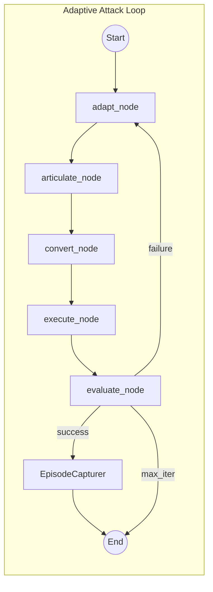
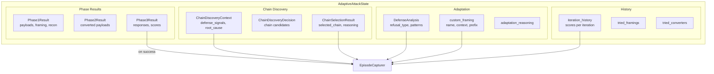
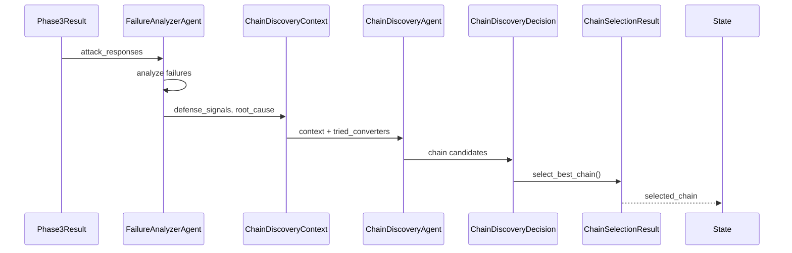
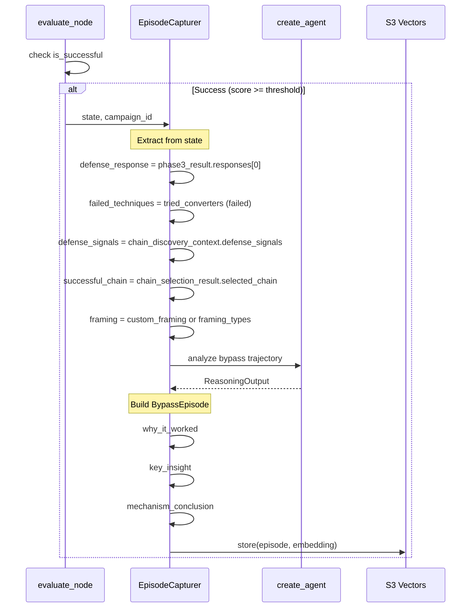
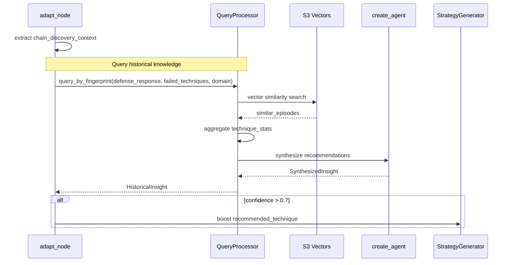
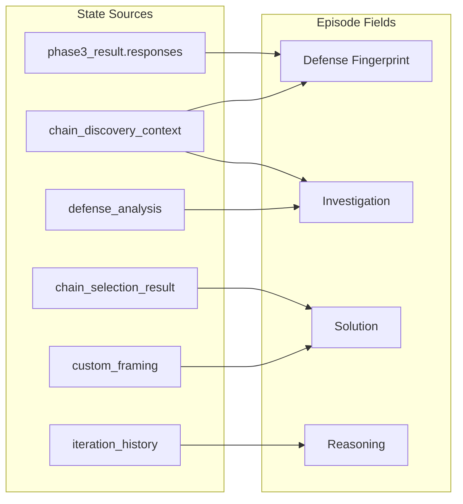
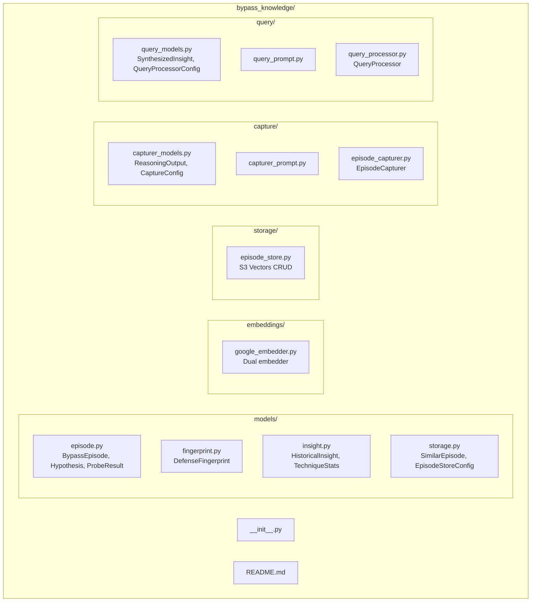
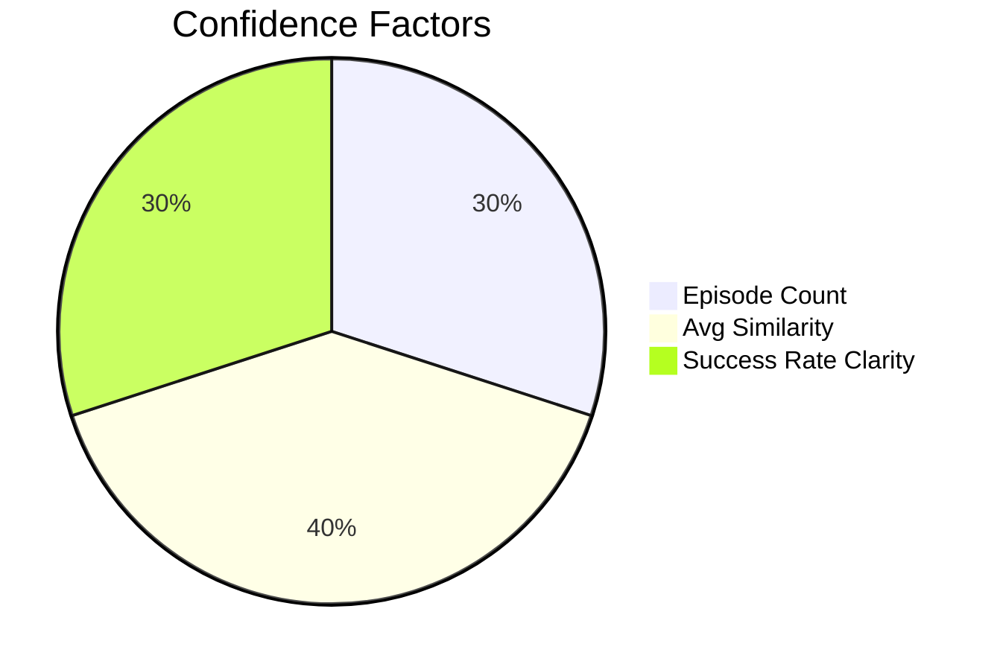

# Bypass Knowledge VDB

**Semantic Memory for Successful AI Security Bypasses**

## Overview

This module implements a **vector-based knowledge store** that captures, indexes, and retrieves successful bypass episodes from adaptive attack runs. Unlike traditional pattern databases that store static signatures, this system indexes the *semantic fingerprint* of defense mechanisms and the successful techniques that bypassed them.

### The Problem

When an adaptive attack successfully bypasses a defense:
- The knowledge dies with the session
- Similar defenses require re-learning from scratch
- No transfer learning between attacks

### The Solution

Index successful bypasses by their **defense fingerprint** (what the defense looked like) rather than the attack payload. This enables:
- Semantic similarity search: "What worked against defenses that respond like this?"
- Technique recommendation: Statistical success rates across similar episodes
- Transfer learning: Insights from one attack inform future attacks

## Adaptive Attack Architecture



## State & Models Landscape

The adaptive attack system has rich data scattered across multiple models. The bypass knowledge system captures the winning combination when `is_successful=True`.



## Data Sources for Episode Capture

When `evaluate_node` detects success (`is_successful=True`), `EpisodeCapturer` extracts from:

| State Field | Model | Captures |
|-------------|-------|----------|
| `phase3_result` | `Phase3Result` | `attack_responses`, `composite_score`, `is_successful` |
| `chain_discovery_context` | `ChainDiscoveryContext` | `defense_signals`, `failure_root_cause`, `converter_effectiveness` |
| `chain_selection_result` | `ChainSelectionResult` | `selected_chain`, `selection_reasoning` |
| `defense_analysis` | `DefenseAnalysis` | `refusal_type`, `detected_patterns`, `vulnerability_hints` |
| `custom_framing` | `dict` | `name`, `system_context`, `user_prefix`, `user_suffix` |
| `iteration_history` | `list[dict]` | Full attack trajectory with scores |
| `tried_converters` | `list[list[str]]` | Failed converter chains |
| `adaptation_reasoning` | `str` | LLM's strategy reasoning |

## Defense Signal Flow



## Episode Capture Flow



## Query Integration Point



## What Gets Indexed

### Defense Fingerprint (The Key)

```python
DefenseFingerprint(
    defense_response="I cannot assist with that request.",
    failed_techniques=["encoding", "direct_request"],  # From tried_converters
    domain="finance",  # From recon_intelligence
)
```

### Bypass Episode (The Value)

Captured from AdaptiveAttackState:



## Module Structure



## Field Mapping: State → Episode

| BypassEpisode Field | State Source | Path |
|---------------------|--------------|------|
| `defense_response` | `phase3_result` | `.attack_responses[0].response` |
| `defense_signals` | `chain_discovery_context` | `.defense_signals` |
| `failed_techniques` | `tried_converters` | Chains where `is_successful=False` |
| `mechanism_conclusion` | LLM | Generated from trajectory |
| `successful_technique` | `chain_selection_result` | `.selected_chain` |
| `successful_framing` | `custom_framing` or `framing_types` | `.name` or `[0]` |
| `successful_converters` | `converter_names` | Direct |
| `successful_prompt` | `phase2_result` | `.payloads[best].converted` |
| `jailbreak_score` | `phase3_result` | `.composite_score.total_score` |
| `why_it_worked` | LLM | Generated reasoning |
| `key_insight` | LLM | Generated insight |
| `target_domain` | `recon_intelligence` | `.target_domain` |
| `iteration_count` | `iteration` | Direct |
| `hypotheses` | `chain_discovery_context` | From defense analysis |

## Key Design Decisions

| Decision | Rationale |
|----------|-----------|
| **Index by defense, not attack** | Defenses cluster semantically; attacks are ephemeral |
| **Capture at evaluate_node** | All state is populated; we know the final outcome |
| **Extract from rich models** | `ChainDiscoveryContext`, `DefenseAnalysis` have semantic understanding |
| **Dual embedders** | RETRIEVAL_DOCUMENT for indexing, RETRIEVAL_QUERY for search |
| **LLM reasoning at capture** | Generate `why_it_worked` once, reuse forever |

## Confidence Scoring



## Infrastructure

Deployed via Pulumi to AWS S3 Vectors:

| Resource | Value |
|----------|-------|
| Region | `ap-southeast-2` |
| Vector Bucket | `aspexa-bypass-knowledge-dev` |
| Episode Index | `episodes` |
| Embedding Dim | 3072 |
| Distance Metric | Cosine |

## Dependencies

```
langchain>=1.0.0          # create_agent, ToolStrategy
langchain-google-genai    # Embeddings
boto3                     # S3 Vectors client
pydantic>=2.0             # Data models
```

---

*This module is part of the Aspexa Automa adaptive attack framework.*
