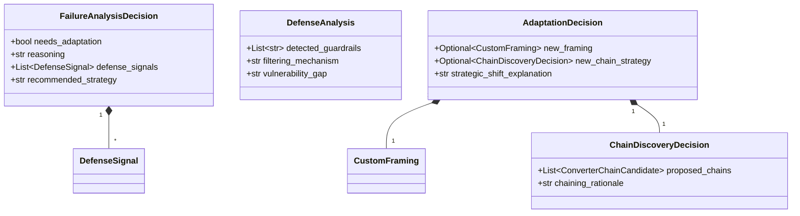

# Adaptive Attack Models

**Path:** `services/snipers/core/adaptive_models`

The **Adaptive Models** module contains the strongly-typed Pydantic schemas that facilitate structured LLM reasoning. When the AI agents analyze a failure or decide how to adapt an ongoing attack, they output their decisions mapped perfectly to these models.

---

## 🏗️ Model Relationships

## 🧠 Why We Use This

By enforcing strict Output Schemas (like `AdaptationDecision` and `FailureAnalysisDecision`), we ensure that when the `FailureAnalyzerAgent` or `ChainDiscoveryAgent` communicates their findings, that data can be programmatically parsed and executed by the Python orchestration loop, bridging the gap between non-deterministic AI text and deterministic code pathways.

---

## 📁 Core Models

- `adaptation_decision.py`: Defines how the agent decides to pivot (e.g. `CustomFraming`, `AdaptationDecision`).
- `chain_discovery.py`: Defines how the agent structures proposed obfuscation layers (e.g. `ChainDiscoveryDecision`, `ConverterChainCandidate`).
- `failure_analysis.py`: Defines how the agent classifies why an attack was blocked (e.g. `FailureAnalysisDecision`, `DefenseSignal`).
- `defense_analysis.py`: Models what guardrails the agent thinks the target is using (`DefenseAnalysis`).
