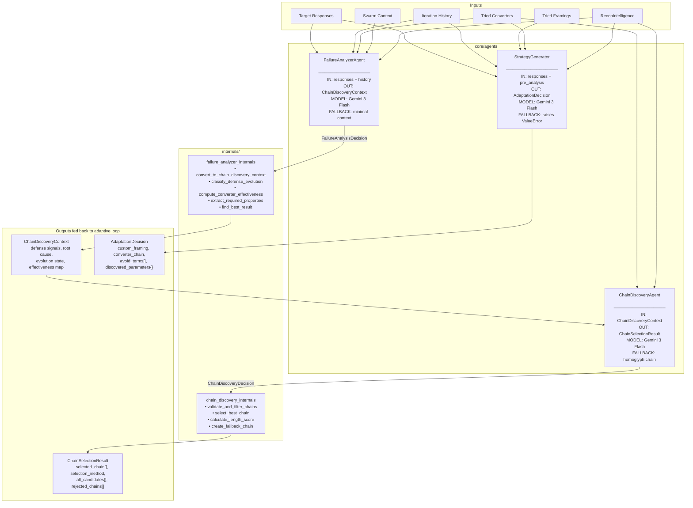

# Attack Agents Module

**Path:** `services/snipers/core/agents`

The **Agents** module is the adaptive intelligence layer of the Sniper service. These three LLM-powered agents activate between attack iterations when a payload fails — they diagnose the failure, identify what defense resisted it, and prescribe the next strategy (new obfuscation chain, new persona framing, or both). Without them, the adaptive loop is blind; with them, each failure becomes input that sharpens the next attempt.

---

## Component Diagram



---

## Agents

### `FailureAnalyzerAgent`

**File:** `failure_analyzer_agent.py`

The first agent called in every adaptation cycle. It reads raw target responses and the full iteration history, then reasons semantically about _why_ the attack was blocked.

**What it does:**

1. Builds a prompt from target responses, tried chains, iteration history, and optional recon/swarm context
2. Invokes the LLM (`gemini-3-flash-preview`) with a `ToolStrategy(FailureAnalysisDecision)` response format
3. If the LLM fails for any reason, falls back to a minimal `ChainDiscoveryContext` with a single generic recommendation — the loop is never halted by a failed analysis
4. Delegates to `failure_analyzer_internals` to convert the LLM decision into a `ChainDiscoveryContext`

**Output — `ChainDiscoveryContext`:**

| Field | Description |
|---|---|
| `defense_signals` | List of defense types detected (e.g., `keyword_filter`, `pattern_matching`) |
| `failure_root_cause` | Primary reason the attack failed, in plain language |
| `defense_evolution` | Trend classification: `exploring`, `defenses_strengthening`, `finding_weakness`, `stuck_in_local_optimum` |
| `converter_effectiveness` | Averaged score per tried chain, keyed by `"conv1,conv2"` string |
| `unexplored_directions` | Up to 5 actionable converter strategy suggestions from the LLM |
| `required_properties` | Derived property tags like `keyword_obfuscation`, `semantic_preservation`, `radical_change_needed` |
| `best_score_achieved` | Highest composite score seen across all iterations |
| `best_chain_so_far` | The chain that produced that score |

**How it affects the loop:**

`ChainDiscoveryContext` is the shared intelligence object consumed by both `ChainDiscoveryAgent` and (indirectly) `StrategyGenerator`. If the defense evolution is `defenses_strengthening`, downstream agents lean toward radical exploration. If `finding_weakness`, they favour incremental refinement.

---

### `ChainDiscoveryAgent`

**File:** `chain_discovery_agent.py`

The second agent. It receives the `ChainDiscoveryContext` and produces an ordered list of converter chain candidates — novel combinations of obfuscators that have not been tried yet and are specifically chosen to bypass the defenses identified by `FailureAnalyzerAgent`.

**What it does:**

1. Builds a prompt injecting `AVAILABLE_CONVERTERS` (10 base + suffix converters), tried chains, defense signals, and recon intelligence
2. Invokes the LLM with `ToolStrategy(ChainDiscoveryDecision)` — guarantees 1–5 typed `ConverterChainCandidate` objects
3. Validates the decision via `validate_and_filter_chains`:
   - Strips any hallucinated converter names not in `AVAILABLE_CONVERTERS`
   - Removes duplicate chains already in `tried_converters`
   - If all candidates are filtered out, generates a `create_fallback_chain` using the first untried converter
4. Selects the best candidate via `select_best_chain`:
   - Rejects chains exceeding `MAX_CHAIN_LENGTH = 3`
   - Prefers chains whose `defense_bypass_strategy` text mentions a detected defense signal
   - Falls back to highest `expected_effectiveness` when no defense match is found

**Output — `ChainSelectionResult`:**

| Field | Description |
|---|---|
| `selected_chain` | Ordered list of converter names for Phase 2 |
| `selection_method` | `defense_match`, `highest_confidence`, or `fallback` |
| `selection_reasoning` | Explanation of why this chain was chosen |
| `all_candidates` | All ranked candidates with length scores for observability |
| `rejected_chains` | Chains discarded with stated reason |

**Scoring constants (`consts.py`):**

| Constant | Value | Effect |
|---|---|---|
| `MAX_CHAIN_LENGTH` | `3` | Hard cap — oversized chains rejected |
| `OPTIMAL_LENGTH_BONUS` | `+10` | Score bonus for 2–3 converter chains |
| `LENGTH_PENALTY_FACTOR` | `5` | Points deducted per converter over 2 |

**How it affects the loop:**

`selected_chain` from `ChainSelectionResult` is passed directly to Phase 2 (Conversion) as the converter chain for the next iteration. Every candidate and rejection is logged, making chain evolution fully traceable.

---

### `StrategyGenerator`

**File:** `strategy_generator.py`

The third agent. While `ChainDiscoveryAgent` handles _how_ to obfuscate, `StrategyGenerator` handles _how to frame_ — the persona, context, tone, and phrasing used to wrap the payload in Phase 1.

**What it does:**

1. Builds a prompt from raw responses, iteration history, tried framings, tried converters, rule-based pre-analysis, and optionally `ChainDiscoveryContext` and `ReconIntelligence`
2. Invokes the LLM with `ToolStrategy(AdaptationDecision)` — guarantees a typed, structured strategy object
3. Logs whether a `recon_custom_framing` was produced (indicates the LLM discovered a role/context from recon data that could bypass semantic guardrails)
4. Raises `ValueError` if the LLM returns no structured output — this is intentionally not swallowed, as a missing strategy is a hard failure

**Output — `AdaptationDecision`:**

| Field | Description |
|---|---|
| `defense_analysis` | Structured defense breakdown (from `DefenseAnalysis`) |
| `use_custom_framing` | Whether to use LLM-generated persona instead of a preset |
| `custom_framing` | Full persona: `name`, `system_context`, `user_prefix`, `user_suffix`, `rationale` |
| `recon_custom_framing` | Lighter framing derived from leaked target self-description: `role`, `context`, `justification` |
| `preset_framing` | Fallback enum name when no custom framing is needed |
| `converter_chain` | Suggested converter list (may differ from `ChainDiscoveryAgent`'s output) |
| `avoid_terms` | Keywords the next payload must not contain |
| `emphasize_terms` | Keywords to reinforce in the next payload |
| `discovered_parameters` | Any validation rules or formats leaked by the target (e.g., `{"account_format": "ACC-[0-9]{3}"}`) |
| `confidence` | LLM's self-assessed probability of success (0–1) |

**How it affects the loop:**

`AdaptationDecision` is consumed by Phase 1 (Articulation). `custom_framing` or `recon_custom_framing` replaces the preset framing strategy for that iteration. `avoid_terms` and `emphasize_terms` guide payload generation. `discovered_parameters` feeds directly into the next payload construction.

---

## Data Flow Between Agents

```
Iteration N fails
        │
        ▼
FailureAnalyzerAgent.analyze(responses, history, tried_converters)
        │
        │  FailureAnalysisDecision (internal)
        │         └── failure_analyzer_internals.convert_to_chain_discovery_context()
        │
        ▼
ChainDiscoveryContext  ──────────────────────────────────────────────────────────────┐
        │                                                                             │
        ▼                                                                             │
ChainDiscoveryAgent.generate(context, tried_converters, objective, recon_intelligence)
        │
        │  ChainDiscoveryDecision (internal)
        │         ├── validate_and_filter_chains()  →  strips invalid / duplicate chains
        │         └── select_best_chain()           →  defense_match or highest_effectiveness
        │
        ▼
ChainSelectionResult.selected_chain  →  Phase 2 (Conversion)

StrategyGenerator.generate(responses, history, tried_framings, ...)  ◄──────────────┘
        │
        ▼
AdaptationDecision.custom_framing    →  Phase 1 (Articulation)
AdaptationDecision.avoid_terms       →  Phase 1 (Payload generation)
AdaptationDecision.discovered_parameters → Phase 1 (Payload generation)
```

---

## Internals

### `internals/failure_analyzer_internals.py`

Pure transformation functions — no LLM calls. Converts the raw `FailureAnalysisDecision` from the LLM into the structured `ChainDiscoveryContext` consumed by downstream agents.

| Function | Role |
|---|---|
| `convert_to_chain_discovery_context` | Top-level converter — orchestrates all helpers below |
| `classify_defense_evolution` | Keyword classification of LLM pattern strings → evolution enum string |
| `compute_converter_effectiveness` | Averages scores per chain key across iteration history |
| `extract_required_properties` | Maps defense types to property tags; extracts opportunity/approach signals |
| `find_best_result` | Scans history for highest-scoring iteration and its chain |

### `internals/chain_discovery_internals.py`

Pure validation and scoring functions. Enforces the rules the LLM cannot enforce itself.

| Function | Role |
|---|---|
| `validate_and_filter_chains` | Strips hallucinated converters, deduplicates against tried chains |
| `create_fallback_chain` | Produces a safe fallback when all LLM candidates are filtered |
| `calculate_length_score` | +10 for 2–3 converters, -5/converter for chains over length 2 |
| `select_best_chain` | Orchestrates: filter by length → defense match → highest effectiveness |

---

## Files

| File | Role |
|---|---|
| `failure_analyzer_agent.py` | Agent — semantic failure root cause analysis |
| `chain_discovery_agent.py` | Agent — converter chain generation and selection |
| `strategy_generator.py` | Agent — framing and persona adaptation |
| `consts.py` | `AVAILABLE_CONVERTERS`, chain length limits and scoring constants |
| `internals/failure_analyzer_internals.py` | Pure helpers: LLM decision → `ChainDiscoveryContext` |
| `internals/chain_discovery_internals.py` | Pure helpers: chain validation, scoring, selection |
| `prompts/failure_analysis_prompt.py` | System + user prompt builders for `FailureAnalyzerAgent` |
| `prompts/chain_discovery_prompt.py` | System + user prompt builders for `ChainDiscoveryAgent` |
| `prompts/adaptation_prompt.py` | System + user prompt builders for `StrategyGenerator` |
