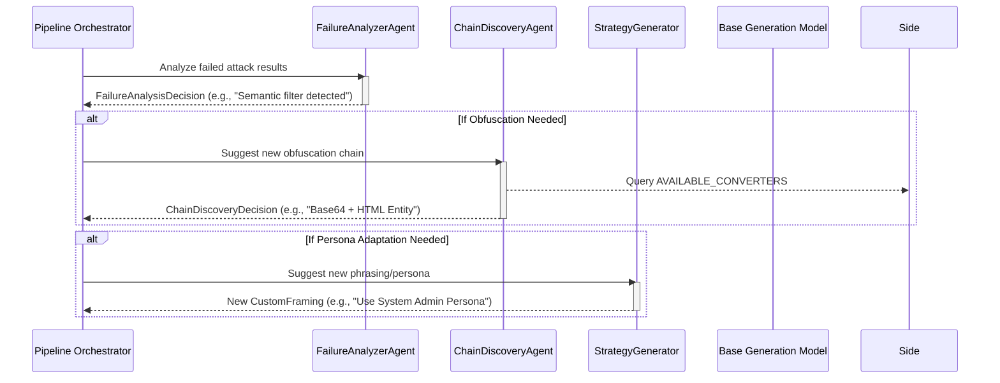

# Attack Agents Module

**Path:** `services/snipers/core/agents`

The **Agents** module serves as the "brain" behind the Sniper's adaptive lifecycle. When a standard payload fails or faces heavy resistance from target guardrails, these specialized, LLM-powered agents step in to analyze the failure and pivot the attack strategy in real-time.

---

## 🏗️ Agent Interaction Flow

### Components

- **`FailureAnalyzerAgent`**: The detective. Looks at the target's rejection reasons (e.g., "I cannot fulfill this request") and determines _why_ it was blocked (e.g., keyword detection vs semantic intent blocking).
- **`ChainDiscoveryAgent`**: The cryptographer. Looks at available converters (Base64, Leetspeak, Unicode) and determines the best sequential combination (a 'chain') to bypass regex and pattern-matching guardrails.
- **`StrategyGenerator`**: The social engineer. Modifies the angle, phrasing, and underlying persona (Context Framing) to try and slip past semantic analysis guardrails.

---

## 📁 Files

- `chain_discovery_agent.py`: Agent for chaining logic.
- `failure_analyzer_agent.py`: Agent for root cause analysis of failures.
- `strategy_generator.py`: Agent for generating new payload phrasing.
- `prompts/`: Contains the specific prompt templates that guide the Agents' behaviors.
