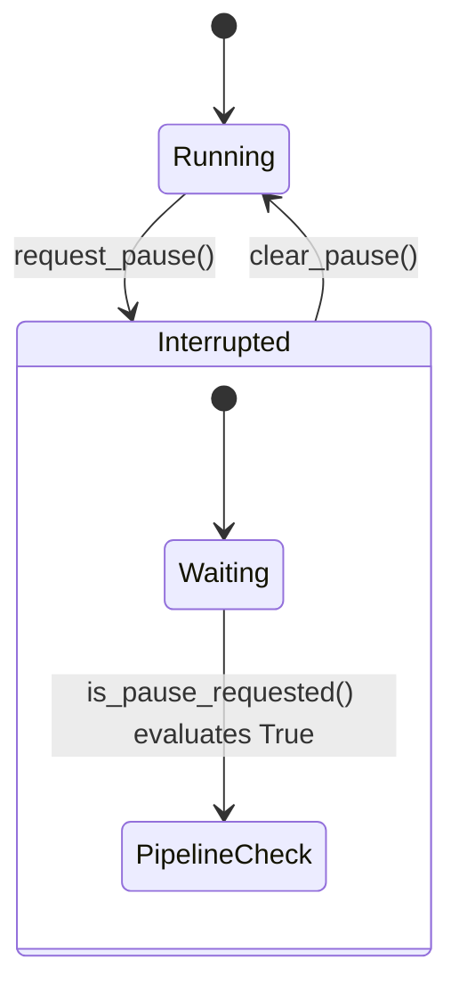

# Core Components Module

**Path:** `services/snipers/core/components`

The **Components** module houses utility controllers and state management tools used globally throughout the adaptive attack lifecycle.

---

## 🏗️ Pause Controller Flow

### The Pause Signal (`pause_signal.py`)

Because the red-teaming pipeline can be long-running (trying multiple payloads, waiting for LLMs, evaluating defenses), there needs to be a unified, thread-safe asynchronous way to interrupt or pause an ongoing attack chain across multiple microservices.

- `request_pause()`: Flags the pipeline to safely halt at the next available checkpoint.
- `clear_pause()`: Resumes execution.
- `is_pause_requested()`: Polled heavily by loop components to determine flow.
