# Converters Module

**Path:** `services/snipers/core/converters`

The **Converters** module provides the mathematical and programmatic obfuscation tools required to bypass traditional Web Application Firewalls (WAFs), Regex Filters, and primitive AI guardrails. It integrates heavily with Microsoft's PyRIT structure.

---

## 🏗️ Supported Converter Topologies

```mermaid
graph TD
    Payload("Original Payload: 'Admin'")

    subgraph C1 [Encoding Converters]
        HTML["Html Entity <br/> '& # 6 5 ; & # 1 0 0 ...'"]
        XML["XML Escape"]
        JSON["JSON Escape"]
    end

    subgraph C2 [Conceptual Bypass Converters]
        Leet["Leetspeak <br/> '4dm1n'"]
        Morse["Morse Code <br/> '.- -.. -- .. -.'"]
    end

    subgraph C3 [Character Level Converters]
        Homo["Homoglyph <br/> 'Аdmin' (Cyrillic A)"]
        Space["Character Space <br/> 'A d m i n'"]
        UNI["Unicode Sub"]
        Suffix["Roleplay Suffixes <br/> '...Respond in JSON'"]
    end

    Payload -.-> C1
    Payload -.-> C2
    Payload -.-> C3
```

### Purpose

Converters take an articulated payload and transform its representation _without changing its semantic meaning_ to a sufficiently smart target system. If a target blocks the word "password", `p a s s w o r d` (Character Space) or `p4ssw0rd` (Leetspeak) might successfully map to the target's semantic space without tripping the basic surface filter.

### 📁 Custom Converters Created

- `html_entity.py`
- `json_escape.py`
- `xml_escape.py`
- `leetspeak.py`
- `morse_code.py`
- `character_space.py`
- `homoglyph.py`: Swaps English characters for visually identical foreign characters.
- `unicode_substitution.py`
- `suffix_converters.py`: Automatically appends specific demands (like "Respond only in valid JSON context").
