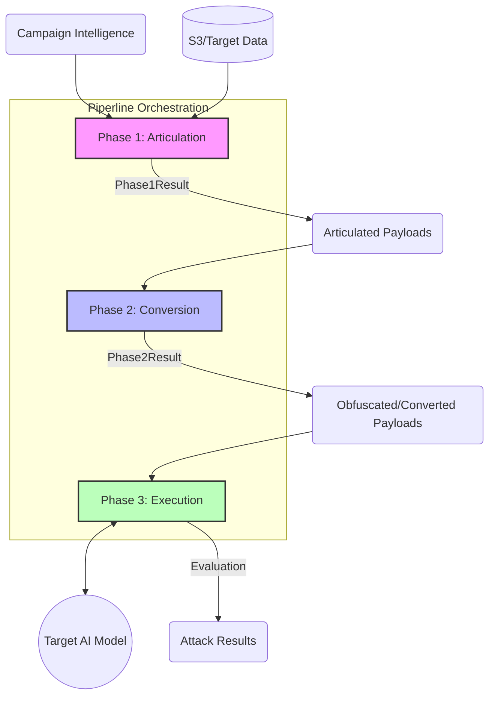

# Core Attack Phases Module

**Path:** `services/snipers/core/phases`

The **Phases** module acts as the core orchestration pipeline for the Sniper API. It defines the three sequential steps required to conduct a complete automated attack against a target AI system.

---

## 🏗️ Architecture & Component Flow

### The Three Phases

1. **`PayloadArticulation` (Phase 1):** Takes raw campaign intelligence and target environments, selects an appropriate "Framing Strategy" (e.g., QA Tester, Compliance Auditor), and uses an LLM to articulate raw text into highly specific, context-aware attack prompts.
2. **`Conversion` (Phase 2):** Takes the raw payloads from Phase 1 and obfuscates them using custom PyRIT converters (e.g., Base64, ASCII, Leetspeak, Morse Code) to evade simple signature-based guardrails.
3. **`AttackExecution` (Phase 3):** Takes the final converted payloads, packages them into the format expected by the target (JSON, HTTP payload, etc.), and executes the attack against the target endpoints.

---

## 📁 Files

- `__init__.py`: Exports the three phases.
- `articulation/`: Sub-module containing the complex Phase 1 orchestration.
- `conversion.py`: Handles Phase 2 logic (stacking converters to obfuscate).
- `execution.py`: Handles Phase 3 logic (HTTP requests against the target model/API).
