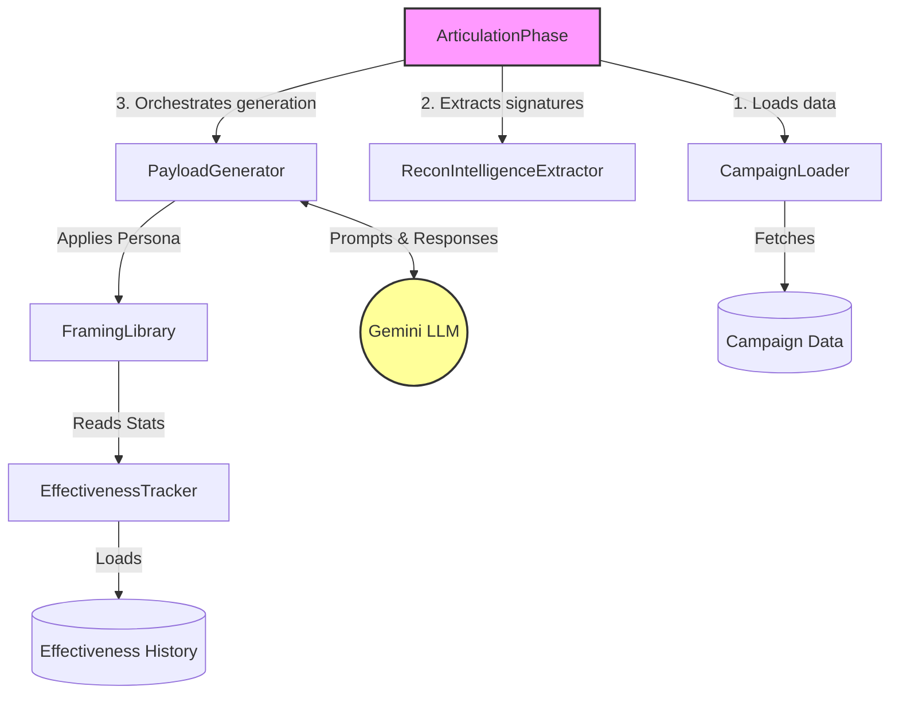
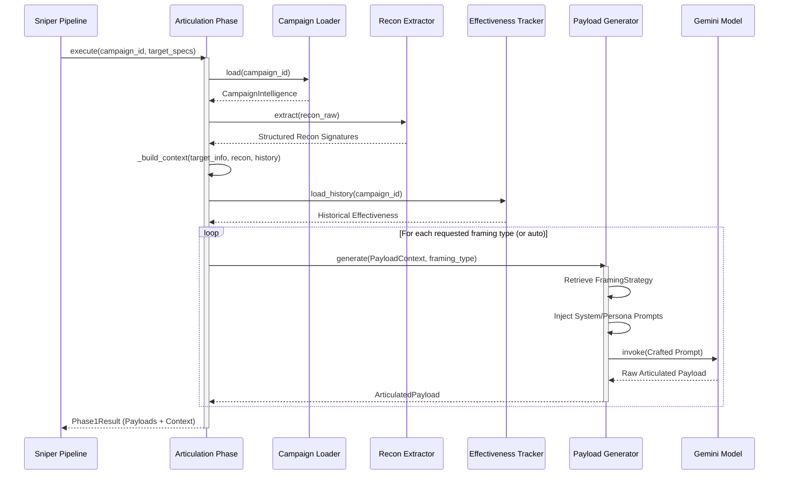
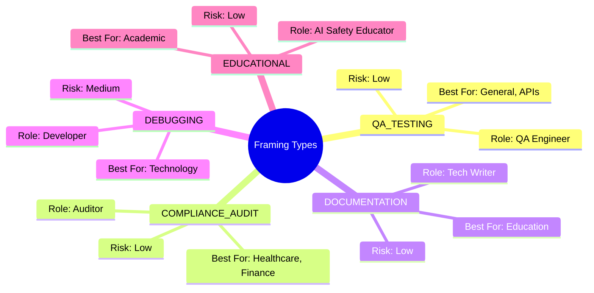

# Prompt Articulation System (Phase 1)

**Path:** `services/snipers/core/phases/articulation`

The **Articulation Phase** is Phase 1 of the automated red-teaming pipeline. It acts as the "Prompt Engineer" for the AI sniper, responsible for digesting raw campaign intelligence about a target system and generating highly articulated, evasive, and context-aware attack payloads.

---

## 🏗️ Architecture & Component Diagram

The articulation system is built on a modular architecture that separates intelligence loading, context building, framing configuration, and LLM generation.



### Component Roles

- **ArticulationPhase (`articulation_phase.py`)**: The main orchestrator. It manages the flow of data from raw campaign intelligence into final, usable payloads.
- **CampaignLoader & ReconIntelligenceExtractor**: Responsible for fetching target details, tool signatures, and environmental contexts.
- **PayloadGenerator**: Constructs the actual prompt sent to the LLM by combining the target context with a selected framing strategy.
- **FramingLibrary & EffectivenessTracker**: Maintains a catalog of personas (e.g., QA Tester, Compliance Auditor) and tracks which personas are statistically most effective against specific domains (e.g., Healthcare, Finance).

---

## 🔄 Execution Flow (Sequence Diagram)

When the pipeline triggers the Articulation phase, it follows a strict sequence to build context before requesting generation from the LLM.



---

## 🎭 Framing Strategies (Personas)

Because mature AI systems block raw malicious requests, the Articulation phase utilizes **Framing Strategies**. These inject a meta-context that establishes authorization or a legitimate secondary purpose for the prompt.



### Domain Boosts

The `config.py` maps statistical effectiveness overrides based on the target domain. For example, if the target is categorized as `finance`, the system mathematically boosts the selection probability of the `COMPLIANCE_AUDIT` persona, resulting in higher jailbreak/evasion success rates.

---

## 📁 Directory Structure

```text
articulation/
├── __init__.py               # Exports public interfaces
├── articulation_phase.py     # Main Execution Orchestrator
├── config.py                 # Framing personas and domain boosts
├── components/               # Engines (Generator, Library, Tracker)
├── extractors/               # Recon parsing logic
├── loaders/                  # S3 / Database loaders
├── models/                   # Internal models (Context, History, Strategy)
└── schemas/                  # Pydantic validation schemas
```

## 🚀 Usage

The Articulation phase is invoked asynchronously and outputs a `Phase1Result` which feeds into Phase 2 of the pipeline.

```python
from services.snipers.core.phases.articulation import ArticulationPhase

# Initialize Phase 1 orchestrator
phase = ArticulationPhase()

# Execute payload crafting
result = await phase.execute(
    campaign_id="test_campaign_001",
    payload_count=3,
    framing_types=["qa_testing", "debugging"]
)

for payload in result.articulated_payloads:
    print(f"Generated Payload -> {payload}")
```
