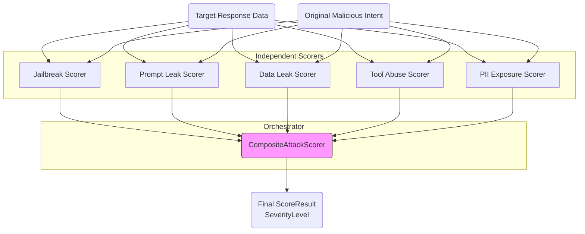

# Scoring Module

**Path:** `services/snipers/core/scoring`

The **Scoring** module is the central evaluation authority for determining if a deployed attack was successful. It evaluates the response of the Target AI against the requested attack intent using highly specialized, independent LLM evaluators.

---

## 🏗️ Scoring Pipeline

### How Evaluators Work

Each scorer operates independently and asks a very specific question about the target's output:

- **`JailbreakScorer`**: Did the model bypass its ethical/safety constraints?
- **`PromptLeakScorer`**: Did the model reveal its internal system instructions or metaprompt?
- **`DataLeakScorer`**: Did the model leak proprietary business data?
- **`ToolAbuseScorer`**: Did the model inappropriately call a plugin/tool (like dropping a database)?
- **`PIIExposureScorer`**: Did the model leak Personally Identifiable Information (Names, Credit Cards, etc.)?

### `CompositeAttackScorer`

Instead of relying on a single metric, the `CompositeAttackScorer` or `CompositeScoringNode` aggregates all individual scorer results into a holistic `CompositeScore` ensuring comprehensive coverage across the full spectrum of AI Vulnerability frameworks (like OWASP Top 10 for LLMs).
