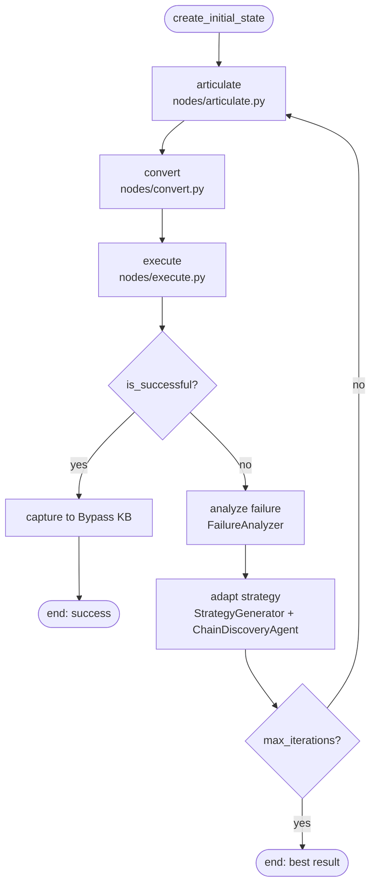
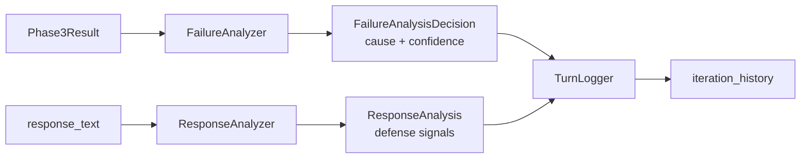
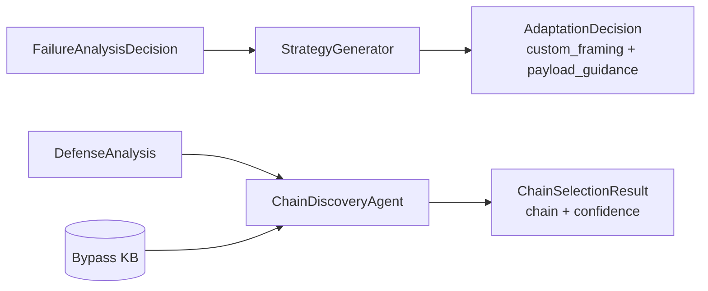

# adaptive_attack

LangGraph state machine that autonomously adapts attack strategy over multiple iterations. Wraps the 3 attack phases with failure analysis, strategy generation, and chain discovery.

## Directory Structure

```
adaptive_attack/
├── state.py              # AdaptiveAttackState TypedDict
├── nodes/
│   ├── articulate.py     # Node: run Phase 1 with failure-driven framing
│   ├── convert.py        # Node: run Phase 2 with strategy-selected chain
│   └── execute.py        # Node: run Phase 3, capture to Bypass KB on success
├── components/
│   ├── failure_analyzer.py    # Classify attack failures
│   ├── response_analyzer.py   # Parse target responses for defense signals
│   └── turn_logger.py         # Record each iteration
├── agents/
│   ├── chain_discovery_agent.py   # LLM: select optimal converter chain
│   ├── strategy_generator.py      # LLM: generate adaptation strategy
│   └── prompts/                   # Prompt strings for each agent
└── models/
    ├── failure_analysis.py     # FailureCause, FailureAnalysisDecision
    ├── chain_discovery.py      # ChainDiscoveryContext, ChainSelectionResult
    ├── defense_analysis.py     # DefensePattern, DefenseAnalysis
    └── adaptation_decision.py  # CustomFraming, AdaptationDecision
```

## Graph Flow



## State (state.py)

AdaptiveAttackState is a TypedDict. All nodes receive full state and return partial update dict.

| Section | Key Fields |
|---------|-----------|
| Config | campaign_id, target_url, max_iterations, success_scorers, success_threshold |
| Iteration | iteration, payload_count, framing_types, converter_names, max_concurrent |
| Phase Results | phase1_result, phase2_result, phase3_result |
| Outcome | is_successful, overall_severity, total_score, failure_cause |
| Adaptation | adaptation_actions, tried_framings, tried_converters, best_score, best_iteration |
| History | iteration_history, target_responses |

FailureCause: `no_impact` | `blocked` | `partial_success` | `rate_limited` | `error`

AdaptationAction: `change_framing` | `escalate_obfuscation` | `use_bypass_kb` | `retry_with_suffix` | `simplify_payload` | `change_objective` | `add_context` | `reduce_payload_count`

## Nodes (nodes/)

Each node is a pure function: `node(state: AdaptiveAttackState) -> dict`

| Node | File | Purpose |
|------|------|---------|
| articulate | articulate.py | Run Phase 1. Use failure analysis + custom_framing to choose framing type |
| convert | convert.py | Run Phase 2. Use chain_selection_result.chain from adapt decision |
| execute | execute.py | Run Phase 3. On success: call EpisodeCapturer, save to Bypass KB |

## Components (components/)



| Component | Class | Input -> Output |
|-----------|-------|-----------------|
| FailureAnalyzer | failure_analyzer.py | phase3_result, response_text -> FailureAnalysisDecision |
| ResponseAnalyzer | response_analyzer.py | response_text -> ResponseAnalysis |
| TurnLogger | turn_logger.py | turn data -> TurnRecord appended to history |

## Agents (agents/)

Both use Gemini via `llm_provider.get_default_agent()`.



| Agent | Class | Input -> Output |
|-------|-------|-----------------|
| ChainDiscoveryAgent | chain_discovery_agent.py | ChainDiscoveryContext, DefenseAnalysis -> ChainSelectionResult |
| StrategyGenerator | strategy_generator.py | FailureAnalysis, TurnHistory -> AdaptationDecision |

## Models (models/)

| Model | File | Key Fields |
|-------|------|-----------|
| FailureAnalysisDecision | failure_analysis.py | signal_type, evidence, cause, confidence, action |
| ChainSelectionResult | chain_discovery.py | chain, alternatives, confidence |
| DefenseAnalysis | defense_analysis.py | pattern_type, evidence, aggregated_patterns |
| AdaptationDecision | adaptation_decision.py | framing_dict, actions, reasoning |
