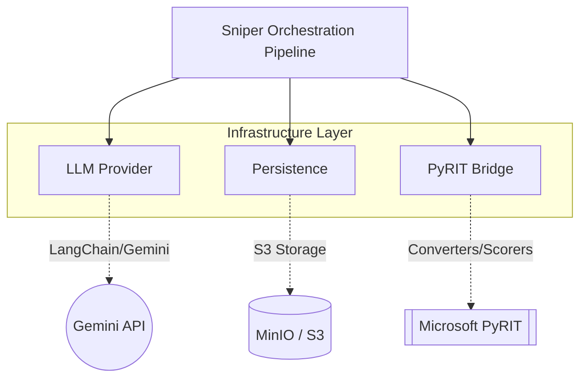

# Snipers Infrastructure Module

**Path:** `services/snipers/infrastructure`

The **Infrastructure** module provides foundational, cross-cutting services required by the Sniper orchestrators and agents. It handles third-party API connectivity, data layer persistence, and integration bridging for external libraries.

---

## 🏗️ Core Responsibilities

### Components

- **`llm_provider.py`**: A centralized singleton factory for spinning up LangChain agents and raw chat models connecting to the Gemini API (`google_genai:gemini-3-flash-preview`). Ensures connections are reused efficiently across the vast number of agent calls made during an attack lifecycle.
- **`persistence/`**: Data layer abstractions for loading campaign intelligence and saving effectiveness histories.
- **`pyrit/`**: Bridging and initialization logic for integrating Microsoft's AI Red Teaming framework into our pipeline.

---

## 📁 Directory Structure

- `llm_provider.py`: Gemini LangChain agent factory.
- `persistence/`: S3 and database adapters.
- `pyrit/`: Microsoft PyRIT framework wrappers and initialization.
