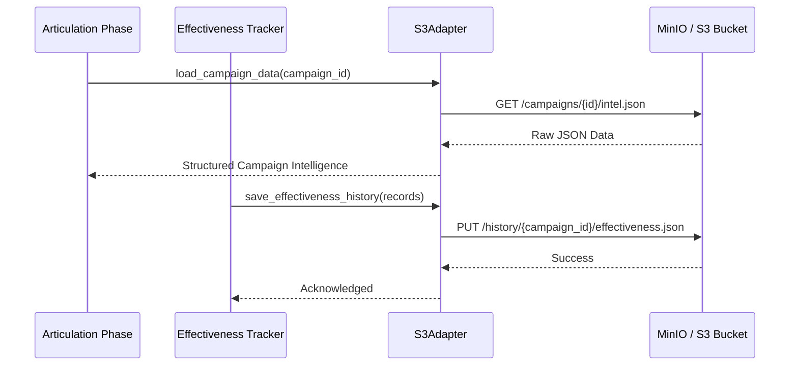

# Persistence Infrastructure

**Path:** `services/snipers/infrastructure/persistence`

The **Persistence** module handles all state and data storage operations for the Sniper pipeline. Because the pipeline operates asynchronously and might be paused or distributed, state must be reliably loaded and saved to an external data store (S3/MinIO).

---

## 🏗️ Storage Architecture

### Purpose

The `S3Adapter` abstracts away the underlying `boto3` or `minio` client logic. When agents need to write failure analysis history or when the initial articulation phase needs to load target tools/domains, it routes through this adapter rather than directly calling database APIs.

### 📁 Files

- `s3_adapter.py`: Provides read/write access to S3-compatible blob storage, primarily managing `CampaignIntelligence` and historical `EffectivenessRecord` artifacts.
