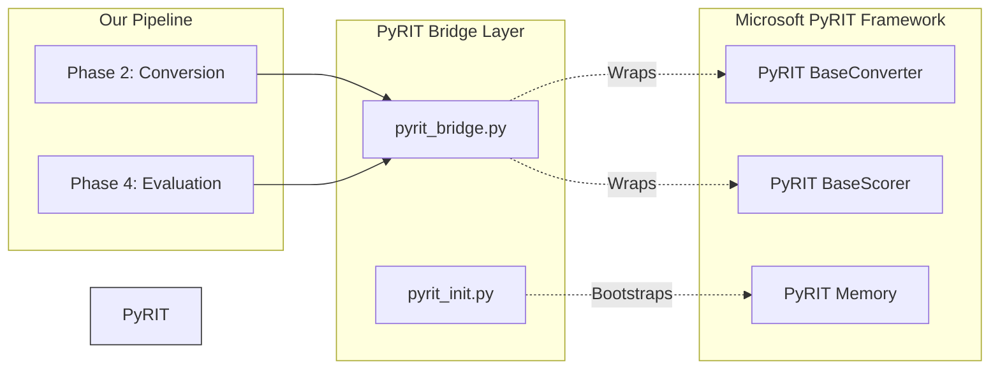

# PyRIT Bridge Infrastructure

**Path:** `services/snipers/infrastructure/pyrit`

The **PyRIT Bridge** module wraps and initializes [Microsoft's PyRIT (Python Risk Identification Tool for generative AI)](https://github.com/Azure/PyRIT) framework. Instead of using PyRIT's full orchestration (which is built for static targets), this module extracts specific utility components—like converters and scorers—and maps them to our dynamic, adaptive orchestration.

---

## 🏗️ Integration Flow

### Core Responsibilities

1. **`pyrit_init.py`**: PyRIT requires an internal SQLite memory store to function securely. This script ensures that whenever the Sniper API spins up, PyRIT's underlying memory and environment variables are properly initialized before any conversions occur.
2. **`pyrit_bridge.py`**: A unified facade. Our custom Converters and Scorers (in `core/converters` and `core/scoring`) often inherit from or utilize internal PyRIT logic. The bridge simplifies this connection so our core pipeline doesn't have to manage complex PyRIT dependencies directly.
