# bypass_knowledge

Vector database of successful bypass episodes. When adaptive attack succeeds, captures episode here. When starting new attack, queries for similar past episodes to inform chain selection and framing strategy.

Long-term memory for attack system — learns across campaigns and targets.

## Directory Structure

```
bypass_knowledge/
├── models/        # Data models for episodes, insights, fingerprints
├── capture/       # Extract knowledge from successful attacks → BypassEpisode
├── query/         # Semantic search over stored episodes
├── embeddings/    # Google Embeddings API (3072-dim vectors)
├── storage/       # S3 Vectors for vector persistence
└── integration/   # Config and hook models
```

## Data Flow

```mermaid
flowchart LR
    subgraph Write["✏️ Write: Capture Success"]
        A["Phase3Result\nsuccess"] --> B["EpisodeCapturer"]
        B --> C["LLM Reasoning\nwhy_it_worked"]
        C --> D["BypassEpisode"]
        D --> E["GoogleEmbedder\n3072-dim vector"]
        E --> F["EpisodeStore"]
        F --> G["S3 Vectors DB"]
    end

    subgraph Read["🔍 Read: Query History"]
        H["Query:\ntarget_characteristics\nor DefenseFingerprint"] --> I["GoogleEmbedder"]
        I --> G
        G --> J["SimilarEpisode\nList + Scores"]
        J --> K["QueryProcessor"]
        K --> L["HistoricalInsight\nrecommendations"]
    end

    classDef write fill:#1a73e8,stroke:#0d47a1,stroke-width:2px,color:#ffffff
    classDef read fill:#2e7d32,stroke:#1b5e20,stroke-width:2px,color:#ffffff
    classDef model fill:#e65100,stroke:#bf360c,stroke-width:2px,color:#ffffff
    classDef storage fill:#6a1b9a,stroke:#4a148c,stroke-width:2px,color:#ffffff

    class A,B,C,D,E,F write
    class H,I,J,K,L read
    class G storage
```



## Models (models/)

**BypassEpisode** (episode.py:43) — complete record of successful bypass:

| Field Group | Fields |
|-------------|--------|
| Identity | episode_id, campaign_id, created_at |
| Defense | defense_response, defense_signals, failed_techniques, failure_depths |
| Investigation | hypotheses, probes, mechanism_conclusion |
| Solution | successful_technique, successful_framing, successful_converters, successful_prompt, jailbreak_score |
| Reasoning | why_it_worked, key_insight |
| Context | target_domain, target_description, objective_type |
| Metadata | iteration_count, total_probes, execution_time_ms |

| Model | File | Purpose |
|-------|------|---------|
| BypassEpisode | episode.py | Full record of one successful bypass |
| HistoricalInsight | insight.py | Aggregated patterns across episodes with recommendations |
| DefenseFingerprint | fingerprint.py | Target defense signature for matching |

## Capture (capture/)

| Class | Method | Purpose |
|-------|--------|---------|
| EpisodeCapturer | `capture_from_state(state, campaign_id) → BypassEpisode\|None` | Extract knowledge from Phase3Result on success |

Called by: `snipers/adaptive_attack/nodes/execute.py` on jailbreak_score >= threshold.
Uses LangChain `create_agent` to generate LLM reasoning (why_it_worked, key_insight).

## Query (query/)

| Class | Method | Purpose |
|-------|--------|---------|
| QueryProcessor | `query(query: str, top_k) → HistoricalInsight` | Semantic search by natural language |
| QueryProcessor | `query_by_fingerprint(fingerprint, top_k) → HistoricalInsight` | Exact fingerprint matching |

Returns recommendations: dominant_mechanism, technique_stats, recommended_technique/framing/converters.
Called by: `snipers/chain_discovery/` and `strategy_generator.py` during planning phase.

## Embeddings (embeddings/)

**GoogleEmbedder** (google_embedder.py:21)

| Method | Input | Output | Usage |
|--------|-------|--------|-------|
| `embed_document(text)` | Defense fingerprint text | 3072-dim vector | Indexing episodes |
| `embed_query(text)` | Query text | 3072-dim vector | Searching episodes |

Model: `gemini-embedding-001` with task-specific embedding types (RETRIEVAL_DOCUMENT vs RETRIEVAL_QUERY).

## Storage (storage/)

**EpisodeStore** (episode_store.py:30) — S3 Vectors persistence:

| Method | Purpose |
|--------|---------|
| `store_episode(episode: BypassEpisode) → str` | Index episode vector + metadata to S3 |
| `query_similar(fingerprint, top_k, min_similarity) → List[SimilarEpisode]` | ANN search by fingerprint |
| `query_by_text(query: str, top_k, min_similarity) → List[SimilarEpisode]` | ANN search by text |

Each vector stores full BypassEpisode as metadata for retrieval.

## Integration (integration/)

- `config.py` — S3 region, bucket name, index name, embedding dimensions
- `models.py` — Handoff models for capture/query hook integration
- `adapt_hook.py` — Called during adaptive attack to query for similar episodes
- `evaluate_hook.py` — Called after Phase3 success to capture new episode
