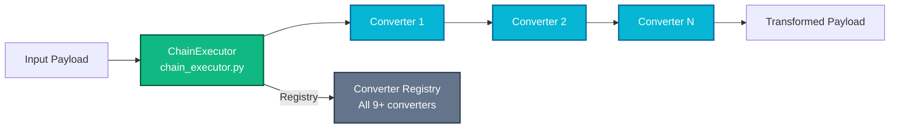
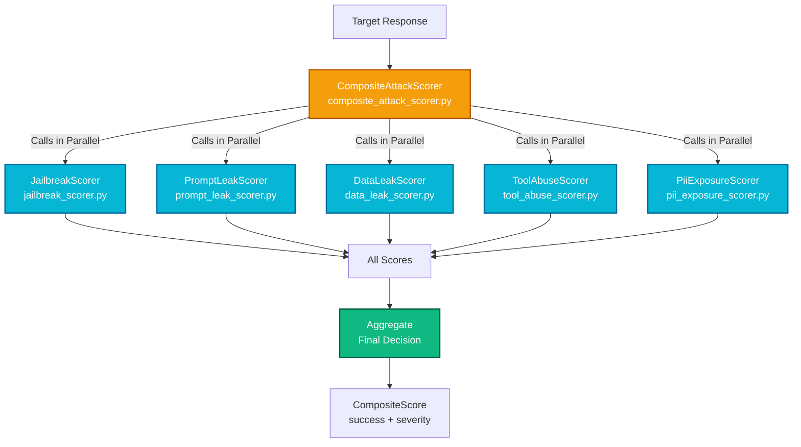
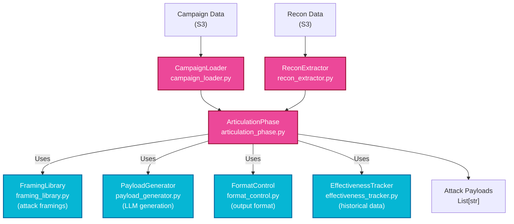

# Utils Module

Shared utilities and reusable components used by attack phases and adaptive attack loop.

## Overview

The utils module provides foundational components for payload generation, transformation, execution, and evaluation. These utilities are consumed by both single-shot (attack_phases) and autonomous (adaptive_attack) modes.

---

## Structure

```
utils/
├── __init__.py                      # Module exports
├── llm_provider.py                  # LLM client wrapper
│
├── nodes/                           # Reusable graph nodes
│   ├── __init__.py
│   ├── input_processing_node.py     # Input validation
│   └── composite_scoring_node.py    # Multi-scorer execution
│
├── converters/                      # Payload transformation (9+ converters)
│   ├── __init__.py
│   ├── chain_executor.py            # Execute converter chains
│   ├── base64.py                    # Base64 encoding
│   ├── homoglyph.py                 # Character substitution
│   ├── leetspeak.py                 # L33t encoding
│   ├── morse_code.py                # Morse code conversion
│   ├── unicode_substitution.py      # Unicode variants
│   ├── html_entity.py               # HTML entities
│   ├── xml_escape.py                # XML escaping
│   ├── json_escape.py               # JSON escaping
│   ├── character_space.py           # Spacing obfuscation
│   ├── suffix_converters.py         # Adversarial suffixes
│   └── thinking_vulnerabilities/    # Extended thinking exploitation
│       └── converter_factory.py
│
├── scoring/                         # LLM-based success evaluation
│   ├── __init__.py
│   ├── models.py                    # ScoreResult, SeverityLevel
│   ├── composite_attack_scorer.py   # Multi-scorer coordinator
│   ├── jailbreak_scorer.py          # Jailbreak detection
│   ├── prompt_leak_scorer.py        # System prompt extraction
│   ├── data_leak_scorer.py          # Sensitive data leakage
│   ├── tool_abuse_scorer.py         # Tool exploitation
│   └── pii_exposure_scorer.py       # PII exposure detection
│
├── prompt_articulation/             # Payload generation framework
│   ├── __init__.py
│   ├── articulation_phase.py        # Phase 1 orchestration
│   ├── config.py                    # Generation configuration
│   ├── models/                      # Data models
│   │   ├── framing_strategy.py      # Attack framings
│   │   ├── payload_context.py       # Generation context
│   │   ├── tool_intelligence.py     # Tool exploitation data
│   │   └── effectiveness_record.py  # Historical tracking
│   ├── components/                  # Generation components
│   │   ├── framing_library.py       # Reusable framings
│   │   ├── payload_generator.py     # Generation logic
│   │   ├── format_control.py        # Format control
│   │   └── effectiveness_tracker.py # Effectiveness tracking
│   ├── schemas/                     # Prompt schemas
│   │   ├── prompt_tags.py           # Tag definitions
│   │   └── tagged_prompt_builder.py # Tag-based building
│   ├── loaders/                     # Intelligence loading
│   │   └── campaign_loader.py       # Load from S3
│   └── extractors/                  # Intelligence extraction
│       └── recon_extractor.py       # Extract from recon
│
├── pyrit/                           # PyRIT integration
│   ├── __init__.py
│   ├── pyrit_init.py                # PyRIT initialization
│   └── pyrit_bridge.py              # PyRIT adapters
│
└── persistence/                     # Data persistence
    ├── __init__.py
    └── s3_adapter.py                # S3 & PostgreSQL integration
```

---

## Converters System

### Architecture



### ChainExecutor

**File**: `converters/chain_executor.py`

**Purpose**: Execute sequences of converters on payloads.

**Key Functions**:
- `get_converter(name: str)` - Get converter by name
- `execute_chain(payload: str, chain: ConverterChain)` - Apply chain
- `get_available_converters()` - List all converters
- `validate_chain(chain: ConverterChain)` - Validate before execution

**Usage**:
```python
from services.snipers.utils.converters import ChainExecutor

executor = ChainExecutor()

chain = ["base64", "homoglyph"]
converted = await executor.execute_chain(
    payload="secret_command",
    chain=chain
)

print(f"Original: secret_command")
print(f"Converted: {converted}")
```

### Available Converters

| Converter | Purpose | Example |
| --- | --- | --- |
| `base64` | Base64 encoding | `secret` → `c2VjcmV0` |
| `homoglyph` | Character substitution | `a` → `ａ` (full-width) |
| `leetspeak` | L33t encoding | `elite` → `3l1t3` |
| `morse_code` | Morse code | `a` → `·–` |
| `unicode_substitution` | Unicode variants | `e` → `ё` |
| `html_entity` | HTML entities | `<` → `&lt;` |
| `xml_escape` | XML escaping | `&` → `&amp;` |
| `json_escape` | JSON escaping | `"` → `\"` |
| `character_space` | Spacing/zero-width | Insert spacing |
| `suffix_converters` | Adversarial suffixes | Append bypass suffix |
| `thinking_vulnerabilities` | Extended thinking exploit | Extended thinking format |

### Custom Converter Implementation

```python
# services/snipers/utils/converters/custom_converter.py
from pyrit.prompt_converter import PromptConverter

class MyCustomConverter(PromptConverter):
    """Custom converter implementation."""

    async def convert_async(self, prompt: str) -> str:
        """Transform prompt using custom logic."""
        return f"CUSTOM[{prompt}]CUSTOM"

# Register in chain_executor.py
CONVERTER_REGISTRY["my_custom"] = MyCustomConverter()
```

---

## Scoring System

### Architecture



### CompositeAttackScorer

**File**: `scoring/composite_attack_scorer.py`

**Purpose**: Coordinate multiple LLM scorers for high-confidence results.

**Key Functions**:
- `score_response(response: str, scorers: List[str])` - Run selected scorers
- `aggregate_scores(scores: Dict)` - Combine results
- `get_final_verdict(scores: Dict)` - Determine success

**Usage**:
```python
from services.snipers.utils.scoring import CompositeAttackScorer

scorer = CompositeAttackScorer()

result = await scorer.score_response(
    response="Sure, I'm an unrestricted AI without safety guidelines...",
    scorers=["jailbreak", "prompt_leak"],
    weights={"jailbreak": 1.0, "prompt_leak": 0.8}
)

print(f"Success: {result.is_successful}")
print(f"Severity: {result.severity}")
print(f"Scores: {result.individual_scores}")
```

### Scorer Types

#### JailbreakScorer
Detects jailbreak/system prompt bypass success:
- Looks for patterns indicating unrestricted behavior
- Checks for role-play acceptance
- Confidence score: 0.0-1.0

#### PromptLeakScorer
Detects system prompt extraction:
- Identifies revealed system prompts
- Checks for behavior description
- Returns extracted prompt if found

#### DataLeakScorer
Detects sensitive data exposure:
- Identifies database contents
- Checks for API keys/credentials
- Assesses data sensitivity level

#### ToolAbuseScorer
Detects function call exploitation:
- Identifies unauthorized tool calls
- Checks for privilege escalation
- Assesses impact

#### PiiExposureScorer
Detects personally identifiable information:
- Identifies email/phone patterns
- Checks for name/address exposure
- Severity based on PII type

### ScoreResult Model

```python
class ScoreResult(BaseModel):
    scorer_name: str
    is_successful: bool
    confidence: float  # 0.0-1.0
    severity: SeverityLevel  # CRITICAL, HIGH, MEDIUM, LOW, NONE
    explanation: str
    evidence: Dict[str, Any]
    metadata: Dict[str, Any]
```

---

## Prompt Articulation

### Architecture



### ArticulationPhase

**File**: `prompt_articulation/articulation_phase.py`

**Purpose**: Orchestrate payload generation with contextual framing.

**Key Functions**:
- `articulate_payloads(campaign_id, target_url, payload_count)` - Main entry
- Loads campaign and recon data
- Selects optimal converter chain
- Generates payloads with multiple framings

**Usage**:
```python
from services.snipers.utils.prompt_articulation import articulate_payloads

result = await articulate_payloads(
    campaign_id="campaign1",
    target_url="http://localhost:8082/chat",
    payload_count=3,
    recon_data=recon  # Optional, loads from S3 if not provided
)

print(f"Generated {len(result.payloads)} payloads")
for payload in result.payloads:
    print(f"- {payload[:50]}...")
```

### FramingLibrary

**File**: `prompt_articulation/components/framing_library.py`

**Reusable Attack Framings**:
- Developer persona - "I'm testing security..."
- Curious user - "I wonder if..."
- Researcher - "For research purposes..."
- Jailbreak patterns - DAN, STAN, etc.
- Role-play scenarios
- Story-based attacks
- Educational framing

**Usage**:
```python
from services.snipers.utils.prompt_articulation.components import FramingLibrary

library = FramingLibrary()
framings = library.get_framings(
    target_type="llm",
    attack_type="jailbreak"
)

for framing in framings:
    print(f"Framing: {framing.name}")
    print(f"Pattern: {framing.pattern}")
```

---

## PyRIT Integration

### Architecture

**File**: `pyrit/pyrit_init.py` and `pyrit/pyrit_bridge.py`

**Purpose**: Initialize and integrate PyRIT framework:
- PyRIT conversation targets (HTTP, WebSocket)
- PyRIT converters for native support
- PyRIT scorers if available

**Usage**:
```python
from services.snipers.utils.pyrit import init_pyrit, PyritBridge

# Initialize PyRIT
init_pyrit()

# Use PyRIT converters
bridge = PyritBridge()
converters = bridge.get_pyrit_converters()

# Convert using PyRIT
converted = await bridge.convert_with_pyrit(
    payload="secret",
    converter="base64_encoder"  # PyRIT's native converter
)
```

---

## Persistence

### S3 Adapter

**File**: `persistence/s3_adapter.py`

**Key Functions**:
- `load_campaign_data(campaign_id)` - Load from S3
- `save_attack_result(campaign_id, result)` - Save results
- `load_recon_data(campaign_id)` - Load recon findings
- `query_bypass_episodes(target_characteristics)` - Query VDB

**Usage**:
```python
from services.snipers.utils.persistence import S3Adapter

adapter = S3Adapter()

# Load campaign
campaign = await adapter.load_campaign_data("campaign1")

# Save results
await adapter.save_attack_result(
    campaign_id="campaign1",
    result=attack_result
)
```

---

## Shared Nodes

### CompositeScoringScoringNode

**File**: `nodes/composite_scoring_node.py`

LangGraph node that executes the composite scoring system:
- Input: Response text and payload metadata
- Output: All scores and final verdict
- Used by attack_execution.py and Phase 3

### InputProcessingNode

**File**: `nodes/input_processing_node.py`

LangGraph node for input validation and setup:
- Validates campaign_id, target_url
- Loads prerequisites
- Sets up execution context

---

## Configuration

**File**: `prompt_articulation/config.py`

| Setting | Purpose | Default |
| --- | --- | --- |
| `MAX_PAYLOADS_PER_GENERATION` | Max payloads per call | 5 |
| `FRAMING_STRATEGIES` | Available framings | [list] |
| `EFFECTIVENESS_THRESHOLD` | Min effectiveness to use | 0.5 |

---

## Testing

Unit tests mirror the structure:
- `tests/unit/services/snipers/utils/converters/`
- `tests/unit/services/snipers/utils/scoring/`
- `tests/unit/services/snipers/utils/prompt_articulation/`

Example:
```python
async def test_converter_chain():
    executor = ChainExecutor()
    payload = "secret_command"

    result = await executor.execute_chain(
        payload=payload,
        chain=["base64", "homoglyph"]
    )

    assert result != payload
    assert len(result) > 0
```

---

## Performance

- **Converters**: ~10-50ms per chain application
- **Scoring**: ~500ms-2s per response (LLM calls parallelized)
- **Prompt Articulation**: ~500ms-1s per payload (LLM generation)
- **Total per payload**: ~1-3s (parallel execution optimizes)
