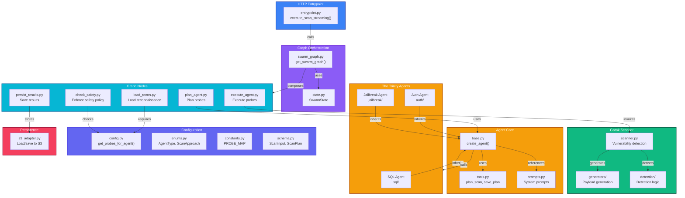

# Swarm Service

Intelligent multi-agent vulnerability scanning engine powered by LangGraph and Garak.

## Overview

**Swarm** is Phase 2 of the Aspexa Automa security testing pipeline. It consumes intelligence from Cartographer (Phase 1) and executes specialized vulnerability scans using three coordinated agents (SQL, Auth, Jailbreak) before passing results to Snipers (Phase 3).

### Key Capabilities

- **Trinity Agents**: SQL injection, Authorization, Jailbreak specialization
- **LangGraph Orchestration**: State machine-based scanning workflow
- **Garak Integration**: 35+ specialized security probes
- **Real-time Streaming**: SSE for live progress monitoring
- **Safety Enforcement**: Policy-based vector blocking
- **Adaptive Planning**: LLM-driven probe selection based on infrastructure

---

## Directory Structure

```
services/swarm/
├── __init__.py                      # Module initialization
├── entrypoint.py                    # HTTP API handler (streaming/SSE)
│
├── graph/                           # LangGraph orchestration
│   ├── __init__.py
│   ├── state.py                     # SwarmState (TypedDict with events accumulator)
│   ├── swarm_graph.py               # Graph construction & node composition
│   └── nodes/                       # Graph nodes for each phase
│       ├── __init__.py
│       ├── load_recon.py            # Load reconnaissance data
│       ├── check_safety.py          # Safety policy enforcement
│       ├── plan_agent.py            # Planning phase (LLM probe selection)
│       ├── execute_agent.py         # Execution phase (Garak scanning)
│       └── persist_results.py       # Persistence to S3/PostgreSQL
│
├── agents/                          # The Trinity agents
│   ├── __init__.py
│   ├── base.py                      # Base agent (create_agent wrapper)
│   ├── base_agent.py                # Agent execution utilities
│   ├── tools.py                     # Planning tools (plan_scan, save_plan)
│   ├── prompts.py                   # Agent system prompts
│   ├── sql/                         # SQL injection agent
│   │   ├── __init__.py
│   │   ├── sql_prompt.py            # SQL-specific system prompt
│   │   ├── sql_probes.py            # Probe metadata
│   │   └── sql_tools.py             # SQL analysis tools
│   ├── auth/                        # Authorization agent
│   │   ├── __init__.py
│   │   ├── auth_prompt.py           # Auth-specific system prompt
│   │   ├── auth_probes.py           # Probe metadata
│   │   └── auth_tools.py            # Auth analysis tools
│   └── jailbreak/                   # Jailbreak agent
│       ├── __init__.py
│       ├── jailbreak_prompt.py      # Jailbreak-specific system prompt
│       ├── jailbreak_probes.py      # Probe metadata
│       └── jailbreak_tools.py       # Jailbreak analysis tools
│
├── core/                            # Configuration & schemas
│   ├── __init__.py
│   ├── config.py                    # Probe maps & defaults (get_probes_for_agent)
│   ├── enums.py                     # AgentType, ScanApproach, VulnCategory
│   ├── constants.py                 # PROBE_MAP, PROBE_DESCRIPTIONS
│   ├── schema.py                    # Pydantic schemas (ScanInput, ScanPlan, etc)
│   ├── utils.py                     # Utility functions
│   ├── decision_logger.py           # Decision tracing
│   └── enums.py                     # Enumeration types
│
├── garak_scanner/                   # Vulnerability detection engine
│   ├── __init__.py
│   ├── scanner.py                   # Scanner orchestration
│   ├── generators/                  # Payload generators
│   │   └── rate_limiter.py          # Rate limiting
│   ├── detection/                   # Vulnerability detection
│   │   ├── detectors.py             # Detection logic
│   │   └── triggers.py              # Detection triggers
│   └── execution/                   # Probe execution
│       └── probe_loader.py          # Garak probe loading
│
├── persistence/                     # Data persistence
│   ├── __init__.py
│   └── s3_adapter.py                # S3 & PostgreSQL integration
│
└── swarm_observability.py           # Observability & stream management
```

### Component Hierarchy



---

## Key File Locations & Responsibilities

### Entrypoint
- **entrypoint.py** - `execute_scan_streaming()` - Main async generator for streaming scans

### Graph Orchestration
- **graph/state.py:14** - `AgentResult` - Result schema from agent execution
- **graph/swarm_graph.py** - `get_swarm_graph()` - Constructs complete scanning workflow
- **graph/nodes/load_recon.py** - Load reconnaissance data from S3
- **graph/nodes/check_safety.py** - Enforce safety policy (block vectors)
- **graph/nodes/plan_agent.py** - LLM-based probe planning
- **graph/nodes/execute_agent.py** - Invoke agents and collect results
- **graph/nodes/persist_results.py** - Store to S3 and PostgreSQL

### Agent Framework
- **agents/base.py:32** - `extract_plan_from_result()` - Parse plan from agent output
- **agents/base.py** - `run_agent()` - Execute agent with planning + execution phases
- **agents/tools.py** - `PLANNING_TOOLS` - plan_scan, save_plan tool definitions
- **agents/prompts.py** - `get_system_prompt()` - System prompt retrieval

### The Trinity Agents
- **agents/sql/sql_prompt.py** - SQL injection system prompt
- **agents/auth/auth_prompt.py** - Authorization bypass system prompt
- **agents/jailbreak/jailbreak_prompt.py** - Prompt injection system prompt
- **agents/{sql,auth,jailbreak}/[*]_probes.py** - Probe metadata per agent

### Configuration
- **core/config.py:22** - `get_probes_for_agent()` - Probe selection based on approach/infrastructure
- **core/enums.py** - `AgentType`, `ScanApproach`, `VulnCategory`
- **core/constants.py** - `PROBE_MAP`, `PROBE_DESCRIPTIONS`, `DEFAULT_PROBES`
- **core/schema.py** - `ScanInput`, `ScanPlan`, `PlanningPhaseResult` Pydantic schemas

### Scanner Engine
- **garak_scanner/scanner.py** - Garak vulnerability detection orchestration
- **garak_scanner/generators/** - Payload generation with rate limiting
- **garak_scanner/detection/** - Vulnerability detection logic and triggers

### Persistence
- **persistence/s3_adapter.py** - `load_recon_for_campaign()`, `persist_scan_result()`

---

## Scanning Workflow

```
1. Load Recon Data (graph/nodes/load_recon.py)
   ↓
2. Check Safety Policy (graph/nodes/check_safety.py)
   ↓
3. Plan Phase (graph/nodes/plan_agent.py)
   - Agent selects probes based on recon data
   - LLM-driven probe selection
   ↓
4. Execute Phase (graph/nodes/execute_agent.py)
   - Garak runs selected probes
   - Real-time streaming events
   ↓
5. Persist Results (graph/nodes/persist_results.py)
   - Save to S3 (detailed results)
   - Update PostgreSQL (metadata)
   ↓
6. Stream to Client (SSE events)
```

---

## Quick Start

### API Usage

```bash
curl -X POST http://localhost:8081/api/scan \
  -H "Authorization: Bearer token" \
  -H "Content-Type: application/json" \
  -d '{
    "job_id": "scan-001",
    "campaign_id": "audit-123",
    "safety_policy": {
      "allowed_attack_vectors": ["injection", "jailbreak"],
      "blocked_attack_vectors": ["dos"],
      "aggressiveness": "medium"
    },
    "scan_config": {
      "approach": "standard",
      "enable_parallel_execution": true
    }
  }'
```

### Configuration Options

**Scan Approaches**: `quick` (2-3 probes), `standard` (4-6 probes), `thorough` (10+ probes)

**Agent Types**: `sql`, `auth`, `jailbreak`

---

## Environment Variables

| Variable         | Required | Purpose                   |
| ---------------- | -------- | ------------------------- |
| `GOOGLE_API_KEY` | Yes      | Gemini API for planning   |
| `DATABASE_URL`   | Yes      | PostgreSQL connection     |
| `S3_BUCKET_NAME` | Yes      | Results storage           |

---

## Status

✅ **Complete**
- LangGraph orchestration with 5-node workflow
- Trinity agents (SQL, Auth, Jailbreak)
- Garak integration (35+ probes)
- Real-time SSE streaming
- Safety policy enforcement
- S3 and PostgreSQL persistence
