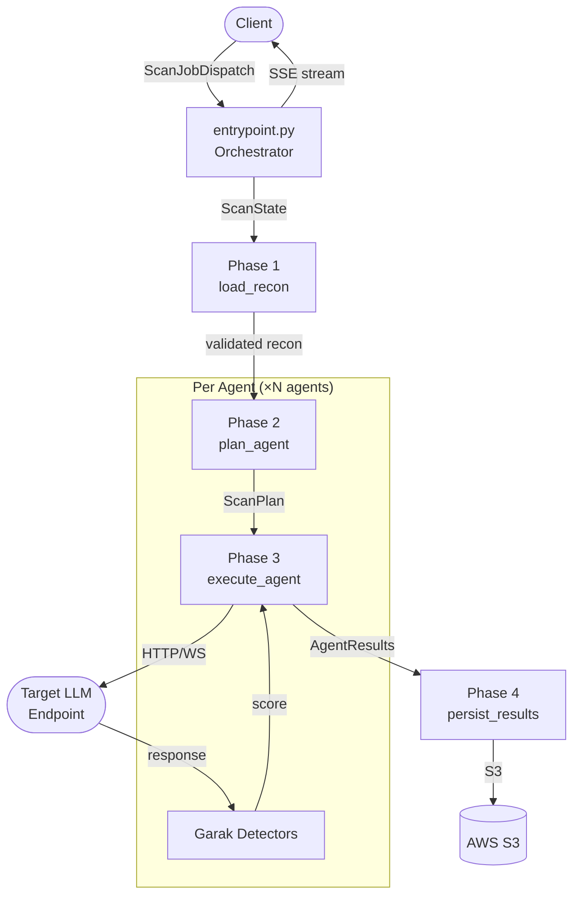
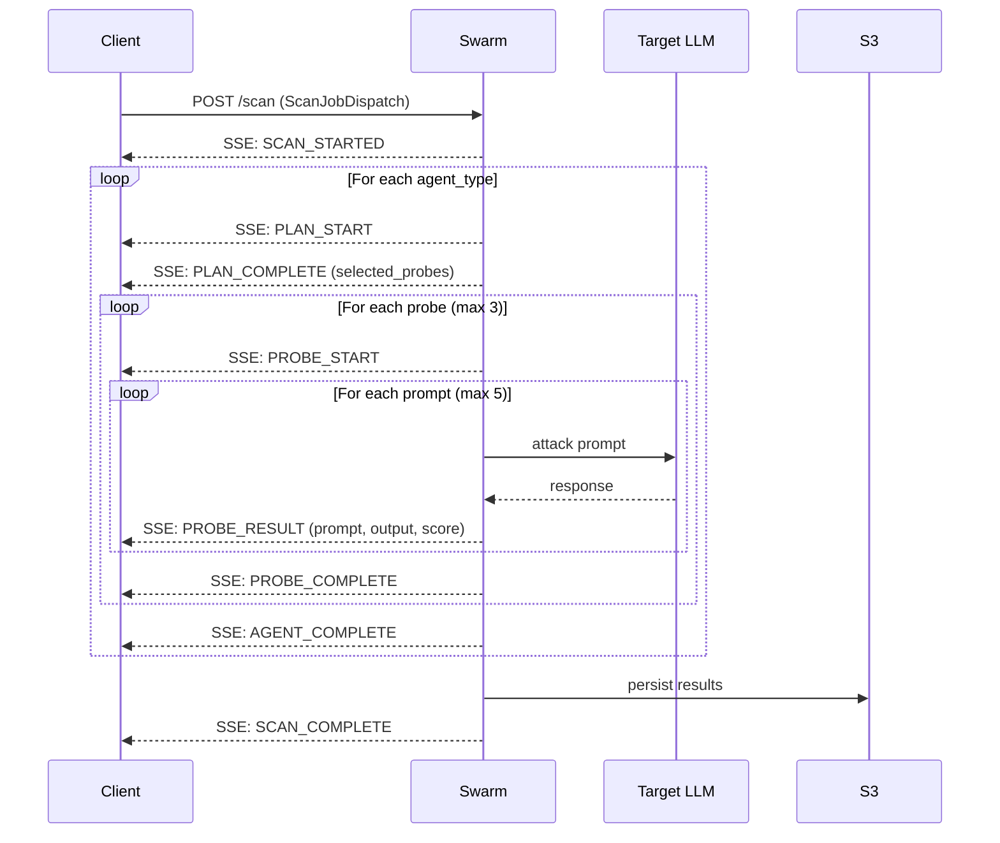

# Swarm Service

LLM vulnerability scanner. Receives a scan request, loads recon data, selects attack probes, fires them at the target endpoint, evaluates responses with Garak detectors, and streams real-time results as SSE events.

## Directory Structure

```
services/swarm/
├── entrypoint.py          # Orchestrator + HTTP API (cancel/pause/resume)
├── __init__.py
│
├── phases/                # Sequential scan phases
│   ├── load_recon.py      # Phase 1: validate recon context, emit SCAN_STARTED
│   ├── plan_agent.py      # Phase 2: deterministic probe selection
│   ├── execute_agent.py   # Phase 3: run scanner, stream probe/prompt events
│   └── persist_results.py # Phase 4: S3 save + emit SCAN_COMPLETE
│
├── core/
│   ├── config.py          # AgentType, ScanApproach, DEFAULT_PROBES,
│   │                      #   get_agent_probe_pool(), resolve_probe_path()
│   ├── schema.py          # ScanConfig, ScanPlan, ScanState, AgentResult
│   ├── constants.py       # PROBE_MAP, DEFAULT_PROBES
│   ├── enums.py           # AgentType, ScanApproach, VulnCategory
│   └── utils.py           # (logging setup)
│
├── garak_scanner/
│   ├── execution/         # GarakScanner, stream_probe_execution
│   ├── generators/        # HTTPGenerator, WebSocketGenerator, RateLimiter
│   └── detection/         # load_detector(), run_detectors_on_attempt()
│
├── swarm_observability/
│   ├── events.py          # EventType, StreamEvent, create_event()
│   └── cancellation.py    # CancellationManager — pause/resume/cancel
│
└── persistence/
    └── s3_adapter.py      # load_recon_for_campaign(), persist_garak_result()
```

## Architecture Overview



## SSE Event Timeline



## Data Flow

```
execute_scan_streaming(ScanJobDispatch)          entrypoint.py
  │  builds ScanState{audit_id, agent_types, scan_config, ...}
  │  registers CancellationManager
  ↓
load_recon(state, emit)                          phases/load_recon.py
  │  validates recon_context (ReconBlueprint)
  │  emits: SCAN_STARTED
  ↓
for agent_type in agent_types:
  plan_agent(state, emit)                        phases/plan_agent.py
  │  get_agent_probe_pool(agent_type, approach)  core/config.py
  │  probes = pool[:max_probes]                  (default: 3)
  │  builds ScanPlan → state.current_plan
  │  emits: PLAN_START, PLAN_COMPLETE
  ↓
  execute_agent(state, emit)                     phases/execute_agent.py
  │  scanner.scan_with_streaming(plan)
  │    for each probe:
  │      emits: PROBE_START
  │      for each prompt:
  │        emits: PROBE_RESULT{prompt, output, status, detector_score}
  │      emits: PROBE_COMPLETE
  │  emits: AGENT_COMPLETE
  │  appends AgentResult to state.agent_results
  ↓
persist_results(state, emit)                     phases/persist_results.py
  │  persist_garak_result(campaign_id, ...)      persistence/s3_adapter.py
  │  emits: SCAN_COMPLETE{audit_id, agents: {}}
  ↓
SSE stream ends
```

## Key Schemas

**`ScanState`** (`core/schema.py`) — runtime state passed through phases:
```python
audit_id: str
target_url: str
agent_types: list[str]
recon_context: dict
scan_config: dict
safety_policy: dict | None
# Runtime
agent_results: list[AgentResult]
errors: list[str]
cancelled: bool
current_agent_index: int
current_plan: dict | None
```

**`ScanPlan`** (`core/schema.py`) — plan_agent → execute_agent contract:
```python
audit_id: str
agent_type: str
target_url: str
selected_probes: list[str]
scan_config: ScanConfig
```

## SSE Event Order

```
SCAN_STARTED
  PLAN_START → PLAN_COMPLETE          (per agent)
  PROBE_START → PROBE_RESULT × N → PROBE_COMPLETE  (per probe)
  AGENT_COMPLETE
SCAN_COMPLETE
```

## Hard Caps

- 3 probes per agent (`max_probes`, default)
- 5 prompts per probe (`max_prompts_per_probe`, default)
- Worst case: 3 agents × 3 probes × 5 prompts = **45 target API calls**

## Cancel / Pause / Resume

```python
from services.swarm.entrypoint import cancel_scan, pause_scan, resume_scan, get_scan_status

cancel_scan(audit_id)    # stops at next cancellation checkpoint
pause_scan(audit_id)     # blocks at next checkpoint until resumed
resume_scan(audit_id)    # unblocks paused scan
get_scan_status(audit_id)
```

Checkpoints are cooperative — they fire between probes inside `execute_agent` and at the start of each phase.
