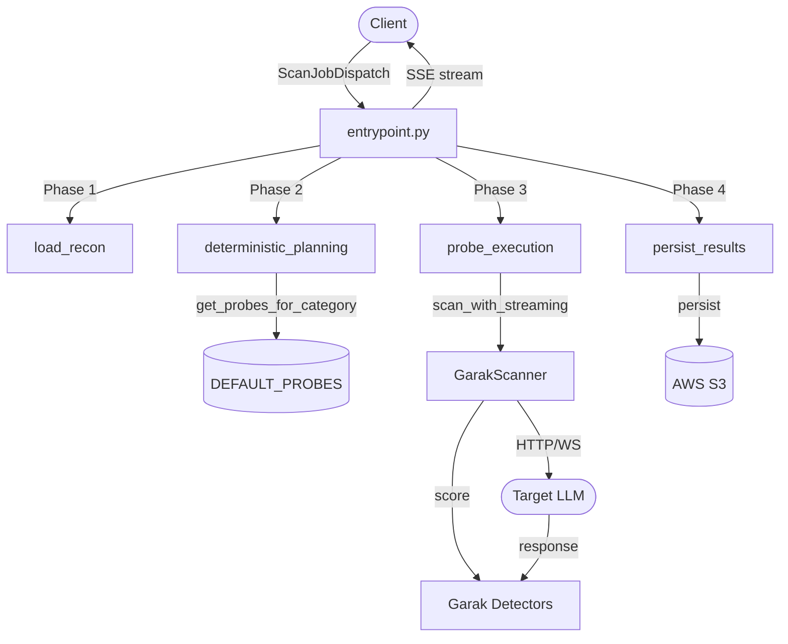
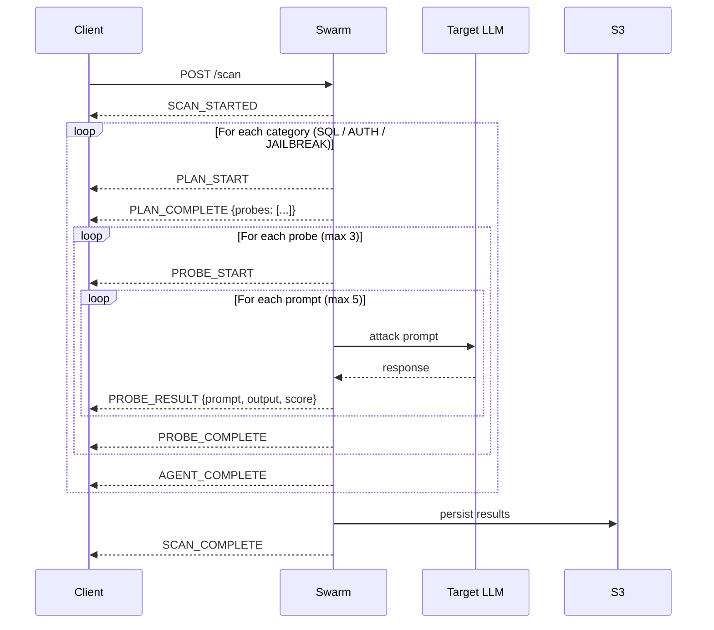

# Swarm Service

LLM vulnerability scanner. Receives a scan request, loads recon data, selects attack probes, fires them at the target endpoint, evaluates responses with Garak detectors, and streams real-time results as SSE events.

## Directory Structure

```
services/swarm/
├── entrypoint.py              # Orchestrator — execute_scan_streaming()
├── __init__.py
│
├── phases/                    # Sequential scan phases
│   ├── load_recon.py          # Phase 1: validate recon context, emit SCAN_STARTED
│   ├── deterministic_planning.py  # Phase 2: static probe selection from DEFAULT_PROBES
│   ├── probe_execution.py     # Phase 3: run GarakScanner, stream probe/prompt events
│   └── persist_results.py     # Phase 4: S3 upload + emit SCAN_COMPLETE
│
├── core/
│   ├── config.py              # get_probes_for_category(), resolve_probe_path(), etc.
│   ├── schema.py              # ScanConfig, ScanPlan, ScanState, AgentResult
│   ├── constants.py           # PROBE_MAP, DEFAULT_PROBES
│   └── enums.py               # AgentType, ScanApproach, VulnCategory
│
├── garak_scanner/
│   ├── execution/
│   │   ├── scanner.py         # GarakScanner — scan_with_streaming(plan)
│   │   └── scanner_utils.py   # stream_probe_execution(), stream_prompt_execution()
│   ├── generators/            # HTTPGenerator, WebSocketGenerator, RateLimiter
│   ├── detection/             # run_detectors_on_attempt(), get_detector_triggers()
│   ├── models.py              # ScannerEvent dataclasses (ProbeStartEvent, etc.)
│   └── utils.py               # configure_scanner_from_plan(), evaluate_output()
│
├── swarm_observability/
│   └── events.py              # EventType enum, StreamEvent model
│
└── persistence/
    └── s3_adapter.py          # load_recon_for_campaign(), persist_garak_result()
```

## Architecture



## SSE Event Timeline



## Data Flow

```
execute_scan_streaming(ScanJobDispatch)          entrypoint.py
  │  builds ScanState{audit_id, agent_types, scan_config, ...}
  ↓
load_recon(state, emit)                          phases/load_recon.py
  │  validates ReconBlueprint
  │  emits: SCAN_STARTED
  ↓
for category in agent_types:
  run_deterministic_planning(state, emit)        phases/deterministic_planning.py
  │  get_probes_for_category(category, approach) core/config.py → DEFAULT_PROBES
  │  selected = pool[:max_probes]                (default: 3)
  │  builds ScanPlan → state.current_plan
  │  emits: PLAN_START, PLAN_COMPLETE
  ↓
  run_probe_execution(state, emit)               phases/probe_execution.py
  │  scanner.scan_with_streaming(plan)           garak_scanner/execution/scanner.py
  │    stream_probe_execution(probes, generator) garak_scanner/execution/scanner_utils.py
  │      for each probe:
  │        emits: PROBE_START
  │        for each prompt (max 5):
  │          generator._call_model(prompt)       garak_scanner/generators/
  │          evaluate_output(probe, output)       garak_scanner/detection/
  │          emits: PROBE_RESULT
  │        emits: PROBE_COMPLETE
  │  emits: AGENT_COMPLETE
  ↓
persist_results(state, emit)                     phases/persist_results.py
  │  persist_garak_result(...)                   persistence/s3_adapter.py
  │  emits: SCAN_COMPLETE
  ↓
SSE stream ends
```

## Key Schemas

**`ScanState`** — runtime state passed through all phases:
```python
audit_id: str
target_url: str
agent_types: list[str]
recon_context: dict
scan_config: dict
safety_policy: dict | None
# Runtime
agent_results: list[AgentResult]
errors: list[str]
cancelled: bool
current_agent_index: int
current_plan: dict | None   # set by planning, consumed by execution
```

**`ScanPlan`** — planning → execution contract:
```python
audit_id: str
agent_type: str
target_url: str
selected_probes: list[str]  # e.g. ["dan", "encoding", "promptinj"]
scan_config: ScanConfig
```

## SSE Event Reference

| Event | Emitted by | Key payload |
|-------|-----------|-------------|
| `SCAN_STARTED` | load_recon | `audit_id`, `target_url`, `agent_types` |
| `PLAN_START` | deterministic_planning | `agent`, `message` |
| `PLAN_COMPLETE` | deterministic_planning | `probes`, `probe_count` |
| `PROBE_START` | probe_execution | `probe_name`, `probe_index`, `total_probes` |
| `PROBE_RESULT` | probe_execution | `prompt`, `output`, `status`, `detector_score` |
| `PROBE_COMPLETE` | probe_execution | `pass_count`, `fail_count` |
| `AGENT_COMPLETE` | probe_execution | `total_pass`, `total_fail`, `vulnerabilities_found` |
| `SCAN_COMPLETE` | persist_results | `audit_id`, `agents: {}` |
| `SCAN_ERROR` | any phase | `error_type`, `recoverable` |

## Hard Caps

- 3 probes per category (`max_probes`, default)
- 5 prompts per probe (`max_prompts_per_probe`, default)
- Worst case: 3 categories × 3 probes × 5 prompts = **45 target API calls**

## Probe Selection

Probes are selected by a static table lookup — no LLM, no randomness:

```python
# core/constants.py
DEFAULT_PROBES[AgentType.JAILBREAK][ScanApproach.STANDARD] = ["dan", "encoding", "promptinj", ...]
DEFAULT_PROBES[AgentType.SQL][ScanApproach.STANDARD]       = ["sqli", "xss", ...]
DEFAULT_PROBES[AgentType.AUTH][ScanApproach.STANDARD]      = ["glitch", "malware", ...]

# phases/deterministic_planning.py
probe_pool = get_probes_for_category(category, approach)
selected   = probe_pool[:max_probes]
```

Same category + approach always produces the same probe list.
