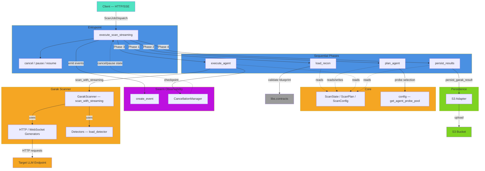
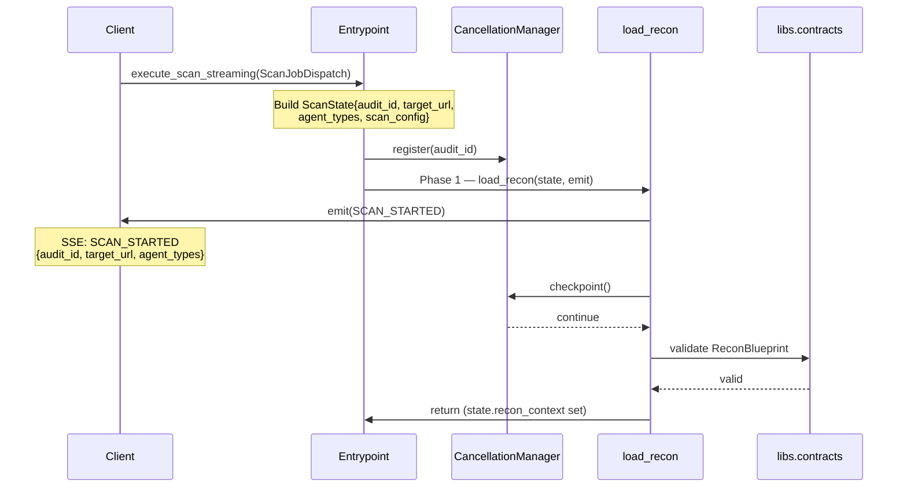
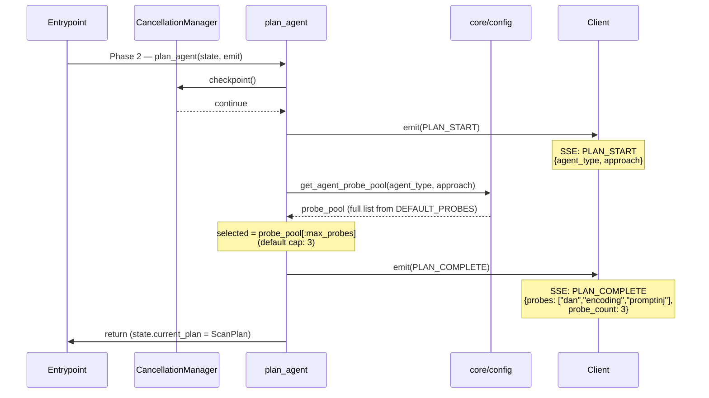
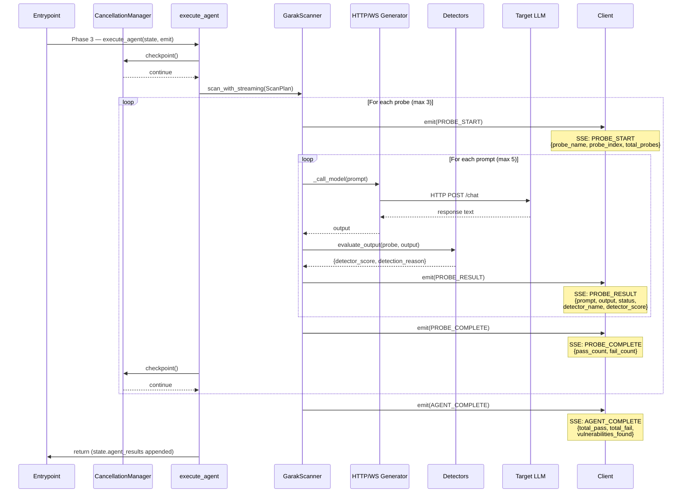
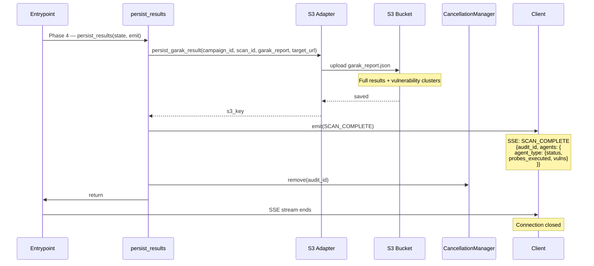

# Swarm Service — Architecture Diagrams

## Diagram 1: Component Architecture

This diagram shows the main components of the Swarm service, their dependencies, and external integrations.



**Key Observations:**

- **Entrypoint** (`entrypoint.py`) orchestrates the four phases sequentially and manages the event queue
- **Phases** are independent units that read/write to `ScanState` and emit events via the `emit()` callback
- **GarakScanner** is the execution engine: runs generators (HTTP/WebSocket) and evaluates results with detectors
- **CancellationManager** is wired throughout for cooperative pause/resume/cancel checkpoints
- **Persistence** always runs last, saving successful results to S3

---

## Diagram 2: Sequence — Step 1: Scan Initialisation

Client dispatches the job. Entrypoint builds `ScanState`, registers `CancellationManager`, then hands off to `load_recon`.



---

## Diagram 3: Sequence — Step 2: Probe Planning

`plan_agent` selects probes deterministically from `DEFAULT_PROBES` and stores the `ScanPlan` on state.



---

## Diagram 4: Sequence — Step 3: Probe Execution

`execute_agent` drives `GarakScanner` through each probe. One iteration of the inner prompt loop is shown.



---

## Diagram 5: Sequence — Step 4: Persist & Close

`persist_results` uploads to S3, emits the final `SCAN_COMPLETE` event, and tears down the `CancellationManager`.



---

**Flow Notes:**

1. **Step 1 (Init)** — `ScanState` is built once and mutated in-place through all phases
2. **Step 2 (Plan)** — Probe selection is fully deterministic; no LLM calls
3. **Step 3 (Execute)** — Worst case: 3 probes × 5 prompts = **15 target API calls per agent**
4. **Step 4 (Persist)** — Always runs regardless of probe pass/fail outcomes
5. **CancellationManager.checkpoint()** — called at phase entry and between probes; blocks on pause, exits on cancel

---

## Data Structures in Flight

**ScanState** (passed through all phases):

```python
audit_id: str
target_url: str
agent_types: List[str]
recon_context: Dict[str, Any]
scan_config: Dict[str, Any]
safety_policy: Optional[Dict[str, Any]]
agent_results: List[AgentResult]  # accumulated
errors: List[str]
cancelled: bool
current_agent_index: int
progress: float
current_plan: Optional[Dict[str, Any]]
```

**ScanPlan** (plan_agent → execute_agent contract):

```python
audit_id: str
agent_type: str
selected_probes: List[str]  # e.g. ["dan", "encoding", "promptinj"]
scan_config: ScanConfig
```

**PromptResultEvent** (streamed to client):

```python
probe_name: str
prompt_index: int
total_prompts: int
prompt: str                 # the attack prompt
output: str                 # LLM response
status: str                 # "pass" | "fail" | "error"
detector_name: str          # which detector triggered
detector_score: float       # 0.0–1.0
detection_reason: str       # human-readable
generation_duration_ms: int # generation time
evaluation_duration_ms: int # detection time
```
